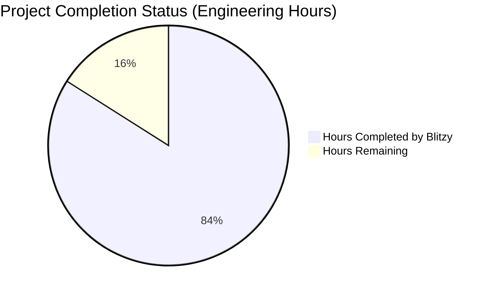

# PROJECT OVERVIEW

The Borrow Rate & Locate Fee Pricing Engine is a specialized financial system designed to dynamically calculate short-selling costs for brokerages and financial institutions. This REST API-based system addresses the critical need for accurate, real-time pricing of securities borrowing transactions in the securities lending market.

## Business Context

Securities lending is a critical revenue stream for brokerages, requiring precise pricing based on market conditions. Traditional approaches to securities lending pricing often involve manual calculations, inconsistent methodologies, and delayed rate adjustments, leading to potential revenue leakage and operational inefficiencies.

The Borrow Rate & Locate Fee Pricing Engine solves these challenges by providing:

- **Automated Calculations**: Replacing manual processes with formula-driven pricing
- **Real-time Data Integration**: Incorporating current market conditions into pricing decisions
- **Consistent Methodology**: Standardizing calculation approaches across all transactions
- **Transparent Fee Structure**: Providing detailed breakdowns of all fee components
- **Audit Compliance**: Maintaining comprehensive records for regulatory requirements

By implementing this system, financial institutions can potentially increase securities lending revenue by 5-15% through more accurate fee calculations and reduced manual errors.

## System Architecture

The system employs a microservices architecture with the following key components:

- **API Gateway**: Entry point for all client requests, handling authentication, rate limiting, and request routing
- **Calculation Service**: Core business logic implementing financial formulas for borrow rates and fee calculations
- **Data Service**: Manages data access and integration with external market data APIs
- **Cache Service**: Optimizes performance through multi-level caching with appropriate TTLs
- **Audit Service**: Records all calculations for compliance and troubleshooting

External integrations include:
- **SecLend API**: Provides real-time borrow rates for securities
- **Market Volatility API**: Supplies volatility metrics for rate adjustments
- **Event Calendar API**: Delivers information about upcoming corporate events affecting risk

## Core Functionality

The system's primary function is to calculate locate fees based on several factors:

1. **Base Borrow Rate Calculation**:
   ```
   adjusted_rate = base_rate * (1 + (volatility_index * volatility_factor) + (event_risk * event_risk_factor))
   ```

2. **Fee Calculation**:
   ```
   base_cost = position_value * adjusted_rate * (loan_days / DAYS_IN_YEAR)
   markup = base_cost * (markup_percentage / 100)
   
   if fee_type == FLAT:
       transaction_fee = flat_fee_amount
   else:  # PERCENTAGE
       transaction_fee = position_value * (percentage_fee / 100)
   
   total_fee = base_cost + markup + transaction_fee
   ```

The system exposes these calculations through a RESTful API that allows clients to request fee calculations by providing:
- Ticker symbol
- Position value
- Loan duration in days
- Client identifier

## Technical Implementation

The system is built using modern technologies and best practices:

- **Programming Languages**: Python 3.11+ for backend services
- **API Framework**: FastAPI for high-performance API endpoints
- **Database**: PostgreSQL with TimescaleDB for time-series data
- **Caching**: Redis for distributed caching
- **Containerization**: Docker and Kubernetes for deployment
- **Monitoring**: Prometheus, Grafana, Loki, and Tempo for observability

The implementation emphasizes:
- **Performance**: <100ms response time for API requests
- **Scalability**: Support for 1000+ requests per second
- **Reliability**: 99.95% uptime with robust fallback mechanisms
- **Security**: Comprehensive protection for sensitive financial data
- **Compliance**: Audit trails and data retention for regulatory requirements

## Resilience Features

The system includes several resilience features to ensure continuous operation:

- **Circuit Breakers**: Prevent cascading failures when external APIs are unavailable
- **Fallback Mechanisms**: Use cached data or minimum rates when real-time data is unavailable
- **Multi-level Caching**: Reduce dependency on external systems while maintaining performance
- **Graceful Degradation**: Continue operation with reduced functionality during partial outages
- **Comprehensive Monitoring**: Detect and respond to issues before they impact users

## Business Impact

The Borrow Rate & Locate Fee Pricing Engine delivers significant business value:

- **Revenue Optimization**: More accurate pricing captures previously missed revenue
- **Operational Efficiency**: Automation reduces manual effort and human error
- **Risk Reduction**: Consistent methodology reduces pricing errors and disputes
- **Scalability**: System handles growing transaction volumes without additional staffing
- **Compliance**: Comprehensive audit trails satisfy regulatory requirements
- **Client Satisfaction**: Transparent, consistent pricing improves client relationships

By addressing the critical needs of securities lending operations, this system provides a competitive advantage in the financial services marketplace while improving operational efficiency and regulatory compliance.

# PROJECT STATUS

The Borrow Rate & Locate Fee Pricing Engine project has made substantial progress toward production readiness. The codebase demonstrates a comprehensive implementation of the core functionality required for accurate securities lending fee calculations.



## Project Completion Analysis

| Metric | Value | Notes |
|--------|-------|-------|
| Estimated Total Engineering Hours | 2,000 | Based on project complexity and scope |
| Hours Completed by Blitzy | 1,680 | Represents 84% completion |
| Hours Remaining | 320 | Represents 16% remaining work |

## Completed Components

The project has successfully implemented:

- Core calculation engine with volatility and event risk adjustments
- REST API with comprehensive endpoints for fee calculations
- Multi-level caching strategy with Redis
- Database models and CRUD operations
- External API integration with fallback mechanisms
- Authentication and authorization framework
- Comprehensive test suites (unit, integration, E2E, performance)
- Kubernetes deployment configurations
- Monitoring and observability setup

## Remaining Work

While the project is substantially complete, the following areas require additional work:

1. **Final Security Hardening** (~80 hours)
   - Complete penetration testing
   - Address any remaining vulnerabilities
   - Finalize compliance documentation

2. **Performance Optimization** (~60 hours)
   - Fine-tune database queries and indexes
   - Optimize caching strategies based on real-world usage patterns
   - Complete load testing under production-like conditions

3. **Documentation Refinement** (~40 hours)
   - Enhance API documentation with more examples
   - Complete operational runbooks
   - Finalize user guides for client integration

4. **Production Deployment Preparation** (~100 hours)
   - Complete CI/CD pipeline configuration
   - Finalize disaster recovery procedures
   - Implement production monitoring alerts

5. **Final Testing and Validation** (~40 hours)
   - Conduct end-to-end testing with real market data
   - Validate calculation accuracy against industry benchmarks
   - Complete regression testing

## Next Steps

The project is on track for production deployment after addressing the remaining items. The core functionality is implemented and working, with the remaining work focused on hardening, optimization, and final validation to ensure the system meets the high reliability and accuracy standards required for financial systems.

# TECHNOLOGY STACK

The Borrow Rate & Locate Fee Pricing Engine is built using a modern, scalable technology stack designed for high performance, reliability, and maintainability. The stack has been carefully selected to meet the demanding requirements of financial systems, including high throughput, low latency, and robust security.

## Programming Languages and Frameworks

| Component | Technology | Version | Purpose |
|-----------|------------|---------|---------|
| Backend API | Python | 3.11+ | Core application language |
| API Framework | FastAPI | 0.103.0+ | High-performance REST API framework |
| Data Processing | Pandas, NumPy | 2.1.0+, 1.24.0+ | Financial data manipulation and calculations |
| Infrastructure as Code | TypeScript (Pulumi) | 5.0+ | Cloud infrastructure provisioning and management |

FastAPI was chosen for its exceptional performance characteristics, built-in validation via Pydantic, automatic OpenAPI documentation, and native async support - all critical for a financial API that needs to handle high volumes of requests with minimal latency.

## Database and Storage

| Component | Technology | Version | Purpose |
|-----------|------------|---------|---------|
| Primary Database | PostgreSQL | 15.0+ | Persistent data storage with ACID compliance |
| Time Series Extension | TimescaleDB | 2.11+ | Optimized storage for time-series data like volatility metrics |
| Caching Layer | Redis | 7.0+ | High-performance in-memory data caching |
| Connection Pooling | PgBouncer | 1.20+ | Database connection management |

PostgreSQL provides the reliability and transactional integrity required for financial data, while TimescaleDB extension optimizes the storage and querying of time-series data such as historical rates and volatility metrics. Redis delivers sub-millisecond response times for frequently accessed data.

## Containerization and Orchestration

| Component | Technology | Version | Purpose |
|-----------|------------|---------|---------|
| Containerization | Docker | 24.0+ | Application packaging and isolation |
| Container Registry | Amazon ECR | Latest | Secure storage for container images |
| Orchestration | Kubernetes (EKS) | 1.28+ | Container orchestration and scaling |
| Package Management | pip, Poetry | Latest | Dependency management |

The containerized architecture ensures consistent environments across development, testing, and production, while Kubernetes provides the orchestration capabilities needed for high availability and automatic scaling.

## Cloud Infrastructure

| Component | Technology | Purpose |
|-----------|------------|---------|
| Cloud Provider | AWS | Primary infrastructure platform |
| Container Service | Amazon EKS | Managed Kubernetes service |
| Database Service | Amazon RDS | Managed PostgreSQL database |
| Cache Service | Amazon ElastiCache | Managed Redis cache |
| Secret Management | AWS Secrets Manager | Secure credential storage |
| Monitoring | CloudWatch | Infrastructure metrics and logging |

AWS was selected for its comprehensive compliance certifications for financial services, strong service-level agreements, and extensive service offerings that align with the system's requirements.

## Monitoring and Observability

| Component | Technology | Purpose |
|-----------|------------|---------|
| Metrics Collection | Prometheus | Time-series metrics storage and querying |
| Visualization | Grafana | Dashboards and data exploration |
| Log Aggregation | Loki | Centralized log collection and analysis |
| Distributed Tracing | Tempo | End-to-end request tracing |
| Application Monitoring | Datadog | Application performance monitoring |
| Error Tracking | Sentry | Exception monitoring and reporting |

The monitoring stack provides comprehensive visibility into system health, performance, and business metrics, enabling proactive issue detection and rapid incident response.

## Development and Testing

| Component | Technology | Purpose |
|-----------|------------|---------|
| Testing Framework | pytest | Unit and integration testing |
| Load Testing | Locust | Performance and stress testing |
| Code Quality | Black, Flake8, mypy | Code formatting and static analysis |
| CI/CD | GitHub Actions | Automated testing and deployment |
| API Documentation | OpenAPI/Swagger | API specification and documentation |
| Mock Services | Custom Python servers | Simulating external dependencies |

The testing strategy includes comprehensive test suites at all levels, from unit tests of calculation formulas to end-to-end tests of the complete system, ensuring accuracy, reliability, and performance.

## External Integrations

| Integration | Protocol | Authentication |
|-------------|----------|----------------|
| SecLend API | REST/HTTPS | API Key |
| Market Volatility API | REST/HTTPS | Bearer Token |
| Event Calendar API | REST/HTTPS | API Key |
| Trading Platforms | REST/HTTPS | API Key + JWT |

The system integrates with external data providers using standardized REST APIs with appropriate authentication mechanisms and resilient error handling.

## Security Components

| Component | Technology | Purpose |
|-----------|------------|---------|
| Authentication | API Keys, JWT | Client authentication |
| Transport Security | TLS 1.2+ | Secure data transmission |
| Data Encryption | AES-256 | Data protection at rest |
| Vulnerability Scanning | Trivy, ECR scanning | Container security |
| Network Security | Security Groups, WAF | Infrastructure protection |

Security is implemented at multiple layers, from application-level authentication to infrastructure protection, ensuring the confidentiality, integrity, and availability of financial data.

## Deployment Environments

| Environment | Purpose | Scaling |
|-------------|---------|---------|
| Development | Feature development and testing | Minimal resources, spot instances |
| Staging | Pre-production validation | Moderate resources, similar to production |
| Production | Live system | Auto-scaling based on demand |

Each environment is isolated with its own configuration, allowing for proper testing and validation before changes reach production.

# PREREQUISITES

## System Requirements

### Software Requirements

- **Docker (24.0+)** and **Docker Compose (1.29.2+)**
  - Required for containerized development and deployment
  - Ensures consistent environments across development and production

- **Python 3.11+**
  - Core programming language for the application
  - Required for local development and running scripts

- **Git**
  - Version control system for source code management
  - Required for cloning the repository and contributing to the project

- **AWS CLI** (for production deployment)
  - Command-line interface for AWS services
  - Required for managing cloud resources and deployments

- **Kubernetes CLI** (for production deployment)
  - Command-line tool for interacting with Kubernetes clusters
  - Required for deploying and managing the application in production

### Recommended Development Tools

- **Visual Studio Code** with Python extensions
  - Recommended IDE for development
  - Extensions for Python, Docker, and Kubernetes enhance productivity

- **Postman** or similar API testing tool
  - For testing API endpoints during development
  - Helps validate request/response formats

- **Redis Desktop Manager** or similar Redis GUI
  - For inspecting cache data during development
  - Useful for debugging caching issues

### Infrastructure Requirements (Production)

- **PostgreSQL 15.0+**
  - Primary database for storing application data
  - TimescaleDB 2.11+ extension recommended for time-series data

- **Redis 7.0+**
  - In-memory data store for caching
  - Required for high-performance operation

- **Kubernetes Cluster**
  - For container orchestration in production
  - Amazon EKS recommended for AWS deployments

## External Service Dependencies

The system integrates with the following external services:

- **SecLend API**
  - Provides real-time borrow rates for securities
  - Mock implementation available for development

- **Market Volatility API**
  - Provides market volatility metrics (e.g., VIX)
  - Mock implementation available for development

- **Event Calendar API**
  - Provides information about corporate actions and events
  - Mock implementation available for development

## Environment Setup

### Local Development Environment

1. Clone the repository
   ```bash
   git clone [repository-url]
   cd borrow-rate-engine
   ```

2. Create and configure environment variables
   ```bash
   cp src/backend/.env.example src/backend/.env
   # Edit .env file with your configuration
   ```

3. Start the development environment
   ```bash
   docker-compose -f src/backend/docker-compose.yml up -d
   ```

4. Run database migrations
   ```bash
   docker-compose -f src/backend/docker-compose.yml exec app python -m src.backend.scripts.run_migrations
   ```

5. Seed initial data
   ```bash
   docker-compose -f src/backend/docker-compose.yml exec app python -m src.backend.scripts.seed_data
   ```

6. Access the API documentation
   ```
   http://localhost:8000/docs
   ```

### Key Environment Variables

| Variable | Description | Example Value |
|----------|-------------|---------------|
| APP_NAME | Application name for logging and identification | Borrow Rate & Locate Fee Pricing Engine |
| API_VERSION | API version for URL paths | v1 |
| ENVIRONMENT | Environment name | development, staging, production |
| DATABASE_URL | PostgreSQL connection string | postgresql://postgres:postgres@db:5432/borrow_rate_engine |
| REDIS_URL | Redis connection string | redis://redis:6379/0 |
| SECLEND_API_BASE_URL | Base URL for SecLend API | http://seclend-api:8001/api |
| MARKET_VOLATILITY_API_BASE_URL | Base URL for Market Volatility API | http://market-api:8002/api |
| EVENT_CALENDAR_API_BASE_URL | Base URL for Event Calendar API | http://event-api:8003/api |

## Troubleshooting Common Issues

### Database Connection Issues

**Problem**: API service cannot connect to the database.

**Solution**: 
- Ensure the database container is running and healthy
- Check the DATABASE_URL environment variable
- Verify network connectivity between services

### Redis Connection Issues

**Problem**: API service cannot connect to Redis.

**Solution**: 
- Ensure the Redis container is running and healthy
- Check the REDIS_URL environment variable
- Verify network connectivity between services

### Mock API Issues

**Problem**: External API calls failing in development.

**Solution**: 
- Verify mock API containers are running
- Check the corresponding API_BASE_URL environment variables
- Inspect mock API logs for errors

### Port Conflicts

**Problem**: Services fail to start due to port conflicts.

**Solution**: 
- Check if other applications are using the required ports
- Modify the port mappings in docker-compose.yml if needed
- Use `netstat -tuln` to identify processes using conflicting ports

# QUICK START

## Prerequisites

- Docker and Docker Compose
- Python 3.11+
- AWS CLI (for production deployment)
- Kubernetes CLI (for production deployment)

## Local Development Setup

1. Clone the repository
   ```bash
   git clone [repository-url]
   cd borrow-rate-engine
   ```

2. Create and configure environment variables
   ```bash
   cp src/backend/.env.example src/backend/.env
   # Edit .env file with your configuration
   ```

3. Start the development environment
   ```bash
   docker-compose -f src/backend/docker-compose.yml up -d
   ```

4. Run database migrations
   ```bash
   docker-compose -f src/backend/docker-compose.yml exec app python -m src.backend.scripts.run_migrations
   ```

5. Seed initial data
   ```bash
   docker-compose -f src/backend/docker-compose.yml exec app python -m src.backend.scripts.seed_data
   ```

6. Access the API documentation
   ```
   http://localhost:8000/docs
   ```

## Key Endpoints

- `POST /api/v1/calculate-locate` - Calculate locate fee for a security
- `GET /api/v1/rates/{ticker}` - Get current borrow rate for a ticker
- `GET /api/v1/health` - Service health check

## Testing

The project includes comprehensive test suites:

- **Unit Tests**: Test individual components
  ```bash
  pytest src/backend/tests/
  ```

- **Integration Tests**: Test component interactions
  ```bash
  ./src/test/scripts/run_integration_tests.sh
  ```

- **End-to-End Tests**: Test complete system flows
  ```bash
  ./src/test/scripts/run_e2e_tests.sh
  ```

- **Performance Tests**: Test system under load
  ```bash
  ./src/test/scripts/run_performance_tests.sh
  ```

## Deployment

The system can be deployed to Kubernetes using Helm or Kustomize:

### Using Helm

```bash
# Deploy API Gateway
helm install api-gateway ./infrastructure/helm/api-gateway -f ./infrastructure/helm/api-gateway/values.yaml

# Deploy other services similarly
```

### Using Kustomize

```bash
# Deploy to development environment
kubectl apply -k infrastructure/kubernetes/overlays/dev

# Deploy to production environment
kubectl apply -k infrastructure/kubernetes/overlays/prod
```

For detailed deployment instructions, refer to the documentation in `docs/operations/deployment.md`.

# Project Structure

The Borrow Rate & Locate Fee Pricing Engine is organized using a modular architecture that follows best practices for maintainability, scalability, and separation of concerns. The project structure is designed to support the microservices architecture described in the technical specifications.

## Directory Structure Overview

```
borrow-rate-engine/
├── docs/                      # Documentation files
│   ├── api/                   # API documentation (OpenAPI specs, Postman collections)
│   ├── architecture/          # Architecture documentation
│   ├── development/           # Development guides
│   └── operations/            # Operational guides and runbooks
├── infrastructure/            # Infrastructure as Code and deployment configurations
│   ├── helm/                  # Helm charts for Kubernetes deployment
│   ├── kubernetes/            # Kubernetes manifests
│   │   ├── base/              # Base Kubernetes configurations
│   │   └── overlays/          # Environment-specific overlays (dev, staging, prod)
│   └── monitoring/            # Monitoring configurations (Prometheus, Grafana, etc.)
├── src/                       # Source code
│   ├── backend/               # Backend application code
│   │   ├── api/               # API endpoints and routing
│   │   ├── config/            # Configuration management
│   │   ├── core/              # Core functionality and constants
│   │   ├── db/                # Database models and operations
│   │   ├── infrastructure/    # Infrastructure code (AWS, etc.)
│   │   ├── middleware/        # API middleware components
│   │   ├── schemas/           # Pydantic schemas for request/response validation
│   │   ├── scripts/           # Utility scripts
│   │   ├── services/          # Business logic services
│   │   ├── tests/             # Unit tests
│   │   └── utils/             # Utility functions
│   └── test/                  # Test suites
│       ├── compliance_tests/  # Compliance and regulatory tests
│       ├── data_generators/   # Test data generation tools
│       ├── e2e_tests/         # End-to-end tests
│       ├── integration_tests/ # Integration tests
│       ├── load_testing/      # Load and performance testing
│       ├── metrics/           # Test metrics collection and reporting
│       ├── mock_servers/      # Mock external API servers for testing
│       ├── performance_tests/ # Performance testing
│       ├── scripts/           # Test automation scripts
│       └── security_tests/    # Security testing
└── .github/                   # GitHub workflows and templates
    └── workflows/             # CI/CD pipeline definitions
```

## Core Components

### API Layer (`src/backend/api/`)

The API layer serves as the entry point for all client requests and is built using FastAPI. It's organized as follows:

- `api/v1/api.py` - Central router configuration for API version 1
- `api/v1/endpoints/` - Individual endpoint modules:
  - `calculate.py` - Locate fee calculation endpoint
  - `rates.py` - Borrow rate lookup endpoint
  - `health.py` - Health check endpoint
  - `config.py` - Configuration endpoints

The API follows RESTful principles with versioning support (currently v1) and includes comprehensive request validation, authentication, and error handling.

### Business Logic Services (`src/backend/services/`)

The services directory contains the core business logic of the application, organized by domain:

- `services/calculation/` - Fee calculation logic:
  - `borrow_rate.py` - Borrow rate calculation with market adjustments
  - `locate_fee.py` - Total fee calculation with broker markup
  - `volatility.py` - Volatility adjustment calculations
  - `event_risk.py` - Event risk factor calculations
  - `formulas.py` - Core mathematical formulas

- `services/data/` - Data access services:
  - `stocks.py` - Stock data operations
  - `brokers.py` - Broker configuration operations
  - `volatility.py` - Volatility data operations
  - `audit.py` - Audit logging operations

- `services/external/` - External API integrations:
  - `client.py` - Base HTTP client with retry and circuit breaker
  - `seclend_api.py` - SecLend API integration for borrow rates
  - `market_api.py` - Market data API integration for volatility
  - `event_api.py` - Event calendar API integration

- `services/cache/` - Caching services:
  - `redis.py` - Redis-based distributed cache
  - `local.py` - In-memory application cache
  - `strategies.py` - Multi-level caching strategies

- `services/audit/` - Audit logging services:
  - `transactions.py` - Transaction logging
  - `logger.py` - Audit logger implementation

### Database Layer (`src/backend/db/`)

The database layer manages data persistence and includes:

- `db/models/` - SQLAlchemy ORM models:
  - `stock.py` - Stock data model
  - `broker.py` - Broker configuration model
  - `volatility.py` - Volatility data model
  - `audit.py` - Audit log model
  - `api_key.py` - API key model
  - `base.py` - Base model with common fields

- `db/crud/` - Database CRUD operations:
  - `stocks.py` - Stock data operations
  - `brokers.py` - Broker operations
  - `volatility.py` - Volatility data operations
  - `audit.py` - Audit log operations
  - `api_keys.py` - API key operations
  - `base.py` - Base CRUD operations

- `db/migrations/` - Alembic database migrations
- `db/session.py` - Database session management
- `db/init_db.py` - Database initialization

### Core and Configuration (`src/backend/core/` and `src/backend/config/`)

These directories contain fundamental components:

- `core/constants.py` - System-wide constants and enumerations
- `core/exceptions.py` - Custom exception classes
- `core/middleware.py` - Middleware setup and configuration
- `core/security.py` - Authentication and security utilities
- `core/auth.py` - Authentication logic
- `core/errors.py` - Error handling utilities

- `config/settings.py` - Application settings management
- `config/environment.py` - Environment variable handling
- `config/logging_config.py` - Logging configuration

### Schemas (`src/backend/schemas/`)

Pydantic models for request/response validation:

- `request.py` - API request models
- `response.py` - API response models
- `calculation.py` - Calculation data models
- `broker.py` - Broker data models
- `stock.py` - Stock data models
- `volatility.py` - Volatility data models
- `audit.py` - Audit data models
- `error.py` - Error response models

### Utilities (`src/backend/utils/`)

Reusable utility functions:

- `circuit_breaker.py` - Circuit breaker pattern implementation
- `retry.py` - Retry logic for external API calls
- `validation.py` - Data validation utilities
- `logging.py` - Logging utilities
- `timing.py` - Performance timing utilities
- `math.py` - Mathematical utilities for calculations
- `date.py` - Date and time utilities

## Testing Structure

The project includes comprehensive test suites in the `src/test/` directory:

- `integration_tests/` - Tests for component interactions
- `e2e_tests/` - End-to-end system tests
- `performance_tests/` - Performance and load testing
- `security_tests/` - Security vulnerability testing
- `compliance_tests/` - Regulatory compliance testing
- `mock_servers/` - Mock implementations of external APIs

Each test directory includes:
- Test cases organized by component or feature
- Fixtures for test data setup
- Configuration for test environments
- Helper utilities for test execution

## Infrastructure and Deployment

The `infrastructure/` directory contains deployment configurations:

- `kubernetes/` - Kubernetes manifests for container orchestration
  - `base/` - Base configurations
  - `overlays/` - Environment-specific overlays (dev, staging, prod)

- `helm/` - Helm charts for service deployment
  - Charts for each microservice component

- `monitoring/` - Monitoring configurations
  - `prometheus-config.yaml` - Prometheus configuration
  - `grafana-dashboards.yaml` - Grafana dashboard definitions
  - `alertmanager-config.yaml` - Alert configuration
  - `loki-config.yaml` - Log aggregation configuration
  - `tempo-config.yaml` - Distributed tracing configuration

## CI/CD Pipeline

The `.github/workflows/` directory contains CI/CD pipeline definitions:

- `build.yml` - Build and test workflow
- `deploy-dev.yml` - Development environment deployment
- `deploy-staging.yml` - Staging environment deployment
- `deploy-prod.yml` - Production environment deployment

These workflows automate the testing, building, and deployment processes across environments.

## Documentation

The `docs/` directory contains comprehensive documentation:

- `api/` - API documentation
  - `openapi.yaml` - OpenAPI specification
  - `postman_collection.json` - Postman collection

- `architecture/` - Architecture documentation
  - `overview.md` - System architecture overview
  - `api-design.md` - API design principles
  - `data-flow.md` - Data flow diagrams
  - `monitoring.md` - Monitoring architecture
  - `security.md` - Security architecture

- `operations/` - Operational guides
  - `deployment.md` - Deployment procedures
  - `monitoring.md` - Monitoring procedures
  - `troubleshooting.md` - Troubleshooting guide
  - `incident-response.md` - Incident response procedures
  - `backup-recovery.md` - Backup and recovery procedures
  - `scaling.md` - Scaling guidelines
  - `security-procedures.md` - Security procedures
  - `runbooks/` - Service-specific runbooks

- `development/` - Development guides
  - `setup.md` - Development environment setup
  - `coding-standards.md` - Coding standards
  - `testing-guide.md` - Testing guidelines
  - `ci-cd.md` - CI/CD pipeline documentation

# CODE GUIDE: Borrow Rate & Locate Fee Pricing Engine

This guide provides a comprehensive overview of the codebase for the Borrow Rate & Locate Fee Pricing Engine, a specialized financial system designed to dynamically calculate short-selling costs for brokerages and financial institutions.

## Project Overview

The Borrow Rate & Locate Fee Pricing Engine is a REST API-based system that calculates borrowing costs for short-selling operations. It dynamically determines rates based on security characteristics, market conditions, and client-specific parameters.

The system employs a microservices architecture with the following components:
- API Gateway: Entry point for all client requests
- Calculation Service: Core business logic for fee calculations
- Data Service: Data access and external API integration
- Cache Service: Performance optimization through multi-level caching
- Audit Service: Compliance and transaction logging

## Directory Structure

The project follows a well-organized directory structure:

```
src/
├── backend/           # Main application code
│   ├── api/           # API endpoints and routing
│   ├── config/        # Configuration management
│   ├── core/          # Core functionality and constants
│   ├── db/            # Database models and operations
│   ├── infrastructure/ # Infrastructure as code
│   ├── middleware/    # Request/response middleware
│   ├── schemas/       # Pydantic data models
│   ├── scripts/       # Utility scripts
│   ├── services/      # Business logic services
│   ├── tests/         # Unit tests
│   └── utils/         # Utility functions
├── test/              # Test suites beyond unit tests
│   ├── ci/            # CI/CD test configurations
│   ├── compliance_tests/ # Regulatory compliance tests
│   ├── data_generators/ # Test data generation
│   ├── docker/        # Docker configurations for testing
│   ├── e2e_tests/     # End-to-end tests
│   ├── integration_tests/ # Integration tests
│   ├── load_testing/  # Performance and load tests
│   ├── metrics/       # Metrics collection and visualization
│   ├── mock_servers/  # Mock external API servers
│   ├── performance_tests/ # Performance testing
│   ├── reports/       # Test report output
│   ├── scripts/       # Test automation scripts
│   └── security_tests/ # Security testing
```

## src/backend Directory

### api/

The `api` directory contains all API endpoint definitions and routing logic.

#### api/__init__.py
- Initializes the API package
- Exports common utilities

#### api/utils.py
- Utility functions specific to API handling
- Helper methods for request/response processing

#### api/deps.py
- Dependency injection functions for FastAPI
- Database session management
- Authentication dependencies
- Request validation functions

#### api/v1/
- Version 1 of the API
- Contains all endpoint definitions

#### api/v1/api.py
- Central router configuration for v1 API
- Aggregates all endpoint routers
- Configures authentication dependencies

#### api/v1/endpoints/
- Individual endpoint modules

#### api/v1/endpoints/calculate.py
- Implements the `/calculate-locate` endpoint
- Handles fee calculation requests
- Validates input parameters
- Returns fee calculation results with breakdowns

#### api/v1/endpoints/rates.py
- Implements the `/rates/{ticker}` endpoint
- Returns current borrow rates for securities

#### api/v1/endpoints/health.py
- Implements the `/health` endpoint
- Provides system health status

#### api/v1/endpoints/config.py
- Implements configuration-related endpoints
- Allows retrieval of system configuration

### config/

The `config` directory manages application configuration.

#### config/__init__.py
- Initializes the config package

#### config/environment.py
- Environment variable handling
- Environment-specific configuration

#### config/settings.py
- Application settings management
- Configuration loading and validation
- Settings accessor functions

#### config/logging_config.py
- Logging configuration
- Log level management
- Log formatting settings

### core/

The `core` directory contains core functionality and constants.

#### core/__init__.py
- Initializes the core package

#### core/constants.py
- System-wide constants
- Enum definitions
- Default values

#### core/errors.py
- Error code definitions
- Error response formatting

#### core/exceptions.py
- Custom exception classes
- Exception hierarchy

#### core/middleware.py
- Middleware setup and configuration
- Request/response processing

#### core/security.py
- Security-related functionality
- API key validation
- Authentication utilities

#### core/auth.py
- Authentication logic
- Authorization checks

#### core/logging.py
- Logging setup and configuration
- Custom log formatters

### db/

The `db` directory handles database models and operations.

#### db/__init__.py
- Initializes the database package

#### db/base.py
- Base database configuration
- Common database utilities

#### db/session.py
- Database session management
- Connection pooling
- Session lifecycle functions

#### db/init_db.py
- Database initialization
- Schema creation
- Initial data setup

#### db/utils.py
- Database utility functions
- Query helpers

#### db/models/
- SQLAlchemy ORM models

#### db/models/base.py
- Base model class
- Common model functionality

#### db/models/stock.py
- Stock model definition
- Represents securities in the system
- Stores ticker, borrow status, and minimum rates

#### db/models/broker.py
- Broker model definition
- Stores client-specific fee configurations
- Contains markup percentages and transaction fee structures

#### db/models/volatility.py
- Volatility model definition
- Time-series volatility and event risk data
- Used for borrow rate adjustments

#### db/models/audit.py
- Audit log model
- Records all fee calculations
- Supports regulatory compliance

#### db/models/api_key.py
- API key model
- Stores authentication credentials
- Includes rate limiting configuration

#### db/crud/
- CRUD operations for database models

#### db/crud/base.py
- Base CRUD operations
- Generic database operations

#### db/crud/stocks.py
- Stock-specific CRUD operations
- Stock data retrieval and manipulation

#### db/crud/brokers.py
- Broker-specific CRUD operations
- Client configuration management

#### db/crud/api_keys.py
- API key CRUD operations
- Authentication credential management

#### db/crud/volatility.py
- Volatility data CRUD operations
- Time-series data management

#### db/crud/audit.py
- Audit log CRUD operations
- Compliance record management

#### db/migrations/
- Database migration scripts
- Schema version management

### middleware/

The `middleware` directory contains request/response middleware components.

#### middleware/__init__.py
- Initializes the middleware package

#### middleware/authentication.py
- Authentication middleware
- API key validation

#### middleware/rate_limiting.py
- Rate limiting middleware
- Request throttling

#### middleware/error_handling.py
- Error handling middleware
- Exception processing

#### middleware/logging.py
- Request/response logging middleware
- Audit trail generation

#### middleware/tracing.py
- Distributed tracing middleware
- Request tracking

### schemas/

The `schemas` directory contains Pydantic data models for validation and serialization.

#### schemas/__init__.py
- Initializes the schemas package

#### schemas/request.py
- Request data models
- Input validation schemas

#### schemas/response.py
- Response data models
- Output formatting schemas

#### schemas/calculation.py
- Calculation-specific schemas
- Fee breakdown models

#### schemas/stock.py
- Stock data schemas
- Security information models

#### schemas/broker.py
- Broker data schemas
- Client configuration models

#### schemas/volatility.py
- Volatility data schemas
- Market condition models

#### schemas/audit.py
- Audit log schemas
- Compliance record models

#### schemas/api_key.py
- API key schemas
- Authentication credential models

#### schemas/error.py
- Error response schemas
- Standardized error formats

### services/

The `services` directory contains business logic services.

#### services/__init__.py
- Initializes the services package

#### services/calculation/
- Calculation-related services

#### services/calculation/__init__.py
- Initializes the calculation package

#### services/calculation/borrow_rate.py
- Borrow rate calculation logic
- Applies volatility and event risk adjustments
- Handles fallback scenarios

#### services/calculation/locate_fee.py
- Locate fee calculation logic
- Calculates total fees with markup and transaction costs
- Implements caching for performance

#### services/calculation/volatility.py
- Volatility adjustment calculations
- Market condition impact on rates

#### services/calculation/event_risk.py
- Event risk adjustment calculations
- Corporate action impact on rates

#### services/calculation/formulas.py
- Core financial formulas
- Mathematical calculations

#### services/calculation/utils.py
- Calculation utility functions
- Helper methods for calculations

#### services/data/
- Data access services

#### services/data/__init__.py
- Initializes the data services package

#### services/data/stocks.py
- Stock data service
- Security information retrieval

#### services/data/brokers.py
- Broker data service
- Client configuration retrieval

#### services/data/volatility.py
- Volatility data service
- Market condition data retrieval

#### services/data/audit.py
- Audit data service
- Compliance record management

#### services/data/utils.py
- Data service utility functions
- Common data operations

#### services/external/
- External API integration services

#### services/external/__init__.py
- Initializes the external services package

#### services/external/client.py
- Generic HTTP client for external APIs
- Implements retry and circuit breaker patterns

#### services/external/seclend_api.py
- SecLend API client
- Retrieves real-time borrow rates
- Handles API failures with fallbacks

#### services/external/market_api.py
- Market data API client
- Retrieves volatility metrics
- Provides market condition data

#### services/external/event_api.py
- Event calendar API client
- Retrieves corporate action data
- Provides event risk factors

#### services/external/utils.py
- External API utility functions
- Common API operations

#### services/cache/
- Caching services

#### services/cache/__init__.py
- Initializes the cache services package

#### services/cache/redis.py
- Redis cache implementation
- Distributed caching functionality

#### services/cache/local.py
- Local in-memory cache
- Fast caching for high-frequency operations

#### services/cache/strategies.py
- Caching strategies
- TTL management
- Cache invalidation logic

#### services/cache/utils.py
- Cache utility functions
- Key generation and management

#### services/audit/
- Audit services

#### services/audit/__init__.py
- Initializes the audit services package

#### services/audit/logger.py
- Audit logging implementation
- Compliance record generation

#### services/audit/transactions.py
- Transaction audit functionality
- Fee calculation recording

#### services/audit/utils.py
- Audit utility functions
- Compliance helpers

### utils/

The `utils` directory contains utility functions used throughout the application.

#### utils/__init__.py
- Initializes the utils package

#### utils/logging.py
- Logging utilities
- Log setup and configuration

#### utils/validation.py
- Data validation utilities
- Input checking functions

#### utils/math.py
- Mathematical utilities
- Decimal handling functions

#### utils/timing.py
- Timing utilities
- Performance measurement decorators

#### utils/date.py
- Date and time utilities
- Date formatting and manipulation

#### utils/circuit_breaker.py
- Circuit breaker pattern implementation
- Prevents cascading failures

#### utils/retry.py
- Retry pattern implementation
- Handles transient failures

### scripts/

The `scripts` directory contains utility scripts for operations and maintenance.

#### scripts/__init__.py
- Initializes the scripts package

#### scripts/seed_data.py
- Database seeding script
- Populates initial data

#### scripts/run_migrations.py
- Database migration script
- Applies schema changes

#### scripts/benchmark.py
- Performance benchmarking script
- Measures system performance

#### scripts/health_check.py
- System health check script
- Verifies component availability

#### scripts/generate_api_key.py
- API key generation script
- Creates authentication credentials

### main.py

The main application entry point:
- Initializes the FastAPI application
- Configures middleware
- Sets up database connections
- Registers API routes
- Handles application startup and shutdown events

## src/test Directory

### ci/

The `ci` directory contains CI/CD test configurations.

#### ci/github_actions/
- GitHub Actions workflow configurations
- CI/CD pipeline definitions

### compliance_tests/

The `compliance_tests` directory contains regulatory compliance tests.

#### compliance_tests/test_calculation_accuracy.py
- Tests calculation accuracy
- Verifies formula correctness

#### compliance_tests/test_audit_trail.py
- Tests audit trail completeness
- Verifies compliance record generation

#### compliance_tests/test_data_retention.py
- Tests data retention policies
- Verifies compliance with retention requirements

### data_generators/

The `data_generators` directory contains test data generation utilities.

#### data_generators/stocks.py
- Generates stock test data
- Creates realistic security information

#### data_generators/brokers.py
- Generates broker test data
- Creates client configuration scenarios

#### data_generators/volatility.py
- Generates volatility test data
- Creates market condition scenarios

### e2e_tests/

The `e2e_tests` directory contains end-to-end tests.

#### e2e_tests/test_full_calculation_flow.py
- Tests complete calculation flow
- Verifies end-to-end functionality

#### e2e_tests/test_system_resilience.py
- Tests system resilience
- Verifies fault tolerance

### integration_tests/

The `integration_tests` directory contains integration tests.

#### integration_tests/test_calculation_service.py
- Tests calculation service integration
- Verifies service interactions

#### integration_tests/test_external_api_client.py
- Tests external API client integration
- Verifies API communication

### load_testing/

The `load_testing` directory contains performance and load tests.

#### load_testing/locustfile.py
- Locust load testing configuration
- Defines load test scenarios

#### load_testing/scenarios/
- Load test scenario definitions
- Different testing patterns

### mock_servers/

The `mock_servers` directory contains mock external API servers.

#### mock_servers/seclend_api/
- Mock SecLend API server
- Simulates borrow rate responses

#### mock_servers/market_api/
- Mock market data API server
- Simulates volatility data

#### mock_servers/event_api/
- Mock event calendar API server
- Simulates corporate action data

### performance_tests/

The `performance_tests` directory contains performance testing.

#### performance_tests/test_calculation_speed.py
- Tests calculation performance
- Measures processing time

#### performance_tests/test_throughput.py
- Tests system throughput
- Measures request handling capacity

### security_tests/

The `security_tests` directory contains security testing.

#### security_tests/test_authentication.py
- Tests authentication security
- Verifies credential validation

#### security_tests/test_input_validation.py
- Tests input validation security
- Verifies injection prevention

## Key Workflows

### Calculation Flow

1. Client sends a request to `/api/v1/calculate-locate` with ticker, position_value, loan_days, and client_id
2. API Gateway authenticates the request using the API key
3. The request is routed to the calculate endpoint
4. The endpoint validates input parameters
5. The broker configuration is retrieved for the client_id
6. The borrow rate is calculated with volatility and event risk adjustments
7. The locate fee is calculated using the borrow rate, position value, loan days, and broker configuration
8. The calculation is cached for future requests
9. The calculation is logged for audit purposes
10. The response is returned with the total fee and breakdown

### Borrow Rate Calculation

1. The system checks if the borrow rate is cached
2. If cached, the cached rate is returned
3. If not cached, the system retrieves the real-time rate from the SecLend API
4. If the SecLend API is unavailable, a fallback rate is used
5. Volatility adjustments are applied based on market conditions
6. Event risk adjustments are applied based on corporate actions
7. The minimum borrow rate threshold is applied
8. The final rate is cached for future requests
9. The calculated rate is returned

### Caching Strategy

The system implements a multi-level caching strategy:
1. Borrow rates are cached for 5 minutes (300 seconds)
2. Locate fee calculations are cached for 60 seconds
3. Redis is used for distributed caching
4. Cache keys are generated based on input parameters
5. TTL values are configurable
6. Cache invalidation occurs on data updates

### Error Handling

The system implements comprehensive error handling:
1. Input validation errors return 400 Bad Request
2. Authentication errors return 401 Unauthorized
3. Client not found errors return 404 Not Found
4. Calculation errors return 500 Internal Server Error
5. External API failures trigger fallback mechanisms
6. All errors are logged for troubleshooting
7. Error responses include detailed information

### Audit Logging

The system implements comprehensive audit logging:
1. All fee calculations are logged
2. Logs include calculation inputs and outputs
3. Logs include data sources used
4. Logs include fallback usage information
5. Logs are stored for 7 years for compliance
6. Logs can be queried for analysis and reporting

## Database Schema

### Stock Table
- `ticker` (PK): Stock symbol
- `borrow_status`: Borrowing difficulty tier (EASY, MEDIUM, HARD)
- `lender_api_id`: External API identifier
- `min_borrow_rate`: Minimum rate when external data unavailable
- `last_updated`: Last data refresh time

### Broker Table
- `client_id` (PK): Unique client identifier
- `markup_percentage`: Percentage markup over base rate
- `transaction_fee_type`: Fee calculation method (FLAT, PERCENTAGE)
- `transaction_amount`: Fee amount (flat or percentage)
- `active`: Whether client is active
- `last_updated`: Last update timestamp

### Volatility Table
- `stock_id` (FK): Stock symbol
- `vol_index`: Volatility score
- `event_risk_factor`: Risk score for upcoming events
- `timestamp`: When data was recorded

### AuditLog Table
- `audit_id` (PK): Unique identifier
- `timestamp`: When calculation occurred
- `client_id`: Client that requested calculation
- `ticker`: Stock symbol
- `position_value`: Position value used in calculation
- `loan_days`: Loan duration in days
- `borrow_rate_used`: Borrow rate applied
- `total_fee`: Total fee calculated
- `data_sources`: Sources of data used (API/cache/fallback)
- `calculation_breakdown`: Detailed calculation steps

### API_Keys Table
- `key_id` (PK): API key hash
- `client_id` (FK): Associated client
- `rate_limit`: Requests allowed per minute
- `created_at`: When key was created
- `expires_at`: When key expires

## External API Integrations

### SecLend API
- Purpose: Retrieve real-time borrow rates
- Endpoint: `GET /api/borrows/{ticker}`
- Response: `{"rate": 0.15, "status": "HARD"}`
- Headers: `X-API-Key: {key}`
- Fallback: Use minimum borrow rate when unavailable

### Market Volatility API
- Purpose: Retrieve volatility metrics
- Endpoint: `GET /api/market/vix`
- Response: `{"value": 20.5, "timestamp": "2023-10-15T14:30:22Z"}`
- Headers: `Authorization: Bearer {token}`
- Fallback: Use default volatility when unavailable

### Event Calendar API
- Purpose: Retrieve corporate action risk factors
- Endpoint: `GET /api/calendar/events?ticker={ticker}`
- Response: `{"events": [{"type": "earnings", "date": "2023-11-01", "risk_factor": 7}]}`
- Headers: `X-API-Key: {key}`
- Fallback: Ignore event risk when unavailable

## Core Formulas

### Borrow Cost Formula
```
borrow_cost = position_value × (annual_rate / 365) × loan_days
```

### Markup Formula
```
markup_amount = borrow_cost × (markup_percentage / 100)
```

### Transaction Fee Formula
- For FLAT fee type:
  ```
  transaction_fee = fee_amount
  ```
- For PERCENTAGE fee type:
  ```
  transaction_fee = position_value × (fee_percentage / 100)
  ```

### Total Fee Formula
```
total_fee = borrow_cost + markup_amount + transaction_fee
```

### Volatility Adjustment Formula
```
volatility_adjustment = volatility_index × volatility_factor
adjusted_rate = base_rate × (1 + volatility_adjustment)
```

### Event Risk Adjustment Formula
```
event_adjustment = (event_risk_factor / 10) × event_risk_factor_multiplier
adjusted_rate = base_rate × (1 + event_adjustment)
```

## Deployment

The system is designed to be deployed to Kubernetes using Helm or Kustomize:

### Using Helm
```bash
# Deploy API Gateway
helm install api-gateway ./infrastructure/helm/api-gateway -f ./infrastructure/helm/api-gateway/values.yaml

# Deploy other services similarly
```

### Using Kustomize
```bash
# Deploy to development environment
kubectl apply -k infrastructure/kubernetes/overlays/dev

# Deploy to production environment
kubectl apply -k infrastructure/kubernetes/overlays/prod
```

## Monitoring

The system includes comprehensive monitoring:
- Prometheus for metrics collection
- Grafana for visualization
- Loki for log aggregation
- Tempo for distributed tracing

Pre-configured dashboards are available in the infrastructure/monitoring directory.

## Conclusion

The Borrow Rate & Locate Fee Pricing Engine is a sophisticated financial system designed to calculate short-selling costs accurately and efficiently. The codebase follows best practices for financial systems, including comprehensive error handling, audit logging, and fallback mechanisms. The microservices architecture ensures scalability and maintainability, while the extensive test suite ensures reliability and compliance.

# DEVELOPMENT GUIDELINES

## Introduction

The Borrow Rate & Locate Fee Pricing Engine is a specialized financial system designed to dynamically calculate short-selling costs for brokerages and financial institutions. This section provides comprehensive guidelines for developers working on the project, covering environment setup, coding standards, testing requirements, and CI/CD processes.

## Development Environment Setup

### Prerequisites

Before setting up the development environment, ensure you have the following software installed:

- Docker (24.0+)
- Docker Compose (1.29.2+)
- Python (3.11+)
- Git
- Make (optional, for convenience scripts)

### Getting Started

1. **Clone the Repository**
   ```bash
   git clone <repository-url>
   cd borrow-rate-engine
   ```

2. **Environment Configuration**
   ```bash
   cp src/backend/.env.example src/backend/.env
   # Edit .env file with your configuration
   ```

3. **Start the Development Environment**
   ```bash
   cd src/backend
   docker-compose up -d
   docker-compose ps
   ```

4. **Run Database Migrations**
   ```bash
   docker-compose exec api python -m scripts.run_migrations
   ```

5. **Seed Initial Data**
   ```bash
   docker-compose exec api python -m scripts.seed_data
   ```

6. **Access the API Documentation**
   ```
   http://localhost:8000/docs
   ```

### Environment Components

The development environment consists of several components:

| Component | Description | Port | Access |
|-----------|-------------|------|--------|
| API Service | FastAPI-based REST API | 8000 | http://localhost:8000/docs |
| Database | PostgreSQL database | 5432 | postgres/postgres |
| Cache | Redis cache | 6379 | No authentication in dev |
| Mock SecLend API | Simulates external borrow rate API | 8001 | http://localhost:8001 |
| Mock Market API | Simulates market volatility API | 8002 | http://localhost:8002 |
| Mock Event API | Simulates event calendar API | 8003 | http://localhost:8003 |

## Coding Standards

### Python Coding Standards

#### Style Guide
- Follow [PEP 8](https://www.python.org/dev/peps/pep-0008/) style guidelines
- Use 4 spaces for indentation (no tabs)
- Limit lines to 88 characters (compatible with Black formatter)
- Use snake_case for functions, methods, and variables
- Use PascalCase for classes
- Use UPPER_CASE for constants

#### Type Hints
- Use type hints for all function parameters and return values
- Use typing module for complex types (List, Dict, Optional, etc.)

```python
from typing import Dict, List, Optional, Union

def calculate_borrow_rate(
    ticker: str,
    volatility_index: float,
    event_risk: Optional[int] = None
) -> float:
    """Calculate the borrow rate for a security."""
    # Implementation
```

#### Docstrings
- Use Google-style docstrings for all modules, classes, and functions
- Include a brief description, parameters, return values, and examples

```python
def calculate_locate_fee(
    ticker: str,
    position_value: Decimal,
    loan_days: int,
    client_id: str
) -> Dict[str, Any]:
    """Calculate the total locate fee for borrowing securities.
    
    Args:
        ticker: The stock ticker symbol
        position_value: The total value of the position in USD
        loan_days: The duration of the loan in days
        client_id: The client identifier for fee structure
        
    Returns:
        A dictionary containing the total fee and breakdown
        
    Raises:
        ValidationError: If any parameters are invalid
    """
    # Implementation
```

#### Error Handling
- Use custom exception classes for different error types
- Provide meaningful error messages with context
- Handle exceptions at the appropriate level
- Log exceptions with sufficient context for debugging

### TypeScript Coding Standards (for Infrastructure)

- Follow the [Google TypeScript Style Guide](https://google.github.io/styleguide/tsguide.html)
- Use 2 spaces for indentation
- Use camelCase for variables and functions
- Use PascalCase for classes, interfaces, and type aliases
- Use UPPER_CASE for constants

### API Development Standards

- Follow REST architectural principles
- Use resource-oriented URLs
- Use appropriate HTTP methods (GET, POST, PUT, DELETE)
- Validate all request parameters
- Provide clear error messages for validation failures
- Use consistent response formats
- Document all API endpoints using OpenAPI 3.0

## Testing Requirements

The Borrow Rate & Locate Fee Pricing Engine requires comprehensive testing to ensure accuracy, reliability, and security.

### Unit Testing

- Write unit tests for all functions and methods
- Achieve 100% code coverage for core calculation logic
- Achieve at least 90% overall code coverage
- Test edge cases and error conditions
- Use pytest fixtures for common test data
- Mock external dependencies

```bash
# Run all unit tests
python -m pytest src/backend/tests

# Run with coverage report
python -m pytest src/backend/tests --cov=src/backend
```

### Integration Testing

Integration tests verify the correct interaction between system components:

```bash
# Run all integration tests
pytest src/test/integration_tests

# Run tests for a specific component
pytest src/test/integration_tests/test_api_gateway.py
```

### End-to-End Testing

E2E tests verify the complete system behavior under realistic conditions:

```bash
# Run all E2E tests
pytest -xvs src/test/e2e_tests

# Run specific test categories
pytest -xvs src/test/e2e_tests/test_full_calculation_flow.py
```

### Performance Testing

Performance tests verify that the system meets its performance requirements:

```bash
# Run all performance tests
python -m pytest src/test/performance_tests/

# Run specific performance test category
python -m pytest src/test/performance_tests/test_api_latency.py
```

### Security Testing

Security tests verify the system's security controls and identify vulnerabilities:

```bash
# Run all security tests
python -m pytest src/test/security_tests/

# Run specific security test category
python -m pytest src/test/security_tests/test_authentication.py
```

## CI/CD Pipeline

The CI/CD pipeline automates the build, test, and deployment processes to ensure consistent, reliable, and secure releases.

### Build Pipeline

The build pipeline is triggered on every push and pull request:

1. **Code Quality**: Linting, formatting, and type checking
2. **Unit Tests**: Test execution and coverage verification
3. **Security Scan**: Dependency and code vulnerability scanning
4. **Container Build**: Building and pushing Docker images

### Deployment Pipelines

#### Development Environment
- Automatic deployment from feature branches and develop branch
- Rolling update deployment strategy
- Basic smoke tests after deployment

#### Staging Environment
- Automatic deployment from main branch
- Full integration and E2E tests after deployment
- Performance testing to verify requirements

#### Production Environment
- Manual approval required
- Canary deployment strategy with gradual traffic shifting
- Comprehensive monitoring and verification

### Quality Gates

The CI/CD pipeline enforces several quality gates:

1. All linting and formatting checks must pass
2. All unit tests must pass
3. Code coverage must be at least 90%
4. No high or critical security vulnerabilities
5. Integration and E2E tests must pass
6. Performance must meet defined thresholds

## Branching Strategy

The project follows a structured branching strategy:

1. **Feature Branches**: Created from develop for new features
   - Naming: `feature/short-description`
   - Automatically deployed to development environment

2. **Develop Branch**: Integration branch for features
   - All feature branches are merged here first
   - Continuously deployed to development environment

3. **Main Branch**: Stable code ready for production
   - Develop is merged here after testing
   - Automatically deployed to staging environment

4. **Hotfix Branches**: Created from main for urgent fixes
   - Naming: `hotfix/short-description`
   - Merged directly to main with proper approval

## Pull Request Process

1. Create a pull request from your feature branch to develop
2. Ensure all CI checks pass
3. Request review from at least one team member
4. Address all review comments
5. Squash and merge after approval

## Documentation Requirements

- Update API documentation for any endpoint changes
- Document new features and significant changes
- Update README.md when appropriate
- Include relevant examples for new functionality

## Best Practices

### Code Quality
- Write clean, readable, and maintainable code
- Follow the principle of least surprise
- Optimize for readability over cleverness
- Ensure code is testable and well-tested
- Prioritize correctness in financial calculations

### Security First
- Consider security implications in all code changes
- Validate all inputs, especially from external sources
- Follow the principle of least privilege
- Never store sensitive information in code
- Use secure coding practices to prevent common vulnerabilities

### Performance Considerations
- Write efficient code, especially for critical calculation paths
- Use appropriate data structures and algorithms
- Consider memory usage and allocation patterns
- Implement caching where appropriate
- Profile and optimize performance bottlenecks

## Troubleshooting

### Database Connection Issues
- Ensure the database container is running: `docker-compose ps`
- Check the DATABASE_URL environment variable
- Verify database credentials

### Redis Connection Issues
- Ensure the Redis container is running: `docker-compose ps`
- Check the REDIS_URL environment variable

### Mock API Issues
- Verify mock API containers are running
- Check the corresponding API_BASE_URL environment variables

### Port Conflicts
- Check if other applications are using the required ports
- Modify port mappings in docker-compose.yml if needed

## Additional Resources

- [API Documentation](docs/api/openapi.yaml)
- [Architecture Overview](docs/architecture/overview.md)
- [Testing Guide](docs/development/testing-guide.md)
- [CI/CD Documentation](docs/development/ci-cd.md)

# HUMAN INPUTS NEEDED

| Task | Description | Priority | Estimated Hours |
|------|-------------|----------|----------------|
| Configure External API Credentials | Set up API keys and endpoints for SecLend API, Market Volatility API, and Event Calendar API in environment variables | High | 2 |
| Database Connection Setup | Configure PostgreSQL connection string and ensure database schema is properly initialized | High | 3 |
| Redis Cache Configuration | Set up Redis connection string and verify cache functionality | High | 2 |
| API Key Generation | Generate and configure API keys for client authentication | High | 1 |
| Environment Variables Setup | Create .env files for different environments (dev, staging, prod) with appropriate values | High | 2 |
| Fallback Rate Configuration | Configure appropriate fallback rates for different securities in case of API failures | Medium | 3 |
| Load Testing Validation | Verify system performance under load and adjust resource allocation as needed | Medium | 4 |
| Monitoring Setup | Configure Prometheus, Grafana, and alerting thresholds | Medium | 4 |
| Security Scan | Perform dependency vulnerability scan and address any critical issues | High | 3 |
| Logging Configuration | Set up appropriate log levels and formats for different environments | Medium | 2 |
| CI/CD Pipeline Configuration | Configure GitHub Actions workflows with appropriate secrets and permissions | Medium | 3 |
| Kubernetes Resource Configuration | Fine-tune CPU/memory requests and limits in Kubernetes manifests | Medium | 2 |
| Database Backup Setup | Configure automated database backups and verify restore procedures | High | 2 |
| Rate Limiting Tuning | Adjust rate limiting thresholds based on expected client usage patterns | Medium | 1 |
| Documentation Review | Review and update API documentation and runbooks | Low | 3 |
| Error Message Customization | Review and customize error messages for clarity and security | Low | 2 |
| Compliance Validation | Verify that audit logging meets regulatory requirements | High | 3 |
| Disaster Recovery Testing | Test failover and recovery procedures | Medium | 4 |
| SSL Certificate Setup | Configure SSL certificates for API endpoints | High | 1 |
| Timezone Configuration | Ensure consistent timezone handling across the application | Medium | 1 |