# Technical Specifications

## 1. INTRODUCTION

### EXECUTIVE SUMMARY

The Borrow Rate & Locate Fee Pricing Engine is a specialized financial system designed to dynamically calculate short-selling costs for brokerages and financial institutions. This system addresses the critical need for accurate, real-time pricing of securities borrowing transactions in the securities lending market.

| Business Problem | Solution Approach | Key Stakeholders | Value Proposition |
|------------------|-------------------|------------------|-------------------|
| Manual, inconsistent pricing of securities borrowing | Automated, formula-driven pricing engine with real-time data integration | • Brokerages<br>• Trading desks<br>• Risk management teams<br>• Financial operations | • Increased pricing accuracy<br>• Reduced operational risk<br>• Enhanced revenue capture<br>• Improved client transparency |

The system will enable financial institutions to optimize revenue from securities lending while providing transparent, consistent pricing to their clients, potentially increasing securities lending revenue by 5-15% through more accurate fee calculations and reduced manual errors.

### SYSTEM OVERVIEW

#### Project Context

| Business Context | Current Limitations | Enterprise Integration |
|------------------|---------------------|------------------------|
| Securities lending is a critical revenue stream for brokerages, requiring precise pricing based on market conditions | • Manual calculations<br>• Inconsistent pricing methodologies<br>• Delayed rate adjustments<br>• Limited audit trails | • Will integrate with existing trading platforms<br>• Connects to market data systems<br>• Interfaces with client billing systems<br>• Supports regulatory reporting requirements |

#### High-Level Description

The Borrow Rate & Locate Fee Pricing Engine is a REST API-based system that calculates borrowing costs for short-selling operations. It dynamically determines rates based on security characteristics, market conditions, and client-specific parameters.

Key architectural components include:
- Internal database for stock metadata and broker-specific configurations
- External data integration for real-time market rates and volatility metrics
- Calculation engine implementing standardized pricing formulas
- REST API interface for seamless integration with trading platforms
- Caching layer for performance optimization

The system employs a microservices architecture to ensure scalability, with separate services handling data acquisition, calculation logic, and API interactions.

#### Success Criteria

| Objective | Success Factors | Key Performance Indicators |
|-----------|-----------------|----------------------------|
| Accurate fee calculation | • Formula correctness<br>• Data freshness<br>• Edge case handling | • <0.01% calculation error rate<br>• 99.9% data accuracy<br>• 100% formula compliance |
| System performance | • Response time<br>• Availability<br>• Throughput | • <100ms response time<br>• 99.95% uptime<br>• Support for 1000+ requests/second |
| Business impact | • Revenue optimization<br>• Operational efficiency<br>• Client satisfaction | • 10% increase in lending revenue<br>• 80% reduction in manual calculations<br>• <5% client fee disputes |

### SCOPE

#### In-Scope

**Core Features and Functionalities:**
- Real-time borrow rate calculation based on market conditions
- Client-specific fee calculation with markup and transaction fees
- REST API for integration with trading platforms
- Caching mechanism for performance optimization
- Error handling and validation
- Audit logging of all calculations

**Implementation Boundaries:**
- Support for all US equities markets
- Integration with specified external data providers (SecLend, market volatility APIs)
- Support for multiple broker fee structures
- Handling of standard and exceptional market conditions
- Data retention compliant with regulatory requirements

#### Out-of-Scope

- Actual execution of securities lending transactions
- User interface for manual calculations (API-only implementation)
- Historical analysis and reporting tools (separate system)
- Integration with non-US markets (future phase)
- Automated adjustment of broker markup rates (manual configuration only)
- Direct client access to the API (broker-mediated only)
- Handling of non-equity securities (bonds, options, etc.)
- Regulatory reporting (data will be provided to separate reporting systems)

## 2. PRODUCT REQUIREMENTS

### 2.1 FEATURE CATALOG

#### F-001: Real-Time Borrow Rate Calculation

| Metadata | Details |
|----------|---------|
| Feature Name | Real-Time Borrow Rate Calculation |
| Feature Category | Core Calculation |
| Priority Level | Critical |
| Status | Proposed |

**Description:**
- **Overview**: Dynamically calculates the base borrow rate for securities based on real-time market data, volatility factors, and event risk.
- **Business Value**: Ensures accurate pricing that reflects current market conditions, optimizing revenue capture.
- **User Benefits**: Provides brokers with competitive, market-aligned rates that adjust to changing conditions.
- **Technical Context**: Core calculation engine that processes multiple data inputs to determine the appropriate borrow rate.

**Dependencies:**
- **Prerequisite Features**: None
- **System Dependencies**: Internal database with stock metadata
- **External Dependencies**: SecLend API or equivalent for base borrow rates, Market Volatility API
- **Integration Requirements**: Real-time data feeds for market conditions and volatility indices

#### F-002: Client-Specific Fee Calculation

| Metadata | Details |
|----------|---------|
| Feature Name | Client-Specific Fee Calculation |
| Feature Category | Core Calculation |
| Priority Level | Critical |
| Status | Proposed |

**Description:**
- **Overview**: Calculates the total fee charged to clients by applying broker-specific markups and transaction fees to the base borrow rate.
- **Business Value**: Enables customized pricing strategies for different client segments.
- **User Benefits**: Allows brokers to maintain different fee structures for various client relationships.
- **Technical Context**: Formula-driven calculation that incorporates client-specific parameters stored in the broker configuration.

**Dependencies:**
- **Prerequisite Features**: F-001 (Real-Time Borrow Rate Calculation)
- **System Dependencies**: Brokers database table with markup and fee configurations
- **External Dependencies**: None
- **Integration Requirements**: Access to client identification and profile information

#### F-003: REST API Interface

| Metadata | Details |
|----------|---------|
| Feature Name | REST API Interface |
| Feature Category | Integration |
| Priority Level | Critical |
| Status | Proposed |

**Description:**
- **Overview**: Provides a standardized REST API endpoint for calculating locate fees based on ticker, position value, loan duration, and client ID.
- **Business Value**: Enables seamless integration with trading platforms and other systems.
- **User Benefits**: Allows automated fee calculations within existing workflows.
- **Technical Context**: HTTP-based interface supporting both GET and POST methods with JSON responses.

**Dependencies:**
- **Prerequisite Features**: F-001, F-002
- **System Dependencies**: Authentication and authorization system
- **External Dependencies**: None
- **Integration Requirements**: Compatible with client trading platforms and systems

#### F-004: Data Caching System

| Metadata | Details |
|----------|---------|
| Feature Name | Data Caching System |
| Feature Category | Performance |
| Priority Level | High |
| Status | Proposed |

**Description:**
- **Overview**: Implements a caching layer for frequently accessed data such as borrow rates and volatility metrics.
- **Business Value**: Reduces external API calls and improves system performance.
- **User Benefits**: Ensures consistent response times even during high-volume periods.
- **Technical Context**: Redis-based caching with appropriate time-to-live (TTL) settings for different data types.

**Dependencies:**
- **Prerequisite Features**: F-001
- **System Dependencies**: Redis or equivalent caching infrastructure
- **External Dependencies**: None
- **Integration Requirements**: Cache invalidation mechanisms for data freshness

#### F-005: Error Handling and Validation

| Metadata | Details |
|----------|---------|
| Feature Name | Error Handling and Validation |
| Feature Category | System Reliability |
| Priority Level | High |
| Status | Proposed |

**Description:**
- **Overview**: Validates input parameters and handles errors gracefully with informative messages.
- **Business Value**: Reduces operational issues and support requests.
- **User Benefits**: Provides clear feedback when issues occur.
- **Technical Context**: Comprehensive validation rules and standardized error response format.

**Dependencies:**
- **Prerequisite Features**: F-003
- **System Dependencies**: Logging system
- **External Dependencies**: None
- **Integration Requirements**: Consistent error format across all API endpoints

#### F-006: Fallback Mechanisms

| Metadata | Details |
|----------|---------|
| Feature Name | Fallback Mechanisms |
| Feature Category | System Reliability |
| Priority Level | High |
| Status | Proposed |

**Description:**
- **Overview**: Implements fallback strategies when external data sources are unavailable.
- **Business Value**: Ensures business continuity during external service disruptions.
- **User Benefits**: Maintains system availability even when dependencies fail.
- **Technical Context**: Uses stored minimum borrow rates and cached data when real-time sources are unavailable.

**Dependencies:**
- **Prerequisite Features**: F-001, F-004
- **System Dependencies**: Internal database with fallback values
- **External Dependencies**: None
- **Integration Requirements**: Monitoring system for external API availability

### 2.2 FUNCTIONAL REQUIREMENTS TABLE

#### F-001: Real-Time Borrow Rate Calculation

| Requirement ID | Description | Acceptance Criteria | Priority |
|----------------|-------------|---------------------|----------|
| F-001-RQ-001 | System must retrieve real-time borrow rates from external API | Successfully retrieves rates for 99.9% of valid ticker symbols | Must-Have |
| F-001-RQ-002 | System must adjust base rates based on market volatility | Volatility adjustment formula correctly applied and documented | Must-Have |
| F-001-RQ-003 | System must adjust rates based on event risk factors | Event risk adjustment correctly applied for stocks with upcoming events | Should-Have |
| F-001-RQ-004 | System must enforce minimum borrow rates | Rate never falls below configured minimum for any security | Must-Have |

**Technical Specifications:**
- **Input Parameters**: Ticker symbol, volatility index, event risk factor
- **Output/Response**: Calculated borrow rate as decimal percentage
- **Performance Criteria**: Calculation completed in <50ms
- **Data Requirements**: Access to stock metadata, real-time market data

**Validation Rules:**
- **Business Rules**: Rates must reflect market conditions and security-specific factors
- **Data Validation**: Ticker symbols must be valid and active
- **Security Requirements**: Secure access to external APIs
- **Compliance Requirements**: Rates must be documented and auditable

#### F-002: Client-Specific Fee Calculation

| Requirement ID | Description | Acceptance Criteria | Priority |
|----------------|-------------|---------------------|----------|
| F-002-RQ-001 | System must apply broker-specific markups to base rates | Markup percentage correctly applied to base borrow cost | Must-Have |
| F-002-RQ-002 | System must calculate transaction fees based on broker configuration | Both flat and percentage-based fees correctly calculated | Must-Have |
| F-002-RQ-003 | System must provide detailed fee breakdown | Response includes itemized breakdown of all fee components | Should-Have |
| F-002-RQ-004 | System must handle time-based proration of fees | Fees correctly prorated based on loan duration | Must-Have |

**Technical Specifications:**
- **Input Parameters**: Position value, loan days, client ID, base borrow rate
- **Output/Response**: Total fee amount with detailed breakdown
- **Performance Criteria**: Calculation completed in <30ms
- **Data Requirements**: Access to broker fee configurations

**Validation Rules:**
- **Business Rules**: Fee structure must match broker's configuration
- **Data Validation**: Position value and loan days must be positive numbers
- **Security Requirements**: Client-specific data must be protected
- **Compliance Requirements**: Fee calculations must be transparent and auditable

#### F-003: REST API Interface

| Requirement ID | Description | Acceptance Criteria | Priority |
|----------------|-------------|---------------------|----------|
| F-003-RQ-001 | System must provide REST endpoint for fee calculation | Endpoint accessible and returns correct responses | Must-Have |
| F-003-RQ-002 | API must support both GET and POST methods | Both methods function correctly with appropriate parameters | Should-Have |
| F-003-RQ-003 | API must return standardized JSON responses | All responses follow documented format | Must-Have |
| F-003-RQ-004 | API must implement authentication | All requests require valid API keys | Must-Have |

**Technical Specifications:**
- **Input Parameters**: Ticker, position_value, loan_days, client_id
- **Output/Response**: JSON with status, total_fee, breakdown, and borrow_rate_used
- **Performance Criteria**: API response time <100ms for 95% of requests
- **Data Requirements**: Access to all calculation components

**Validation Rules:**
- **Business Rules**: API must enforce all business rules for calculations
- **Data Validation**: All input parameters must be validated before processing
- **Security Requirements**: API keys must be validated, rate limiting implemented
- **Compliance Requirements**: All API calls must be logged for audit purposes

#### F-004: Data Caching System

| Requirement ID | Description | Acceptance Criteria | Priority |
|----------------|-------------|---------------------|----------|
| F-004-RQ-001 | System must cache borrow rates | Borrow rates cached with appropriate TTL | Must-Have |
| F-004-RQ-002 | System must cache volatility data | Volatility metrics cached with appropriate TTL | Should-Have |
| F-004-RQ-003 | System must implement cache invalidation | Cache invalidated when data becomes stale | Must-Have |
| F-004-RQ-004 | System must handle cache misses gracefully | System falls back to direct API calls on cache miss | Must-Have |

**Technical Specifications:**
- **Input Parameters**: Data type, key, value, TTL
- **Output/Response**: Cached data or cache miss indicator
- **Performance Criteria**: Cache retrieval in <10ms
- **Data Requirements**: Redis or equivalent caching infrastructure

**Validation Rules:**
- **Business Rules**: TTL must be appropriate for data volatility
- **Data Validation**: Cached data must be validated before use
- **Security Requirements**: Cache must be secured against unauthorized access
- **Compliance Requirements**: Caching must not compromise data accuracy

#### F-005: Error Handling and Validation

| Requirement ID | Description | Acceptance Criteria | Priority |
|----------------|-------------|---------------------|----------|
| F-005-RQ-001 | System must validate all input parameters | All parameters checked for type, range, and format | Must-Have |
| F-005-RQ-002 | System must return descriptive error messages | Error responses include specific reason and valid parameters | Must-Have |
| F-005-RQ-003 | System must log all validation errors | All validation failures logged with context | Should-Have |
| F-005-RQ-004 | System must handle unexpected errors gracefully | Unexpected errors caught and reported without system failure | Must-Have |

**Technical Specifications:**
- **Input Parameters**: All API parameters
- **Output/Response**: Standardized error response format
- **Performance Criteria**: Validation completed in <20ms
- **Data Requirements**: Access to validation rules

**Validation Rules:**
- **Business Rules**: All business rules enforced during validation
- **Data Validation**: Type, range, and format checks for all parameters
- **Security Requirements**: Validation must prevent injection attacks
- **Compliance Requirements**: All validation failures must be logged

#### F-006: Fallback Mechanisms

| Requirement ID | Description | Acceptance Criteria | Priority |
|----------------|-------------|---------------------|----------|
| F-006-RQ-001 | System must detect external API failures | System identifies unavailable external services within 1 second | Must-Have |
| F-006-RQ-002 | System must use minimum borrow rates when API unavailable | Fallback to configured minimum rates when real-time data unavailable | Must-Have |
| F-006-RQ-003 | System must use cached data when appropriate | Cached data used when fresh and primary source unavailable | Should-Have |
| F-006-RQ-004 | System must log all fallback events | All instances of fallback mechanism usage logged | Must-Have |

**Technical Specifications:**
- **Input Parameters**: External API status, cached data availability
- **Output/Response**: Fallback data or error if no fallback available
- **Performance Criteria**: Fallback decision in <50ms
- **Data Requirements**: Access to fallback values and cached data

**Validation Rules:**
- **Business Rules**: Fallback values must be within acceptable ranges
- **Data Validation**: Fallback data must be validated before use
- **Security Requirements**: Fallback mechanisms must not bypass security controls
- **Compliance Requirements**: Use of fallback data must be clearly indicated

### 2.3 FEATURE RELATIONSHIPS

#### Dependency Map

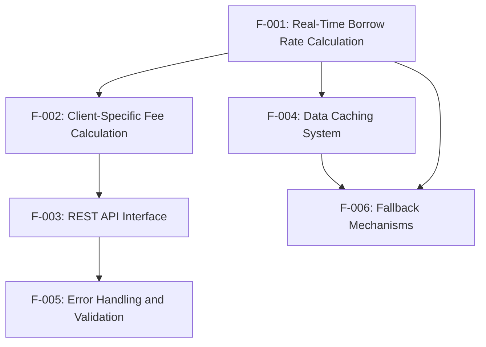
```mermaid
graph TD
    F001[F-001: Real-Time Borrow Rate Calculation]
    F002[F-002: Client-Specific Fee Calculation]
    F003[F-003: REST API Interface]
    F004[F-004: Data Caching System]
    F005[F-005: Error Handling and Validation]
    F006[F-006: Fallback Mechanisms]
    
    F001 --> F002
    F001 --> F004
    F002 --> F003
    F003 --> F005
    F004 --> F006
    F001 --> F006
```

#### Integration Points

| Feature | Integration Points |
|---------|-------------------|
| F-001 | SecLend API, Market Volatility API, Event Calendar API |
| F-002 | Internal broker configuration database |
| F-003 | Trading platforms, Client systems |
| F-004 | Redis cache, External APIs |
| F-005 | Logging system |
| F-006 | Monitoring system |

#### Shared Components

| Component | Used By Features |
|-----------|-----------------|
| Database Access Layer | F-001, F-002, F-006 |
| External API Client | F-001, F-006 |
| Calculation Engine | F-001, F-002 |
| Validation Framework | F-003, F-005 |
| Caching Infrastructure | F-004, F-006 |

### 2.4 IMPLEMENTATION CONSIDERATIONS

#### F-001: Real-Time Borrow Rate Calculation

| Consideration | Details |
|---------------|---------|
| Technical Constraints | Must handle API rate limits from external data providers |
| Performance Requirements | Calculation must complete in <50ms |
| Scalability Considerations | Must scale to handle all US equities (~8,000 tickers) |
| Security Implications | Secure storage of API credentials for external services |
| Maintenance Requirements | Regular review of calculation formulas for market relevance |

#### F-002: Client-Specific Fee Calculation

| Consideration | Details |
|---------------|---------|
| Technical Constraints | Must support various fee structures across different brokers |
| Performance Requirements | Calculation must complete in <30ms |
| Scalability Considerations | Must handle growing number of client configurations |
| Security Implications | Client fee structures must be protected from unauthorized access |
| Maintenance Requirements | Regular auditing of fee calculations for accuracy |

#### F-003: REST API Interface

| Consideration | Details |
|---------------|---------|
| Technical Constraints | Must conform to REST standards and support JSON |
| Performance Requirements | API response time <100ms for 95% of requests |
| Scalability Considerations | Must handle 1000+ requests per second during peak periods |
| Security Implications | API keys, rate limiting, and input validation required |
| Maintenance Requirements | API versioning strategy for future changes |

#### F-004: Data Caching System

| Consideration | Details |
|---------------|---------|
| Technical Constraints | Redis or equivalent required with appropriate memory allocation |
| Performance Requirements | Cache retrieval in <10ms |
| Scalability Considerations | Cache size will grow with number of active securities |
| Security Implications | Cache must be secured against unauthorized access |
| Maintenance Requirements | Regular monitoring of cache hit rates and performance |

#### F-005: Error Handling and Validation

| Consideration | Details |
|---------------|---------|
| Technical Constraints | Must integrate with logging and monitoring systems |
| Performance Requirements | Validation must not significantly impact response time |
| Scalability Considerations | Logging volume will increase with request volume |
| Security Implications | Error messages must not expose sensitive information |
| Maintenance Requirements | Regular review of error patterns for system improvements |

#### F-006: Fallback Mechanisms

| Consideration | Details |
|---------------|---------|
| Technical Constraints | Must detect API failures quickly and reliably |
| Performance Requirements | Fallback decision in <50ms |
| Scalability Considerations | Fallback system must handle full production load |
| Security Implications | Fallback mechanisms must maintain security standards |
| Maintenance Requirements | Regular testing of fallback scenarios |

### 2.5 TRACEABILITY MATRIX

| Requirement ID | Feature ID | Technical Spec Reference | Test Case ID |
|----------------|-----------|--------------------------|-------------|
| F-001-RQ-001 | F-001 | Data Requirements - External Data Sources | TC-001 |
| F-001-RQ-002 | F-001 | Formulas - Borrow Rate Calculation | TC-002 |
| F-001-RQ-003 | F-001 | Formulas - Borrow Rate Calculation | TC-003 |
| F-001-RQ-004 | F-001 | Formulas - Borrow Rate Calculation | TC-004 |
| F-002-RQ-001 | F-002 | Formulas - Locate Fee Formula | TC-005 |
| F-002-RQ-002 | F-002 | Formulas - Locate Fee Formula | TC-006 |
| F-002-RQ-003 | F-002 | REST API Endpoint - Example Response | TC-007 |
| F-002-RQ-004 | F-002 | Formulas - Locate Fee Formula | TC-008 |
| F-003-RQ-001 | F-003 | REST API Endpoint | TC-009 |
| F-003-RQ-002 | F-003 | REST API Endpoint - HTTP Method | TC-010 |
| F-003-RQ-003 | F-003 | REST API Endpoint - Example Response | TC-011 |
| F-003-RQ-004 | F-003 | Additional Considerations - Security | TC-012 |
| F-004-RQ-001 | F-004 | Additional Considerations - Caching Strategy | TC-013 |
| F-004-RQ-002 | F-004 | Additional Considerations - Caching Strategy | TC-014 |
| F-004-RQ-003 | F-004 | Additional Considerations - Caching Strategy | TC-015 |
| F-004-RQ-004 | F-004 | Additional Considerations - Caching Strategy | TC-016 |
| F-005-RQ-001 | F-005 | Additional Considerations - Error Handling | TC-017 |
| F-005-RQ-002 | F-005 | Additional Considerations - Error Handling | TC-018 |
| F-005-RQ-003 | F-005 | Additional Considerations - Error Handling | TC-019 |
| F-005-RQ-004 | F-005 | Additional Considerations - Error Handling | TC-020 |
| F-006-RQ-001 | F-006 | Formulas - Borrow Rate Calculation | TC-021 |
| F-006-RQ-002 | F-006 | Formulas - Borrow Rate Calculation | TC-022 |
| F-006-RQ-003 | F-006 | Additional Considerations - Caching Strategy | TC-023 |
| F-006-RQ-004 | F-006 | Additional Considerations - Error Handling | TC-024 |

## 3. TECHNOLOGY STACK

### 3.1 PROGRAMMING LANGUAGES

| Component | Language | Version | Justification |
|-----------|----------|---------|---------------|
| Backend API | Python | 3.11+ | Python offers excellent data processing capabilities, extensive financial libraries, and strong integration with data science tools needed for rate calculations. Its readability also supports maintainability for complex financial formulas. |
| Data Processing | Python | 3.11+ | Python's pandas and numpy libraries are ideal for the mathematical operations required in borrow rate calculations. |
| Infrastructure Scripts | TypeScript | 5.0+ | Type safety for infrastructure code reduces deployment errors in production financial systems. |

### 3.2 FRAMEWORKS & LIBRARIES

| Component | Framework/Library | Version | Justification |
|-----------|-------------------|---------|---------------|
| API Framework | FastAPI | 0.103.0+ | FastAPI provides high performance, automatic OpenAPI documentation, and strong typing - critical for a financial API with complex parameters. Its async capabilities support high throughput requirements (1000+ requests/second). |
| Data Processing | Pandas | 2.1.0+ | Essential for efficient manipulation of financial data and time series operations needed for rate calculations. |
| Data Validation | Pydantic | 2.4.0+ | Ensures robust input validation and type checking for financial calculations where precision is critical. |
| Testing | pytest | 7.4.0+ | Comprehensive testing framework to ensure calculation accuracy and API reliability. |
| API Client | httpx | 0.25.0+ | Async HTTP client for efficient external API communication with SecLend and market data providers. |

### 3.3 DATABASES & STORAGE

| Component | Technology | Version | Justification |
|-----------|------------|---------|---------------|
| Primary Database | PostgreSQL | 15.0+ | ACID compliance essential for financial data integrity; supports complex queries needed for fee calculations and broker configurations. |
| Caching Layer | Redis | 7.0+ | In-memory data store provides <10ms response times required for caching borrow rates and volatility metrics. TTL features support time-sensitive financial data. |
| Time Series Data | TimescaleDB | 2.11+ | Extension to PostgreSQL optimized for time-series data, supporting historical rate analysis and audit requirements. |
| Connection Pooling | PgBouncer | 1.20+ | Manages database connections efficiently during high-volume trading periods. |

### 3.4 THIRD-PARTY SERVICES

| Service Type | Provider | Purpose | Integration Method |
|--------------|----------|---------|-------------------|
| Market Data API | SecLend API | Real-time borrow rates | REST API with API key authentication |
| Market Volatility | Market Data Provider API | Volatility indices (VIX) | REST API with OAuth 2.0 |
| Event Calendar | Financial Events API | Corporate actions, earnings dates | REST API with API key |
| Monitoring | Datadog | System performance and API metrics | Agent-based with custom metrics |
| Error Tracking | Sentry | Exception monitoring and error reporting | SDK integration |
| Logging | AWS CloudWatch | Centralized logging for audit trail | SDK integration |

### 3.5 DEVELOPMENT & DEPLOYMENT

| Component | Technology | Version | Justification |
|-----------|------------|---------|---------------|
| Containerization | Docker | 24.0+ | Ensures consistent environments across development and production for financial calculations. |
| Container Orchestration | Kubernetes | 1.28+ | Provides high availability and scaling required for a critical financial service. |
| CI/CD | GitHub Actions | N/A | Automated testing and deployment with approval gates for financial system safety. |
| Infrastructure as Code | Terraform | 1.6+ | Reproducible infrastructure deployment reduces operational risk. |
| API Documentation | Swagger/OpenAPI | 3.0 | Self-documenting API essential for integration with trading platforms. |
| Secrets Management | AWS Secrets Manager | N/A | Secure storage of API keys and credentials for external financial services. |

### 3.6 ARCHITECTURE DIAGRAM

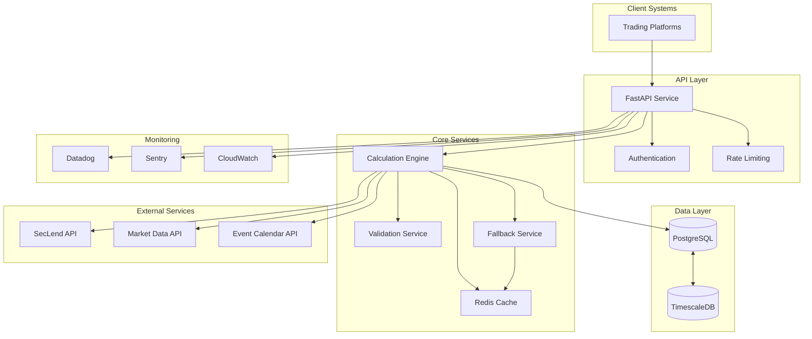
```mermaid
flowchart TB
    subgraph "Client Systems"
        TP[Trading Platforms]
    end
    
    subgraph "API Layer"
        API[FastAPI Service]
        Auth[Authentication]
        Rate[Rate Limiting]
    end
    
    subgraph "Core Services"
        Calc[Calculation Engine]
        Cache[Redis Cache]
        Valid[Validation Service]
        Fall[Fallback Service]
    end
    
    subgraph "Data Layer"
        PG[(PostgreSQL)]
        TS[(TimescaleDB)]
    end
    
    subgraph "External Services"
        SecLend[SecLend API]
        Market[Market Data API]
        Events[Event Calendar API]
    end
    
    subgraph "Monitoring"
        DD[Datadog]
        Sentry[Sentry]
        Logs[CloudWatch]
    end
    
    TP --> API
    API --> Auth
    API --> Rate
    API --> Calc
    Calc --> Cache
    Calc --> Valid
    Calc --> Fall
    Calc --> PG
    PG <--> TS
    Fall --> Cache
    Calc --> SecLend
    Calc --> Market
    Calc --> Events
    API --> DD
    API --> Sentry
    API --> Logs
```

### 3.7 TECHNOLOGY CONSTRAINTS & CONSIDERATIONS

| Constraint | Impact | Mitigation |
|------------|--------|------------|
| API Rate Limits | External market data APIs may have request quotas | Implement aggressive caching with appropriate TTLs; batch requests where possible |
| Performance Requirements | <100ms response time for API calls | Use async processing, Redis caching, and database connection pooling |
| Data Accuracy | Financial calculations must be precise | Comprehensive unit testing of all formulas; automated regression testing |
| High Availability | 99.95% uptime requirement | Kubernetes for container orchestration with multi-zone deployment |
| Security | Financial data requires strong protection | TLS 1.3, API key rotation, rate limiting, input validation |
| Regulatory Compliance | Audit trail requirements | Comprehensive logging of all calculations and data sources used |

## 4. PROCESS FLOWCHART

### 4.1 SYSTEM WORKFLOWS

#### 4.1.1 Core Business Processes

##### Locate Fee Calculation Workflow

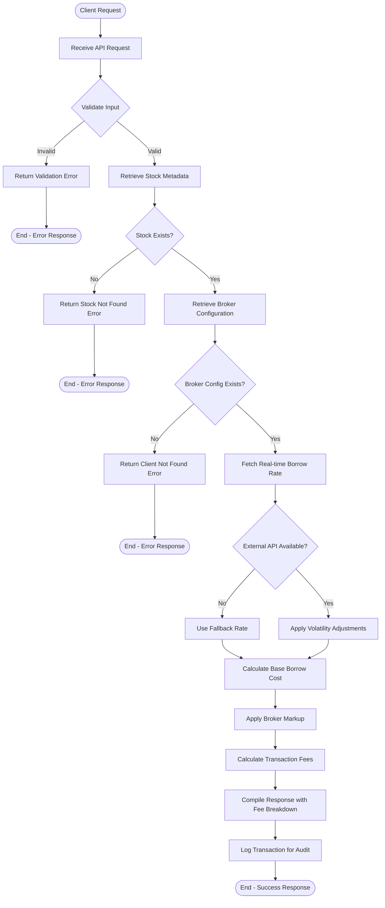
```mermaid
flowchart TD
    Start([Client Request]) --> A[Receive API Request]
    A --> B{Validate Input}
    B -->|Invalid| C[Return Validation Error]
    C --> End1([End - Error Response])
    
    B -->|Valid| D[Retrieve Stock Metadata]
    D --> E{Stock Exists?}
    E -->|No| F[Return Stock Not Found Error]
    F --> End2([End - Error Response])
    
    E -->|Yes| G[Retrieve Broker Configuration]
    G --> H{Broker Config Exists?}
    H -->|No| I[Return Client Not Found Error]
    I --> End3([End - Error Response])
    
    H -->|Yes| J[Fetch Real-time Borrow Rate]
    J --> K{External API Available?}
    K -->|No| L[Use Fallback Rate]
    K -->|Yes| M[Apply Volatility Adjustments]
    
    L --> N[Calculate Base Borrow Cost]
    M --> N
    
    N --> O[Apply Broker Markup]
    O --> P[Calculate Transaction Fees]
    P --> Q[Compile Response with Fee Breakdown]
    Q --> R[Log Transaction for Audit]
    R --> End4([End - Success Response])
```

##### Rate Adjustment Workflow

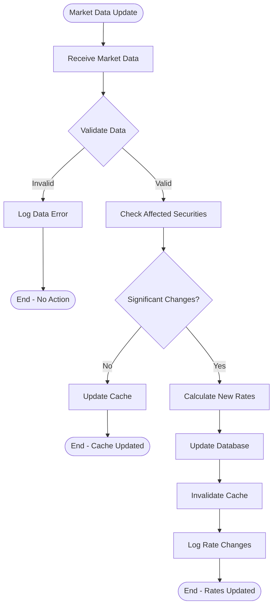
```mermaid
flowchart TD
    Start([Market Data Update]) --> A[Receive Market Data]
    A --> B{Validate Data}
    B -->|Invalid| C[Log Data Error]
    C --> End1([End - No Action])
    
    B -->|Valid| D[Check Affected Securities]
    D --> E{Significant Changes?}
    E -->|No| F[Update Cache]
    F --> End2([End - Cache Updated])
    
    E -->|Yes| G[Calculate New Rates]
    G --> H[Update Database]
    H --> I[Invalidate Cache]
    I --> J[Log Rate Changes]
    J --> End3([End - Rates Updated])
```

#### 4.1.2 Integration Workflows

##### External Data Integration Flow

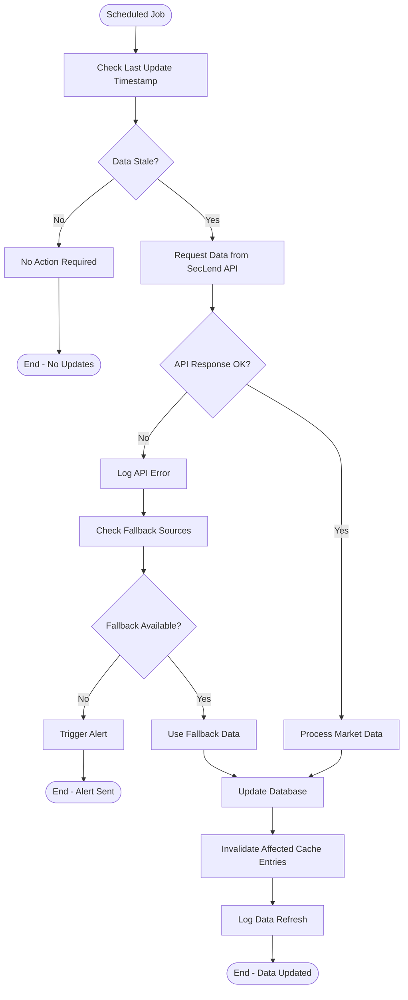
```mermaid
flowchart TD
    Start([Scheduled Job]) --> A[Check Last Update Timestamp]
    A --> B{Data Stale?}
    B -->|No| C[No Action Required]
    C --> End1([End - No Updates])
    
    B -->|Yes| D[Request Data from SecLend API]
    D --> E{API Response OK?}
    E -->|No| F[Log API Error]
    F --> G[Check Fallback Sources]
    G --> H{Fallback Available?}
    H -->|No| I[Trigger Alert]
    I --> End2([End - Alert Sent])
    
    H -->|Yes| J[Use Fallback Data]
    E -->|Yes| K[Process Market Data]
    
    J --> L[Update Database]
    K --> L
    
    L --> M[Invalidate Affected Cache Entries]
    M --> N[Log Data Refresh]
    N --> End3([End - Data Updated])
```

##### Client Request Processing Sequence

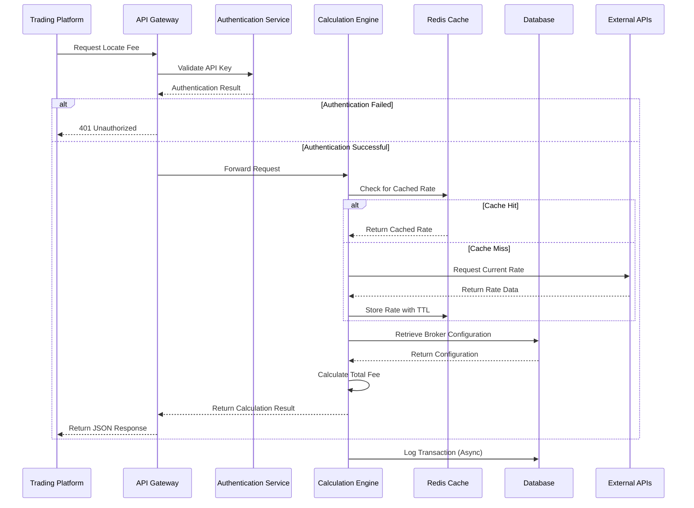
```mermaid
sequenceDiagram
    participant Client as Trading Platform
    participant API as API Gateway
    participant Auth as Authentication Service
    participant Calc as Calculation Engine
    participant Cache as Redis Cache
    participant DB as Database
    participant External as External APIs
    
    Client->>API: Request Locate Fee
    API->>Auth: Validate API Key
    Auth-->>API: Authentication Result
    
    alt Authentication Failed
        API-->>Client: 401 Unauthorized
    else Authentication Successful
        API->>Calc: Forward Request
        Calc->>Cache: Check for Cached Rate
        
        alt Cache Hit
            Cache-->>Calc: Return Cached Rate
        else Cache Miss
            Calc->>External: Request Current Rate
            External-->>Calc: Return Rate Data
            Calc->>Cache: Store Rate with TTL
        end
        
        Calc->>DB: Retrieve Broker Configuration
        DB-->>Calc: Return Configuration
        
        Calc->>Calc: Calculate Total Fee
        Calc-->>API: Return Calculation Result
        API-->>Client: Return JSON Response
    end
    
    Calc->>DB: Log Transaction (Async)
```

### 4.2 FLOWCHART REQUIREMENTS

#### 4.2.1 Borrow Rate Calculation Workflow

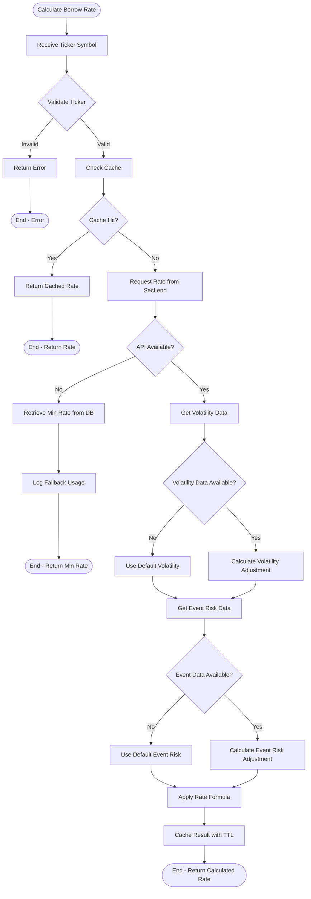
```mermaid
flowchart TD
    Start([Calculate Borrow Rate]) --> A[Receive Ticker Symbol]
    A --> B{Validate Ticker}
    B -->|Invalid| C[Return Error]
    C --> End1([End - Error])
    
    B -->|Valid| D[Check Cache]
    D --> E{Cache Hit?}
    E -->|Yes| F[Return Cached Rate]
    F --> End2([End - Return Rate])
    
    E -->|No| G[Request Rate from SecLend]
    G --> H{API Available?}
    H -->|No| I[Retrieve Min Rate from DB]
    I --> J[Log Fallback Usage]
    J --> End3([End - Return Min Rate])
    
    H -->|Yes| K[Get Volatility Data]
    K --> L{Volatility Data Available?}
    L -->|No| M[Use Default Volatility]
    L -->|Yes| N[Calculate Volatility Adjustment]
    
    M --> O[Get Event Risk Data]
    N --> O
    
    O --> P{Event Data Available?}
    P -->|No| Q[Use Default Event Risk]
    P -->|Yes| R[Calculate Event Risk Adjustment]
    
    Q --> S[Apply Rate Formula]
    R --> S
    
    S --> T[Cache Result with TTL]
    T --> End4([End - Return Calculated Rate])
```

#### 4.2.2 Client Fee Calculation Workflow

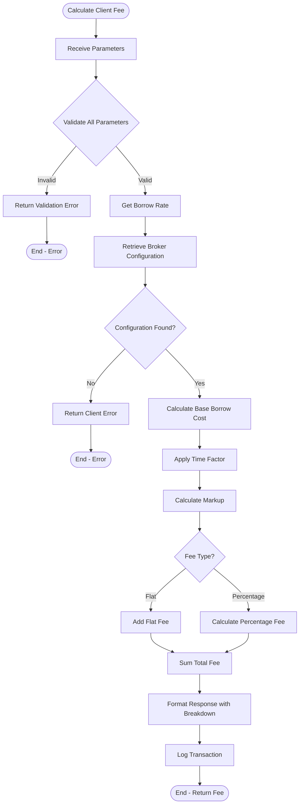
```mermaid
flowchart TD
    Start([Calculate Client Fee]) --> A[Receive Parameters]
    A --> B{Validate All Parameters}
    B -->|Invalid| C[Return Validation Error]
    C --> End1([End - Error])
    
    B -->|Valid| D[Get Borrow Rate]
    D --> E[Retrieve Broker Configuration]
    E --> F{Configuration Found?}
    F -->|No| G[Return Client Error]
    G --> End2([End - Error])
    
    F -->|Yes| H[Calculate Base Borrow Cost]
    H --> I[Apply Time Factor]
    I --> J[Calculate Markup]
    
    J --> K{Fee Type?}
    K -->|Flat| L[Add Flat Fee]
    K -->|Percentage| M[Calculate Percentage Fee]
    
    L --> N[Sum Total Fee]
    M --> N
    
    N --> O[Format Response with Breakdown]
    O --> P[Log Transaction]
    P --> End3([End - Return Fee])
```

#### 4.2.3 Validation Rules Flow

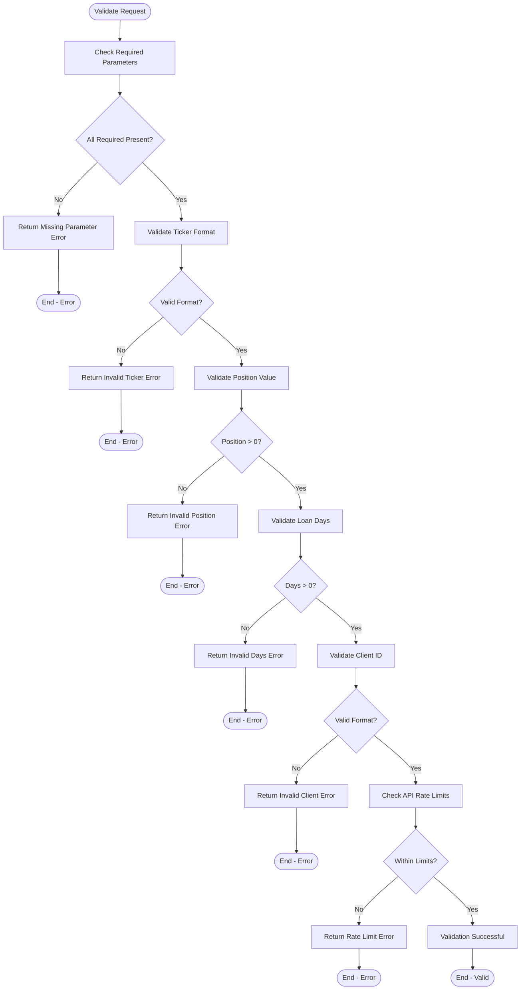
```mermaid
flowchart TD
    Start([Validate Request]) --> A[Check Required Parameters]
    A --> B{All Required Present?}
    B -->|No| C[Return Missing Parameter Error]
    C --> End1([End - Error])
    
    B -->|Yes| D[Validate Ticker Format]
    D --> E{Valid Format?}
    E -->|No| F[Return Invalid Ticker Error]
    F --> End2([End - Error])
    
    E -->|Yes| G[Validate Position Value]
    G --> H{Position > 0?}
    H -->|No| I[Return Invalid Position Error]
    I --> End3([End - Error])
    
    H -->|Yes| J[Validate Loan Days]
    J --> K{Days > 0?}
    K -->|No| L[Return Invalid Days Error]
    L --> End4([End - Error])
    
    K -->|Yes| M[Validate Client ID]
    M --> N{Valid Format?}
    N -->|No| O[Return Invalid Client Error]
    O --> End5([End - Error])
    
    N -->|Yes| P[Check API Rate Limits]
    P --> Q{Within Limits?}
    Q -->|No| R[Return Rate Limit Error]
    R --> End6([End - Error])
    
    Q -->|Yes| S[Validation Successful]
    S --> End7([End - Valid])
```

### 4.3 TECHNICAL IMPLEMENTATION

#### 4.3.1 State Management

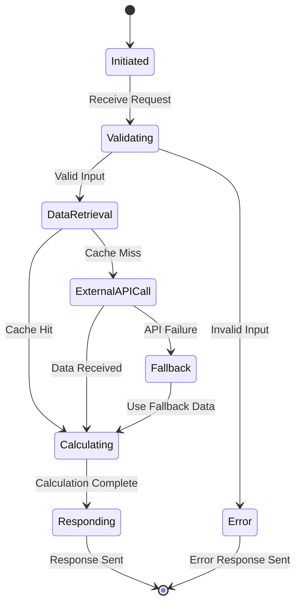
```mermaid
stateDiagram-v2
    [*] --> Initiated
    Initiated --> Validating: Receive Request
    
    Validating --> Error: Invalid Input
    Validating --> DataRetrieval: Valid Input
    
    DataRetrieval --> ExternalAPICall: Cache Miss
    DataRetrieval --> Calculating: Cache Hit
    ExternalAPICall --> Calculating: Data Received
    ExternalAPICall --> Fallback: API Failure
    
    Fallback --> Calculating: Use Fallback Data
    
    Calculating --> Responding: Calculation Complete
    Responding --> [*]: Response Sent
    
    Error --> [*]: Error Response Sent
```

#### 4.3.2 Error Handling Flow

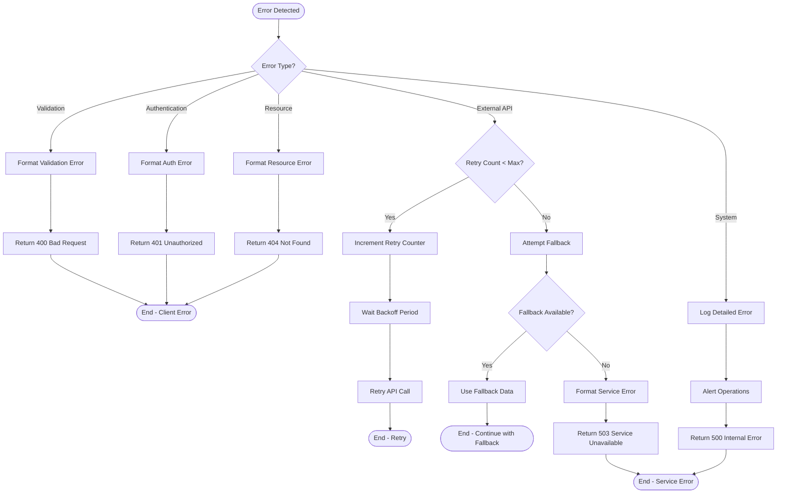
```mermaid
flowchart TD
    Start([Error Detected]) --> A{Error Type?}
    
    A -->|Validation| B[Format Validation Error]
    B --> C[Return 400 Bad Request]
    
    A -->|Authentication| D[Format Auth Error]
    D --> E[Return 401 Unauthorized]
    
    A -->|Resource| F[Format Resource Error]
    F --> G[Return 404 Not Found]
    
    A -->|External API| H{Retry Count < Max?}
    H -->|Yes| I[Increment Retry Counter]
    I --> J[Wait Backoff Period]
    J --> K[Retry API Call]
    
    H -->|No| L[Attempt Fallback]
    L --> M{Fallback Available?}
    M -->|Yes| N[Use Fallback Data]
    M -->|No| O[Format Service Error]
    O --> P[Return 503 Service Unavailable]
    
    A -->|System| Q[Log Detailed Error]
    Q --> R[Alert Operations]
    R --> S[Return 500 Internal Error]
    
    C --> End1([End - Client Error])
    E --> End1
    G --> End1
    
    K --> End2([End - Retry])
    N --> End3([End - Continue with Fallback])
    P --> End4([End - Service Error])
    S --> End4
```

### 4.4 INTEGRATION SEQUENCE DIAGRAMS

#### 4.4.1 API Request Sequence

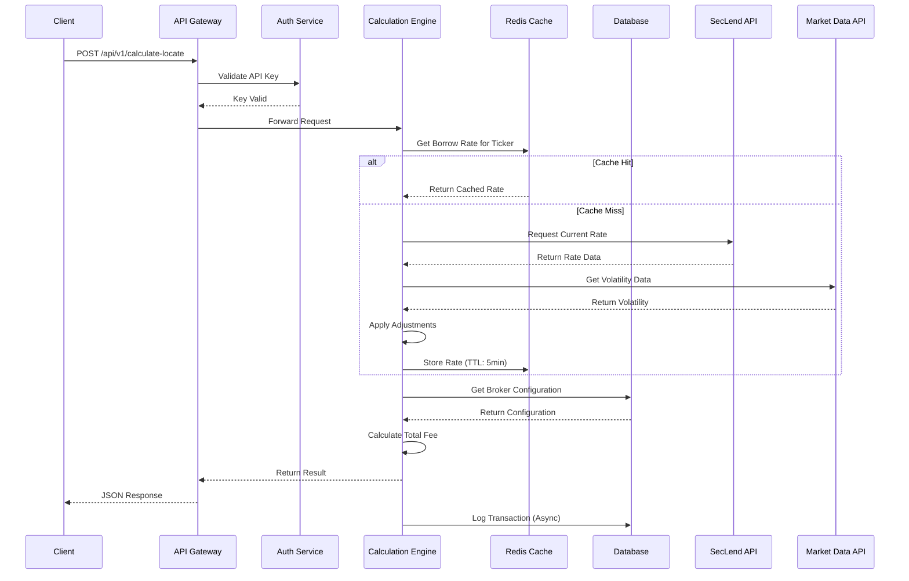
```mermaid
sequenceDiagram
    participant Client
    participant API as API Gateway
    participant Auth as Auth Service
    participant Calc as Calculation Engine
    participant Cache as Redis Cache
    participant DB as Database
    participant SecLend as SecLend API
    participant Market as Market Data API
    
    Client->>API: POST /api/v1/calculate-locate
    API->>Auth: Validate API Key
    Auth-->>API: Key Valid
    
    API->>Calc: Forward Request
    
    Calc->>Cache: Get Borrow Rate for Ticker
    alt Cache Hit
        Cache-->>Calc: Return Cached Rate
    else Cache Miss
        Calc->>SecLend: Request Current Rate
        SecLend-->>Calc: Return Rate Data
        
        Calc->>Market: Get Volatility Data
        Market-->>Calc: Return Volatility
        
        Calc->>Calc: Apply Adjustments
        Calc->>Cache: Store Rate (TTL: 5min)
    end
    
    Calc->>DB: Get Broker Configuration
    DB-->>Calc: Return Configuration
    
    Calc->>Calc: Calculate Total Fee
    Calc-->>API: Return Result
    
    API-->>Client: JSON Response
    
    Calc->>DB: Log Transaction (Async)
```

#### 4.4.2 Data Refresh Sequence

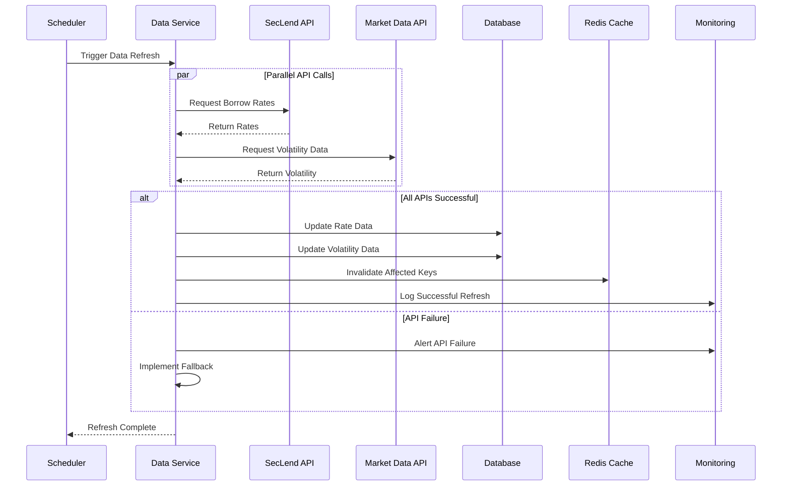
```mermaid
sequenceDiagram
    participant Scheduler
    participant DataSvc as Data Service
    participant SecLend as SecLend API
    participant Market as Market Data API
    participant DB as Database
    participant Cache as Redis Cache
    participant Monitor as Monitoring
    
    Scheduler->>DataSvc: Trigger Data Refresh
    
    par Parallel API Calls
        DataSvc->>SecLend: Request Borrow Rates
        SecLend-->>DataSvc: Return Rates
        
        DataSvc->>Market: Request Volatility Data
        Market-->>DataSvc: Return Volatility
    end
    
    alt All APIs Successful
        DataSvc->>DB: Update Rate Data
        DataSvc->>DB: Update Volatility Data
        DataSvc->>Cache: Invalidate Affected Keys
        DataSvc->>Monitor: Log Successful Refresh
    else API Failure
        DataSvc->>Monitor: Alert API Failure
        DataSvc->>DataSvc: Implement Fallback
    end
    
    DataSvc-->>Scheduler: Refresh Complete
```

### 4.5 SYSTEM BOUNDARIES AND TIMING CONSTRAINTS

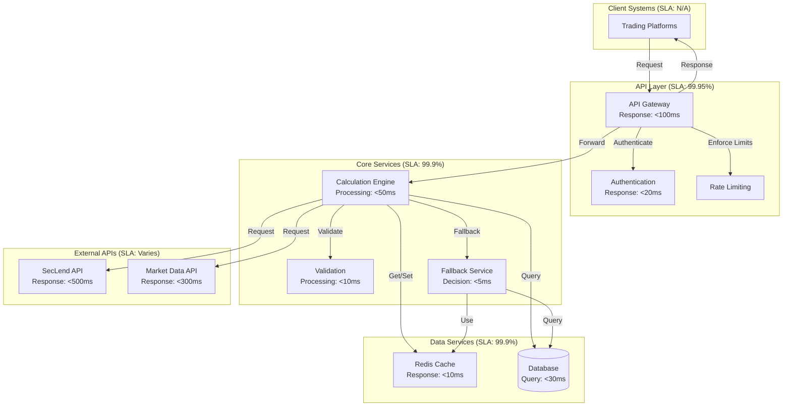
```mermaid
flowchart TD
    subgraph Client["Client Systems (SLA: N/A)"]
        TP[Trading Platforms]
    end
    
    subgraph APILayer["API Layer (SLA: 99.95%)"]
        API[API Gateway<br>Response: <100ms]
        Auth[Authentication<br>Response: <20ms]
        Rate[Rate Limiting]
    end
    
    subgraph CoreServices["Core Services (SLA: 99.9%)"]
        Calc[Calculation Engine<br>Processing: <50ms]
        Valid[Validation<br>Processing: <10ms]
        Fall[Fallback Service<br>Decision: <5ms]
    end
    
    subgraph DataServices["Data Services (SLA: 99.9%)"]
        Cache[Redis Cache<br>Response: <10ms]
        DB[(Database<br>Query: <30ms)]
    end
    
    subgraph ExternalAPIs["External APIs (SLA: Varies)"]
        SecLend[SecLend API<br>Response: <500ms]
        Market[Market Data API<br>Response: <300ms]
    end
    
    TP -->|Request| API
    API -->|Authenticate| Auth
    API -->|Enforce Limits| Rate
    API -->|Forward| Calc
    
    Calc -->|Validate| Valid
    Calc -->|Get/Set| Cache
    Calc -->|Query| DB
    Calc -->|Request| SecLend
    Calc -->|Request| Market
    Calc -->|Fallback| Fall
    
    Fall -->|Use| Cache
    Fall -->|Query| DB
    
    API -->|Response| TP
```

### 4.6 ERROR RECOVERY PROCEDURES

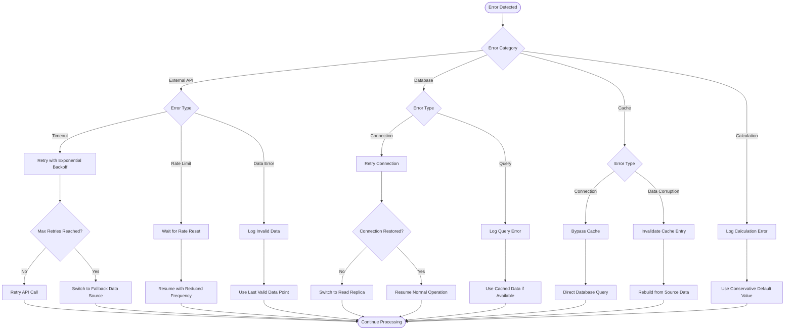
```mermaid
flowchart TD
    Start([Error Detected]) --> A{Error Category}
    
    A -->|External API| B{Error Type}
    B -->|Timeout| C[Retry with Exponential Backoff]
    C --> D{Max Retries Reached?}
    D -->|No| E[Retry API Call]
    D -->|Yes| F[Switch to Fallback Data Source]
    
    B -->|Rate Limit| G[Wait for Rate Reset]
    G --> H[Resume with Reduced Frequency]
    
    B -->|Data Error| I[Log Invalid Data]
    I --> J[Use Last Valid Data Point]
    
    A -->|Database| K{Error Type}
    K -->|Connection| L[Retry Connection]
    L --> M{Connection Restored?}
    M -->|No| N[Switch to Read Replica]
    M -->|Yes| O[Resume Normal Operation]
    
    K -->|Query| P[Log Query Error]
    P --> Q[Use Cached Data if Available]
    
    A -->|Cache| R{Error Type}
    R -->|Connection| S[Bypass Cache]
    S --> T[Direct Database Query]
    
    R -->|Data Corruption| U[Invalidate Cache Entry]
    U --> V[Rebuild from Source Data]
    
    A -->|Calculation| W[Log Calculation Error]
    W --> X[Use Conservative Default Value]
    
    E --> End1([Continue Processing])
    F --> End1
    H --> End1
    J --> End1
    N --> End1
    O --> End1
    Q --> End1
    T --> End1
    V --> End1
    X --> End1
```

## 5. SYSTEM ARCHITECTURE

### 5.1 HIGH-LEVEL ARCHITECTURE

#### 5.1.1 System Overview

The Borrow Rate & Locate Fee Pricing Engine employs a microservices architecture to ensure modularity, scalability, and maintainability. This approach was selected to allow independent scaling of high-traffic components and to facilitate future extensions.

- **Architectural Style**: Microservices-based REST API architecture with event-driven components for data synchronization
- **Key Principles**:
  - Separation of concerns between calculation logic, data management, and API interfaces
  - Stateless service design to enable horizontal scaling
  - Defensive programming with comprehensive error handling and fallbacks
  - Caching at multiple levels to optimize performance and reduce external API costs
  - Event-driven updates for market data changes

- **System Boundaries**:
  - Northbound: REST API interfaces for client applications and trading platforms
  - Southbound: Integration with external market data providers and borrow rate sources
  - Internal: Service-to-service communication via REST and message queues

#### 5.1.2 Core Components Table

| Component Name | Primary Responsibility | Key Dependencies | Critical Considerations |
|----------------|------------------------|------------------|-------------------------|
| API Gateway | Route requests, authenticate clients, enforce rate limits | Auth Service, Calculation Service | Must handle high throughput with minimal latency |
| Calculation Service | Execute fee formulas, apply business rules | Data Service, Cache Service | Formula accuracy and calculation performance are critical |
| Data Service | Manage internal data and external API integration | External APIs, Database | Must handle external API failures gracefully |
| Cache Service | Optimize performance through multi-level caching | Redis | Cache invalidation strategy is crucial for data accuracy |
| Configuration Service | Manage broker-specific rules and fee structures | Database | Must support rapid configuration changes |
| Audit Service | Record all calculations for compliance | Message Queue, Database | Complete audit trail required for regulatory compliance |

#### 5.1.3 Data Flow Description

The primary data flow begins with client requests through the API Gateway, which authenticates and routes to the Calculation Service. The Calculation Service first checks the Cache Service for recent borrow rates. On cache miss, it requests data from the Data Service, which either returns cached external data or fetches fresh data from external APIs.

The Calculation Service applies the appropriate formulas using broker configuration from the Configuration Service. Results are returned to the client and simultaneously sent to the Audit Service for logging. This approach minimizes latency while ensuring complete auditability.

Market data updates flow from external APIs to the Data Service, which processes and stores the data, then publishes change events. These events trigger cache invalidation in the Cache Service to ensure calculations use the most current data.

#### 5.1.4 External Integration Points

| System Name | Integration Type | Data Exchange Pattern | Protocol/Format | SLA Requirements |
|-------------|------------------|------------------------|-----------------|------------------|
| SecLend API | Real-time data source | Request-response | REST/JSON | 99.5% availability, <500ms response |
| Market Volatility API | Real-time data source | Request-response | REST/JSON | 99.5% availability, <300ms response |
| Event Calendar API | Scheduled data source | Polling | REST/JSON | 99% availability, daily updates |
| Trading Platforms | Client systems | Request-response | REST/JSON | 99.95% availability, <100ms response |
| Billing Systems | Downstream consumer | Asynchronous | Message Queue/JSON | Daily reconciliation |

### 5.2 COMPONENT DETAILS

#### 5.2.1 API Gateway

- **Purpose**: Serves as the entry point for all client requests, handling authentication, rate limiting, and request routing
- **Technologies**: NGINX, Kong, or AWS API Gateway
- **Key Interfaces**:
  - `/api/v1/calculate-locate` - Primary calculation endpoint
  - `/api/v1/health` - System health check endpoint
  - `/api/v1/rates/{ticker}` - Current borrow rate lookup endpoint
- **Data Persistence**: No direct persistence, logs API access patterns
- **Scaling Considerations**: Horizontally scalable, stateless design

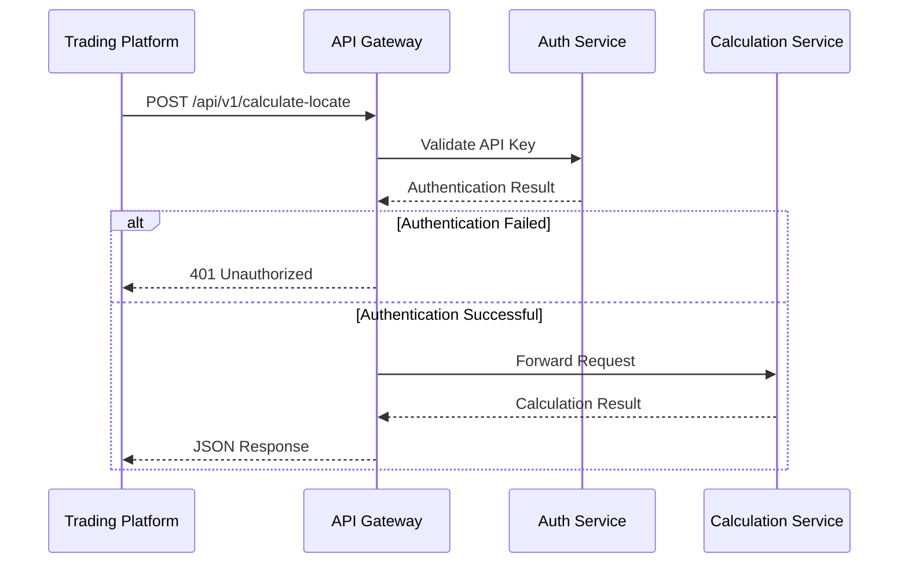
```mermaid
sequenceDiagram
    participant Client as Trading Platform
    participant Gateway as API Gateway
    participant Auth as Auth Service
    participant Calc as Calculation Service
    
    Client->>Gateway: POST /api/v1/calculate-locate
    Gateway->>Auth: Validate API Key
    Auth-->>Gateway: Authentication Result
    
    alt Authentication Failed
        Gateway-->>Client: 401 Unauthorized
    else Authentication Successful
        Gateway->>Calc: Forward Request
        Calc-->>Gateway: Calculation Result
        Gateway-->>Client: JSON Response
    end
```

#### 5.2.2 Calculation Service

- **Purpose**: Implements the core business logic for borrow rate and fee calculations
- **Technologies**: Python with FastAPI or Node.js
- **Key Interfaces**:
  - Internal API for fee calculations
  - Interface to Data Service for market data
  - Interface to Configuration Service for broker settings
- **Data Persistence**: No direct persistence, calculation results cached
- **Scaling Considerations**: CPU-intensive during calculation peaks, scale based on request volume

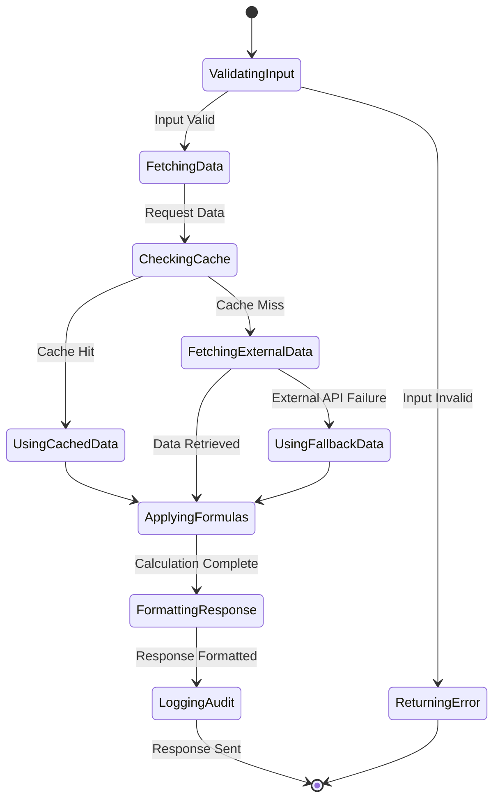
```mermaid
stateDiagram-v2
    [*] --> ValidatingInput
    ValidatingInput --> FetchingData: Input Valid
    ValidatingInput --> ReturningError: Input Invalid
    
    FetchingData --> CheckingCache: Request Data
    CheckingCache --> UsingCachedData: Cache Hit
    CheckingCache --> FetchingExternalData: Cache Miss
    
    FetchingExternalData --> ApplyingFormulas: Data Retrieved
    FetchingExternalData --> UsingFallbackData: External API Failure
    
    UsingCachedData --> ApplyingFormulas
    UsingFallbackData --> ApplyingFormulas
    
    ApplyingFormulas --> FormattingResponse: Calculation Complete
    FormattingResponse --> LoggingAudit: Response Formatted
    LoggingAudit --> [*]: Response Sent
    
    ReturningError --> [*]
```

#### 5.2.3 Data Service

- **Purpose**: Manages all data access, including external API integration and internal database operations
- **Technologies**: Python or Node.js with appropriate database drivers
- **Key Interfaces**:
  - Internal API for data retrieval
  - Connectors to external market data APIs
  - Database access layer
- **Data Persistence**: PostgreSQL for structured data, TimescaleDB for time-series data
- **Scaling Considerations**: I/O-bound, scale based on database and API capacity

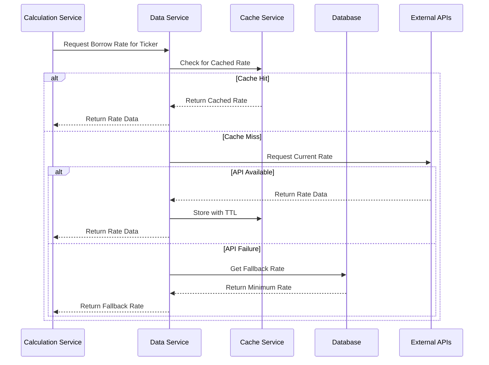
```mermaid
sequenceDiagram
    participant Calc as Calculation Service
    participant Data as Data Service
    participant Cache as Cache Service
    participant DB as Database
    participant External as External APIs
    
    Calc->>Data: Request Borrow Rate for Ticker
    Data->>Cache: Check for Cached Rate
    
    alt Cache Hit
        Cache-->>Data: Return Cached Rate
        Data-->>Calc: Return Rate Data
    else Cache Miss
        Data->>External: Request Current Rate
        
        alt API Available
            External-->>Data: Return Rate Data
            Data->>Cache: Store with TTL
            Data-->>Calc: Return Rate Data
        else API Failure
            Data->>DB: Get Fallback Rate
            DB-->>Data: Return Minimum Rate
            Data-->>Calc: Return Fallback Rate
        end
    end
```

#### 5.2.4 Cache Service

- **Purpose**: Provides multi-level caching to optimize performance and reduce external API calls
- **Technologies**: Redis
- **Key Interfaces**:
  - Internal API for cache operations
  - Redis client interface
- **Data Persistence**: In-memory with configurable persistence
- **Scaling Considerations**: Memory-bound, scale based on cache size and access patterns

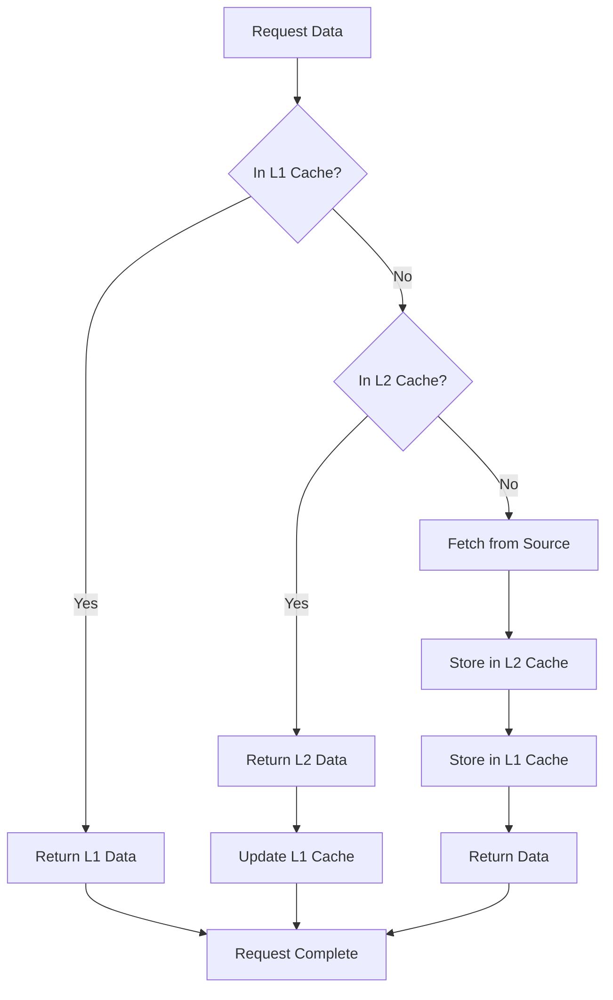
```mermaid
flowchart TD
    A[Request Data] --> B{In L1 Cache?}
    B -->|Yes| C[Return L1 Data]
    B -->|No| D{In L2 Cache?}
    D -->|Yes| E[Return L2 Data]
    D -->|No| F[Fetch from Source]
    F --> G[Store in L2 Cache]
    G --> H[Store in L1 Cache]
    H --> I[Return Data]
    C --> J[Request Complete]
    E --> K[Update L1 Cache]
    K --> J
    I --> J
```

#### 5.2.5 Configuration Service

- **Purpose**: Manages broker-specific configurations and system parameters
- **Technologies**: Python or Node.js with database access
- **Key Interfaces**:
  - Internal API for configuration retrieval
  - Admin API for configuration updates
- **Data Persistence**: PostgreSQL for configuration data
- **Scaling Considerations**: Read-heavy workload, consider read replicas

#### 5.2.6 Audit Service

- **Purpose**: Records all calculations and data access for compliance and troubleshooting
- **Technologies**: Event-driven architecture with message queue
- **Key Interfaces**:
  - Message queue consumer
  - Database writer
- **Data Persistence**: PostgreSQL or specialized audit database
- **Scaling Considerations**: Write-heavy workload, scale based on audit volume

### 5.3 TECHNICAL DECISIONS

#### 5.3.1 Architecture Style Decisions

| Decision | Options Considered | Selected Approach | Rationale |
|----------|-------------------|-------------------|-----------|
| Overall Architecture | Monolithic, Microservices, Serverless | Microservices | Enables independent scaling of components, better fault isolation, and technology flexibility |
| API Design | REST, GraphQL, gRPC | REST | Industry standard for financial APIs, broad client support, and simpler implementation |
| Data Synchronization | Polling, Webhooks, Event-driven | Event-driven with polling fallback | Reduces latency for data updates while ensuring reliability |
| Deployment Model | Containers, VMs, Serverless | Containers (Kubernetes) | Provides consistent environments, efficient resource utilization, and robust orchestration |

#### 5.3.2 Communication Pattern Choices

The system employs a hybrid communication approach:

- **Synchronous REST** for client-facing APIs and time-sensitive internal communication
- **Asynchronous messaging** for audit logging and non-critical updates
- **Publish-subscribe** for market data updates and cache invalidation

This hybrid approach balances the need for immediate responses to client requests with the resilience benefits of asynchronous processing for background tasks.

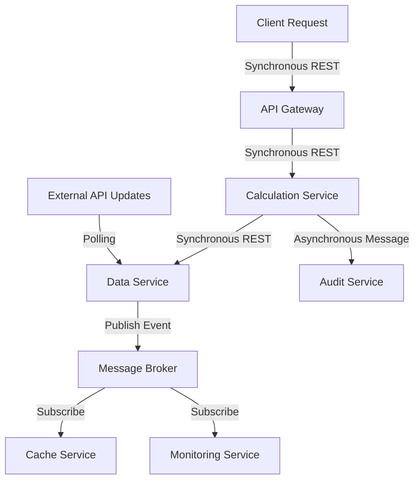
```mermaid
flowchart TD
    A[Client Request] -->|Synchronous REST| B[API Gateway]
    B -->|Synchronous REST| C[Calculation Service]
    C -->|Synchronous REST| D[Data Service]
    C -->|Asynchronous Message| E[Audit Service]
    F[External API Updates] -->|Polling| D
    D -->|Publish Event| G[Message Broker]
    G -->|Subscribe| H[Cache Service]
    G -->|Subscribe| I[Monitoring Service]
```

#### 5.3.3 Data Storage Solution Rationale

| Data Type | Selected Solution | Rationale |
|-----------|-------------------|-----------|
| Broker Configurations | PostgreSQL | ACID compliance for critical configuration data, relational structure fits the data model |
| Market Data History | TimescaleDB | Optimized for time-series data, efficient querying of historical rates |
| Calculation Results | Redis (Cache) | In-memory performance for frequent calculations, TTL support for automatic expiration |
| Audit Logs | PostgreSQL with partitioning | Structured storage with good query performance, partitioning for large volumes |

#### 5.3.4 Caching Strategy Justification

The system implements a multi-level caching strategy:

- **L1 Cache**: In-memory application cache (5-second TTL) for ultra-high-performance during calculation bursts
- **L2 Cache**: Redis distributed cache (5-minute TTL) for sharing across service instances
- **L3 Cache**: Database cache of external API responses (1-hour TTL) for fallback during API outages

This approach balances data freshness with performance and resilience requirements, with shorter TTLs for volatile data and longer TTLs for stable reference data.

#### 5.3.5 Security Mechanism Selection

| Security Concern | Selected Approach | Rationale |
|------------------|-------------------|-----------|
| Authentication | API Key + JWT | Industry standard, scalable, and supports fine-grained permissions |
| Authorization | Role-based Access Control | Allows precise control over feature access based on client type |
| Data Protection | TLS 1.3 + Field-level Encryption | Protects data in transit and sensitive data at rest |
| Rate Limiting | Token Bucket Algorithm | Allows burst capacity while preventing abuse |

### 5.4 CROSS-CUTTING CONCERNS

#### 5.4.1 Monitoring and Observability Approach

The system implements a comprehensive monitoring strategy:

- **Health Metrics**: Service availability, response times, error rates
- **Business Metrics**: Calculation volumes, average fees, API usage by client
- **System Metrics**: CPU, memory, network, and database performance
- **Custom Alerts**: Triggered for anomalies in calculation patterns or external API issues

All metrics are collected via Prometheus and visualized in Grafana dashboards, with critical alerts routed to PagerDuty for immediate response.

#### 5.4.2 Logging and Tracing Strategy

| Log Type | Content | Retention | Access Control |
|----------|---------|-----------|----------------|
| Application Logs | Service operations, errors, warnings | 30 days | Operations team |
| Audit Logs | All calculations with inputs and results | 7 years | Compliance team |
| Security Logs | Authentication attempts, configuration changes | 1 year | Security team |
| Performance Logs | Timing data for optimization | 14 days | Development team |

Distributed tracing using OpenTelemetry provides end-to-end visibility into request flows across services, with trace IDs included in all logs for correlation.

#### 5.4.3 Error Handling Patterns

```mermaid
flowchart TD
    A[Error Detected] --> B{Error Type}
    
    B -->|Validation Error| C[Return 400 Bad Request]
    B -->|Authentication Error| D[Return 401 Unauthorized]
    B -->|Authorization Error| E[Return 403 Forbidden]
    B -->|Resource Error| F[Return 404 Not Found]
    
    B -->|External API Error| G{Fallback Available?}
    G -->|Yes| H[Use Fallback Data]
    G -->|No| I[Return 503 Service Unavailable]
    
    B -->|Database Error| J{Read/Write?}
    J -->|Read| K[Try Replica]
    J -->|Write| L[Queue for Retry]
    
    B -->|Unexpected Error| M[Log Detailed Error]
    M --> N[Return 500 Internal Error]
    
    C --> O[Log Client Error]
    D --> O
    E --> O
    F --> O
    
    H --> P[Log Fallback Usage]
    I --> Q[Trigger Alert]
    
    K --> R{Replica Available?}
    R -->|Yes| S[Continue with Replica]
    R -->|No| T[Return Cached Data]
    
    L --> U[Background Retry]
    
    S --> V[Log Recovery Action]
    T --> V
    U --> V
```

#### 5.4.4 Authentication and Authorization Framework

The system implements a multi-layered security approach:

- **API Gateway Authentication**: Validates API keys and issues short-lived JWTs
- **Service-to-Service Authentication**: Mutual TLS between internal services
- **Authorization Checks**: Role-based permissions enforced at the API and service levels
- **Audit Trail**: All authentication and authorization decisions logged

This approach ensures that only authorized clients can access the API, with fine-grained control over which operations each client can perform.

#### 5.4.5 Performance Requirements and SLAs

| Metric | Target | Degraded | Critical |
|--------|--------|----------|----------|
| API Response Time | <100ms (p95) | 100-250ms | >250ms |
| Calculation Accuracy | 100% | N/A | <100% |
| System Availability | 99.95% | 99.9-99.95% | <99.9% |
| External API Failures | <0.1% | 0.1-1% | >1% |
| Cache Hit Rate | >95% | 85-95% | <85% |

These SLAs are monitored continuously, with alerts triggered when metrics enter the degraded or critical ranges.

#### 5.4.6 Disaster Recovery Procedures

The system implements a robust disaster recovery strategy:

- **Data Backups**: Hourly incremental and daily full backups of all databases
- **Configuration Backups**: Version-controlled configuration with automated deployment
- **Failover Capability**: Active-passive deployment across multiple availability zones
- **Recovery Time Objective (RTO)**: <15 minutes for full system restoration
- **Recovery Point Objective (RPO)**: <5 minutes of data loss in worst-case scenario

Regular disaster recovery drills ensure that procedures are effective and that the team is prepared to respond to various failure scenarios.

## 6. SYSTEM COMPONENTS DESIGN

### 6.1 COMPONENT ARCHITECTURE

The Borrow Rate & Locate Fee Pricing Engine is composed of several distinct components that work together to provide accurate, real-time pricing calculations. The following diagram illustrates the high-level component architecture:

```mermaid
graph TD
    Client[Client Applications] --> API[API Gateway]
    API --> Auth[Authentication Service]
    API --> Calc[Calculation Engine]
    Calc --> DataAccess[Data Access Layer]
    Calc --> Cache[Cache Service]
    DataAccess --> DB[(Internal Database)]
    DataAccess --> ExtAPI[External API Client]
    ExtAPI --> SecLend[SecLend API]
    ExtAPI --> VolAPI[Volatility API]
    ExtAPI --> EventAPI[Event Calendar API]
    Cache --> Redis[(Redis Cache)]
    Calc --> Audit[Audit Service]
    Audit --> AuditDB[(Audit Database)]
```

#### 6.1.1 Component Interactions

| Component | Interacts With | Interaction Type | Purpose |
|-----------|----------------|------------------|---------|
| API Gateway | Authentication Service, Calculation Engine | Synchronous | Route and validate client requests |
| Authentication Service | API Gateway, Internal Database | Synchronous | Validate API keys and enforce rate limits |
| Calculation Engine | Data Access Layer, Cache Service, Audit Service | Synchronous | Execute fee calculations using business rules |
| Data Access Layer | Internal Database, External API Client | Synchronous | Retrieve and manage data needed for calculations |
| External API Client | SecLend API, Volatility API, Event Calendar API | Synchronous | Fetch real-time market data |
| Cache Service | Redis Cache | Synchronous | Store and retrieve frequently accessed data |
| Audit Service | Audit Database | Asynchronous | Record calculation details for compliance |

### 6.2 COMPONENT SPECIFICATIONS

#### 6.2.1 API Gateway

| Aspect | Specification |
|--------|---------------|
| Purpose | Serves as the entry point for all client requests, handling routing, basic validation, and rate limiting |
| Key Functions | • Route requests to appropriate services<br>• Perform basic request validation<br>• Apply rate limiting based on client ID<br>• Handle API versioning |
| Interfaces | • REST API endpoints for client applications<br>• Internal interfaces to Authentication and Calculation services |
| Dependencies | • Authentication Service<br>• Calculation Engine |
| Performance Requirements | • Handle 1000+ requests per second<br>• Add <5ms overhead to request processing |
| Fault Tolerance | • Continue operation if downstream services are degraded<br>• Return appropriate error responses when services are unavailable |

#### 6.2.2 Authentication Service

| Aspect | Specification |
|--------|---------------|
| Purpose | Validates client credentials and enforces access controls |
| Key Functions | • Validate API keys<br>• Enforce client-specific rate limits<br>• Maintain authentication audit logs |
| Interfaces | • Internal API for authentication requests<br>• Database access for client credentials |
| Dependencies | • Internal Database (client credentials)<br>• Logging System |
| Performance Requirements | • Authentication decisions in <20ms<br>• Support 2000+ authentication requests per second |
| Fault Tolerance | • Cache frequently used credentials<br>• Fail closed (deny access) when database is unavailable |

#### 6.2.3 Calculation Engine

| Aspect | Specification |
|--------|---------------|
| Purpose | Implements core business logic for borrow rate and fee calculations |
| Key Functions | • Calculate base borrow rates with market adjustments<br>• Apply broker-specific markups and fees<br>• Generate detailed fee breakdowns<br>• Handle time-based proration |
| Interfaces | • Internal API for calculation requests<br>• Interfaces to Data Access and Cache services |
| Dependencies | • Data Access Layer<br>• Cache Service<br>• Audit Service |
| Performance Requirements | • Complete calculations in <50ms<br>• Support 1000+ calculations per second |
| Fault Tolerance | • Use cached data when external sources are unavailable<br>• Fall back to minimum rates when necessary<br>• Log all calculation parameters for troubleshooting |

#### 6.2.4 Data Access Layer

| Aspect | Specification |
|--------|---------------|
| Purpose | Provides unified access to all data sources, both internal and external |
| Key Functions | • Retrieve stock metadata from internal database<br>• Fetch broker configurations<br>• Coordinate external API requests<br>• Implement data validation and transformation |
| Interfaces | • Internal API for data requests<br>• Database connections<br>• External API client interface |
| Dependencies | • Internal Database<br>• External API Client<br>• Cache Service |
| Performance Requirements | • Database queries in <30ms<br>• Support 2000+ data requests per second |
| Fault Tolerance | • Implement connection pooling<br>• Use read replicas when available<br>• Cache frequently accessed data |

#### 6.2.5 External API Client

| Aspect | Specification |
|--------|---------------|
| Purpose | Manages all interactions with external data providers |
| Key Functions | • Fetch real-time borrow rates from SecLend<br>• Retrieve volatility metrics<br>• Get event risk data<br>• Handle API authentication and rate limiting |
| Interfaces | • Unified interface for external data requests<br>• Specific adapters for each external API |
| Dependencies | • SecLend API<br>• Volatility API<br>• Event Calendar API |
| Performance Requirements | • Complete API requests in <500ms<br>• Support parallel requests to multiple providers |
| Fault Tolerance | • Implement circuit breakers<br>• Use exponential backoff for retries<br>• Provide fallback data when APIs are unavailable |

#### 6.2.6 Cache Service

| Aspect | Specification |
|--------|---------------|
| Purpose | Optimizes performance by caching frequently accessed data |
| Key Functions | • Cache borrow rates with appropriate TTLs<br>• Store volatility and event data<br>• Implement cache invalidation strategies<br>• Provide fallback data during outages |
| Interfaces | • Internal API for cache operations<br>• Redis client interface |
| Dependencies | • Redis Cache |
| Performance Requirements | • Cache operations in <10ms<br>• Support 5000+ cache operations per second |
| Fault Tolerance | • Graceful degradation when Redis is unavailable<br>• Multiple cache levels with different TTLs |

#### 6.2.7 Audit Service

| Aspect | Specification |
|--------|---------------|
| Purpose | Records all calculations for compliance and troubleshooting |
| Key Functions | • Log calculation inputs and results<br>• Record data sources used<br>• Maintain audit trail for regulatory compliance<br>• Support audit queries and reporting |
| Interfaces | • Asynchronous message queue interface<br>• Database writer interface |
| Dependencies | • Audit Database<br>• Message Queue |
| Performance Requirements | • Process audit records asynchronously<br>• Minimal impact on calculation performance |
| Fault Tolerance | • Buffer audit records when database is unavailable<br>• Retry failed writes with exponential backoff |

### 6.3 DATA MODELS

#### 6.3.1 Internal Database Schema

##### Stocks Table

| Column | Type | Description | Constraints |
|--------|------|-------------|-------------|
| ticker | VARCHAR(10) | Stock symbol | PRIMARY KEY |
| borrow_status | ENUM('EASY', 'MEDIUM', 'HARD') | Borrowing difficulty tier | NOT NULL |
| lender_api_id | VARCHAR(50) | External API identifier | NULL |
| min_borrow_rate | DECIMAL(5,2) | Minimum rate when external data unavailable | DEFAULT 0.0, NOT NULL |
| last_updated | TIMESTAMP | Last data refresh time | DEFAULT CURRENT_TIMESTAMP |

##### Brokers Table

| Column | Type | Description | Constraints |
|--------|------|-------------|-------------|
| client_id | VARCHAR(50) | Unique client identifier | PRIMARY KEY |
| markup_percentage | DECIMAL(4,2) | Percentage markup over base rate | NOT NULL |
| transaction_fee_type | ENUM('FLAT', 'PERCENTAGE') | Fee calculation method | NOT NULL |
| transaction_amount | DECIMAL(10,2) | Fee amount (flat or percentage) | NOT NULL |
| active | BOOLEAN | Whether client is active | DEFAULT TRUE |

##### Volatility Table

| Column | Type | Description | Constraints |
|--------|------|-------------|-------------|
| stock_id | VARCHAR(10) | Stock symbol | FOREIGN KEY (Stocks.ticker) |
| vol_index | DECIMAL(5,2) | Volatility score | NOT NULL |
| event_risk_factor | INTEGER | Risk score (0-10) for upcoming events | DEFAULT 0 |
| timestamp | TIMESTAMP | When data was recorded | DEFAULT CURRENT_TIMESTAMP |

##### API_Keys Table

| Column | Type | Description | Constraints |
|--------|------|-------------|-------------|
| key_id | VARCHAR(64) | API key hash | PRIMARY KEY |
| client_id | VARCHAR(50) | Associated client | FOREIGN KEY (Brokers.client_id) |
| rate_limit | INTEGER | Requests allowed per minute | DEFAULT 60 |
| created_at | TIMESTAMP | When key was created | DEFAULT CURRENT_TIMESTAMP |
| expires_at | TIMESTAMP | When key expires | NULL |

#### 6.3.2 Cache Data Models

##### Borrow Rate Cache

| Key Pattern | Value Type | TTL | Description |
|-------------|------------|-----|-------------|
| borrow_rate:{ticker} | DECIMAL | 300s (5min) | Current borrow rate for a stock |
| vol_index:{ticker} | DECIMAL | 900s (15min) | Volatility index for a stock |
| event_risk:{ticker} | INTEGER | 3600s (1hr) | Event risk factor for a stock |
| broker_config:{client_id} | JSON | 1800s (30min) | Broker configuration data |

##### Calculation Cache

| Key Pattern | Value Type | TTL | Description |
|-------------|------------|-----|-------------|
| calc:{ticker}:{client_id}:{position_value}:{loan_days} | JSON | 60s | Recent calculation results |
| min_rate:{ticker} | DECIMAL | 86400s (24hr) | Fallback minimum rate |

#### 6.3.3 Audit Records Schema

| Column | Type | Description | Constraints |
|--------|------|-------------|-------------|
| audit_id | UUID | Unique identifier for audit record | PRIMARY KEY |
| timestamp | TIMESTAMP | When calculation occurred | DEFAULT CURRENT_TIMESTAMP |
| client_id | VARCHAR(50) | Client that requested calculation | NOT NULL |
| ticker | VARCHAR(10) | Stock symbol | NOT NULL |
| position_value | DECIMAL(15,2) | Position value used in calculation | NOT NULL |
| loan_days | INTEGER | Loan duration in days | NOT NULL |
| borrow_rate_used | DECIMAL(5,2) | Borrow rate applied | NOT NULL |
| total_fee | DECIMAL(15,2) | Total fee calculated | NOT NULL |
| data_sources | JSONB | Sources of data used (API/cache/fallback) | NOT NULL |
| calculation_breakdown | JSONB | Detailed calculation steps | NOT NULL |

### 6.4 INTERFACE SPECIFICATIONS

#### 6.4.1 External API Interfaces

##### Calculate Locate Fee Endpoint

| Aspect | Specification |
|--------|---------------|
| Endpoint | `/api/v1/calculate-locate` |
| Methods | GET, POST |
| Authentication | API Key (Header: `X-API-Key`) |
| Rate Limiting | Client-specific, default 60 requests/minute |

**Request Parameters:**

| Parameter | Type | Required | Description |
|-----------|------|----------|-------------|
| ticker | STRING | Yes | Stock symbol (e.g., "AAPL") |
| position_value | DECIMAL | Yes | Notional value of short position in USD |
| loan_days | INTEGER | Yes | Duration of borrow in days |
| client_id | STRING | Yes | Client identifier for fee structure |

**Example GET Request:**
```
GET /api/v1/calculate-locate?ticker=AAPL&position_value=100000&loan_days=30&client_id=xyz123
```

**Example POST Request:**
```json
{
  "ticker": "GME",
  "position_value": 50000,
  "loan_days": 60,
  "client_id": "big_fund_007"
}
```

**Success Response (200 OK):**
```json
{
  "status": "success",
  "total_fee": 3428.77,
  "breakdown": {
    "borrow_cost": 3195.34,
    "markup": 188.53,
    "transaction_fees": 40.90
  },
  "borrow_rate_used": 0.19
}
```

**Error Response (400 Bad Request):**
```json
{
  "status": "error",
  "error": "Invalid parameter: 'loan_days' must be ≥ 1",
  "valid_params": ["ticker", "position_value>0", "loan_days>0", "client_id"]
}
```

##### Current Borrow Rate Endpoint

| Aspect | Specification |
|--------|---------------|
| Endpoint | `/api/v1/rates/{ticker}` |
| Methods | GET |
| Authentication | API Key (Header: `X-API-Key`) |
| Rate Limiting | Client-specific, default 120 requests/minute |

**Path Parameters:**

| Parameter | Type | Required | Description |
|-----------|------|----------|-------------|
| ticker | STRING | Yes | Stock symbol (e.g., "AAPL") |

**Success Response (200 OK):**
```json
{
  "ticker": "AAPL",
  "current_rate": 0.05,
  "borrow_status": "EASY",
  "volatility_index": 18.5,
  "event_risk_factor": 2,
  "last_updated": "2023-10-15T14:30:22Z"
}
```

#### 6.4.2 Internal Component Interfaces

##### Calculation Engine API

| Method | Path | Description | Parameters |
|--------|------|-------------|------------|
| POST | /internal/calculate | Perform fee calculation | ticker, position_value, loan_days, client_id |
| GET | /internal/borrow-rate/{ticker} | Get current borrow rate | ticker |

##### Data Access Layer API

| Method | Path | Description | Parameters |
|--------|------|-------------|------------|
| GET | /internal/data/stock/{ticker} | Get stock metadata | ticker |
| GET | /internal/data/broker/{client_id} | Get broker configuration | client_id |
| GET | /internal/data/volatility/{ticker} | Get volatility data | ticker |

##### Cache Service API

| Method | Path | Description | Parameters |
|--------|------|-------------|------------|
| GET | /internal/cache/{key} | Get cached value | key |
| PUT | /internal/cache/{key} | Set cached value | key, value, ttl |
| DELETE | /internal/cache/{key} | Invalidate cache entry | key |

### 6.5 COMPONENT DEPENDENCIES

#### 6.5.1 Internal Dependencies

```mermaid
graph TD
    API[API Gateway] --> Auth[Authentication Service]
    API --> Calc[Calculation Engine]
    Calc --> DAL[Data Access Layer]
    Calc --> Cache[Cache Service]
    Calc --> Audit[Audit Service]
    DAL --> DB[(Internal Database)]
    DAL --> ExtAPI[External API Client]
    Cache --> Redis[(Redis Cache)]
    Audit --> AuditDB[(Audit Database)]
    Auth --> DB
```

#### 6.5.2 External Dependencies

| Component | External Dependency | Criticality | Fallback Strategy |
|-----------|---------------------|-------------|-------------------|
| External API Client | SecLend API | High | Use cached rates or minimum rates from database |
| External API Client | Volatility API | Medium | Use cached volatility data or default values |
| External API Client | Event Calendar API | Low | Ignore event risk factor in calculations |
| Cache Service | Redis | High | Use in-memory application cache or direct database queries |
| Data Access Layer | PostgreSQL | Critical | Read-only mode with cached data |

### 6.6 COMPONENT DEPLOYMENT

#### 6.6.1 Deployment Architecture

```mermaid
graph TD
    subgraph "Public Zone"
        LB[Load Balancer]
    end
    
    subgraph "Application Zone"
        API1[API Gateway 1]
        API2[API Gateway 2]
        Auth1[Auth Service 1]
        Auth2[Auth Service 2]
        Calc1[Calculation Engine 1]
        Calc2[Calculation Engine 2]
        Calc3[Calculation Engine 3]
        DAL1[Data Access 1]
        DAL2[Data Access 2]
        ExtAPI1[External API Client 1]
        ExtAPI2[External API Client 2]
    end
    
    subgraph "Data Zone"
        Redis1[(Redis Primary)]
        Redis2[(Redis Replica)]
        PG1[(PostgreSQL Primary)]
        PG2[(PostgreSQL Replica)]
        Audit1[Audit Service 1]
        Audit2[Audit Service 2]
    end
    
    LB --> API1
    LB --> API2
    
    API1 --> Auth1
    API1 --> Auth2
    API2 --> Auth1
    API2 --> Auth2
    
    API1 --> Calc1
    API1 --> Calc2
    API2 --> Calc2
    API2 --> Calc3
    
    Calc1 --> DAL1
    Calc2 --> DAL1
    Calc2 --> DAL2
    Calc3 --> DAL2
    
    DAL1 --> ExtAPI1
    DAL2 --> ExtAPI1
    DAL2 --> ExtAPI2
    
    DAL1 --> PG1
    DAL2 --> PG1
    DAL2 --> PG2
    
    Calc1 --> Redis1
    Calc2 --> Redis1
    Calc3 --> Redis1
    Redis1 --> Redis2
    
    Calc1 --> Audit1
    Calc2 --> Audit1
    Calc3 --> Audit2
    
    Audit1 --> PG1
    Audit2 --> PG1
    Audit2 --> PG2
    
    PG1 --> PG2
```

#### 6.6.2 Scaling Considerations

| Component | Scaling Approach | Scaling Trigger | Resource Constraints |
|-----------|------------------|-----------------|----------------------|
| API Gateway | Horizontal | CPU > 70%, Request count > 800/sec | Network I/O |
| Authentication Service | Horizontal | CPU > 60%, Request count > 1500/sec | Database connections |
| Calculation Engine | Horizontal | CPU > 80%, Request count > 700/sec | CPU, Memory |
| Data Access Layer | Horizontal | CPU > 70%, Request count > 1500/sec | Database connections |
| External API Client | Horizontal | CPU > 50%, Request count > 500/sec | External API rate limits |
| Cache Service | Vertical + Replicas | Memory usage > 70% | Memory |
| Audit Service | Horizontal | Message queue depth > 1000 | Database write capacity |

#### 6.6.3 Resource Requirements

| Component | CPU | Memory | Storage | Network |
|-----------|-----|--------|---------|---------|
| API Gateway | 2 cores | 4 GB | 20 GB | 1 Gbps |
| Authentication Service | 2 cores | 4 GB | 20 GB | 1 Gbps |
| Calculation Engine | 4 cores | 8 GB | 20 GB | 1 Gbps |
| Data Access Layer | 2 cores | 6 GB | 20 GB | 1 Gbps |
| External API Client | 2 cores | 4 GB | 20 GB | 1 Gbps |
| Cache Service (Redis) | 4 cores | 16 GB | 50 GB SSD | 1 Gbps |
| Database (PostgreSQL) | 8 cores | 32 GB | 500 GB SSD | 1 Gbps |
| Audit Service | 2 cores | 4 GB | 20 GB | 1 Gbps |

### 6.7 COMPONENT RESILIENCE

#### 6.7.1 Failure Modes and Recovery

| Component | Failure Mode | Impact | Recovery Strategy | MTTR |
|-----------|--------------|--------|-------------------|------|
| API Gateway | Instance failure | Reduced capacity | Auto-scaling, load balancer health checks | <1 min |
| Authentication Service | Database connection failure | Authentication failures | Connection pooling, retries with backoff | <30 sec |
| Calculation Engine | High CPU utilization | Increased latency | Auto-scaling, circuit breakers | <2 min |
| Data Access Layer | Database read failure | Calculation errors | Fallback to replicas, cached data | <15 sec |
| External API Client | API timeout | Delayed calculations | Circuit breakers, fallback to cached data | <10 sec |
| Cache Service | Redis failure | Performance degradation | Redis sentinel, replica promotion | <1 min |
| Audit Service | Database write failure | Missing audit records | Message queue buffering, async retries | <5 min |

#### 6.7.2 Circuit Breaker Patterns

```mermaid
stateDiagram-v2
    [*] --> Closed
    Closed --> Open: Failure threshold exceeded
    Open --> HalfOpen: Timeout period elapsed
    HalfOpen --> Closed: Success threshold met
    HalfOpen --> Open: Failure occurs
```

| Component | Protected Resource | Failure Threshold | Timeout Period | Success Threshold |
|-----------|-------------------|-------------------|----------------|-------------------|
| External API Client | SecLend API | 5 failures in 30 sec | 60 seconds | 3 consecutive successes |
| External API Client | Volatility API | 3 failures in 30 sec | 30 seconds | 2 consecutive successes |
| Data Access Layer | Database read | 10 failures in 60 sec | 30 seconds | 5 consecutive successes |
| Cache Service | Redis operations | 5 failures in 10 sec | 15 seconds | 3 consecutive successes |

#### 6.7.3 Fallback Strategies

| Component | Failure Scenario | Fallback Approach | Data Freshness Impact |
|-----------|------------------|-------------------|----------------------|
| External API Client | SecLend API unavailable | Use cached rates, then minimum rates from database | Medium - rates may be stale |
| External API Client | Volatility API unavailable | Use cached volatility data, then default values | Low - volatility changes slowly |
| External API Client | Event Calendar API unavailable | Ignore event risk factor in calculations | Low - affects only stocks with events |
| Data Access Layer | Database read failure | Use cached broker configurations | Low - configurations change infrequently |
| Cache Service | Redis unavailable | Use in-memory application cache, then direct database queries | Low - performance impact only |

### 6.8 COMPONENT MONITORING

#### 6.8.1 Health Metrics

| Component | Health Metric | Warning Threshold | Critical Threshold | Action |
|-----------|---------------|-------------------|-------------------|--------|
| API Gateway | Request success rate | <98% | <95% | Alert, investigate failed requests |
| API Gateway | Response time | >150ms | >250ms | Scale up, check downstream services |
| Authentication Service | Authentication success rate | <99% | <97% | Alert, check database connectivity |
| Calculation Engine | Calculation error rate | >0.1% | >1% | Alert, verify calculation logic |
| Data Access Layer | Database query time | >50ms | >100ms | Optimize queries, check indexes |
| External API Client | API success rate | <97% | <90% | Alert, check external API status |
| Cache Service | Cache hit rate | <90% | <80% | Adjust TTLs, check invalidation logic |
| Audit Service | Queue depth | >2000 | >5000 | Scale up audit service, check database |

#### 6.8.2 Business Metrics

| Metric | Description | Collection Method | Visualization |
|--------|-------------|-------------------|--------------|
| Average borrow rate | Mean borrow rate across all calculations | Calculation Engine logs | Time series graph |
| Fee distribution | Distribution of fee amounts by ticker | Audit records | Histogram |
| Client usage patterns | Requests per client over time | API Gateway logs | Stacked area chart |
| Fallback usage | Percentage of calculations using fallback data | Calculation Engine logs | Time series graph |
| Revenue impact | Estimated revenue from fees | Audit records | Daily/weekly totals |

#### 6.8.3 Alerting Strategy

| Alert | Trigger | Severity | Response Time | Responder |
|-------|---------|----------|---------------|-----------|
| API Gateway down | Multiple instances unhealthy | Critical | 5 minutes | Operations team |
| High error rate | >1% calculation errors for 5 minutes | Critical | 10 minutes | Engineering team |
| External API failure | Circuit breaker open for >5 minutes | High | 15 minutes | Operations team |
| Database performance | Query times >100ms for 10 minutes | High | 30 minutes | Database team |
| Cache performance | Hit rate <80% for 30 minutes | Medium | 2 hours | Engineering team |
| Unusual fee pattern | Sudden >20% change in average fees | Medium | 4 hours | Business team |

## 6.1 CORE SERVICES ARCHITECTURE

The Borrow Rate & Locate Fee Pricing Engine employs a microservices architecture to ensure scalability, resilience, and maintainability. This approach allows independent scaling of components based on their specific resource requirements and usage patterns.

### SERVICE COMPONENTS

#### Service Boundaries and Responsibilities

| Service | Primary Responsibility | Key Functions |
|---------|------------------------|--------------|
| API Gateway Service | Entry point for all client requests | Request routing, authentication, rate limiting |
| Calculation Service | Core business logic execution | Fee calculation, formula application, business rules |
| Data Service | Data access and integration | Database operations, external API integration |
| Cache Service | Performance optimization | Multi-level caching, invalidation strategies |
| Audit Service | Compliance and logging | Transaction recording, audit trail maintenance |

#### Inter-Service Communication Patterns

```mermaid
flowchart TD
    Client[Client Applications] --> Gateway[API Gateway Service]
    Gateway -->|REST| Auth[Authentication Service]
    Gateway -->|REST| Calc[Calculation Service]
    Calc -->|REST| Data[Data Service]
    Calc -->|REST| Cache[Cache Service]
    Calc -->|Message Queue| Audit[Audit Service]
    Data -->|REST| External[External API Client]
    External -->|REST| SecLend[SecLend API]
    External -->|REST| Market[Market Data API]
```

| Pattern | Implementation | Use Case |
|---------|----------------|----------|
| Synchronous REST | HTTP/JSON between services | Time-sensitive operations requiring immediate response |
| Asynchronous Messaging | RabbitMQ/SQS for audit events | Non-blocking operations like audit logging |
| Publish-Subscribe | Redis PubSub for cache invalidation | Notifying all services of data changes |

#### Service Discovery and Load Balancing

| Mechanism | Implementation | Purpose |
|-----------|----------------|---------|
| Service Registry | Kubernetes Service objects | Dynamic service registration and discovery |
| Load Balancing | Kubernetes Service + Ingress | Distribute traffic across service instances |
| Health Checks | Readiness/Liveness probes | Ensure traffic only routes to healthy instances |

#### Circuit Breaker Patterns

```mermaid
stateDiagram-v2
    [*] --> Closed
    Closed --> Open: Failure threshold exceeded
    Open --> HalfOpen: Timeout period elapsed
    HalfOpen --> Closed: Success threshold met
    HalfOpen --> Open: Failure occurs
```

| Service | Protected Resource | Circuit Breaker Configuration |
|---------|-------------------|------------------------------|
| Data Service | SecLend API | 5 failures/30s, 60s timeout, 3 successes to reset |
| Data Service | Market Data API | 3 failures/30s, 30s timeout, 2 successes to reset |
| Cache Service | Redis | 5 failures/10s, 15s timeout, 3 successes to reset |

#### Retry and Fallback Mechanisms

| Service | Retry Strategy | Fallback Mechanism |
|---------|---------------|-------------------|
| Data Service | Exponential backoff (3 retries) | Use cached data or minimum rates |
| Cache Service | Quick retry (2 attempts) | Use in-memory cache or bypass cache |
| Calculation Service | No retries | Use conservative default values |

### SCALABILITY DESIGN

#### Scaling Approach

```mermaid
flowchart TD
    subgraph "Horizontal Scaling"
        API1[API Gateway 1]
        API2[API Gateway 2]
        Calc1[Calculation 1]
        Calc2[Calculation 2]
        Calc3[Calculation 3]
        Data1[Data Service 1]
        Data2[Data Service 2]
    end
    
    subgraph "Vertical Scaling"
        Cache[(Cache Service)]
        DB[(Database)]
    end
    
    LB[Load Balancer] --> API1
    LB --> API2
    
    API1 --> Calc1
    API1 --> Calc2
    API2 --> Calc2
    API2 --> Calc3
    
    Calc1 --> Data1
    Calc2 --> Data1
    Calc2 --> Data2
    Calc3 --> Data2
    
    Data1 --> DB
    Data2 --> DB
    
    Calc1 --> Cache
    Calc2 --> Cache
    Calc3 --> Cache
```

| Service | Scaling Approach | Rationale |
|---------|-----------------|-----------|
| API Gateway | Horizontal | Network I/O bound, benefits from distribution |
| Calculation Service | Horizontal | CPU-bound, benefits from parallel processing |
| Data Service | Horizontal | I/O bound, benefits from connection pooling |
| Cache Service | Vertical + Replicas | Memory-bound, benefits from larger instances |
| Database | Vertical + Read Replicas | Mixed workload, benefits from specialized resources |

#### Auto-Scaling Triggers and Rules

| Service | Scaling Metric | Scale-Out Trigger | Scale-In Trigger |
|---------|---------------|-------------------|------------------|
| API Gateway | CPU Utilization | >70% for 3 minutes | <30% for 10 minutes |
| API Gateway | Request Count | >800 req/sec for 2 minutes | <300 req/sec for 15 minutes |
| Calculation Service | CPU Utilization | >80% for 2 minutes | <40% for 10 minutes |
| Calculation Service | Request Count | >700 req/sec for 2 minutes | <300 req/sec for 15 minutes |
| Data Service | Database Connections | >80% of pool for 3 minutes | <40% of pool for 10 minutes |

#### Resource Allocation Strategy

| Service | CPU Allocation | Memory Allocation | Storage | Network |
|---------|---------------|-------------------|---------|---------|
| API Gateway | 2 cores | 4 GB | 20 GB | 1 Gbps |
| Calculation Service | 4 cores | 8 GB | 20 GB | 1 Gbps |
| Data Service | 2 cores | 6 GB | 20 GB | 1 Gbps |
| Cache Service | 4 cores | 16 GB | 50 GB SSD | 1 Gbps |
| Database | 8 cores | 32 GB | 500 GB SSD | 1 Gbps |

#### Performance Optimization Techniques

| Technique | Implementation | Benefit |
|-----------|----------------|---------|
| Multi-level Caching | L1 (in-memory), L2 (Redis), L3 (DB) | Reduces latency and external API calls |
| Connection Pooling | Database and HTTP connection pools | Reduces connection overhead |
| Asynchronous Processing | Non-blocking I/O for external calls | Improves throughput during API delays |
| Request Batching | Batch similar requests to external APIs | Reduces API call overhead |

### RESILIENCE PATTERNS

#### Fault Tolerance Mechanisms

```mermaid
flowchart TD
    subgraph "Multi-AZ Deployment"
        subgraph "Availability Zone 1"
            API1[API Gateway]
            Calc1[Calculation Service]
            Data1[Data Service]
            Cache1[Cache Primary]
            DB1[Database Primary]
        end
        
        subgraph "Availability Zone 2"
            API2[API Gateway]
            Calc2[Calculation Service]
            Data2[Data Service]
            Cache2[Cache Replica]
            DB2[Database Replica]
        end
    end
    
    Client --> API1
    Client --> API2
    
    API1 --> Calc1
    API2 --> Calc2
    
    Calc1 --> Data1
    Calc2 --> Data2
    
    Data1 --> DB1
    Data2 --> DB1
    Data2 --> DB2
    
    Calc1 --> Cache1
    Calc2 --> Cache1
    Cache1 --> Cache2
    
    DB1 --> DB2
```

| Mechanism | Implementation | Purpose |
|-----------|----------------|---------|
| Multi-AZ Deployment | Services deployed across availability zones | Survive zone failures |
| Service Redundancy | Multiple instances of each service | Handle instance failures |
| Database Replication | Primary-replica configuration | Ensure data availability |
| Cache Replication | Redis sentinel with replicas | Maintain cache during failures |

#### Disaster Recovery Procedures

| Scenario | Recovery Procedure | Recovery Time Objective |
|----------|-------------------|-------------------------|
| Single Instance Failure | Automatic replacement via Kubernetes | <1 minute |
| Availability Zone Failure | Traffic shifts to healthy zone | <5 minutes |
| Database Primary Failure | Automatic failover to replica | <2 minutes |
| Complete Region Failure | Manual promotion of DR region | <30 minutes |

#### Data Redundancy Approach

| Data Type | Redundancy Method | Recovery Point Objective |
|-----------|-------------------|--------------------------|
| Transaction Data | Synchronous database replication | Zero data loss |
| Cached Data | Asynchronous cache replication | <1 minute of cache updates |
| Audit Logs | Message queue with persistence | Zero data loss |
| Configuration Data | Version-controlled with automated deployment | Last committed version |

#### Service Degradation Policies

| Degradation Level | Trigger | Response |
|-------------------|---------|----------|
| Minor Degradation | External API latency >500ms | Use cached data with extended TTL |
| Moderate Degradation | External API unavailable | Use fallback minimum rates |
| Severe Degradation | Database read issues | Read-only mode with cached broker configs |
| Critical Degradation | Database write issues | Queue audit logs, continue operations |

```mermaid
flowchart TD
    A[Normal Operation] -->|External API Latency >500ms| B[Minor Degradation]
    B -->|External API Unavailable| C[Moderate Degradation]
    C -->|Database Read Issues| D[Severe Degradation]
    D -->|Database Write Issues| E[Critical Degradation]
    
    B -->|Conditions Normalize| A
    C -->|External API Recovers| B
    D -->|Database Reads Recover| C
    E -->|Database Writes Recover| D
```

The Core Services Architecture provides a robust foundation for the Borrow Rate & Locate Fee Pricing Engine, ensuring high availability, scalability, and resilience while maintaining the performance characteristics required for financial calculations.

## 6.2 DATABASE DESIGN

### 6.2.1 SCHEMA DESIGN

#### Entity Relationships

```mermaid
erDiagram
    Stocks ||--o{ Volatility : "has metrics"
    Stocks ||--o{ AuditLog : "referenced in"
    Brokers ||--o{ AuditLog : "referenced in"
    Brokers ||--o{ API_Keys : "has"
    
    Stocks {
        varchar ticker PK
        enum borrow_status
        varchar lender_api_id
        decimal min_borrow_rate
        timestamp last_updated
    }
    
    Brokers {
        varchar client_id PK
        decimal markup_percentage
        enum transaction_fee_type
        decimal transaction_amount
        boolean active
    }
    
    Volatility {
        varchar stock_id FK
        decimal vol_index
        integer event_risk_factor
        timestamp timestamp
    }
    
    AuditLog {
        uuid audit_id PK
        timestamp timestamp
        varchar client_id FK
        varchar ticker FK
        decimal position_value
        integer loan_days
        decimal borrow_rate_used
        decimal total_fee
        jsonb data_sources
        jsonb calculation_breakdown
    }
    
    API_Keys {
        varchar key_id PK
        varchar client_id FK
        integer rate_limit
        timestamp created_at
        timestamp expires_at
    }
```

#### Data Models and Structures

| Table | Purpose | Key Fields | Relationships |
|-------|---------|------------|--------------|
| Stocks | Stores stock metadata and baseline rates | ticker (PK), borrow_status, min_borrow_rate | One-to-many with Volatility |
| Brokers | Stores broker-specific fee configurations | client_id (PK), markup_percentage, transaction_fee_type | One-to-many with API_Keys |
| Volatility | Stores time-series volatility and event risk data | stock_id (FK), vol_index, timestamp | Many-to-one with Stocks |
| AuditLog | Records all fee calculations for compliance | audit_id (PK), client_id (FK), ticker (FK) | Many-to-one with Stocks and Brokers |
| API_Keys | Manages API authentication | key_id (PK), client_id (FK), rate_limit | Many-to-one with Brokers |

#### Indexing Strategy

| Table | Index Name | Columns | Type | Purpose |
|-------|------------|---------|------|---------|
| Stocks | stocks_pkey | ticker | Primary Key | Unique identifier for stocks |
| Stocks | stocks_lender_idx | lender_api_id | B-tree | Fast lookup by external API ID |
| Brokers | brokers_pkey | client_id | Primary Key | Unique identifier for brokers |
| Volatility | vol_stock_time_idx | stock_id, timestamp | B-tree | Fast lookup of volatility by stock and time |
| Volatility | vol_time_idx | timestamp | B-tree | Time-based queries across all stocks |
| AuditLog | audit_pkey | audit_id | Primary Key | Unique identifier for audit records |
| AuditLog | audit_client_idx | client_id | B-tree | Client-based audit queries |
| AuditLog | audit_ticker_idx | ticker | B-tree | Stock-based audit queries |
| AuditLog | audit_time_idx | timestamp | B-tree | Time-based audit queries |
| API_Keys | api_keys_pkey | key_id | Primary Key | Unique identifier for API keys |
| API_Keys | api_keys_client_idx | client_id | B-tree | Client-based key lookup |

#### Partitioning Approach

| Table | Partition Type | Partition Key | Retention | Purpose |
|-------|----------------|---------------|-----------|---------|
| Volatility | Time-based | timestamp | 90 days | Efficient queries on recent volatility data |
| AuditLog | Time-based | timestamp | 7 years | Regulatory compliance with efficient queries |

```mermaid
graph TD
    subgraph "AuditLog Partitioning"
        AL[AuditLog Master Table]
        AL --> AL1[Partition: Current Month]
        AL --> AL2[Partition: Previous Month]
        AL --> AL3[Partition: 2 Months Ago]
        AL --> ALH[Partition: Historical]
    end
    
    subgraph "Volatility Partitioning"
        V[Volatility Master Table]
        V --> V1[Partition: Current Week]
        V --> V2[Partition: Previous Week]
        V --> V3[Partition: 2 Weeks Ago]
        V --> VH[Partition: Historical]
    end
```

#### Replication Configuration

```mermaid
graph TD
    subgraph "Primary Database"
        PG_P[PostgreSQL Primary]
        TS_P[TimescaleDB Extension]
    end
    
    subgraph "Read Replica 1"
        PG_R1[PostgreSQL Replica]
        TS_R1[TimescaleDB Extension]
    end
    
    subgraph "Read Replica 2"
        PG_R2[PostgreSQL Replica]
        TS_R2[TimescaleDB Extension]
    end
    
    subgraph "Disaster Recovery"
        PG_DR[PostgreSQL Standby]
        TS_DR[TimescaleDB Extension]
    end
    
    PG_P -- "Synchronous Replication" --> PG_DR
    PG_P -- "Asynchronous Replication" --> PG_R1
    PG_P -- "Asynchronous Replication" --> PG_R2
```

| Replication Type | Configuration | Purpose |
|------------------|---------------|---------|
| Synchronous | Primary to DR Standby | Ensure zero data loss in disaster scenarios |
| Asynchronous | Primary to Read Replicas | Distribute read load for performance |
| Connection Routing | PgBouncer | Direct writes to Primary, reads to Replicas |

#### Backup Architecture

| Backup Type | Frequency | Retention | Storage |
|-------------|-----------|-----------|---------|
| Full Database | Daily | 30 days | Encrypted S3 Bucket |
| Incremental | Hourly | 7 days | Encrypted S3 Bucket |
| Transaction Logs | Continuous | 7 days | Encrypted S3 Bucket |
| Schema Backup | On Change | 90 days | Version Control System |

```mermaid
graph TD
    PG[PostgreSQL Database] -- "Continuous" --> WAL[Write-Ahead Logs]
    WAL -- "Archive" --> S3WAL[S3 WAL Archive]
    
    PG -- "Hourly" --> INC[Incremental Backup]
    INC -- "Store" --> S3INC[S3 Incremental Backup]
    
    PG -- "Daily" --> FULL[Full Backup]
    FULL -- "Store" --> S3FULL[S3 Full Backup]
    
    S3WAL -- "Restore" --> PITR[Point-in-Time Recovery]
    S3INC -- "Restore" --> PITR
    S3FULL -- "Restore" --> PITR
    
    PITR -- "Recover to" --> NEW[New Database Instance]
```

### 6.2.2 DATA MANAGEMENT

#### Migration Procedures

| Migration Type | Tool | Approach | Validation |
|----------------|------|----------|------------|
| Schema Changes | Flyway | Versioned migration scripts | Automated tests post-migration |
| Data Backfills | Custom ETL | Parallel processing with checkpoints | Row count and checksum validation |
| Index Changes | Online Schema Change | Low-impact background rebuilds | Query performance verification |

Migration Workflow:
1. Development environment testing
2. Staging environment validation with production-like data
3. Production migration during low-traffic window
4. Automated validation and monitoring
5. Rollback capability if issues detected

#### Versioning Strategy

| Object Type | Versioning Approach | Change Management |
|-------------|---------------------|-------------------|
| Schema | Sequential version numbers (V1, V2) | Git-tracked migration scripts |
| Stored Procedures | Semantic versioning (1.0.0) | Version in procedure name |
| API Responses | Immutable versions with deprecation | Support multiple versions simultaneously |
| Configuration | Git-tracked with environment variables | CI/CD pipeline deployment |

#### Archival Policies

| Data Type | Active Retention | Archive Retention | Archive Storage |
|-----------|------------------|-------------------|----------------|
| Volatility Data | 90 days in main tables | 7 years | Cold storage (S3 Glacier) |
| Audit Logs | 1 year in partitioned tables | 7 years | Cold storage (S3 Glacier) |
| Market Rates | 30 days in main tables | 7 years | Cold storage (S3 Glacier) |
| Configuration History | All versions in Git | Indefinite | Version control system |

#### Data Storage and Retrieval Mechanisms

| Data Type | Primary Storage | Access Pattern | Retrieval Mechanism |
|-----------|----------------|----------------|---------------------|
| Reference Data (Stocks, Brokers) | PostgreSQL | Read-heavy, infrequent updates | Direct query with caching |
| Time-Series Data (Volatility) | TimescaleDB | Time-based queries, append-only | Specialized time-series functions |
| Transactional Data (Audit) | PostgreSQL | Write-heavy, infrequent reads | Partitioned table queries |
| Cached Data | Redis | High-frequency reads | Key-based lookups with TTL |

#### Caching Policies

| Cache Type | Data Cached | TTL | Invalidation Strategy |
|------------|-------------|-----|----------------------|
| L1 (Application) | Calculation results | 60 seconds | Time-based expiration |
| L2 (Redis) | Borrow rates, Volatility | 5 minutes | Time-based + explicit on updates |
| L3 (Database) | Broker configurations | 30 minutes | Explicit invalidation on change |
| Query Cache | Frequent stock lookups | 15 minutes | Time-based expiration |

### 6.2.3 COMPLIANCE CONSIDERATIONS

#### Data Retention Rules

| Data Category | Regulatory Requirement | Retention Period | Implementation |
|---------------|------------------------|------------------|----------------|
| Financial Transactions | SEC Rule 17a-4 | 7 years | Immutable audit logs with timestamps |
| Rate Calculations | Internal policy | 3 years | Versioned calculation records |
| Client Information | GDPR/CCPA | Duration of relationship + 2 years | Segregated storage with access controls |
| System Access Logs | SOX compliance | 2 years | Centralized secure logging |

#### Backup and Fault Tolerance Policies

| Requirement | Implementation | Validation |
|-------------|----------------|------------|
| RPO (Recovery Point Objective) | <5 minutes data loss | Regular recovery testing |
| RTO (Recovery Time Objective) | <15 minutes downtime | Disaster recovery drills |
| Geographic Redundancy | Multi-region database deployment | Automated failover testing |
| Backup Encryption | AES-256 encryption at rest | Key rotation and access audits |

#### Privacy Controls

| Control Type | Implementation | Purpose |
|--------------|----------------|---------|
| Data Encryption | TDE (Transparent Data Encryption) | Protect data at rest |
| Column-Level Encryption | Application-level encryption for PII | Additional protection for sensitive fields |
| Data Masking | Dynamic masking for non-privileged users | Limit exposure of sensitive data |
| Access Logging | Audit all data access attempts | Detect unauthorized access |

#### Audit Mechanisms

```mermaid
flowchart TD
    A[Database Operation] --> B{Auditable?}
    B -->|Yes| C[Capture in Audit Log]
    B -->|No| D[Standard Processing]
    
    C --> E[Record User, Action, Timestamp]
    C --> F[Record Before/After Values]
    C --> G[Record Source IP/Application]
    
    E --> H[Store in AuditLog Table]
    F --> H
    G --> H
    
    H --> I[Apply Retention Policy]
    I --> J[Archive After 1 Year]
```

| Audit Type | Implementation | Data Captured |
|------------|----------------|---------------|
| Data Modifications | Triggers on tables | Before/after values, user, timestamp |
| Query Access | pgAudit extension | Query text, user, timestamp, rows affected |
| Schema Changes | Event triggers | DDL statements, user, timestamp |
| Authentication | Log middleware | Success/failure, IP address, timestamp |

#### Access Controls

| Access Level | Permissions | Implementation |
|--------------|-------------|----------------|
| Application Service | Read/Write specific tables | Dedicated database role with minimal privileges |
| Reporting Users | Read-only on specific views | Role-based access with column restrictions |
| Administrators | Schema modification | Privileged role with audit logging |
| Auditors | Read-only on audit tables | Dedicated role for compliance review |

### 6.2.4 PERFORMANCE OPTIMIZATION

#### Query Optimization Patterns

| Pattern | Implementation | Use Case |
|---------|----------------|----------|
| Materialized Views | Refresh on schedule for reports | Aggregated audit data for compliance reporting |
| Covering Indexes | Include frequently queried columns | Stock lookups with borrow status |
| Partial Indexes | Filter on commonly queried conditions | Active brokers only |
| Query Rewriting | Application-level query generation | Dynamic filtering based on user input |

Example Optimized Queries:

```sql
-- Covering index for stock lookups
CREATE INDEX stocks_lookup_idx ON Stocks(ticker) INCLUDE (borrow_status, min_borrow_rate);

-- Partial index for active brokers
CREATE INDEX active_brokers_idx ON Brokers(client_id) WHERE active = TRUE;

-- Materialized view for audit reporting
CREATE MATERIALIZED VIEW monthly_audit_summary AS
SELECT 
    date_trunc('month', timestamp) AS month,
    client_id,
    COUNT(*) AS transaction_count,
    AVG(borrow_rate_used) AS avg_borrow_rate,
    SUM(total_fee) AS total_fees
FROM AuditLog
GROUP BY date_trunc('month', timestamp), client_id;
```

#### Caching Strategy

```mermaid
flowchart TD
    A[Client Request] --> B{In Redis Cache?}
    B -->|Yes| C[Return Cached Result]
    B -->|No| D[Query Database]
    
    D --> E{In Query Cache?}
    E -->|Yes| F[Return DB Cached Result]
    E -->|No| G[Execute Full Query]
    
    G --> H[Store in Query Cache]
    H --> I[Store in Redis Cache]
    
    C --> J[Return Response]
    F --> I
    I --> J
```

| Cache Layer | Technology | Data Types | Invalidation |
|-------------|------------|------------|--------------|
| Application | In-memory | Calculation results | Time-based (60s) |
| Distributed | Redis | Borrow rates, Volatility | Time-based + explicit |
| Database | PostgreSQL | Query results | Automatic on data change |
| CDN | CloudFront | Static reference data | API-triggered invalidation |

#### Connection Pooling

| Pool Type | Size | Timeout | Purpose |
|-----------|------|---------|---------|
| Application Pool | 10-20 connections | 30s idle timeout | Handle normal application traffic |
| Reporting Pool | 5-10 connections | 60s idle timeout | Segregate reporting queries |
| Admin Pool | 3-5 connections | 120s idle timeout | Administrative operations |

```mermaid
graph TD
    subgraph "Application Servers"
        App1[App Server 1]
        App2[App Server 2]
        App3[App Server 3]
    end
    
    subgraph "Connection Pooling"
        PgB[PgBouncer]
    end
    
    subgraph "Database Servers"
        Primary[Primary DB]
        Replica1[Read Replica 1]
        Replica2[Read Replica 2]
    end
    
    App1 --> PgB
    App2 --> PgB
    App3 --> PgB
    
    PgB -- "Write Queries" --> Primary
    PgB -- "Read Queries" --> Replica1
    PgB -- "Read Queries" --> Replica2
```

#### Read/Write Splitting

| Query Type | Routing | Consistency Requirements |
|------------|---------|--------------------------|
| Fee Calculations | Read Replicas | Eventually consistent (5s lag acceptable) |
| Configuration Updates | Primary | Strongly consistent |
| Audit Logging | Primary | Strongly consistent |
| Reporting Queries | Read Replicas | Eventually consistent (1h lag acceptable) |

Implementation:
- PgBouncer for connection routing based on query type
- Application-level awareness of read vs. write operations
- Replica lag monitoring with automatic primary fallback if lag exceeds thresholds

#### Batch Processing Approach

| Process | Batch Size | Frequency | Implementation |
|---------|------------|-----------|----------------|
| Volatility Updates | 100 stocks | Every 5 minutes | Background worker with checkpoints |
| Audit Archiving | 10,000 records | Daily | Scheduled job during off-hours |
| Data Aggregation | Full dataset | Weekly | Materialized view refresh |
| Index Maintenance | As needed | Weekly | Automated REINDEX with monitoring |

Batch Processing Workflow:
1. Identify records for processing using time-based or ID-based ranges
2. Process in configurable batch sizes with transaction boundaries
3. Maintain checkpoint information for restart capability
4. Log progress and completion status
5. Implement circuit breakers for error conditions

## 6.3 INTEGRATION ARCHITECTURE

### 6.3.1 API DESIGN

#### Protocol Specifications

| Aspect | Specification | Details |
|--------|---------------|---------|
| Protocol | REST over HTTPS | TLS 1.2+ required for all communications |
| Content Type | JSON | All requests and responses use application/json |
| Status Codes | Standard HTTP | 200 (Success), 400 (Bad Request), 401 (Unauthorized), 403 (Forbidden), 404 (Not Found), 429 (Too Many Requests), 500 (Server Error) |
| Idempotency | Supported | Idempotency keys for POST requests to prevent duplicate calculations |

#### Authentication Methods

| Method | Implementation | Use Case |
|--------|----------------|----------|
| API Key | HTTP Header: X-API-Key | Primary authentication for all client applications |
| JWT | Bearer token in Authorization header | Service-to-service communication |
| mTLS | Client certificates | Secure communication with critical external services |

```mermaid
sequenceDiagram
    participant Client as Client Application
    participant Gateway as API Gateway
    participant Auth as Authentication Service
    participant API as Pricing API
    
    Client->>Gateway: Request with X-API-Key
    Gateway->>Auth: Validate API Key
    Auth-->>Gateway: Key Valid + Client Info
    Gateway->>API: Forward Request with Client Context
    API-->>Gateway: Response
    Gateway-->>Client: JSON Response
```

#### Authorization Framework

| Role | Access Level | Resources |
|------|--------------|-----------|
| Client | Read-only | Calculate endpoints for assigned tickers |
| Admin | Read/Write | All endpoints including configuration |
| Service | Read/Write | Specific service-to-service endpoints |

Authorization is implemented using a role-based access control (RBAC) system with the following flow:
1. Authentication identifies the client
2. Client roles are retrieved from the database
3. Access control lists determine permitted operations
4. Request is allowed or denied based on permissions

#### Rate Limiting Strategy

| Client Tier | Default Limit | Burst Capacity | Enforcement |
|-------------|---------------|----------------|------------|
| Standard | 60 requests/minute | 100 requests | Per client ID |
| Premium | 300 requests/minute | 500 requests | Per client ID |
| Internal | 1000 requests/minute | 2000 requests | Per service |

```mermaid
flowchart TD
    A[Incoming Request] --> B{Check Rate Limit}
    B -->|Within Limit| C[Process Request]
    B -->|Exceeded| D[Return 429 Too Many Requests]
    C --> E[Update Rate Counter]
    D --> F[Include Retry-After Header]
```

Rate limiting is implemented using a token bucket algorithm with Redis for distributed counter management. Clients receive appropriate headers:
- `X-RateLimit-Limit`: Total requests allowed
- `X-RateLimit-Remaining`: Requests remaining in window
- `X-RateLimit-Reset`: Time until limit resets
- `Retry-After`: Seconds to wait when limit exceeded

#### Versioning Approach

| Version Type | Implementation | Lifecycle |
|--------------|----------------|-----------|
| API Version | URL path prefix (/api/v1/) | Major versions supported for 24 months |
| Feature Version | Accept-Version header | Minor versions supported for 12 months |
| Deprecation | Sunset header | 6-month notice before endpoint removal |

Version compatibility is maintained through:
- Backward compatible changes within major versions
- Clear deprecation notices via documentation and headers
- Version-specific request handlers for breaking changes
- Automated compatibility testing between versions

#### Documentation Standards

| Documentation Type | Tool/Format | Audience |
|-------------------|-------------|----------|
| API Reference | OpenAPI 3.0 | Developers |
| Integration Guide | Markdown | Implementation teams |
| Code Examples | Multiple languages | Client developers |

All API endpoints are documented using OpenAPI specifications with:
- Complete request/response schemas
- Example requests and responses
- Error scenarios and handling
- Authentication requirements
- Rate limiting details

### 6.3.2 MESSAGE PROCESSING

#### Event Processing Patterns

| Pattern | Implementation | Use Case |
|---------|----------------|----------|
| Publish-Subscribe | Redis PubSub | Real-time rate updates |
| Request-Response | Synchronous REST | Fee calculations |
| Command | Asynchronous queue | Audit logging |

```mermaid
flowchart TD
    A[Market Data Update] -->|Publish| B[Redis PubSub]
    B -->|Subscribe| C[Cache Service]
    B -->|Subscribe| D[Calculation Service]
    B -->|Subscribe| E[Monitoring Service]
    
    F[Client Request] -->|Request| G[API Gateway]
    G -->|Response| F
    
    H[Calculation Complete] -->|Command| I[Message Queue]
    I -->|Process| J[Audit Service]
```

#### Message Queue Architecture

| Queue | Technology | Message Types | Consumers |
|-------|------------|---------------|-----------|
| Audit Events | RabbitMQ | Calculation records | Audit Service |
| Market Updates | Redis PubSub | Rate changes | Multiple services |
| Data Sync | RabbitMQ | External data updates | Data Service |

```mermaid
flowchart TD
    subgraph "Message Producers"
        A[Calculation Service]
        B[Data Service]
        C[External API Client]
    end
    
    subgraph "Message Brokers"
        D[RabbitMQ - Audit]
        E[Redis PubSub - Market]
        F[RabbitMQ - Data Sync]
    end
    
    subgraph "Message Consumers"
        G[Audit Service]
        H[Cache Service]
        I[Calculation Service]
        J[Monitoring Service]
    end
    
    A -->|Audit Events| D
    B -->|Market Updates| E
    C -->|Data Updates| F
    
    D -->|Process| G
    E -->|Update| H
    E -->|Invalidate| I
    E -->|Monitor| J
    F -->|Process| B
```

#### Stream Processing Design

| Stream | Source | Processing | Destination |
|--------|--------|------------|------------|
| Market Data | External APIs | Rate calculation | Redis Cache |
| Volatility Updates | Market API | Risk adjustment | Database |
| Audit Events | Calculation Service | Aggregation | Audit Database |

Stream processing is implemented with the following characteristics:
- Near real-time processing of market data updates
- Stateful processing for volatility trend analysis
- Exactly-once delivery semantics for audit events
- Backpressure handling for traffic spikes

#### Batch Processing Flows

| Batch Process | Schedule | Purpose | Implementation |
|---------------|----------|---------|----------------|
| Rate Reconciliation | Daily (off-hours) | Verify cached rates against source | Scheduled job |
| Audit Aggregation | Hourly | Summarize calculation metrics | Spark job |
| Data Archival | Weekly | Move historical data to cold storage | ETL pipeline |

```mermaid
flowchart TD
    A[Scheduler] -->|Trigger| B[Rate Reconciliation Job]
    B -->|Fetch| C[External API]
    B -->|Compare| D[Redis Cache]
    B -->|Update| E[Database]
    B -->|Report| F[Monitoring]
    
    G[Scheduler] -->|Trigger| H[Audit Aggregation]
    H -->|Read| I[Audit Queue]
    H -->|Process| J[Spark Job]
    J -->|Write| K[Data Warehouse]
    
    L[Scheduler] -->|Trigger| M[Archival Job]
    M -->|Read| N[Database]
    M -->|Transform| O[ETL Pipeline]
    O -->|Write| P[Cold Storage]
```

#### Error Handling Strategy

| Error Type | Handling Approach | Recovery |
|------------|-------------------|----------|
| Transient Failures | Retry with exponential backoff | Automatic |
| Data Validation | Reject with detailed error | Manual correction |
| System Errors | Circuit breaker pattern | Fallback to cached data |

```mermaid
sequenceDiagram
    participant Client
    participant API
    participant External
    participant Fallback
    
    Client->>API: Request Calculation
    API->>External: Get Current Rate
    
    alt External API Available
        External-->>API: Return Rate
    else External API Failure
        External--xAPI: Timeout/Error
        API->>Fallback: Request Fallback Rate
        Fallback-->>API: Return Cached/Min Rate
        API->>API: Log Fallback Usage
    end
    
    API->>Client: Return Calculation Result
```

### 6.3.3 EXTERNAL SYSTEMS

#### Third-Party Integration Patterns

| Integration Pattern | Implementation | External System |
|---------------------|----------------|----------------|
| API Client | REST with retry logic | SecLend API |
| Webhook Consumer | Event-driven updates | Market Data API |
| Batch Extract | Scheduled data pulls | Event Calendar API |

```mermaid
flowchart TD
    subgraph "Pricing Engine"
        A[API Client Module]
        B[Webhook Handler]
        C[Batch Processor]
        D[Cache Service]
        E[Database]
    end
    
    subgraph "External Systems"
        F[SecLend API]
        G[Market Data API]
        H[Event Calendar API]
    end
    
    A -->|REST Requests| F
    F -->|JSON Responses| A
    
    G -->|Push Updates| B
    B -->|Process| D
    
    C -->|Scheduled Pull| H
    H -->|Data Feed| C
    
    A -->|Store| E
    B -->|Update| E
    C -->|Update| E
    
    A -->|Cache| D
    D -->|Serve| A
```

#### Legacy System Interfaces

| Legacy System | Interface Type | Data Exchange | Transformation |
|---------------|----------------|---------------|----------------|
| Trading Platform | REST API | JSON over HTTPS | Direct mapping |
| Billing System | File-based | CSV export/import | ETL process |
| Risk Management | Message Queue | Structured events | Event adapter |

Legacy system integration is handled through:
- Adapter services that translate between modern and legacy formats
- Scheduled data synchronization for non-real-time systems
- Compatibility layers for older authentication methods
- Monitoring for integration health and data consistency

#### API Gateway Configuration

| Gateway Feature | Implementation | Purpose |
|-----------------|----------------|---------|
| Request Routing | Path-based routing | Direct requests to appropriate services |
| Traffic Management | Canary deployments | Gradual rollout of new API versions |
| Request Transformation | Request/response mapping | Adapt to client requirements |
| Monitoring | Request logging | Track usage patterns and errors |

```mermaid
flowchart TD
    Client[Client Applications] --> Gateway[API Gateway]
    
    subgraph "Gateway Functions"
        Gateway --> Auth[Authentication]
        Gateway --> Route[Request Routing]
        Gateway --> Limit[Rate Limiting]
        Gateway --> Transform[Transformation]
        Gateway --> Log[Logging]
    end
    
    subgraph "Backend Services"
        Route --> Calc[Calculation Service]
        Route --> Data[Data Service]
        Route --> Admin[Admin Service]
    end
    
    Calc --> Cache[Redis Cache]
    Calc --> DB[Database]
    Data --> External[External APIs]
```

#### External Service Contracts

| Service | Contract Type | SLA | Contingency |
|---------|--------------|-----|-------------|
| SecLend API | REST API | 99.5% uptime, <500ms response | Fallback to minimum rates |
| Market Volatility API | REST API | 99.5% uptime, <300ms response | Use cached volatility data |
| Event Calendar API | REST API | 99% uptime, daily updates | Ignore event risk factor |

Each external service integration includes:
- Formal API contract documentation
- SLA monitoring and alerting
- Circuit breakers to prevent cascading failures
- Fallback mechanisms for service degradation
- Regular contract compliance testing

### 6.3.4 INTEGRATION FLOWS

#### Primary Calculation Flow

```mermaid
sequenceDiagram
    participant Client as Trading Platform
    participant Gateway as API Gateway
    participant Calc as Calculation Service
    participant Data as Data Service
    participant Cache as Redis Cache
    participant SecLend as SecLend API
    participant Market as Market Data API
    
    Client->>Gateway: POST /api/v1/calculate-locate
    Gateway->>Gateway: Authenticate & Authorize
    Gateway->>Calc: Forward Request
    
    Calc->>Cache: Get Borrow Rate for Ticker
    alt Cache Hit
        Cache-->>Calc: Return Cached Rate
    else Cache Miss
        Calc->>Data: Request Current Rate
        Data->>SecLend: GET /api/borrows/{ticker}
        SecLend-->>Data: Return Rate Data
        Data->>Market: GET /api/market/volatility/{ticker}
        Market-->>Data: Return Volatility Data
        Data-->>Calc: Return Combined Data
        Calc->>Cache: Store with TTL
    end
    
    Calc->>Data: Get Broker Configuration
    Data-->>Calc: Return Configuration
    
    Calc->>Calc: Apply Fee Formula
    Calc-->>Gateway: Return Calculation Result
    Gateway-->>Client: JSON Response
    
    Calc->>Queue: Send Audit Event (Async)
```

#### Market Data Update Flow

```mermaid
sequenceDiagram
    participant Scheduler as Scheduler
    participant DataSvc as Data Service
    participant SecLend as SecLend API
    participant Market as Market Data API
    participant DB as Database
    participant PubSub as Redis PubSub
    participant Cache as Redis Cache
    participant Calc as Calculation Service
    
    Scheduler->>DataSvc: Trigger Data Refresh
    
    DataSvc->>SecLend: Fetch Latest Rates
    SecLend-->>DataSvc: Return Rate Updates
    
    DataSvc->>Market: Fetch Volatility Data
    Market-->>DataSvc: Return Volatility Updates
    
    DataSvc->>DB: Update Stored Data
    
    DataSvc->>PubSub: Publish Rate Changes
    PubSub-->>Cache: Receive Update
    PubSub-->>Calc: Receive Update
    
    Cache->>Cache: Invalidate Affected Keys
    Calc->>Calc: Update Internal State
    
    DataSvc->>DB: Log Refresh Complete
```

#### Fallback Mechanism Flow

```mermaid
sequenceDiagram
    participant Client as Client Application
    participant API as API Gateway
    participant Calc as Calculation Service
    participant Data as Data Service
    participant SecLend as SecLend API
    participant DB as Database
    participant Monitor as Monitoring Service
    
    Client->>API: Request Calculation
    API->>Calc: Forward Request
    
    Calc->>Data: Get Current Rate
    Data->>SecLend: Request Rate
    
    alt API Available
        SecLend-->>Data: Return Rate
        Data-->>Calc: Return Rate
    else API Timeout
        SecLend--xData: Timeout
        Data->>DB: Get Fallback Rate
        DB-->>Data: Return Minimum Rate
        Data-->>Calc: Return Fallback Rate
        Data->>Monitor: Log Fallback Usage
    else API Error
        SecLend--xData: Error Response
        Data->>DB: Get Fallback Rate
        DB-->>Data: Return Minimum Rate
        Data-->>Calc: Return Fallback Rate
        Data->>Monitor: Log API Error
    end
    
    Calc->>Calc: Complete Calculation
    Calc-->>API: Return Result
    API-->>Client: Return Response
```

### 6.3.5 EXTERNAL DEPENDENCIES

| Dependency | Type | Purpose | Integration Method | Criticality |
|------------|------|---------|-------------------|-------------|
| SecLend API | External Service | Real-time borrow rates | REST API | Critical |
| Market Volatility API | External Service | Volatility metrics | REST API | High |
| Event Calendar API | External Service | Event risk data | REST API | Medium |
| Redis | Infrastructure | Caching, pub/sub | Client library | Critical |
| RabbitMQ | Infrastructure | Message queuing | Client library | High |
| PostgreSQL | Infrastructure | Data persistence | Client library | Critical |
| AWS S3 | Cloud Service | Audit log archival | SDK | Medium |
| Datadog | Monitoring | System monitoring | Agent + API | Medium |

Each external dependency is managed with:
- Documented integration requirements
- Version compatibility matrix
- Health monitoring and alerting
- Fallback mechanisms for critical dependencies
- Regular dependency updates and security patches

## 6.4 SECURITY ARCHITECTURE

### 6.4.1 AUTHENTICATION FRAMEWORK

The Borrow Rate & Locate Fee Pricing Engine implements a multi-layered authentication framework to ensure that only authorized clients can access the system.

#### Identity Management

| Component | Implementation | Purpose |
|-----------|----------------|---------|
| API Key Management | Secure key generation and storage in AWS Secrets Manager | Primary authentication method for client applications |
| Service Accounts | Kubernetes service accounts with limited permissions | Authentication for internal service-to-service communication |
| Identity Provider Integration | OAuth 2.0 compatibility for enterprise clients | Support for client identity federation |

#### Authentication Methods

| Method | Use Case | Implementation |
|--------|----------|----------------|
| API Key Authentication | Client application access | X-API-Key header validated against database |
| JWT Tokens | Session management | Short-lived tokens (15 min) with refresh capability |
| Mutual TLS | Service-to-service | Certificate-based authentication between internal services |

#### Session Management

```mermaid
sequenceDiagram
    participant Client as Client Application
    participant Gateway as API Gateway
    participant Auth as Authentication Service
    participant DB as Database
    
    Client->>Gateway: Request with X-API-Key
    Gateway->>Auth: Validate API Key
    Auth->>DB: Check Key Validity
    DB-->>Auth: Key Status & Permissions
    
    alt Valid Key
        Auth-->>Gateway: Generate JWT Token
        Gateway-->>Client: Return JWT Token
        Note over Client,Gateway: Subsequent requests use JWT
    else Invalid Key
        Auth-->>Gateway: Authentication Failed
        Gateway-->>Client: 401 Unauthorized
    end
```

#### Token Handling

| Token Type | Lifetime | Renewal | Storage |
|------------|----------|---------|---------|
| Access Token (JWT) | 15 minutes | Via refresh token | Client memory (not persistent) |
| Refresh Token | 24 hours | Requires re-authentication | Secure HTTP-only cookie |
| API Keys | 90 days | Manual rotation | Secure vault with access controls |

#### Password and Key Policies

| Policy | Requirement | Enforcement |
|--------|-------------|------------|
| API Key Complexity | 32+ character random string | Automatic generation only |
| API Key Rotation | 90-day maximum lifetime | Expiration alerts and automatic disabling |
| Key Storage | Encrypted at rest | AWS Secrets Manager with KMS |
| Failed Authentication | Account lockout after 5 failures | Temporary lockout with exponential backoff |

### 6.4.2 AUTHORIZATION SYSTEM

#### Role-Based Access Control

```mermaid
flowchart TD
    subgraph "Roles"
        R1[Client]
        R2[Admin]
        R3[Auditor]
        R4[System]
    end
    
    subgraph "Permissions"
        P1[Calculate Fees]
        P2[View Rates]
        P3[Modify Config]
        P4[View Audit Logs]
        P5[System Integration]
    end
    
    R1 --> P1
    R1 --> P2
    
    R2 --> P1
    R2 --> P2
    R2 --> P3
    R2 --> P4
    
    R3 --> P2
    R3 --> P4
    
    R4 --> P5
```

| Role | Description | Permissions |
|------|-------------|-------------|
| Client | Standard API consumer | Calculate fees, view rates for assigned tickers |
| Admin | System administrator | All permissions including configuration changes |
| Auditor | Compliance reviewer | View-only access to rates and audit logs |
| System | Internal services | System-level integration permissions |

#### Permission Management

| Permission | Description | Access Level |
|------------|-------------|-------------|
| Calculate Fees | Execute fee calculations | Execute |
| View Rates | Access current borrow rates | Read |
| Modify Config | Change system configuration | Write |
| View Audit Logs | Access calculation history | Read |
| System Integration | Internal service communication | Execute |

Permissions are assigned to roles and enforced at multiple levels:
1. API Gateway level for coarse-grained access control
2. Service level for function-specific permissions
3. Data level for row-based security (client data isolation)

#### Resource Authorization Flow

```mermaid
sequenceDiagram
    participant Client as Client Application
    participant Gateway as API Gateway
    participant Auth as Authorization Service
    participant Service as Backend Service
    
    Client->>Gateway: Request with JWT
    Gateway->>Auth: Validate Token & Permissions
    
    alt Authorized
        Auth-->>Gateway: Permission Granted
        Gateway->>Service: Forward Request with Context
        Service->>Service: Apply Data-Level Security
        Service-->>Gateway: Response
        Gateway-->>Client: Return Response
    else Unauthorized
        Auth-->>Gateway: Permission Denied
        Gateway-->>Client: 403 Forbidden
    end
```

#### Policy Enforcement Points

| Enforcement Point | Implementation | Security Controls |
|-------------------|----------------|-------------------|
| API Gateway | Request validation and routing | Authentication, coarse authorization, rate limiting |
| Service Layer | Business logic enforcement | Function-level authorization, data filtering |
| Data Layer | Database access controls | Row-level security, data masking |

#### Audit Logging

| Event Type | Data Captured | Retention |
|------------|---------------|-----------|
| Authentication | User, timestamp, IP, success/failure | 1 year |
| Authorization | User, resource, action, decision | 1 year |
| Configuration Changes | User, changes made, timestamp | 7 years |
| Fee Calculations | All inputs, outputs, and data sources | 7 years |

All security events are logged with:
- Tamper-evident logging (hash chaining)
- Secure transmission to centralized logging
- Alerting for suspicious patterns
- Regular compliance review

### 6.4.3 DATA PROTECTION

#### Encryption Standards

| Data State | Encryption Standard | Implementation |
|------------|---------------------|----------------|
| Data at Rest | AES-256 | Database TDE, encrypted volumes |
| Data in Transit | TLS 1.2+ | HTTPS for all communications |
| Sensitive Fields | Field-level encryption | Application-level encryption for PII |

#### Key Management

```mermaid
flowchart TD
    subgraph "Key Management"
        KMS[AWS KMS]
        HSM[Hardware Security Module]
        KeyRotation[Automatic Key Rotation]
    end
    
    subgraph "Encryption Layers"
        TDE[Database TDE]
        FieldEnc[Field-level Encryption]
        TLS[TLS Certificates]
    end
    
    KMS --> TDE
    KMS --> FieldEnc
    HSM --> KMS
    KeyRotation --> KMS
    
    subgraph "Access Controls"
        IAM[IAM Policies]
        MFA[Multi-Factor Auth]
    end
    
    IAM --> KMS
    MFA --> KMS
```

| Key Type | Management | Rotation | Access Control |
|----------|------------|----------|----------------|
| Database Encryption Keys | AWS KMS | 90 days | IAM roles with least privilege |
| TLS Certificates | AWS Certificate Manager | 1 year | Restricted to DevOps team |
| API Keys | Custom key management | 90 days | Self-service portal with MFA |

#### Data Masking Rules

| Data Type | Masking Method | Example |
|-----------|----------------|---------|
| Client IDs | Partial masking | ABC-***-XYZ |
| Position Values | Value bucketing | "Range: $10K-$50K" |
| Proprietary Rates | Role-based visibility | Full values for admins, ranges for others |

#### Secure Communication

| Communication Path | Protection Method | Additional Controls |
|--------------------|-------------------|---------------------|
| Client to API | TLS 1.2+, Certificate Pinning | IP allowlisting for enterprise clients |
| Service to Service | Mutual TLS | Network segmentation, service mesh |
| External API Integration | TLS 1.2+, API Keys | Dedicated connection for critical providers |

#### Compliance Controls

| Regulation | Control Implementation | Validation Method |
|------------|------------------------|-------------------|
| SEC Rule 17a-4 | Immutable audit logs, 7-year retention | Quarterly compliance review |
| SOX | Segregation of duties, change controls | Annual audit |
| GDPR/CCPA | Data minimization, access controls | Privacy impact assessment |

### 6.4.4 SECURITY ZONES

```mermaid
flowchart TD
    subgraph "Public Zone"
        LB[Load Balancer]
        WAF[Web Application Firewall]
    end
    
    subgraph "DMZ"
        API[API Gateway]
        Auth[Authentication Service]
    end
    
    subgraph "Application Zone"
        Calc[Calculation Service]
        Data[Data Service]
        Cache[Cache Service]
    end
    
    subgraph "Data Zone"
        DB[(Database)]
        Redis[(Redis Cache)]
    end
    
    subgraph "External Zone"
        ExtAPI[External APIs]
    end
    
    Client[Client Applications] --> WAF
    WAF --> LB
    LB --> API
    
    API <--> Auth
    API --> Calc
    
    Calc <--> Data
    Calc <--> Cache
    
    Data <--> DB
    Cache <--> Redis
    
    Data <--> ExtAPI
```

| Security Zone | Access Controls | Network Controls |
|---------------|-----------------|------------------|
| Public Zone | WAF, DDoS protection | Public internet exposure, IP filtering |
| DMZ | Authentication enforcement | Limited internal access, stateful firewall |
| Application Zone | Service-to-service authentication | No direct external access, network policies |
| Data Zone | Database authentication, encryption | Strict access control, no public endpoints |
| External Zone | API keys, IP allowlisting | Outbound-only connections, encrypted |

### 6.4.5 SECURITY MONITORING AND INCIDENT RESPONSE

| Monitoring Type | Implementation | Alert Triggers |
|-----------------|----------------|----------------|
| Authentication Failures | Log analysis, pattern detection | 5+ failures in 5 minutes |
| Unusual API Usage | Request rate and pattern analysis | Deviation from baseline |
| Data Access Patterns | Database activity monitoring | Unusual query patterns |
| Configuration Changes | Change detection | Any unauthorized change |

Incident response follows a defined process:
1. Detection via monitoring alerts
2. Classification of severity
3. Containment of potential breach
4. Investigation of root cause
5. Remediation of vulnerability
6. Recovery to normal operations
7. Post-incident review and improvement

### 6.4.6 SECURITY COMPLIANCE MATRIX

| Security Control | Implementation | Compliance Requirement | Verification Method |
|------------------|----------------|------------------------|---------------------|
| Access Control | Role-based permissions | SOX, SEC 17a-4 | Quarterly access review |
| Data Encryption | AES-256 for all sensitive data | PCI-DSS, GDPR | Annual penetration testing |
| Audit Logging | Comprehensive event capture | SOX, SEC 17a-4 | Monthly log review |
| Authentication | Multi-factor for admin access | NIST 800-53 | Authentication testing |
| Network Security | Segmentation, firewalls | ISO 27001 | Network vulnerability scanning |
| Key Management | Automated rotation, secure storage | NIST 800-57 | Key inventory audit |
| Secure Development | SAST, DAST, code review | OWASP Top 10 | Pre-release security testing |

The security architecture for the Borrow Rate & Locate Fee Pricing Engine provides comprehensive protection for this financial system, ensuring data confidentiality, integrity, and availability while meeting regulatory requirements for the securities lending industry.

## 6.5 MONITORING AND OBSERVABILITY

### 6.5.1 MONITORING INFRASTRUCTURE

The Borrow Rate & Locate Fee Pricing Engine requires comprehensive monitoring to ensure accurate financial calculations, system reliability, and regulatory compliance. The monitoring infrastructure is designed to provide real-time visibility into all system components and business operations.

#### Metrics Collection Architecture

```mermaid
flowchart TD
    subgraph "Application Layer"
        API[API Gateway]
        Calc[Calculation Service]
        Data[Data Service]
        Cache[Cache Service]
    end
    
    subgraph "Infrastructure Layer"
        DB[(Database)]
        Redis[(Redis)]
        K8s[Kubernetes]
    end
    
    subgraph "External Dependencies"
        SecLend[SecLend API]
        Market[Market Data API]
        Event[Event Calendar API]
    end
    
    subgraph "Monitoring Stack"
        Prom[Prometheus]
        Loki[Loki]
        Tempo[Tempo]
        Alert[Alertmanager]
        Grafana[Grafana Dashboards]
    end
    
    API --> Prom
    Calc --> Prom
    Data --> Prom
    Cache --> Prom
    DB --> Prom
    Redis --> Prom
    K8s --> Prom
    
    API --> Loki
    Calc --> Loki
    Data --> Loki
    Cache --> Loki
    
    API --> Tempo
    Calc --> Tempo
    Data --> Tempo
    Cache --> Tempo
    
    Prom --> Alert
    Loki --> Alert
    
    Prom --> Grafana
    Loki --> Grafana
    Tempo --> Grafana
    
    Alert --> PagerDuty[PagerDuty]
    Alert --> Slack[Slack]
    Alert --> Email[Email]
```

| Component | Technology | Purpose | Retention |
|-----------|------------|---------|-----------|
| Metrics Collection | Prometheus | Time-series metrics storage and querying | 30 days |
| Log Aggregation | Loki | Centralized log collection and analysis | 90 days |
| Distributed Tracing | Tempo | End-to-end request tracing | 14 days |
| Alert Management | Alertmanager | Alert routing and deduplication | N/A |
| Visualization | Grafana | Dashboards and data exploration | N/A |

#### Log Aggregation Strategy

The system implements a structured logging approach with consistent formats across all services:

```mermaid
flowchart TD
    subgraph "Log Sources"
        App[Application Logs]
        Sys[System Logs]
        Audit[Audit Logs]
        Access[Access Logs]
    end
    
    subgraph "Collection"
        Fluent[Fluent Bit Agents]
    end
    
    subgraph "Processing"
        Loki[Loki]
        Rules[Log Processing Rules]
    end
    
    subgraph "Storage"
        Hot[Hot Storage - 90 days]
        Cold[Cold Storage - 7 years]
    end
    
    subgraph "Analysis"
        Grafana[Grafana]
        LogQL[LogQL Queries]
        Alerts[Log-based Alerts]
    end
    
    App --> Fluent
    Sys --> Fluent
    Audit --> Fluent
    Access --> Fluent
    
    Fluent --> Loki
    Loki --> Rules
    
    Loki --> Hot
    Rules --> Audit?
    Audit? -->|Yes| Cold
    Audit? -->|No| Hot
    
    Hot --> Grafana
    Cold --> Grafana
    Loki --> LogQL
    LogQL --> Alerts
```

| Log Type | Content | Format | Retention |
|----------|---------|--------|-----------|
| Application Logs | Service operations, errors | JSON | 90 days |
| Audit Logs | Calculation details, data access | JSON | 7 years |
| System Logs | Infrastructure events | Structured text | 30 days |
| Access Logs | API requests, authentication | Combined log format | 90 days |

#### Distributed Tracing Implementation

```mermaid
sequenceDiagram
    participant Client
    participant API as API Gateway
    participant Calc as Calculation Service
    participant Data as Data Service
    participant Ext as External API
    participant Trace as Tempo
    
    Client->>+API: Request with trace-id
    Note over API: Add span: api-request
    API->>+Calc: Forward request
    Note over Calc: Add span: calculation
    Calc->>+Data: Get market data
    Note over Data: Add span: data-fetch
    Data->>+Ext: External API call
    Note over Ext: Add span: external-call
    Ext-->>-Data: Response
    Data-->>-Calc: Return data
    Calc-->>-API: Return result
    API-->>-Client: Response
    
    API->>Trace: Export trace data
    Calc->>Trace: Export trace data
    Data->>Trace: Export trace data
```

The system uses OpenTelemetry for distributed tracing with:
- Automatic instrumentation of all services
- Propagation of trace context across service boundaries
- Custom span attributes for business context
- Sampling strategy that captures 100% of error cases and 10% of normal traffic

### 6.5.2 OBSERVABILITY PATTERNS

#### Health Check Implementation

| Component | Health Check Type | Frequency | Failure Threshold |
|-----------|-------------------|-----------|-------------------|
| API Gateway | HTTP endpoint (/health) | 15 seconds | 3 consecutive failures |
| Calculation Service | HTTP endpoint + DB connectivity | 30 seconds | 2 consecutive failures |
| Data Service | HTTP endpoint + External API status | 30 seconds | 2 consecutive failures |
| Cache Service | Redis connectivity | 15 seconds | 3 consecutive failures |
| Database | Connection pool + query execution | 60 seconds | 2 consecutive failures |

Health checks are implemented at multiple levels:
- Kubernetes liveness and readiness probes
- Load balancer health checks
- Application-level deep health checks
- Synthetic transactions for end-to-end verification

#### Performance Metrics

```mermaid
graph TD
    subgraph "API Gateway Metrics"
        A1[Request Rate]
        A2[Response Time]
        A3[Error Rate]
        A4[Authentication Success Rate]
    end
    
    subgraph "Calculation Service Metrics"
        B1[Calculation Rate]
        B2[Calculation Duration]
        B3[Formula Accuracy]
        B4[Cache Hit Rate]
    end
    
    subgraph "Data Service Metrics"
        C1[External API Latency]
        C2[External API Success Rate]
        C3[Database Query Time]
        C4[Data Freshness]
    end
    
    subgraph "Infrastructure Metrics"
        D1[CPU Utilization]
        D2[Memory Usage]
        D3[Network I/O]
        D4[Disk I/O]
    end
```

| Metric Category | Key Metrics | Warning Threshold | Critical Threshold |
|-----------------|-------------|-------------------|-------------------|
| Latency | API response time | >100ms (p95) | >250ms (p95) |
| Throughput | Requests per second | >800 RPS | >1000 RPS |
| Error Rate | Failed requests percentage | >0.1% | >1% |
| Resource Usage | CPU utilization | >70% | >85% |

#### Business Metrics

| Metric | Description | Purpose | Visualization |
|--------|-------------|---------|---------------|
| Average Borrow Rate | Mean rate across all calculations | Track market trends | Time series line chart |
| Fee Distribution | Histogram of fee amounts | Identify pricing patterns | Histogram |
| Revenue Impact | Estimated revenue from fees | Business performance | Daily/weekly bar chart |
| Client Usage | Requests per client | Client engagement | Stacked area chart |

#### SLA Monitoring

```mermaid
graph TD
    subgraph "SLA Components"
        A[Availability]
        B[Response Time]
        C[Accuracy]
        D[Data Freshness]
    end
    
    subgraph "Measurement Methods"
        A1[Uptime Monitoring]
        A2[Synthetic Transactions]
        A3[Error Rate Tracking]
        
        B1[Request Timing]
        B2[Percentile Analysis]
        
        C1[Validation Checks]
        C2[Audit Comparisons]
        
        D1[Data Timestamp Analysis]
        D2[Update Frequency Monitoring]
    end
    
    A --> A1
    A --> A2
    A --> A3
    
    B --> B1
    B --> B2
    
    C --> C1
    C --> C2
    
    D --> D1
    D --> D2
```

| SLA Component | Target | Measurement Method | Reporting Frequency |
|---------------|--------|-------------------|---------------------|
| System Availability | 99.95% | Uptime monitoring | Daily |
| API Response Time | <100ms (p95) | Request timing | Hourly |
| Calculation Accuracy | 100% | Validation checks | Daily |
| Data Freshness | <5min delay | Timestamp analysis | Hourly |

#### Capacity Tracking

The system implements predictive capacity monitoring to ensure resources scale ahead of demand:

```mermaid
flowchart TD
    subgraph "Capacity Metrics"
        A[Current Usage]
        B[Growth Trend]
        C[Peak Analysis]
        D[Seasonal Patterns]
    end
    
    subgraph "Forecasting"
        E[Linear Projection]
        F[Machine Learning Model]
        G[Seasonal Adjustment]
    end
    
    subgraph "Planning"
        H[Resource Allocation]
        I[Scaling Triggers]
        J[Infrastructure Changes]
    end
    
    A --> E
    B --> E
    B --> F
    C --> F
    D --> G
    
    E --> H
    F --> H
    G --> H
    
    H --> I
    H --> J
```

| Capacity Dimension | Current Utilization | Growth Rate | Scaling Trigger |
|--------------------|---------------------|-------------|-----------------|
| API Requests | 400 RPS average | 15% monthly | >700 RPS sustained |
| Database Connections | 60% of pool | 10% monthly | >80% of pool |
| Storage Usage | 45% of allocation | 20% monthly | >70% of allocation |
| Calculation Throughput | 350 calc/sec | 12% monthly | >600 calc/sec |

### 6.5.3 INCIDENT RESPONSE

#### Alert Routing Framework

```mermaid
flowchart TD
    subgraph "Alert Sources"
        A[System Metrics]
        B[Log Patterns]
        C[Synthetic Tests]
        D[Business Anomalies]
    end
    
    subgraph "Alert Processing"
        E[Alertmanager]
        F[Deduplication]
        G[Grouping]
        H[Severity Classification]
    end
    
    subgraph "Notification Channels"
        I[PagerDuty]
        J[Slack]
        K[Email]
        L[SMS]
    end
    
    subgraph "Response Teams"
        M[Operations]
        N[Engineering]
        O[Database]
        P[Security]
        Q[Business]
    end
    
    A --> E
    B --> E
    C --> E
    D --> E
    
    E --> F
    F --> G
    G --> H
    
    H -->|P1| I
    H -->|P2| I
    H -->|P2-P3| J
    H -->|P3-P4| K
    H -->|P1| L
    
    I --> M
    I --> N
    I --> O
    I --> P
    
    J --> M
    J --> N
    J --> O
    J --> P
    J --> Q
    
    K --> Q
    K --> M
```

| Alert Severity | Response Time | Escalation Path | Example Trigger |
|----------------|---------------|-----------------|-----------------|
| P1 (Critical) | 15 minutes | On-call → Team Lead → Manager | System unavailable |
| P2 (High) | 30 minutes | On-call → Team Lead | API error rate >1% |
| P3 (Medium) | 2 hours | Team notification | Degraded performance |
| P4 (Low) | Next business day | Ticket creation | Minor anomalies |

#### Alert Threshold Matrix

| Metric | Warning (P3) | High (P2) | Critical (P1) |
|--------|--------------|-----------|---------------|
| API Success Rate | <99.5% for 5min | <99% for 5min | <98% for 2min |
| Response Time | >150ms for 10min | >250ms for 5min | >500ms for 2min |
| External API Errors | >1% for 15min | >5% for 5min | >10% for 2min |
| Database Latency | >50ms for 15min | >100ms for 5min | >200ms for 2min |
| Cache Hit Rate | <90% for 30min | <80% for 15min | <70% for 5min |

#### Escalation Procedures

```mermaid
sequenceDiagram
    participant Alert as Alert System
    participant Primary as Primary On-Call
    participant Secondary as Secondary On-Call
    participant Lead as Team Lead
    participant Manager as Engineering Manager
    
    Alert->>Primary: P1 Alert Notification
    Note over Primary: 5 minute acknowledgement window
    
    alt Primary Acknowledges
        Primary->>Alert: Acknowledge Alert
        Primary->>Primary: Begin Investigation
    else No Acknowledgement after 5 minutes
        Alert->>Secondary: Escalate Alert
        Secondary->>Alert: Acknowledge Alert
        Secondary->>Secondary: Begin Investigation
    end
    
    alt Not Resolved within 30 minutes
        Alert->>Lead: Escalate to Team Lead
        Lead->>Lead: Join Investigation
    end
    
    alt Not Resolved within 60 minutes
        Alert->>Manager: Escalate to Manager
        Manager->>Manager: Initiate Incident Command
    end
```

| Role | Responsibilities | Escalation Timeframe |
|------|------------------|----------------------|
| Primary On-Call | Initial response and troubleshooting | Acknowledge within 5 minutes |
| Secondary On-Call | Backup for primary | Engaged after 5 minutes of no response |
| Team Lead | Technical guidance and resource coordination | Engaged after 30 minutes |
| Engineering Manager | Stakeholder communication and incident command | Engaged after 60 minutes |

#### Runbook Structure

Each critical component has a detailed runbook that includes:

1. **System Overview**
   - Component purpose and dependencies
   - Normal operating parameters
   - Common failure modes

2. **Diagnostic Procedures**
   - Initial assessment steps
   - Log analysis commands
   - Health check procedures
   - Performance analysis tools

3. **Recovery Procedures**
   - Step-by-step recovery instructions
   - Rollback procedures
   - Service restart protocols
   - Data validation checks

4. **Escalation Guidelines**
   - When to involve specialized teams
   - Required information for escalation
   - Contact information and schedules

Example runbook sections for the Calculation Service:

```mermaid
flowchart TD
    A[Calculation Service Alert] --> B{Error Type?}
    
    B -->|High Latency| C[Check CPU/Memory]
    B -->|High Error Rate| D[Check Logs]
    B -->|External API Failure| E[Check API Status]
    
    C --> C1[Scale Service if CPU >80%]
    C --> C2[Check Database Connection Pool]
    
    D --> D1[Validate Input Parameters]
    D --> D2[Check Formula Logic]
    
    E --> E1[Verify API Credentials]
    E --> E2[Activate Fallback Mechanism]
    E --> E3[Check Circuit Breaker Status]
```

#### Post-Mortem Process

After each significant incident, a structured post-mortem is conducted:

1. **Incident Timeline**
   - Detection time and method
   - Response actions and timestamps
   - Resolution time and method

2. **Root Cause Analysis**
   - Technical factors
   - Process factors
   - Environmental factors

3. **Impact Assessment**
   - Duration of impact
   - Affected systems and users
   - Business consequences

4. **Corrective Actions**
   - Immediate fixes
   - Long-term improvements
   - Process changes

5. **Lessons Learned**
   - What went well
   - What could be improved
   - Knowledge gaps identified

### 6.5.4 DASHBOARD DESIGN

#### Executive Dashboard

```mermaid
graph TD
    subgraph "Executive Dashboard"
        A[System Health Status]
        B[Key Business Metrics]
        C[SLA Compliance]
        D[Recent Incidents]
    end
    
    subgraph "System Health"
        A1[Overall Status: Green/Yellow/Red]
        A2[Component Status Heatmap]
        A3[7-Day Availability Trend]
    end
    
    subgraph "Business Metrics"
        B1[Daily Calculation Volume]
        B2[Average Fee Amount]
        B3[Top Client Usage]
        B4[Revenue Impact Estimate]
    end
    
    subgraph "SLA Metrics"
        C1[Availability: 99.98%]
        C2[Response Time: 85ms p95]
        C3[Calculation Accuracy: 100%]
    end
    
    subgraph "Incident Summary"
        D1[Open Incidents: 0]
        D2[Recent Resolutions: 2]
        D3[MTTR: 45 minutes]
    end
    
    A --> A1
    A --> A2
    A --> A3
    
    B --> B1
    B --> B2
    B --> B3
    B --> B4
    
    C --> C1
    C --> C2
    C --> C3
    
    D --> D1
    D --> D2
    D --> D3
```

#### Operational Dashboard

```mermaid
graph TD
    subgraph "Operational Dashboard"
        A[Real-time Traffic]
        B[Error Rates]
        C[Resource Utilization]
        D[External Dependencies]
    end
    
    subgraph "Traffic Metrics"
        A1[Requests per Second]
        A2[Response Time Distribution]
        A3[Endpoint Usage Breakdown]
    end
    
    subgraph "Error Analysis"
        B1[Error Rate by Endpoint]
        B2[Top Error Types]
        B3[Client Error Distribution]
    end
    
    subgraph "Resource Metrics"
        C1[CPU/Memory by Service]
        C2[Database Connections]
        C3[Cache Hit/Miss Ratio]
    end
    
    subgraph "Dependencies"
        D1[SecLend API Status]
        D2[Market Data API Latency]
        D3[Event Calendar API Status]
    end
    
    A --> A1
    A --> A2
    A --> A3
    
    B --> B1
    B --> B2
    B --> B3
    
    C --> C1
    C --> C2
    C --> C3
    
    D --> D1
    D --> D2
    D --> D3
```

#### Technical Dashboard

```mermaid
graph TD
    subgraph "Technical Dashboard"
        A[Service Performance]
        B[Database Metrics]
        C[Cache Performance]
        D[API Gateway Metrics]
    end
    
    subgraph "Service Details"
        A1[Calculation Service Latency]
        A2[Data Service API Calls]
        A3[Service Error Rates]
        A4[Service Instance Count]
    end
    
    subgraph "Database Insights"
        B1[Query Performance]
        B2[Connection Pool Status]
        B3[Transaction Volume]
        B4[Slow Query Analysis]
    end
    
    subgraph "Cache Analytics"
        C1[Hit Rate by Key Pattern]
        C2[Memory Usage]
        C3[Eviction Rate]
        C4[Key Expiration Analysis]
    end
    
    subgraph "Gateway Statistics"
        D1[Request Volume by Client]
        D2[Authentication Success Rate]
        D3[Rate Limiting Events]
        D4[Response Code Distribution]
    end
    
    A --> A1
    A --> A2
    A --> A3
    A --> A4
    
    B --> B1
    B --> B2
    B --> B3
    B --> B4
    
    C --> C1
    C --> C2
    C --> C3
    C --> C4
    
    D --> D1
    D --> D2
    D --> D3
    D --> D4
```

### 6.5.5 MONITORING IMPLEMENTATION PLAN

| Phase | Focus | Timeline | Deliverables |
|-------|-------|----------|-------------|
| Foundation | Core infrastructure monitoring | Week 1-2 | Basic health checks, resource metrics |
| Service Instrumentation | Application-level metrics | Week 3-4 | Custom metrics, tracing implementation |
| Business Metrics | Financial calculation monitoring | Week 5-6 | Fee calculation accuracy, rate monitoring |
| Advanced Alerting | Proactive detection | Week 7-8 | Alert tuning, anomaly detection |

Implementation approach:
1. Deploy monitoring infrastructure (Prometheus, Loki, Tempo, Grafana)
2. Instrument services with OpenTelemetry
3. Configure basic health checks and resource monitoring
4. Implement business-specific metrics
5. Create dashboards for different user personas
6. Set up alerting rules and notification channels
7. Develop runbooks for common failure scenarios
8. Train team on monitoring tools and incident response

### 6.5.6 OBSERVABILITY MATURITY ROADMAP

```mermaid
flowchart LR
    A[Phase 1: Basic Monitoring] --> B[Phase 2: Enhanced Observability]
    B --> C[Phase 3: Predictive Analytics]
    C --> D[Phase 4: Autonomous Operations]
    
    subgraph "Phase 1"
        A1[Health Checks]
        A2[Resource Metrics]
        A3[Basic Alerting]
    end
    
    subgraph "Phase 2"
        B1[Distributed Tracing]
        B2[Log Correlation]
        B3[Business Metrics]
    end
    
    subgraph "Phase 3"
        C1[Anomaly Detection]
        C2[Predictive Scaling]
        C3[Performance Forecasting]
    end
    
    subgraph "Phase 4"
        D1[Self-healing Systems]
        D2[Automated Remediation]
        D3[Continuous Optimization]
    end
    
    A --> A1
    A --> A2
    A --> A3
    
    B --> B1
    B --> B2
    B --> B3
    
    C --> C1
    C --> C2
    C --> C3
    
    D --> D1
    D --> D2
    D --> D3
```

The monitoring and observability architecture for the Borrow Rate & Locate Fee Pricing Engine provides comprehensive visibility into system health, performance, and business metrics. This enables proactive issue detection, rapid incident response, and continuous improvement of the system's reliability and accuracy.

## 6.6 TESTING STRATEGY

### 6.6.1 TESTING APPROACH

#### Unit Testing

| Aspect | Specification |
|--------|---------------|
| Testing Frameworks | • Python: pytest with pytest-cov<br>• TypeScript: Jest with ts-jest |
| Directory Structure | • `/tests/unit/calculation/`<br>• `/tests/unit/data/`<br>• `/tests/unit/api/`<br>• `/tests/unit/cache/` |
| Mocking Strategy | • External APIs: responses/nock<br>• Database: pytest-postgresql/testcontainers<br>• Redis: fakeredis/redis-mock |

The unit testing approach will focus on isolated testing of all calculation formulas, data transformations, and business logic. Given the financial nature of the system, particular attention will be paid to edge cases in the borrow rate and fee calculations.

```python
# Example unit test for borrow rate calculation
def test_calculate_borrow_rate_with_volatility_adjustment():
    # Arrange
    ticker = "AAPL"
    api_rate = 0.05  # 5% base rate
    volatility_index = 25.0  # VIX at 25
    event_risk = 2  # Low event risk
    
    # Mock dependencies
    mock_api_client.get_sec_lend_rate.return_value = api_rate
    mock_data_service.get_volatility.return_value = volatility_index
    mock_data_service.get_event_risk.return_value = event_risk
    
    # Act
    result = calculation_service.calculate_borrow_rate(ticker)
    
    # Assert
    expected = 0.05 * (1 + (25.0 * 0.01) + (2/10 * 0.05))
    assert result == pytest.approx(expected)
```

| Code Coverage Requirements | Test Naming Conventions | Test Data Management |
|---------------------------|-------------------------|----------------------|
| • Core calculation logic: 100%<br>• API endpoints: 95%<br>• Data access layer: 90%<br>• Overall coverage: ≥90% | • `test_[unit]_[scenario]_[expected_outcome]`<br>• Example: `test_borrow_rate_high_volatility_increases_rate` | • Fixtures for common test data<br>• Parameterized tests for multiple scenarios<br>• Separate test data files in JSON/YAML |

#### Integration Testing

| Aspect | Specification |
|--------|---------------|
| Service Integration | • Test service interactions with actual dependencies<br>• Focus on data flow between components<br>• Verify correct handling of dependency failures |
| API Testing | • Test all API endpoints with valid/invalid inputs<br>• Verify response formats, status codes, and headers<br>• Test authentication and rate limiting |
| Database Integration | • Test database queries, transactions, and error handling<br>• Verify data integrity constraints<br>• Test migration scripts and schema changes |

Integration tests will use containerized dependencies (PostgreSQL, Redis) to ensure tests run in an environment similar to production while remaining isolated and repeatable.

```mermaid
flowchart TD
    A[API Integration Tests] --> B{Test API Gateway}
    B --> C[Test Authentication]
    B --> D[Test Rate Limiting]
    B --> E[Test Request Validation]
    
    F[Service Integration Tests] --> G{Test Service Interactions}
    G --> H[Calculation + Data Service]
    G --> I[Data Service + External APIs]
    G --> J[Cache Service + Redis]
    
    K[Database Integration Tests] --> L{Test Data Access}
    L --> M[CRUD Operations]
    L --> N[Transaction Handling]
    L --> O[Error Conditions]
```

| External Service Mocking | Test Environment Management |
|--------------------------|----------------------------|
| • Mock SecLend API with predefined responses<br>• Mock Market Volatility API with configurable scenarios<br>• Mock Event Calendar API with test events | • Docker Compose for local integration testing<br>• Kubernetes namespace for CI/CD integration tests<br>• Database seeding with known test data<br>• Environment teardown after test completion |

#### End-to-End Testing

| Aspect | Specification |
|--------|---------------|
| E2E Test Scenarios | • Complete fee calculation flow<br>• Fallback handling during external API failures<br>• Rate limit enforcement<br>• Data refresh and cache invalidation |
| Performance Testing | • Load testing: 1000 requests/second<br>• Stress testing: 2000+ requests/second<br>• Endurance testing: sustained load for 24 hours<br>• Spike testing: sudden increase to 3000 requests/second |
| Security Testing | • Authentication bypass attempts<br>• Input validation and injection testing<br>• Rate limiting effectiveness<br>• Sensitive data exposure checks |

End-to-end tests will verify the complete system behavior under realistic conditions, including interactions with external dependencies and handling of various failure scenarios.

```mermaid
sequenceDiagram
    participant Client
    participant API as API Gateway
    participant Auth as Auth Service
    participant Calc as Calculation Service
    participant Data as Data Service
    participant Ext as External APIs
    
    Client->>API: Request Fee Calculation
    API->>Auth: Validate API Key
    Auth-->>API: Authentication Result
    
    alt Authentication Success
        API->>Calc: Forward Request
        Calc->>Data: Get Market Data
        Data->>Ext: Request Current Rates
        Ext-->>Data: Return Rate Data
        Data-->>Calc: Return Processed Data
        Calc->>Calc: Apply Fee Formula
        Calc-->>API: Return Calculation
        API-->>Client: Return JSON Response
    else Authentication Failure
        API-->>Client: Return 401 Unauthorized
    end
```

| Test Data Setup/Teardown | Cross-Environment Testing |
|--------------------------|---------------------------|
| • Automated data seeding before test runs<br>• Isolated test data per test suite<br>• Complete cleanup after test execution<br>• Data versioning for reproducibility | • Testing in development, staging, and production-like environments<br>• Configuration validation across environments<br>• Environment-specific test suites for unique scenarios |

### 6.6.2 TEST AUTOMATION

| Aspect | Specification |
|--------|---------------|
| CI/CD Integration | • Run unit tests on every commit<br>• Run integration tests on pull requests<br>• Run E2E tests before deployment<br>• Run performance tests nightly |
| Automated Test Triggers | • Code changes in relevant components<br>• Configuration changes<br>• External API contract changes<br>• Database schema migrations |
| Parallel Test Execution | • Run tests in parallel by category<br>• Isolate tests with shared dependencies<br>• Configure optimal parallelization factor based on resources |

```mermaid
flowchart TD
    subgraph "CI Pipeline"
        A[Code Commit] --> B[Static Analysis]
        B --> C[Unit Tests]
        C --> D[Build]
        D --> E[Integration Tests]
        E --> F[Security Scan]
        F --> G[Artifact Creation]
    end
    
    subgraph "CD Pipeline"
        G --> H[Deploy to Staging]
        H --> I[E2E Tests in Staging]
        I --> J[Performance Tests]
        J --> K[Approval Gate]
        K --> L[Deploy to Production]
        L --> M[Smoke Tests]
        M --> N[Monitoring]
    end
```

| Test Reporting | Failed Test Handling | Flaky Test Management |
|----------------|----------------------|------------------------|
| • JUnit XML reports for CI integration<br>• HTML reports with test details<br>• Trend analysis for test metrics<br>• Slack/email notifications for failures | • Automatic retry (max 3 attempts)<br>• Detailed failure logs with context<br>• Screenshots/API responses for debugging<br>• Quarantine of consistently failing tests | • Tag known flaky tests<br>• Separate reporting for flaky tests<br>• Prioritized remediation of flaky tests<br>• Automatic quarantine after 3 flaky runs |

### 6.6.3 QUALITY METRICS

| Metric | Target | Measurement Method | Action on Failure |
|--------|--------|-------------------|-------------------|
| Code Coverage | ≥90% overall, 100% for calculation logic | pytest-cov/Jest coverage reports | Block PR merge if below threshold |
| Test Success Rate | 100% for all test suites | CI/CD pipeline test results | Block deployment if any tests fail |
| API Response Time | <100ms (p95) under test load | Performance test results | Optimize code or scale resources |
| Error Rate | <0.1% during load testing | Load test error metrics | Investigate and fix error sources |

#### Quality Gates

```mermaid
flowchart TD
    A[Development] --> B{Unit Tests Pass?}
    B -->|Yes| C{Code Coverage ≥90%?}
    B -->|No| A
    
    C -->|Yes| D{Static Analysis Pass?}
    C -->|No| A
    
    D -->|Yes| E[Ready for PR]
    D -->|No| A
    
    E --> F{Integration Tests Pass?}
    F -->|Yes| G{Security Scan Pass?}
    F -->|No| A
    
    G -->|Yes| H[Ready for Staging]
    G -->|No| A
    
    H --> I{E2E Tests Pass?}
    I -->|Yes| J{Performance Tests Pass?}
    I -->|No| A
    
    J -->|Yes| K[Ready for Production]
    J -->|No| A
```

| Documentation Requirements | Review Process |
|---------------------------|----------------|
| • Test plan for each feature<br>• Test case documentation<br>• Test environment setup guide<br>• Test data documentation | • Peer review of test cases<br>• QA review of test coverage<br>• Regular test strategy reviews<br>• Post-release test effectiveness analysis |

### 6.6.4 TEST ENVIRONMENT ARCHITECTURE

```mermaid
flowchart TD
    subgraph "Development Environment"
        A[Local Docker Compose]
        B[Mocked External APIs]
        C[Test Database]
        D[Test Redis]
    end
    
    subgraph "CI Environment"
        E[Kubernetes Test Namespace]
        F[Containerized Services]
        G[Test Database]
        H[Test Redis]
        I[API Mocks]
    end
    
    subgraph "Staging Environment"
        J[Full Deployment]
        K[Staging Database]
        L[Staging Redis]
        M[Sandbox External APIs]
    end
    
    subgraph "Production-Like Environment"
        N[Performance Test Environment]
        O[Production-Scale Resources]
        P[Test Data at Scale]
        Q[External API Simulators]
    end
    
    A --> E
    E --> J
    J --> N
```

### 6.6.5 SPECIALIZED TESTING REQUIREMENTS

#### Financial Calculation Testing

Given the financial nature of the system, special attention will be paid to testing the accuracy of calculations:

| Test Type | Description | Examples |
|-----------|-------------|----------|
| Precision Testing | Verify decimal precision handling | Test with small and large position values |
| Boundary Testing | Test edge cases in calculations | Zero values, extremely high rates, maximum integers |
| Regulatory Compliance | Verify calculations meet financial regulations | Test fee calculations against manual verification |
| Reconciliation Testing | Compare system calculations with external sources | Validate against industry standard calculations |

#### Security Testing

| Test Type | Description | Tools |
|-----------|-------------|-------|
| Authentication Testing | Verify all endpoints require proper authentication | OWASP ZAP, custom scripts |
| Authorization Testing | Verify proper access controls | Role-based test suite |
| Input Validation | Test boundary conditions and injection attacks | Fuzzing tools, OWASP ZAP |
| Rate Limiting | Verify effectiveness of rate limiting | Custom load testing scripts |

#### Data Flow Testing

```mermaid
flowchart TD
    A[Client Request] --> B[API Gateway]
    B --> C[Authentication]
    C --> D[Calculation Service]
    D --> E[Data Service]
    E --> F[External API]
    E --> G[Database]
    D --> H[Cache Service]
    
    subgraph "Test Points"
        TP1[Test Point 1: Request Validation]
        TP2[Test Point 2: Authentication]
        TP3[Test Point 3: Calculation Logic]
        TP4[Test Point 4: Data Retrieval]
        TP5[Test Point 5: External API Integration]
        TP6[Test Point 6: Caching Logic]
        TP7[Test Point 7: Response Formation]
    end
    
    B -.-> TP1
    C -.-> TP2
    D -.-> TP3
    E -.-> TP4
    F -.-> TP5
    H -.-> TP6
    D -.-> TP7
```

### 6.6.6 TEST DATA MANAGEMENT

| Aspect | Approach | Tools |
|--------|----------|-------|
| Test Data Generation | Synthetic data generation for various scenarios | Faker, custom generators |
| Data Versioning | Version control for test datasets | Git LFS, data versioning tools |
| Sensitive Data | Anonymized production-like data for realistic testing | Data masking tools |
| Test Data Cleanup | Automated cleanup after test execution | Custom scripts, database reset procedures |

#### Test Data Scenarios

| Scenario | Data Requirements | Purpose |
|----------|-------------------|---------|
| Normal Market Conditions | Standard borrow rates, average volatility | Verify typical calculation flow |
| High Volatility Market | Elevated VIX, high borrow rates | Test volatility adjustments |
| Corporate Events | Stocks with upcoming earnings/events | Test event risk factor adjustments |
| Hard-to-Borrow Securities | Limited availability stocks | Test HTB premium calculations |
| Market Disruption | Extreme volatility, API failures | Test fallback mechanisms |

### 6.6.7 RESOURCE REQUIREMENTS

| Resource | Development | CI/CD | Performance Testing |
|----------|-------------|-------|---------------------|
| CPU | 4 cores | 8 cores | 16+ cores |
| Memory | 8 GB | 16 GB | 32+ GB |
| Storage | 20 GB SSD | 50 GB SSD | 100+ GB SSD |
| Network | 100 Mbps | 1 Gbps | 10 Gbps |
| Duration | On-demand | <30 minutes | 24+ hours |

The testing strategy for the Borrow Rate & Locate Fee Pricing Engine is designed to ensure the accuracy, reliability, and performance of this critical financial system. By implementing comprehensive testing at all levels, from unit tests of calculation formulas to end-to-end tests of the complete system, we can ensure that the system meets its requirements for accuracy, performance, and security.

## 7. USER INTERFACE DESIGN

No user interface required. The Borrow Rate & Locate Fee Pricing Engine is designed as a REST API-based system without a graphical user interface. All interactions with the system will be performed programmatically through the defined API endpoints.

The system will be integrated with client applications and trading platforms via the REST API interface described in the Technical Specifications. These client applications will be responsible for providing their own user interfaces to interact with the pricing engine.

## 8. INFRASTRUCTURE

### 8.1 DEPLOYMENT ENVIRONMENT

#### 8.1.1 Target Environment Assessment

| Aspect | Specification | Justification |
|--------|---------------|---------------|
| Environment Type | Cloud-based | Financial systems benefit from cloud scalability and reliability; eliminates need for specialized hardware management |
| Primary Provider | AWS | Strong financial services compliance certifications, comprehensive service offerings for financial workloads |
| Geographic Distribution | Multi-AZ, Single Region | Multi-AZ for high availability; single region to minimize latency for time-sensitive calculations |
| Regulatory Compliance | SOC 2, PCI DSS | Financial data handling requires strong compliance controls |

**Resource Requirements:**

| Resource Type | Development | Staging | Production |
|---------------|-------------|---------|------------|
| Compute | 4 vCPU | 8 vCPU | 16 vCPU (auto-scaling) |
| Memory | 8 GB | 16 GB | 32 GB (auto-scaling) |
| Storage | 50 GB SSD | 100 GB SSD | 500 GB SSD with provisioned IOPS |
| Network | 1 Gbps | 1 Gbps | 10 Gbps |

#### 8.1.2 Environment Management

```mermaid
flowchart TD
    subgraph "Infrastructure as Code"
        TF[Terraform Modules]
        TF --> VPC[Network Infrastructure]
        TF --> EKS[Kubernetes Cluster]
        TF --> RDS[Database Resources]
        TF --> REDIS[Cache Resources]
    end
    
    subgraph "Configuration Management"
        HM[Helm Charts]
        HM --> API[API Services]
        HM --> CALC[Calculation Services]
        HM --> DATA[Data Services]
        
        CM[ConfigMaps/Secrets]
        CM --> ENV[Environment Variables]
        CM --> CREDS[Credentials]
    end
    
    subgraph "CI/CD Pipeline"
        GH[GitHub Actions]
        GH --> BUILD[Build & Test]
        BUILD --> SCAN[Security Scan]
        SCAN --> PUSH[Push Images]
        PUSH --> DEPLOY[Deploy]
    end
    
    TF --> HM
    CM --> HM
    DEPLOY --> EKS
```

| Approach | Implementation | Tools |
|----------|----------------|-------|
| Infrastructure as Code | Modular Terraform configurations with versioned modules | Terraform, AWS Provider |
| Configuration Management | Kubernetes ConfigMaps and Secrets, Helm charts | Helm, Kubernetes, AWS Secrets Manager |
| Environment Promotion | GitOps workflow with environment-specific branches | ArgoCD, GitHub Actions |
| Backup Strategy | Automated database snapshots, versioned configurations | AWS Backup, S3 |

**Environment Promotion Strategy:**

1. Development environment: Continuous deployment from feature branches
2. Staging environment: Deployment from main branch after PR approval
3. Production environment: Manual approval after successful staging validation
4. Rollback capability through versioned deployments and database snapshots

**Disaster Recovery Plan:**

| Component | Recovery Strategy | RPO | RTO |
|-----------|-------------------|-----|-----|
| Database | Point-in-time recovery from automated snapshots | 5 minutes | 15 minutes |
| Application | Redeployment from container images | 0 minutes | 5 minutes |
| Configuration | Restoration from version control | 0 minutes | 5 minutes |
| Full System | Multi-AZ failover with automated recovery | 5 minutes | 30 minutes |

### 8.2 CLOUD SERVICES

#### 8.2.1 Provider Selection

AWS is selected as the primary cloud provider due to:
- Comprehensive compliance certifications for financial services
- Strong service-level agreements for critical components
- Advanced database and caching services with high performance
- Mature container orchestration capabilities
- Extensive monitoring and security tooling

#### 8.2.2 Core Services

| Service | Purpose | Configuration |
|---------|---------|---------------|
| Amazon EKS | Container orchestration | v1.28+, managed control plane |
| Amazon RDS for PostgreSQL | Primary database | v15+, Multi-AZ, 4 vCPU, 16 GB RAM |
| Amazon ElastiCache for Redis | Caching layer | v7.0+, Cluster mode enabled, 2 nodes |
| Amazon ECR | Container registry | Private repository with vulnerability scanning |
| AWS Secrets Manager | Credentials management | Automatic rotation for database credentials |

#### 8.2.3 High Availability Design

```mermaid
flowchart TD
    subgraph "Region us-east-1"
        subgraph "AZ us-east-1a"
            EKS1[EKS Node Group 1]
            RDS1[RDS Primary]
            REDIS1[Redis Primary]
        end
        
        subgraph "AZ us-east-1b"
            EKS2[EKS Node Group 2]
            RDS2[RDS Standby]
            REDIS2[Redis Replica]
        end
        
        subgraph "AZ us-east-1c"
            EKS3[EKS Node Group 3]
        end
        
        ALB[Application Load Balancer]
        ALB --> EKS1
        ALB --> EKS2
        ALB --> EKS3
        
        RDS1 <--> RDS2
        REDIS1 --> REDIS2
    end
    
    CLIENT[Client Applications] --> ALB
```

| Component | High Availability Strategy |
|-----------|----------------------------|
| API Services | Minimum 3 replicas across 3 AZs |
| Database | Multi-AZ deployment with synchronous replication |
| Cache | Multi-AZ with automatic failover |
| Load Balancing | Application Load Balancer across all AZs |
| Storage | S3 with cross-region replication for audit logs |

#### 8.2.4 Cost Optimization Strategy

| Strategy | Implementation | Estimated Savings |
|----------|----------------|-------------------|
| Right-sizing | Regular resource utilization analysis | 20-30% |
| Spot Instances | Use for non-critical workloads (dev/test) | 60-70% for eligible workloads |
| Reserved Instances | 1-year commitment for baseline capacity | 40% on committed resources |
| Auto-scaling | Scale based on actual demand patterns | 15-25% |

**Estimated Monthly Infrastructure Costs:**

| Environment | Estimated Cost | Optimization Potential |
|-------------|----------------|------------------------|
| Development | $1,500 - $2,000 | High (spot instances, scheduled shutdown) |
| Staging | $2,000 - $3,000 | Medium (right-sizing, scheduled scaling) |
| Production | $5,000 - $7,000 | Low (reserved instances, performance tuning) |

#### 8.2.5 Security and Compliance

| Security Control | Implementation | Compliance Requirement |
|------------------|----------------|------------------------|
| Network Isolation | VPC with private subnets, security groups | PCI DSS, SOC 2 |
| Data Encryption | Encryption at rest and in transit | PCI DSS, SOC 2 |
| Access Control | IAM roles with least privilege | SOC 2 |
| Audit Logging | CloudTrail, VPC Flow Logs | SOC 2, SEC requirements |
| Vulnerability Management | Amazon Inspector, ECR scanning | PCI DSS |

### 8.3 CONTAINERIZATION

#### 8.3.1 Container Platform

| Aspect | Selection | Justification |
|--------|-----------|---------------|
| Container Runtime | Docker | Industry standard, broad compatibility |
| Registry | Amazon ECR | Tight integration with AWS services, vulnerability scanning |
| Build Tool | Docker Buildkit | Improved build performance, layer caching |
| Security Scanning | Trivy, ECR scanning | Comprehensive vulnerability detection |

#### 8.3.2 Base Image Strategy

| Service | Base Image | Justification |
|---------|------------|---------------|
| API Services | Python 3.11-slim | Minimal attack surface, official support |
| Calculation Services | Python 3.11-slim | Consistent environment with API services |
| Data Services | Python 3.11-slim | Consistent environment across services |

**Image Versioning Approach:**

- Semantic versioning (MAJOR.MINOR.PATCH)
- Git commit SHA as metadata tag
- Environment-specific tags (dev, staging, prod)
- Immutable images (never overwrite existing tags)

#### 8.3.3 Build Optimization

| Technique | Implementation | Benefit |
|-----------|----------------|---------|
| Multi-stage Builds | Separate build and runtime stages | Smaller final images |
| Layer Caching | Optimize Dockerfile for cache efficiency | Faster builds |
| Dependency Caching | Pre-build dependency layers | Reduced build time |
| Image Scanning | Scan during build process | Early vulnerability detection |

**Example Dockerfile:**

```dockerfile
# Build stage
FROM python:3.11-slim AS builder
WORKDIR /app
COPY requirements.txt .
RUN pip wheel --no-cache-dir --wheel-dir /app/wheels -r requirements.txt

# Runtime stage
FROM python:3.11-slim
WORKDIR /app
COPY --from=builder /app/wheels /app/wheels
COPY --from=builder /app/requirements.txt .
RUN pip install --no-cache-dir --no-index --find-links=/app/wheels -r requirements.txt && \
    rm -rf /app/wheels

COPY ./app /app
USER nobody
CMD ["uvicorn", "main:app", "--host", "0.0.0.0", "--port", "8000"]
```

### 8.4 ORCHESTRATION

#### 8.4.1 Orchestration Platform

| Aspect | Selection | Justification |
|--------|-----------|---------------|
| Platform | Amazon EKS | Managed Kubernetes with AWS integration |
| Version | 1.28+ | Latest stable with extended support |
| Node Type | EC2 (mix of on-demand and spot) | Cost optimization with reliability |
| Networking | AWS VPC CNI | Native integration with AWS networking |

#### 8.4.2 Cluster Architecture

```mermaid
flowchart TD
    subgraph "EKS Cluster"
        subgraph "System Namespaces"
            MN[monitoring]
            LG[logging]
            SC[security]
        end
        
        subgraph "Application Namespaces"
            API[api-gateway]
            CALC[calculation-service]
            DATA[data-service]
            CACHE[cache-service]
        end
        
        subgraph "Environment Namespaces"
            DEV[development]
            STG[staging]
            PROD[production]
        end
        
        subgraph "Node Groups"
            SYS[System Nodes]
            APP[Application Nodes]
            SPOT[Spot Nodes]
        end
        
        SYS --> MN
        SYS --> LG
        SYS --> SC
        
        APP --> API
        APP --> CALC
        APP --> DATA
        APP --> CACHE
        
        SPOT --> DEV
        APP --> STG
        APP --> PROD
    end
```

| Component | Configuration | Purpose |
|-----------|---------------|---------|
| Control Plane | AWS-managed | Kubernetes API server, etcd, controllers |
| System Node Group | 2+ nodes, t3.large | System services (monitoring, logging) |
| Application Node Group | 3+ nodes, m5.xlarge | Production workloads |
| Spot Node Group | 2+ nodes, varied types | Development and non-critical workloads |

#### 8.4.3 Service Deployment Strategy

| Service | Deployment Strategy | Configuration |
|---------|---------------------|---------------|
| API Gateway | Rolling update | 3+ replicas, readiness probes, PDBs |
| Calculation Service | Rolling update | 3+ replicas, resource limits, HPA |
| Data Service | Rolling update | 3+ replicas, readiness probes |
| Cache Service | Stateful deployment | Persistent volumes, anti-affinity rules |

**Deployment Configuration Example:**

```yaml
apiVersion: apps/v1
kind: Deployment
metadata:
  name: calculation-service
spec:
  replicas: 3
  strategy:
    type: RollingUpdate
    rollingUpdate:
      maxSurge: 1
      maxUnavailable: 0
  selector:
    matchLabels:
      app: calculation-service
  template:
    metadata:
      labels:
        app: calculation-service
    spec:
      containers:
      - name: calculation-service
        image: ${ECR_REPO}/calculation-service:${VERSION}
        resources:
          requests:
            cpu: 500m
            memory: 1Gi
          limits:
            cpu: 2000m
            memory: 4Gi
        readinessProbe:
          httpGet:
            path: /health
            port: 8000
          initialDelaySeconds: 5
          periodSeconds: 10
        livenessProbe:
          httpGet:
            path: /health
            port: 8000
          initialDelaySeconds: 15
          periodSeconds: 20
```

#### 8.4.4 Auto-scaling Configuration

| Component | Scaling Metric | Min | Max | Target |
|-----------|----------------|-----|-----|--------|
| API Gateway | CPU Utilization | 3 | 10 | 70% |
| Calculation Service | Custom Metric (requests/sec) | 3 | 20 | 700 req/sec |
| Data Service | CPU Utilization | 3 | 10 | 70% |
| Node Groups | Cluster Autoscaler | 3 | 20 | N/A |

**Horizontal Pod Autoscaler Example:**

```yaml
apiVersion: autoscaling/v2
kind: HorizontalPodAutoscaler
metadata:
  name: calculation-service-hpa
spec:
  scaleTargetRef:
    apiVersion: apps/v1
    kind: Deployment
    name: calculation-service
  minReplicas: 3
  maxReplicas: 20
  metrics:
  - type: Resource
    resource:
      name: cpu
      target:
        type: Utilization
        averageUtilization: 70
  - type: Pods
    pods:
      metric:
        name: requests_per_second
      target:
        type: AverageValue
        averageValue: 700
```

### 8.5 CI/CD PIPELINE

#### 8.5.1 Build Pipeline

```mermaid
flowchart TD
    A[Code Push] --> B{Branch Type?}
    B -->|Feature Branch| C[Build & Unit Test]
    B -->|Main Branch| D[Build & Full Test Suite]
    
    C --> E[Code Quality Scan]
    D --> E
    
    E --> F[Security Scan]
    F --> G[Build Container Image]
    G --> H[Scan Container Image]
    
    H --> I{Branch Type?}
    I -->|Feature Branch| J[Push to Dev Registry]
    I -->|Main Branch| K[Push to Staging Registry]
    
    J --> L[Deploy to Dev]
    K --> M[Deploy to Staging]
    
    M --> N[Integration Tests]
    N -->|Pass| O[Tag for Production]
    N -->|Fail| P[Create Issue]
```

| Stage | Tools | Configuration |
|-------|-------|---------------|
| Source Control | GitHub | Branch protection, required reviews |
| Build Automation | GitHub Actions | Self-hosted runners for security |
| Code Quality | SonarQube | 80% minimum coverage, no critical issues |
| Security Scanning | Snyk, Trivy | Block on critical vulnerabilities |
| Artifact Storage | Amazon ECR | Immutable tags, vulnerability scanning |

**Quality Gates:**

1. All unit tests must pass
2. Code coverage must meet minimum thresholds
3. No critical or high security vulnerabilities
4. Static code analysis must pass defined thresholds
5. Container image scan must pass security requirements

#### 8.5.2 Deployment Pipeline

```mermaid
flowchart TD
    A[Production Release Triggered] --> B[Validate Image Signatures]
    B --> C[Deploy to Canary]
    C --> D[Run Smoke Tests]
    
    D -->|Pass| E[Gradually Increase Traffic]
    D -->|Fail| F[Rollback Canary]
    
    E --> G[Monitor Error Rates]
    G -->|Acceptable| H[Complete Rollout]
    G -->|Unacceptable| I[Rollback Deployment]
    
    H --> J[Run Post-Deployment Tests]
    J -->|Pass| K[Mark Release as Stable]
    J -->|Fail| L[Rollback if Critical]
```

| Deployment Strategy | Implementation | Services |
|---------------------|----------------|----------|
| Canary Deployment | Progressive traffic shifting | API Gateway |
| Rolling Updates | Gradual pod replacement | Calculation, Data Services |
| Blue-Green | For major database changes | Database migrations |

**Environment Promotion Workflow:**

1. Development: Automatic deployment from feature branches
2. Staging: Automatic deployment from main branch after tests pass
3. Production: Manual approval after successful staging validation
4. Post-deployment validation with automated tests
5. Automated rollback if monitoring detects issues

**Rollback Procedures:**

| Scenario | Rollback Method | Recovery Time |
|----------|-----------------|---------------|
| Failed Deployment | Revert to previous container image | <5 minutes |
| Database Migration Issue | Restore from pre-migration snapshot | <15 minutes |
| Configuration Error | Revert configuration change | <5 minutes |
| Major System Failure | Restore entire environment from backup | <30 minutes |

### 8.6 INFRASTRUCTURE MONITORING

#### 8.6.1 Monitoring Architecture

```mermaid
flowchart TD
    subgraph "Application Monitoring"
        APM[New Relic APM]
        PROM[Prometheus]
        GRAF[Grafana]
    end
    
    subgraph "Infrastructure Monitoring"
        CW[CloudWatch]
        NODE[Node Exporter]
        KUBE[kube-state-metrics]
    end
    
    subgraph "Log Management"
        FLUENT[Fluent Bit]
        CWL[CloudWatch Logs]
        ES[Elasticsearch]
        KB[Kibana]
    end
    
    subgraph "Alerting"
        AM[Alertmanager]
        PD[PagerDuty]
        SLACK[Slack]
    end
    
    APM --> AM
    PROM --> GRAF
    PROM --> AM
    NODE --> PROM
    KUBE --> PROM
    CW --> GRAF
    
    FLUENT --> CWL
    FLUENT --> ES
    ES --> KB
    
    AM --> PD
    AM --> SLACK
```

| Monitoring Component | Tool | Purpose |
|----------------------|------|---------|
| Metrics Collection | Prometheus, CloudWatch | System and application metrics |
| Log Aggregation | Fluent Bit, Elasticsearch | Centralized logging |
| Visualization | Grafana, Kibana | Dashboards and analysis |
| APM | New Relic | Application performance monitoring |
| Alerting | Alertmanager, PagerDuty | Notification and escalation |

#### 8.6.2 Resource Monitoring

| Resource | Metrics | Thresholds |
|----------|---------|------------|
| CPU | Utilization, throttling | Warning: 70%, Critical: 85% |
| Memory | Usage, swap, OOM events | Warning: 80%, Critical: 90% |
| Disk | Usage, IOPS, latency | Warning: 75%, Critical: 90% |
| Network | Throughput, errors, latency | Warning: 70% capacity, Critical: 85% |

#### 8.6.3 Performance Metrics

| Service | Key Metrics | SLO Targets |
|---------|------------|-------------|
| API Gateway | Request rate, latency, error rate | 99.95% availability, <100ms p95 latency |
| Calculation Service | Calculation rate, accuracy, latency | <50ms calculation time, 100% accuracy |
| Data Service | Query latency, cache hit rate | <30ms query time, >90% cache hit rate |
| Database | Query performance, connection count | <50ms query time, <80% connection pool usage |

#### 8.6.4 Cost Monitoring

| Aspect | Monitoring Approach | Optimization Strategy |
|--------|---------------------|------------------------|
| Resource Utilization | CloudWatch metrics, Kubecost | Right-sizing recommendations |
| Idle Resources | Scheduled reports | Automatic shutdown of non-production resources |
| Storage Costs | S3 analytics, lifecycle policies | Automatic tiering to lower-cost storage |
| Reserved Instance Coverage | AWS Cost Explorer | Regular RI purchase optimization |

#### 8.6.5 Security Monitoring

| Security Aspect | Monitoring Tool | Alert Triggers |
|-----------------|----------------|----------------|
| Network Traffic | VPC Flow Logs, GuardDuty | Unusual traffic patterns, known bad actors |
| Authentication | CloudTrail, IAM Access Analyzer | Failed login attempts, privilege escalation |
| Vulnerabilities | Amazon Inspector, ECR scanning | New critical vulnerabilities |
| Compliance | AWS Config, Security Hub | Drift from compliance baselines |

### 8.7 NETWORK ARCHITECTURE

```mermaid
flowchart TD
    subgraph "Internet"
        CLIENT[Client Applications]
    end
    
    subgraph "AWS Cloud"
        subgraph "VPC"
            subgraph "Public Subnets"
                ALB[Application Load Balancer]
                NAT[NAT Gateway]
                BASTION[Bastion Host]
            end
            
            subgraph "Private Subnets - Application Tier"
                EKS[EKS Nodes]
            end
            
            subgraph "Private Subnets - Data Tier"
                RDS[RDS PostgreSQL]
                REDIS[ElastiCache Redis]
            end
            
            subgraph "Security Groups"
                SG_ALB[ALB Security Group]
                SG_EKS[EKS Security Group]
                SG_DB[Database Security Group]
                SG_CACHE[Cache Security Group]
                SG_BASTION[Bastion Security Group]
            end
        end
        
        subgraph "AWS Services"
            ECR[Elastic Container Registry]
            S3[S3 Buckets]
            SM[Secrets Manager]
            CW[CloudWatch]
        end
    end
    
    CLIENT --> ALB
    ALB --> EKS
    EKS --> RDS
    EKS --> REDIS
    EKS --> ECR
    EKS --> S3
    EKS --> SM
    EKS --> CW
    
    EKS --> NAT
    NAT --> Internet
    BASTION --> EKS
    
    SG_ALB --> ALB
    SG_EKS --> EKS
    SG_DB --> RDS
    SG_CACHE --> REDIS
    SG_BASTION --> BASTION
```

| Network Component | Configuration | Purpose |
|-------------------|---------------|---------|
| VPC | CIDR: 10.0.0.0/16 | Isolated network environment |
| Public Subnets | 3 subnets across AZs | Load balancers, NAT gateways |
| Private App Subnets | 3 subnets across AZs | EKS nodes |
| Private Data Subnets | 3 subnets across AZs | Databases, caches |
| Security Groups | Least privilege access | Network security |
| Network ACLs | Subnet-level filtering | Additional security layer |

**Network Security Controls:**

1. All services in private subnets with no direct internet access
2. Outbound internet access via NAT gateways only
3. Security groups with minimal required access
4. Network ACLs as additional security layer
5. VPC Flow Logs for network traffic monitoring
6. AWS Shield for DDoS protection
7. AWS WAF for web application firewall protection

### 8.8 MAINTENANCE PROCEDURES

| Procedure | Frequency | Impact | Notification |
|-----------|-----------|--------|-------------|
| OS Patching | Monthly | Minimal (rolling updates) | 48 hours notice |
| Database Maintenance | Quarterly | 5-10 minutes downtime | 1 week notice |
| Kubernetes Upgrades | Quarterly | Minimal (rolling updates) | 1 week notice |
| Full DR Test | Bi-annually | No production impact | 2 weeks notice |
| Security Audits | Quarterly | No production impact | 1 week notice |

**Maintenance Windows:**

- Non-critical updates: Weekdays 22:00-02:00 local time
- Critical security patches: As needed with minimal notice
- Major upgrades: Weekends with extended notice

**Runbook Documentation:**

All maintenance procedures are documented in runbooks that include:
1. Pre-maintenance checklist
2. Step-by-step execution instructions
3. Verification procedures
4. Rollback procedures
5. Post-maintenance validation

## APPENDICES

### A. ADDITIONAL TECHNICAL INFORMATION

#### A.1 External API Integration Details

| API | Endpoint | Response Format | Required Headers |
|-----|----------|-----------------|------------------|
| SecLend API | `GET /api/v1/borrows/{ticker}` | `{"rate": 0.15, "status": "HARD"}` | `X-API-Key: {key}` |
| Market Volatility API | `GET /api/market/vix` | `{"value": 20.5, "timestamp": "2023-10-15T14:30:22Z"}` | `Authorization: Bearer {token}` |
| Event Calendar API | `GET /api/calendar/events?ticker={ticker}` | `{"events": [{"type": "earnings", "date": "2023-11-01", "risk_factor": 7}]}` | `X-API-Key: {key}` |

#### A.2 Database Index Recommendations

| Table | Index Name | Columns | Purpose |
|-------|------------|---------|---------|
| Stocks | idx_stocks_ticker | ticker | Primary lookup for stock information |
| Stocks | idx_stocks_lender_id | lender_api_id | Lookup by external API identifier |
| Brokers | idx_brokers_client | client_id | Fast client configuration retrieval |
| Volatility | idx_volatility_stock | stock_id | Lookup volatility by stock |
| Volatility | idx_volatility_date | timestamp | Time-based volatility queries |

#### A.3 Cache TTL Recommendations

| Data Type | TTL | Rationale |
|-----------|-----|-----------|
| Borrow Rates | 5 minutes | Balance between freshness and API load |
| Volatility Metrics | 15 minutes | Volatility changes more slowly than rates |
| Event Risk Factors | 1 hour | Event schedules rarely change intraday |
| Broker Configurations | 30 minutes | Infrequently changed, but critical to refresh |
| Calculation Results | 60 seconds | Short cache for high-volume calculations |

#### A.4 Error Response Codes

| HTTP Status | Error Code | Description | Example Scenario |
|-------------|------------|-------------|------------------|
| 400 | INVALID_PARAMETER | Parameter missing or invalid | Negative position value |
| 401 | UNAUTHORIZED | Missing or invalid API key | Expired API credentials |
| 404 | TICKER_NOT_FOUND | Requested ticker not available | Invalid stock symbol |
| 429 | RATE_LIMIT_EXCEEDED | Too many requests | Client exceeds quota |
| 500 | CALCULATION_ERROR | Error in fee calculation | Formula execution failure |
| 503 | EXTERNAL_API_UNAVAILABLE | External data source unavailable | SecLend API down |

### B. GLOSSARY

| Term | Definition |
|------|------------|
| Borrow Rate | The annualized percentage fee charged for borrowing securities, typically expressed as a percentage of the position value. |
| Locate Fee | The total fee charged to a client for locating and borrowing securities, including the base borrow cost, broker markup, and transaction fees. |
| Easy-to-Borrow (ETB) | Securities that are readily available for borrowing, typically with lower borrow rates. |
| Hard-to-Borrow (HTB) | Securities that are difficult to borrow due to limited supply, typically with higher borrow rates. |
| Markup | Additional percentage added by brokers to the base borrow rate to generate revenue. |
| Position Value | The total market value of the securities being borrowed, calculated as share price multiplied by number of shares. |
| Loan Days | The duration of the securities loan, used to prorate the annualized borrow rate. |
| Volatility Index | A measure of market volatility (e.g., VIX) used to adjust borrow rates during periods of market stress. |
| Event Risk | The potential for price movement due to upcoming events like earnings announcements or regulatory decisions. |
| Time-to-Live (TTL) | The duration for which cached data is considered valid before requiring refresh. |

### C. ACRONYMS

| Acronym | Definition |
|---------|------------|
| API | Application Programming Interface |
| ETB | Easy-to-Borrow |
| HTB | Hard-to-Borrow |
| JSON | JavaScript Object Notation |
| REST | Representational State Transfer |
| TTL | Time-to-Live |
| VIX | Volatility Index |
| CRUD | Create, Read, Update, Delete |
| SLA | Service Level Agreement |
| RPO | Recovery Point Objective |
| RTO | Recovery Time Objective |
| MTTR | Mean Time To Recovery |
| CI/CD | Continuous Integration/Continuous Deployment |
| TDE | Transparent Data Encryption |
| IAM | Identity and Access Management |
| WAF | Web Application Firewall |
| RBAC | Role-Based Access Control |
| JWT | JSON Web Token |
| mTLS | mutual Transport Layer Security |
| PII | Personally Identifiable Information |
| SLO | Service Level Objective |
| ETL | Extract, Transform, Load |
| DDL | Data Definition Language |
| ACID | Atomicity, Consistency, Isolation, Durability |
| SOX | Sarbanes-Oxley Act |
| SEC | Securities and Exchange Commission |
| GDPR | General Data Protection Regulation |
| CCPA | California Consumer Privacy Act |