# Borrow Rate & Locate Fee Pricing Engine: Data Flow Architecture

## Introduction

This document provides a comprehensive overview of the data flow architecture within the Borrow Rate & Locate Fee Pricing Engine. It details how data moves through the system components, including request processing, calculation flows, caching strategies, and external API integrations.

The data flow architecture is designed to meet the following key requirements:

- **Performance**: Process fee calculations with <100ms response time
- **Resilience**: Maintain system functionality even when external dependencies fail
- **Accuracy**: Ensure precise financial calculations with appropriate data types
- **Scalability**: Support high throughput with efficient data processing
- **Auditability**: Maintain comprehensive records of all calculations for compliance

This document serves as a reference for developers implementing or maintaining the system, as well as operators responsible for monitoring and troubleshooting data flows in production.

## Core Data Flows

The Borrow Rate & Locate Fee Pricing Engine implements several core data flows that are used across different operations. This section details the primary flows that form the backbone of the system's data processing architecture.

### Locate Fee Calculation Flow

The primary business flow of the system is the locate fee calculation, which determines the cost of borrowing securities for short-selling operations.

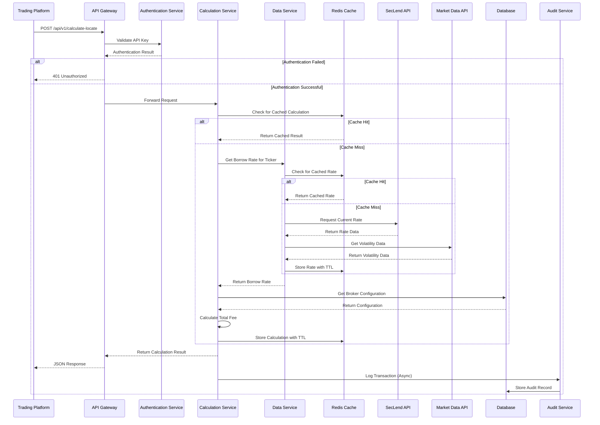

**Key Steps:**

1. **Request Validation**: The API Gateway authenticates the request and validates basic parameters.
2. **Cache Check**: The system checks if this exact calculation has been performed recently.
3. **Borrow Rate Retrieval**: If not cached, the system retrieves the current borrow rate for the ticker.
4. **Broker Configuration**: The system retrieves the broker-specific markup and fee configuration.
5. **Fee Calculation**: The system calculates the total fee using the formula:
   ```
   base_cost = position_value * borrow_rate * (loan_days / 365)
   markup = base_cost * (markup_percentage / 100)
   
   if fee_type == FLAT:
       transaction_fee = flat_fee_amount
   else:  # PERCENTAGE
       transaction_fee = position_value * (percentage_fee / 100)
   
   total_fee = base_cost + markup + transaction_fee
   ```
6. **Response Generation**: The system returns a JSON response with the total fee and breakdown.
7. **Audit Logging**: The calculation details are asynchronously logged for compliance purposes.

**Data Transformations:**

- **Input Validation**: String and numeric inputs are validated and converted to appropriate types (Decimal for financial values).
- **Rate Adjustment**: Base rates are adjusted for volatility and event risk factors.
- **Fee Calculation**: Multiple fee components are calculated and summed with precise decimal arithmetic.
- **Response Formatting**: Decimal values are rounded to appropriate precision for the response.

```python
# Example calculation flow in the locate_fee.py service

def calculate_locate_fee(ticker, position_value, loan_days, markup_percentage, fee_type, fee_amount, borrow_rate=None, use_cache=True):
    # Check cache for existing calculation
    if use_cache:
        cached_result = get_cached_locate_fee(ticker, position_value, loan_days, markup_percentage, fee_type, fee_amount)
        if cached_result:
            return cached_result
    
    # Get borrow rate if not provided
    if borrow_rate is None:
        borrow_rate = calculate_borrow_rate(ticker)
    
    # Calculate base borrow cost
    base_borrow_cost = calculate_borrow_cost(position_value, borrow_rate, loan_days)
    
    # Calculate markup amount
    markup_amount = calculate_markup_amount(base_borrow_cost, markup_percentage)
    
    # Calculate transaction fee
    transaction_fee = calculate_fee(position_value, fee_type, fee_amount)
    
    # Calculate total fee
    total_fee = sum_fee_components([base_borrow_cost, markup_amount, transaction_fee])
    
    # Create result with breakdown
    result = {
        "total_fee": total_fee,
        "breakdown": {
            "borrow_cost": base_borrow_cost,
            "markup": markup_amount,
            "transaction_fees": transaction_fee
        },
        "borrow_rate_used": borrow_rate
    }
    
    # Cache the result if enabled
    if use_cache:
        cache_locate_fee(ticker, position_value, loan_days, markup_percentage, fee_type, fee_amount, result)
    
    return result
```

### Borrow Rate Calculation Flow

The borrow rate calculation flow is a critical component that determines the base rate for securities borrowing, incorporating market volatility and event risk factors.

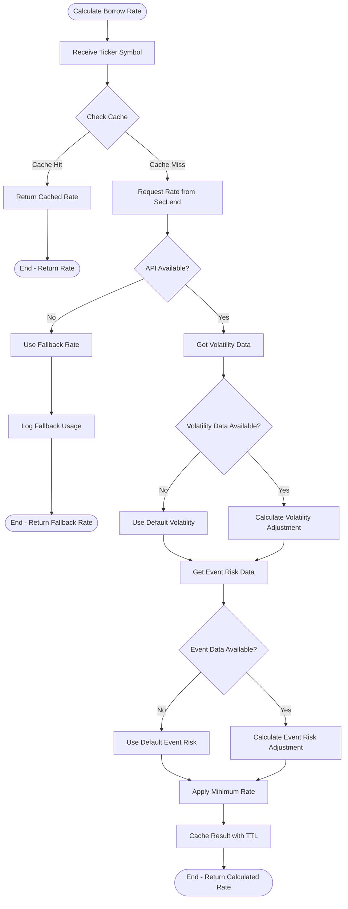

**Key Steps:**

1. **Cache Check**: The system first checks if the borrow rate for this ticker is already cached.
2. **External API Call**: If not cached, the system calls the SecLend API to get the current market rate.
3. **Fallback Handling**: If the API is unavailable, the system uses fallback mechanisms to provide a conservative rate.
4. **Volatility Adjustment**: The system applies a volatility adjustment based on market conditions.
5. **Event Risk Adjustment**: The system applies an event risk adjustment based on upcoming corporate events.
6. **Minimum Rate Enforcement**: The system ensures the rate is not below the configured minimum.
7. **Caching**: The final calculated rate is cached for future use with an appropriate TTL.

**Data Transformations:**

- **API Response Parsing**: JSON response from SecLend API is parsed to extract the rate and status.
- **Status Mapping**: API status strings are mapped to internal BorrowStatus enum values.
- **Rate Adjustments**: Mathematical formulas are applied to adjust the base rate for volatility and event risk.
- **Decimal Precision**: All calculations use Decimal type for financial precision, with appropriate rounding.

```python
# Example borrow rate calculation flow in the borrow_rate.py service

def calculate_borrow_rate(ticker, min_rate=None, use_cache=True):
    # Check cache for existing rate
    if use_cache:
        cached_rate = get_cached_borrow_rate(ticker)
        if cached_rate is not None:
            return cached_rate
    
    # Get real-time base rate
    try:
        base_rate_data = get_real_time_borrow_rate(ticker, min_rate)
        base_rate = Decimal(str(base_rate_data['rate']))
    except ExternalAPIException:
        # Fallback to minimum rate if API fails
        fallback_data = get_fallback_borrow_rate(ticker, min_rate)
        base_rate = Decimal(str(fallback_data['rate']))
    
    # Get volatility data
    try:
        volatility_index = get_stock_volatility(ticker)
    except ExternalAPIException:
        volatility_index = get_default_volatility()
    
    # Apply volatility adjustment
    adjusted_rate = apply_volatility_adjustment(base_rate, volatility_index, DEFAULT_VOLATILITY_FACTOR)
    
    # Get event risk factor
    try:
        event_risk_factor = get_event_risk_factor(ticker)
    except ExternalAPIException:
        event_risk_factor = 0
    
    # Apply event risk adjustment
    adjusted_rate = calculate_event_risk_adjustment(adjusted_rate, event_risk_factor, DEFAULT_EVENT_RISK_FACTOR)
    
    # Apply minimum rate
    final_rate = apply_minimum_rate(adjusted_rate, min_rate or DEFAULT_MINIMUM_BORROW_RATE)
    
    # Cache the result
    if use_cache:
        cache_borrow_rate(ticker, final_rate)
    
    return final_rate
```

### External API Integration Flow

The system integrates with multiple external APIs to retrieve market data. This flow details how external data is fetched, cached, and used with appropriate resilience patterns.

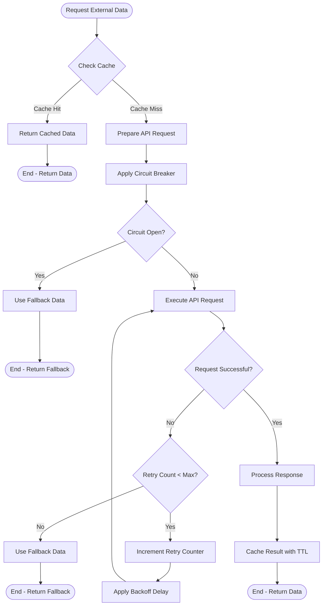

**Key External APIs:**

1. **SecLend API**: Provides real-time borrow rates for securities
   - Endpoint: `GET /api/borrows/{ticker}`
   - Cache TTL: 5 minutes
   - Resilience: Circuit breaker, 3 retries with exponential backoff

2. **Market Volatility API**: Provides volatility metrics for rate adjustments
   - Endpoint: `GET /api/market/volatility/{ticker}`
   - Cache TTL: 15 minutes
   - Resilience: Circuit breaker, 3 retries with exponential backoff

3. **Event Calendar API**: Provides information about upcoming corporate events
   - Endpoint: `GET /api/calendar/events?ticker={ticker}`
   - Cache TTL: 1 hour
   - Resilience: Circuit breaker, 3 retries with exponential backoff

**Resilience Patterns:**

- **Circuit Breaker**: Prevents cascading failures when APIs are unavailable
  - Open circuit after 5 consecutive failures
  - Half-open after 60 seconds to test recovery
  - Close after 3 consecutive successes

- **Retry with Backoff**: Handles transient failures
  - Maximum 3 retries
  - Exponential backoff: 1s, 2s, 4s

- **Fallback Strategy**: Provides alternative data when APIs fail
  - SecLend API: Use minimum rates from database
  - Volatility API: Use default volatility value
  - Event API: Ignore event risk factor

**Data Caching:**

- All external API responses are cached with appropriate TTLs
- Cache keys include relevant parameters (e.g., ticker)
- Cache invalidation occurs on TTL expiration or explicit invalidation

```python
# Example external API integration in the seclend_api.py service

@retry_with_fallback(fallback_function='get_fallback_rate', max_retries=3)
@circuit_breaker(name='seclend_api', failure_threshold=5, recovery_timeout=60, success_threshold=3)
def get_borrow_rate(ticker):
    # Check cache first
    cache_key = get_cache_key(ticker)
    cached_data = redis_cache.get(cache_key)
    if cached_data:
        return json.loads(cached_data)
    
    # Prepare API request
    settings = get_settings()
    api_url = build_url(settings.SECLEND_API_BASE_URL, f"/api/borrows/{ticker}")
    headers = {"X-API-Key": settings.SECLEND_API_KEY}
    
    # Execute API request
    response = get(api_url, headers=headers)
    
    # Validate response
    validate_response(response, REQUIRED_RATE_FIELDS)
    
    # Process response
    result = {
        "rate": response["rate"],
        "status": map_borrow_status(response["status"]),
        "source": "seclend_api"
    }
    
    # Cache result
    redis_cache.set(cache_key, json.dumps(result), settings.SECLEND_API_CACHE_TTL)
    
    return result

def get_fallback_rate(ticker):
    logger.warning(f"Using fallback rate for {ticker}")
    return {
        "rate": DEFAULT_MINIMUM_BORROW_RATE,
        "status": BorrowStatus.HARD,
        "source": "fallback",
        "is_fallback": True
    }
```

### Audit Logging Flow

The audit logging flow captures detailed information about all calculations for compliance and troubleshooting purposes.

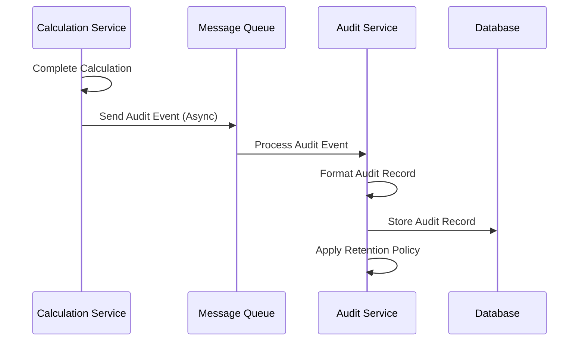

**Key Steps:**

1. **Event Generation**: After completing a calculation, the system generates an audit event with all relevant details.
2. **Asynchronous Processing**: The audit event is sent to a message queue for asynchronous processing.
3. **Record Formatting**: The Audit Service formats the event into a structured audit record.
4. **Storage**: The audit record is stored in the database with appropriate indexing.
5. **Retention Management**: Retention policies are applied to manage audit data volume.

**Audit Record Fields:**

- **Timestamp**: When the calculation occurred
- **Client ID**: Client that requested the calculation
- **Ticker**: Stock symbol
- **Position Value**: Position value used in calculation
- **Loan Days**: Loan duration in days
- **Borrow Rate Used**: Borrow rate applied
- **Total Fee**: Total fee calculated
- **Data Sources**: Sources of data used (API/cache/fallback)
- **Calculation Breakdown**: Detailed calculation steps

**Data Retention:**

- Active audit data: 1 year in partitioned tables
- Archived audit data: 7 years in cold storage
- Automated archival process moves data from active to archive storage

```python
# Example audit logging in the transactions.py service

async def log_calculation_transaction(calculation_data):
    """Log a calculation transaction to the audit system."""
    try:
        # Create audit record
        audit_record = {
            "audit_id": str(uuid.uuid4()),
            "timestamp": datetime.utcnow().isoformat(),
            "client_id": calculation_data["client_id"],
            "ticker": calculation_data["ticker"],
            "position_value": str(calculation_data["position_value"]),
            "loan_days": calculation_data["loan_days"],
            "borrow_rate_used": str(calculation_data["borrow_rate_used"]),
            "total_fee": str(calculation_data["total_fee"]),
            "data_sources": calculation_data.get("data_sources", {}),
            "calculation_breakdown": calculation_data["breakdown"]
        }
        
        # Send to message queue for async processing
        await message_queue.send("audit.calculation", audit_record)
        
        logger.info(f"Audit record created for calculation: {audit_record['audit_id']}")
        return True
    except Exception as e:
        logger.error(f"Failed to create audit record: {str(e)}")
        # Even if audit logging fails, we don't fail the main calculation
        return False
```

## Caching Architecture

The system implements a multi-level caching strategy to optimize performance and reduce load on external systems. This section details the caching architecture, including cache levels, TTL strategies, and invalidation mechanisms.

### Cache Hierarchy

The system employs a three-level cache hierarchy to balance performance, freshness, and resilience:

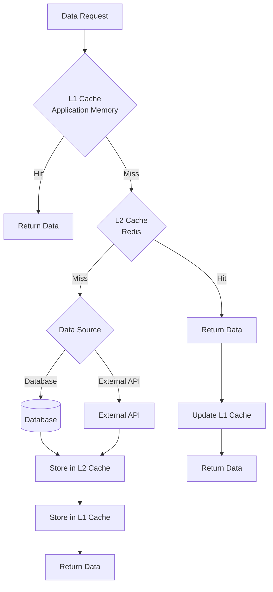

**L1 Cache (Application Memory)**
- **Implementation**: In-memory cache within each service instance
- **Scope**: Per service instance
- **TTL**: Short (60 seconds)
- **Purpose**: Ultra-fast access to very frequently used data
- **Use Cases**: Calculation results, frequently accessed configuration

**L2 Cache (Redis)**
- **Implementation**: Redis distributed cache
- **Scope**: Shared across all service instances
- **TTL**: Medium (5-30 minutes depending on data type)
- **Purpose**: Shared cache for all service instances
- **Use Cases**: Borrow rates, volatility data, broker configurations

**Database Cache**
- **Implementation**: Database tables with timestamp tracking
- **Scope**: System-wide persistent storage
- **TTL**: Long (1+ hours)
- **Purpose**: Fallback data source when external APIs are unavailable
- **Use Cases**: Minimum borrow rates, default volatility values

```python
# Example multi-level cache implementation

class CacheService:
    def __init__(self):
        self.local_cache = {}  # L1 cache (in-memory)
        self.redis_cache = RedisCache()  # L2 cache (Redis)
    
    async def get(self, key, fetch_function, ttl=60):
        """Get data from cache or fetch from source."""
        # Try L1 cache first (in-memory)
        if key in self.local_cache:
            entry = self.local_cache[key]
            if entry["expires"] > time.time():
                logger.debug(f"L1 cache hit for {key}")
                return entry["data"]
            else:
                # Expired, remove from L1
                del self.local_cache[key]
        
        # Try L2 cache (Redis)
        redis_data = await self.redis_cache.get(key)
        if redis_data:
            # Store in L1 cache
            self.local_cache[key] = {
                "data": redis_data,
                "expires": time.time() + ttl
            }
            logger.debug(f"L2 cache hit for {key}")
            return redis_data
        
        # Fetch from source
        data = await fetch_function()
        
        # Store in L2 cache
        await self.redis_cache.set(key, data, ttl)
        
        # Store in L1 cache
        self.local_cache[key] = {
            "data": data,
            "expires": time.time() + ttl
        }
        
        logger.debug(f"Cache miss for {key}, fetched from source")
        return data
```

### Cache TTL Strategy

The system uses a carefully designed Time-To-Live (TTL) strategy to balance data freshness with performance:

| Data Type | TTL | Rationale |
|-----------|-----|----------|
| Borrow Rates | 5 minutes (300s) | Rates can change frequently in volatile markets |
| Volatility Metrics | 15 minutes (900s) | Changes more slowly than rates |
| Event Risk Factors | 1 hour (3600s) | Event schedules rarely change intraday |
| Broker Configurations | 30 minutes (1800s) | Infrequently changed, but critical to refresh |
| Calculation Results | 60 seconds | Short cache for high-volume calculations |
| Minimum Rates | 24 hours (86400s) | Very stable fallback values |

The TTL values are configured as constants in the system and can be adjusted based on market conditions and performance requirements. For example, during highly volatile market periods, the TTLs for borrow rates might be reduced to ensure more frequent refreshes.

```python
# TTL constants defined in constants.py

# Cache TTLs in seconds
CACHE_TTL_BORROW_RATE = 300       # 5 minutes
CACHE_TTL_VOLATILITY = 900        # 15 minutes
CACHE_TTL_EVENT_RISK = 3600       # 1 hour
CACHE_TTL_BROKER_CONFIG = 1800    # 30 minutes
CACHE_TTL_CALCULATION = 60        # 1 minute
CACHE_TTL_MIN_RATE = 86400        # 24 hours
```

### Cache Key Generation

The system uses a consistent approach to cache key generation to ensure proper cache hits and avoid collisions:

**Borrow Rate Cache Keys**
```
borrow_rate:{ticker}
```

**Volatility Cache Keys**
```
volatility:{ticker}
```

**Event Risk Cache Keys**
```
event_risk:{ticker}
```

**Broker Configuration Cache Keys**
```
broker_config:{client_id}
```

**Calculation Result Cache Keys**
```
locate_fee:{ticker}:{position_value}:{loan_days}:{markup_percentage}:{fee_type}:{fee_amount}
```

For complex cache keys (like calculation results), the system normalizes input parameters to ensure consistent key generation:
- Tickers are converted to uppercase
- Decimal values are formatted with consistent precision
- Enums are converted to string representations

This approach ensures that the same calculation with the same parameters will generate the same cache key, regardless of minor formatting differences in the input.

```python
# Example cache key generation for locate fee calculations

def generate_cache_key(ticker, position_value, loan_days, markup_percentage, fee_type, fee_amount):
    """Generate a cache key for locate fee calculations."""
    # Normalize inputs for consistent key generation
    normalized_ticker = ticker.upper()
    normalized_position = format(float(position_value), '.2f')
    normalized_loan_days = str(loan_days)
    normalized_markup = format(float(markup_percentage), '.2f')
    normalized_fee_type = str(fee_type.value if hasattr(fee_type, 'value') else fee_type)
    normalized_fee_amount = format(float(fee_amount), '.2f')
    
    # Combine into cache key
    cache_key = f"{LOCATE_FEE_CACHE_PREFIX}:{normalized_ticker}:{normalized_position}:{normalized_loan_days}:{normalized_markup}:{normalized_fee_type}:{normalized_fee_amount}"
    
    return cache_key
```

### Cache Invalidation

The system implements multiple cache invalidation strategies to ensure data freshness while maintaining performance:

**Time-Based Invalidation**
- Primary mechanism using TTL for all cached data
- Automatically expires cache entries after the configured TTL
- No explicit invalidation required for normal operations

**Event-Driven Invalidation**
- Used for broker configuration changes
- When a broker's configuration is updated, related cache entries are explicitly invalidated
- Implemented using Redis pub/sub for distributed invalidation

**Bulk Invalidation**
- Used during system maintenance or data corrections
- Can invalidate all cache entries of a specific type
- Implemented using Redis key pattern matching

**Selective Invalidation**
- Used when specific data is known to be stale
- Invalidates only the affected cache entries
- Implemented using direct cache key deletion

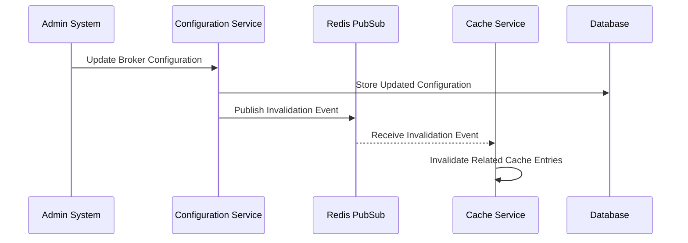

```python
# Example cache invalidation implementation

class CacheInvalidator:
    def __init__(self, redis_client):
        self.redis = redis_client
        self.pubsub = redis_client.pubsub()
        self.pubsub.subscribe('cache_invalidation')
        self.invalidation_thread = threading.Thread(target=self._listen_for_invalidation)
        self.invalidation_thread.daemon = True
        self.invalidation_thread.start()
    
    def invalidate_key(self, key):
        """Invalidate a specific cache key."""
        return self.redis.delete(key)
    
    def invalidate_pattern(self, pattern):
        """Invalidate all keys matching a pattern."""
        keys = self.redis.keys(pattern)
        if keys:
            return self.redis.delete(*keys)
        return 0
    
    def invalidate_broker_config(self, client_id):
        """Invalidate broker configuration cache."""
        key = f"broker_config:{client_id}"
        self.invalidate_key(key)
        # Publish event for distributed invalidation
        self.redis.publish('cache_invalidation', json.dumps({
            'type': 'broker_config',
            'client_id': client_id
        }))
    
    def _listen_for_invalidation(self):
        """Listen for invalidation events from Redis PubSub."""
        for message in self.pubsub.listen():
            if message['type'] == 'message':
                try:
                    data = json.loads(message['data'])
                    if data['type'] == 'broker_config':
                        key = f"broker_config:{data['client_id']}"
                        self.invalidate_key(key)
                        logger.info(f"Invalidated cache key: {key} from PubSub event")
                except Exception as e:
                    logger.error(f"Error processing invalidation event: {str(e)}")
```

## Data Transformation Flows

This section details how data is transformed as it flows through the system, including input validation, calculation processing, and response formatting.

### Input Validation and Transformation

The system implements comprehensive input validation and transformation to ensure data integrity and calculation accuracy:

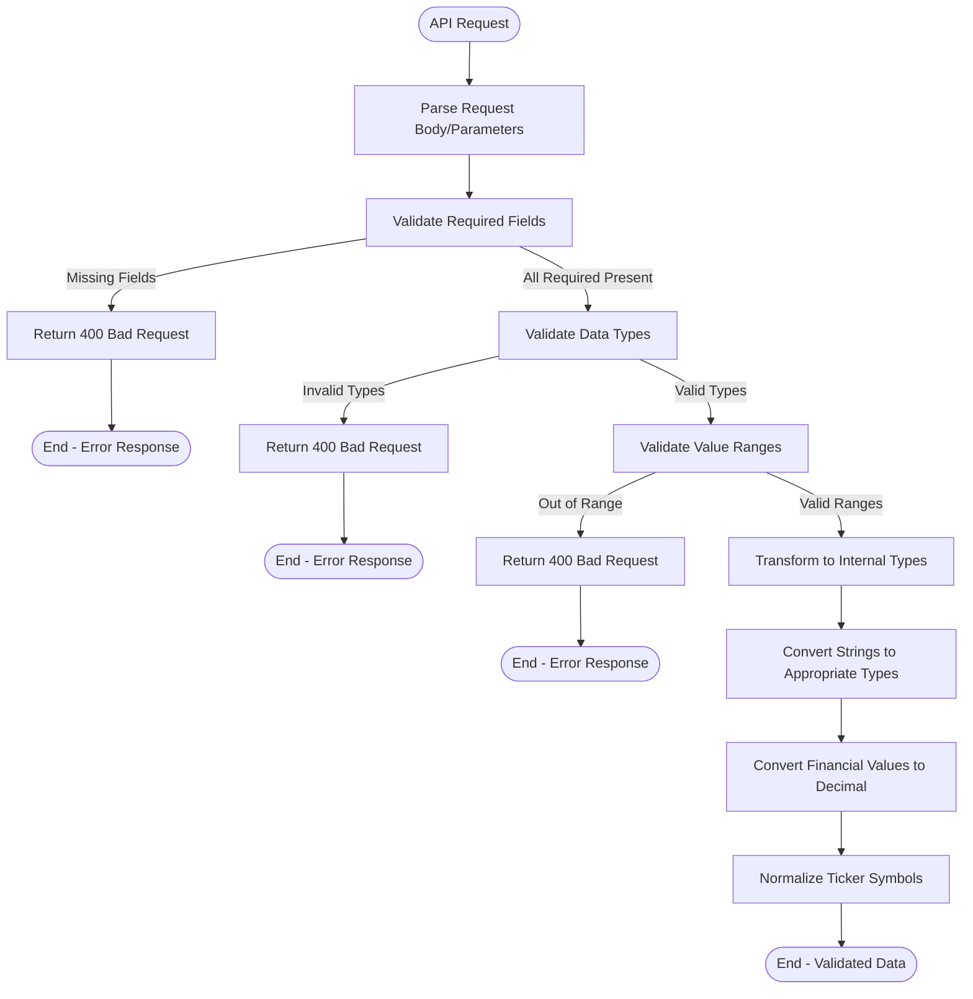

**Key Validation Rules:**

- **Ticker Symbol**
  - Required field
  - String type
  - Valid format (uppercase letters, numbers, and limited special characters)
  - Maximum length: 10 characters

- **Position Value**
  - Required field
  - Numeric type (int, float, or Decimal)
  - Greater than 0
  - Maximum value: 1,000,000,000 (1 billion)

- **Loan Days**
  - Required field
  - Integer type
  - Greater than 0
  - Maximum value: 365 (1 year)

- **Client ID**
  - Required field
  - String type
  - Valid format (alphanumeric with limited special characters)
  - Maximum length: 50 characters

**Data Transformations:**

- **Ticker Symbol**: Converted to uppercase
- **Position Value**: Converted to Decimal type for precise financial calculations
- **Loan Days**: Converted to integer
- **Client ID**: Validated against database of known clients

The system uses Pydantic models for request validation, which provides automatic type conversion and validation based on the defined schema.

```python
# Example request validation using Pydantic

class CalculateLocateRequest(BaseModel):
    ticker: str
    position_value: Decimal
    loan_days: int
    client_id: str
    
    @validator('ticker')
    def validate_ticker(cls, v):
        if not v or not re.match(r'^[A-Za-z0-9.\-]{1,10}$', v):
            raise ValueError('Invalid ticker format')
        return v.upper()  # Normalize to uppercase
    
    @validator('position_value')
    def validate_position_value(cls, v):
        if v <= 0:
            raise ValueError('Position value must be greater than 0')
        if v > 1_000_000_000:
            raise ValueError('Position value exceeds maximum allowed')
        return Decimal(str(v))  # Ensure Decimal type
    
    @validator('loan_days')
    def validate_loan_days(cls, v):
        if v <= 0:
            raise ValueError('Loan days must be greater than 0')
        if v > 365:
            raise ValueError('Loan days cannot exceed 365')
        return int(v)  # Ensure integer type
    
    @validator('client_id')
    def validate_client_id(cls, v):
        if not v or not re.match(r'^[A-Za-z0-9_\-]{1,50}$', v):
            raise ValueError('Invalid client ID format')
        return v
```

### Calculation Processing

The calculation processing flow transforms validated input data into financial results through a series of mathematical operations:

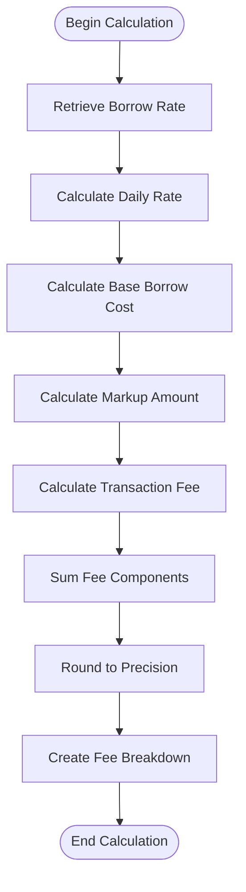

**Key Calculation Steps:**

1. **Borrow Rate Retrieval**
   - Get current borrow rate for the ticker
   - Apply volatility and event risk adjustments
   - Ensure rate is not below minimum threshold

2. **Daily Rate Calculation**
   ```
   daily_rate = annual_rate / DAYS_IN_YEAR
   ```

3. **Base Borrow Cost Calculation**
   ```
   base_borrow_cost = position_value * daily_rate * loan_days
   ```

4. **Markup Amount Calculation**
   ```
   markup_amount = base_borrow_cost * (markup_percentage / 100)
   ```

5. **Transaction Fee Calculation**
   ```
   if fee_type == FLAT:
       transaction_fee = fee_amount
   else:  # PERCENTAGE
       transaction_fee = position_value * (fee_amount / 100)
   ```

6. **Total Fee Calculation**
   ```
   total_fee = base_borrow_cost + markup_amount + transaction_fee
   ```

**Decimal Precision:**

All financial calculations use the Decimal type to ensure precise arithmetic without floating-point errors. Results are rounded to 4 decimal places for consistency and to avoid issues with very small values.

```python
# Example calculation processing in formulas.py

def calculate_daily_rate(annual_rate: Decimal) -> Decimal:
    """Calculate daily rate from annual rate."""
    daily_rate = annual_rate / DAYS_IN_YEAR
    return round_decimal(daily_rate, ROUNDING_PRECISION)

def calculate_borrow_cost(position_value: Decimal, annual_rate: Decimal, days: int) -> Decimal:
    """Calculate the cost of borrowing securities for a specific period."""
    daily_rate = calculate_daily_rate(annual_rate)
    borrow_cost = position_value * daily_rate * Decimal(days)
    return round_decimal(borrow_cost, ROUNDING_PRECISION)

def calculate_markup_amount(base_value: Decimal, markup_percentage: Decimal) -> Decimal:
    """Calculate markup amount based on base value and markup percentage."""
    markup = base_value * (markup_percentage / Decimal('100'))
    return round_decimal(markup, ROUNDING_PRECISION)

def calculate_fee(base_value: Decimal, fee_type: TransactionFeeType, fee_amount: Decimal) -> Decimal:
    """Calculate fee based on fee type (flat or percentage)."""
    if fee_type == TransactionFeeType.FLAT:
        return fee_amount
    else:  # PERCENTAGE
        fee = base_value * (fee_amount / Decimal('100'))
        return round_decimal(fee, ROUNDING_PRECISION)

def sum_fee_components(components: List[Decimal]) -> Decimal:
    """Sum multiple fee components into a total fee."""
    total = sum(components)
    return round_decimal(total, ROUNDING_PRECISION)
```

### Response Formatting

The system formats calculation results into standardized API responses with appropriate data transformations:

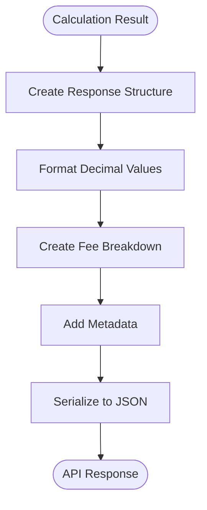

**Response Structure:**

The system uses a consistent response format for all API endpoints:

**Success Response:**
```json
{
  "status": "success",
  "total_fee": 3428.77,
  "breakdown": {
    "borrow_cost": 3195.34,
    "markup": 188.53,
    "transaction_fees": 40.90
  },
  "borrow_rate_used": 0.19
}
```

**Error Response:**
```json
{
  "status": "error",
  "error": "Invalid parameter: position_value must be greater than 0",
  "error_code": "INVALID_PARAMETER",
  "details": {
    "valid_params": ["ticker", "position_value>0", "loan_days>0", "client_id"]
  }
}
```

**Data Transformations:**

- **Decimal to Float**: Decimal values are converted to float for JSON serialization
- **Enum to String**: Enum values are converted to their string representations
- **Rounding**: Financial values are rounded to 2 decimal places in responses
- **Metadata Addition**: Additional context is added (e.g., borrow_rate_used)

The system uses Pydantic models for response formatting, which provides automatic type conversion and validation based on the defined schema.

```python
# Example response formatting using Pydantic

class FeeBreakdownSchema(BaseModel):
    borrow_cost: float
    markup: float
    transaction_fees: float
    
    class Config:
        json_encoders = {
            Decimal: lambda v: float(round(v, 2))
        }

class CalculateLocateResponse(BaseModel):
    status: str = "success"
    total_fee: float
    breakdown: FeeBreakdownSchema
    borrow_rate_used: float
    
    class Config:
        json_encoders = {
            Decimal: lambda v: float(round(v, 2))
        }

# Example usage in API endpoint
def calculate_locate_fee_endpoint(request: CalculateLocateRequest, client_id: str, db: Session):
    try:
        # Get broker configuration
        broker_config = broker_service.get_broker(client_id)
        
        # Extract configuration values
        markup_percentage = broker_config.markup_percentage
        fee_type = broker_config.transaction_fee_type
        fee_amount = broker_config.transaction_fee_amount
        
        # Calculate locate fee
        result = calculate_locate_fee(
            request.ticker,
            request.position_value,
            request.loan_days,
            markup_percentage,
            fee_type,
            fee_amount
        )
        
        # Create response
        breakdown = FeeBreakdownSchema(
            borrow_cost=result["breakdown"]["borrow_cost"],
            markup=result["breakdown"]["markup"],
            transaction_fees=result["breakdown"]["transaction_fees"]
        )
        
        response = CalculateLocateResponse(
            total_fee=result["total_fee"],
            breakdown=breakdown,
            borrow_rate_used=result["borrow_rate_used"]
        )
        
        return response
    except Exception as e:
        # Handle errors and return appropriate error response
        return create_error_response(str(e), ErrorCodes.CALCULATION_ERROR)
```

## Data Storage Flows

This section details how data is stored, retrieved, and managed within the system's database components.

### Database Schema and Relationships

The system uses a relational database (PostgreSQL) with the following schema design:

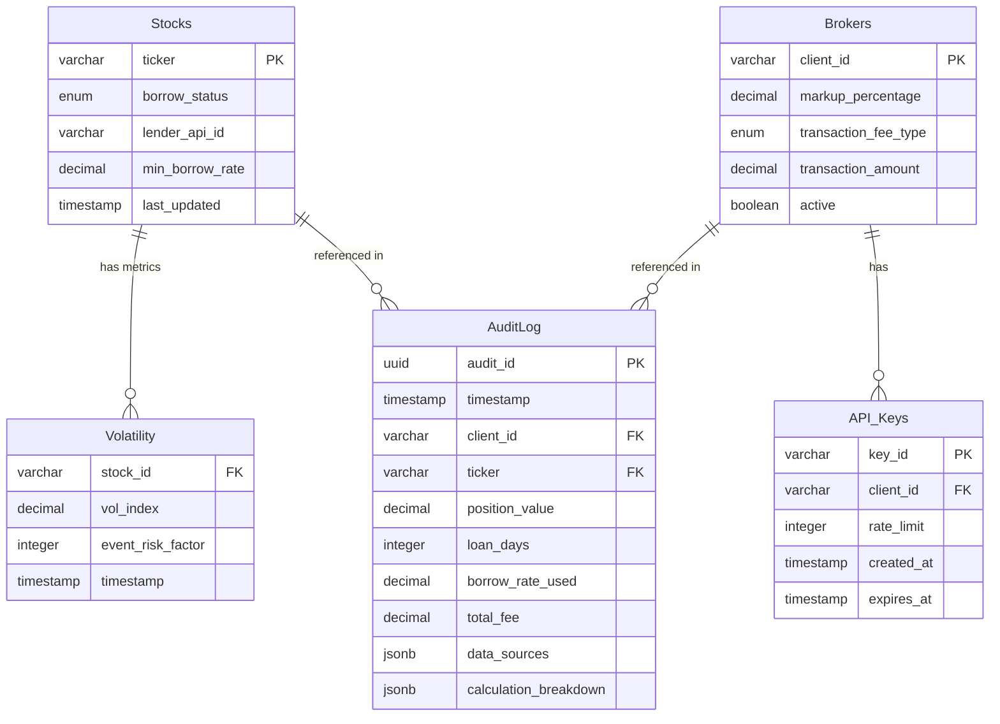

**Key Tables and Relationships:**

- **Stocks**: Contains stock metadata and baseline rates
  - Primary key: ticker
  - Relationships: One-to-many with Volatility and AuditLog

- **Brokers**: Stores broker-specific fee configurations
  - Primary key: client_id
  - Relationships: One-to-many with API_Keys and AuditLog

- **Volatility**: Stores time-series volatility and event risk data
  - Foreign key: stock_id references Stocks.ticker
  - Time-series data with timestamp

- **AuditLog**: Records all fee calculations for compliance
  - Primary key: audit_id (UUID)
  - Foreign keys: client_id references Brokers.client_id, ticker references Stocks.ticker
  - Contains detailed calculation data in JSONB fields

- **API_Keys**: Manages API authentication
  - Primary key: key_id
  - Foreign key: client_id references Brokers.client_id
  - Includes rate limits and expiration

```python
# Example SQLAlchemy models for database schema

class Stock(Base):
    __tablename__ = "stocks"
    
    ticker = Column(String(10), primary_key=True, index=True)
    borrow_status = Column(Enum(BorrowStatus), nullable=False)
    lender_api_id = Column(String(50), nullable=True)
    min_borrow_rate = Column(Numeric(5, 2), nullable=False, default=0.0)
    last_updated = Column(DateTime, default=datetime.utcnow)
    
    # Relationships
    volatility = relationship("Volatility", back_populates="stock")
    audit_logs = relationship("AuditLog", back_populates="stock")

class Broker(Base):
    __tablename__ = "brokers"
    
    client_id = Column(String(50), primary_key=True, index=True)
    markup_percentage = Column(Numeric(4, 2), nullable=False)
    transaction_fee_type = Column(Enum(TransactionFeeType), nullable=False)
    transaction_amount = Column(Numeric(10, 2), nullable=False)
    active = Column(Boolean, default=True)
    
    # Relationships
    api_keys = relationship("APIKey", back_populates="broker")
    audit_logs = relationship("AuditLog", back_populates="broker")

class Volatility(Base):
    __tablename__ = "volatility"
    
    id = Column(Integer, primary_key=True, index=True)
    stock_id = Column(String(10), ForeignKey("stocks.ticker"), nullable=False)
    vol_index = Column(Numeric(5, 2), nullable=False)
    event_risk_factor = Column(Integer, default=0)
    timestamp = Column(DateTime, default=datetime.utcnow)
    
    # Relationships
    stock = relationship("Stock", back_populates="volatility")

class AuditLog(Base):
    __tablename__ = "audit_log"
    
    audit_id = Column(UUID(as_uuid=True), primary_key=True, default=uuid.uuid4)
    timestamp = Column(DateTime, default=datetime.utcnow, index=True)
    client_id = Column(String(50), ForeignKey("brokers.client_id"), nullable=False)
    ticker = Column(String(10), ForeignKey("stocks.ticker"), nullable=False)
    position_value = Column(Numeric(15, 2), nullable=False)
    loan_days = Column(Integer, nullable=False)
    borrow_rate_used = Column(Numeric(5, 2), nullable=False)
    total_fee = Column(Numeric(15, 2), nullable=False)
    data_sources = Column(JSONB, nullable=False)
    calculation_breakdown = Column(JSONB, nullable=False)
    
    # Relationships
    broker = relationship("Broker", back_populates="audit_logs")
    stock = relationship("Stock", back_populates="audit_logs")

class APIKey(Base):
    __tablename__ = "api_keys"
    
    key_id = Column(String(64), primary_key=True)
    client_id = Column(String(50), ForeignKey("brokers.client_id"), nullable=False)
    rate_limit = Column(Integer, default=60)
    created_at = Column(DateTime, default=datetime.utcnow)
    expires_at = Column(DateTime, nullable=True)
    
    # Relationships
    broker = relationship("Broker", back_populates="api_keys")
```

### Data Access Patterns

The system implements several data access patterns to efficiently retrieve and store data:

**Repository Pattern**

The system uses a repository pattern to abstract database operations and provide a clean interface for data access:

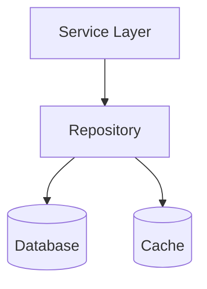

Each entity type has a dedicated repository that handles CRUD operations and implements caching where appropriate.

**Read Patterns**

- **Stock Data**: Frequently read, rarely updated
  - Heavily cached with appropriate TTLs
  - Indexed by ticker for fast lookups

- **Broker Configuration**: Frequently read, occasionally updated
  - Cached with moderate TTL
  - Indexed by client_id for fast lookups

- **Volatility Data**: Frequently read, regularly updated
  - Time-series data with recent values cached
  - Indexed by stock_id and timestamp for efficient queries

- **Audit Logs**: Frequently written, occasionally read
  - Partitioned by timestamp for efficient storage and queries
  - Indexed by client_id, ticker, and timestamp for common query patterns

**Write Patterns**

- **Stock Data**: Batch updates from market data feeds
  - Upsert operations to handle new and existing stocks

- **Volatility Data**: Regular updates from market data feeds
  - Insert-only with timestamp tracking
  - Historical data retention with archiving

- **Audit Logs**: High-volume inserts from calculations
  - Asynchronous writes to minimize impact on response time
  - Bulk inserts where possible

**Query Optimization**

- **Covering Indexes**: Include frequently queried columns in indexes
- **Partial Indexes**: Filter on commonly queried conditions
- **Connection Pooling**: Efficient database connection management
- **Prepared Statements**: Reduce query parsing overhead

```python
# Example repository implementation for stocks

class StockRepository:
    def __init__(self, db_session, cache_service):
        self.db = db_session
        self.cache = cache_service
        self.cache_ttl = CACHE_TTL_STOCK_DATA
    
    async def get_by_ticker(self, ticker):
        """Get stock by ticker with caching."""
        cache_key = f"stock:{ticker.upper()}"
        
        # Try to get from cache first
        cached_stock = await self.cache.get(cache_key)
        if cached_stock:
            return cached_stock
        
        # If not in cache, get from database
        stock = await self.db.query(Stock).filter(Stock.ticker == ticker.upper()).first()
        
        # If found, cache it
        if stock:
            await self.cache.set(cache_key, stock, self.cache_ttl)
        
        return stock
    
    async def get_all_active(self):
        """Get all active stocks."""
        cache_key = "stocks:all_active"
        
        # Try to get from cache first
        cached_stocks = await self.cache.get(cache_key)
        if cached_stocks:
            return cached_stocks
        
        # If not in cache, get from database
        stocks = await self.db.query(Stock).all()
        
        # Cache the result
        await self.cache.set(cache_key, stocks, self.cache_ttl)
        
        return stocks
    
    async def upsert(self, stock_data):
        """Insert or update stock data."""
        ticker = stock_data["ticker"].upper()
        
        # Check if stock exists
        stock = await self.get_by_ticker(ticker)
        
        if stock:
            # Update existing stock
            for key, value in stock_data.items():
                if hasattr(stock, key):
                    setattr(stock, key, value)
            stock.last_updated = datetime.utcnow()
        else:
            # Create new stock
            stock = Stock(**stock_data)
        
        # Save to database
        self.db.add(stock)
        await self.db.commit()
        await self.db.refresh(stock)
        
        # Invalidate cache
        await self.cache.delete(f"stock:{ticker}")
        await self.cache.delete("stocks:all_active")
        
        return stock
```

### Data Retention and Archiving

The system implements a comprehensive data retention and archiving strategy to meet regulatory requirements while maintaining performance:

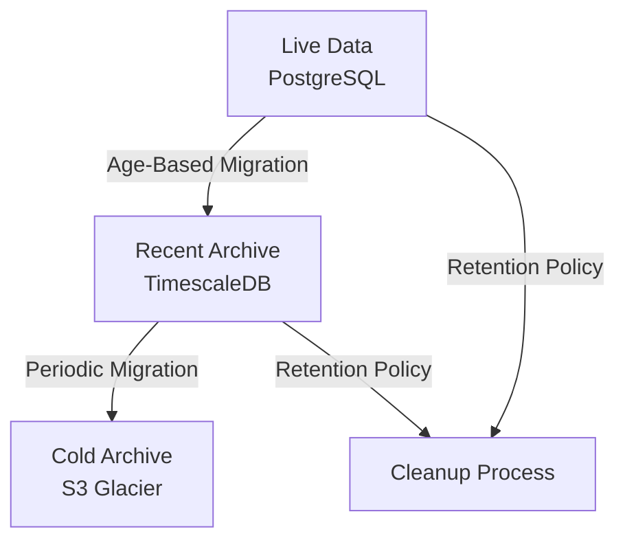

**Retention Policies:**

| Data Type | Active Retention | Archive Retention | Implementation |
|-----------|------------------|-------------------|----------------|
| Volatility Data | 90 days | 7 years | TimescaleDB hypertables with automatic partitioning |
| Audit Logs | 1 year | 7 years | Partitioned tables with archiving to S3 |
| Market Rates | 30 days | 7 years | TimescaleDB hypertables with automatic partitioning |
| Configuration History | All versions | 7 years | Temporal tables with effective date ranges |

**Archiving Process:**

1. **Partitioning**: Time-based partitioning of large tables for efficient management
2. **Compression**: Older partitions are compressed to reduce storage requirements
3. **Migration**: Aged data is migrated to cold storage (S3 Glacier)
4. **Metadata**: Metadata is maintained for archived data retrieval
5. **Verification**: Archival process includes verification steps to ensure data integrity

**Compliance Considerations:**

- **Immutability**: Archived data is stored in immutable format to prevent tampering
- **Encryption**: All archived data is encrypted at rest
- **Access Controls**: Strict access controls on archived data
- **Audit Trail**: All access to archived data is logged
- **Retention Enforcement**: Automated enforcement of retention policies

```python
# Example data archiving implementation

class DataArchiver:
    def __init__(self, db_session, s3_client):
        self.db = db_session
        self.s3 = s3_client
        self.archive_bucket = settings.ARCHIVE_BUCKET
    
    async def archive_audit_logs(self, cutoff_date):
        """Archive audit logs older than cutoff_date."""
        logger.info(f"Starting audit log archival for data before {cutoff_date}")
        
        # Get partition names for data older than cutoff
        partitions = await self.db.execute(
            text("SELECT tablename FROM pg_tables WHERE tablename LIKE 'audit_log_p%' AND tablename ~ '[0-9]{8}'")
        )
        
        for partition in partitions:
            partition_name = partition[0]
            partition_date = datetime.strptime(partition_name[-8:], "%Y%m%d").date()
            
            if partition_date < cutoff_date:
                # Export partition to CSV
                csv_file = f"/tmp/{partition_name}.csv"
                copy_sql = text(f"COPY {partition_name} TO '{csv_file}' WITH CSV HEADER")
                await self.db.execute(copy_sql)
                
                # Upload to S3
                s3_key = f"audit_logs/{partition_name}.csv.gz"
                with open(csv_file, 'rb') as f_in:
                    with gzip.open(f"{csv_file}.gz", 'wb') as f_out:
                        shutil.copyfileobj(f_in, f_out)
                
                self.s3.upload_file(f"{csv_file}.gz", self.archive_bucket, s3_key)
                
                # Verify upload
                response = self.s3.head_object(Bucket=self.archive_bucket, Key=s3_key)
                if response['ResponseMetadata']['HTTPStatusCode'] == 200:
                    # Drop partition after successful upload
                    await self.db.execute(text(f"DROP TABLE {partition_name}"))
                    logger.info(f"Archived and dropped partition {partition_name}")
                else:
                    logger.error(f"Failed to verify archive for {partition_name}")
                
                # Clean up temporary files
                os.remove(csv_file)
                os.remove(f"{csv_file}.gz")
        
        logger.info("Audit log archival complete")
```

## Error Handling and Recovery Flows

This section details how the system handles errors and implements recovery mechanisms to ensure resilience and data integrity.

### Error Handling Patterns

The system implements a comprehensive error handling strategy to ensure graceful handling of failures:

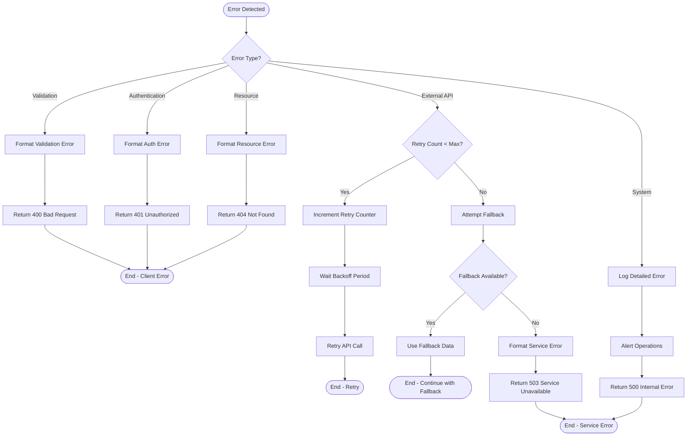

**Error Categories:**

1. **Validation Errors**
   - Invalid input parameters
   - Missing required fields
   - Value out of acceptable range
   - Response: 400 Bad Request with details

2. **Authentication Errors**
   - Missing or invalid API key
   - Expired API key
   - Response: 401 Unauthorized

3. **Resource Errors**
   - Ticker not found
   - Client not found
   - Response: 404 Not Found

4. **External API Errors**
   - API timeout
   - API rate limit exceeded
   - API service unavailable
   - Response: Retry with fallback, or 503 Service Unavailable

5. **System Errors**
   - Database connection failure
   - Unexpected exceptions
   - Internal service errors
   - Response: 500 Internal Server Error

**Standardized Error Response Format:**

```json
{
  "status": "error",
  "error": "Human-readable error message",
  "error_code": "MACHINE_READABLE_ERROR_CODE",
  "details": {} // Optional additional information
}
```

```python
# Example error handling implementation

def create_error_response(message, error_code, details=None, status_code=400):
    """Create a standardized error response."""
    response = {
        "status": "error",
        "error": message,
        "error_code": error_code
    }
    
    if details:
        response["details"] = details
    
    return JSONResponse(status_code=status_code, content=response)

# Example usage in API endpoint
@router.post('/calculate-locate', response_model=CalculateLocateResponse)
async def calculate_locate_fee_endpoint(request: CalculateLocateRequest, db: Session = Depends(get_db)):
    try:
        # Validate client ID
        try:
            broker_config = broker_service.get_broker(request.client_id)
        except ClientNotFoundException:
            return create_error_response(
                f"Client not found: {request.client_id}",
                ErrorCodes.CLIENT_NOT_FOUND,
                status_code=404
            )
        
        # Extract configuration values
        markup_percentage = broker_config.markup_percentage
        fee_type = broker_config.transaction_fee_type
        fee_amount = broker_config.transaction_fee_amount
        
        # Calculate locate fee
        try:
            result = calculate_locate_fee(
                request.ticker,
                request.position_value,
                request.loan_days,
                markup_percentage,
                fee_type,
                fee_amount
            )
        except CalculationException as e:
            return create_error_response(
                f"Calculation error: {str(e)}",
                ErrorCodes.CALCULATION_ERROR,
                status_code=500
            )
        
        # Create response
        # ... response formatting code ...
        
        return response
    except Exception as e:
        logger.exception(f"Unexpected error in calculate_locate_fee_endpoint: {str(e)}")
        return create_error_response(
            "An unexpected error occurred",
            ErrorCodes.CALCULATION_ERROR,
            status_code=500
        )
```

### Resilience Patterns

The system implements several resilience patterns to ensure continued operation even when components fail:

**Circuit Breaker Pattern**

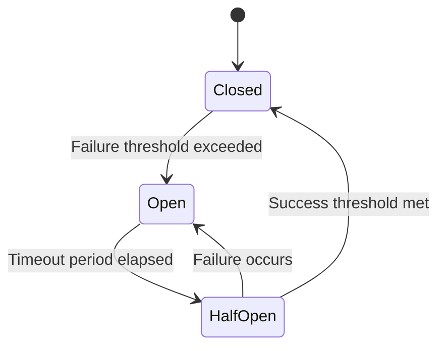

The circuit breaker pattern prevents cascading failures when external dependencies are unavailable:

- **Closed State**: Normal operation, requests pass through
- **Open State**: External service considered unavailable, requests fail fast
- **Half-Open State**: Testing if service has recovered

Implementation details:
- Failure threshold: 5 consecutive failures
- Timeout period: 60 seconds
- Success threshold: 3 consecutive successes

**Retry Pattern**

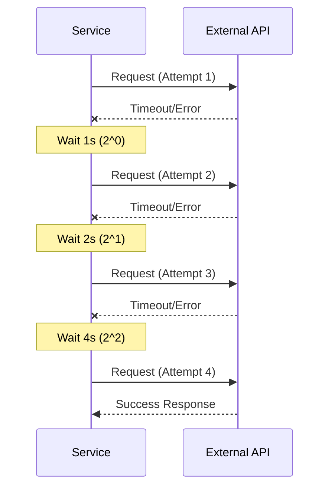

The retry pattern handles transient failures in external dependencies:

- Maximum retry attempts: 3
- Backoff strategy: Exponential (2^n seconds)
- Jitter: Random jitter added to prevent thundering herd

**Fallback Pattern**

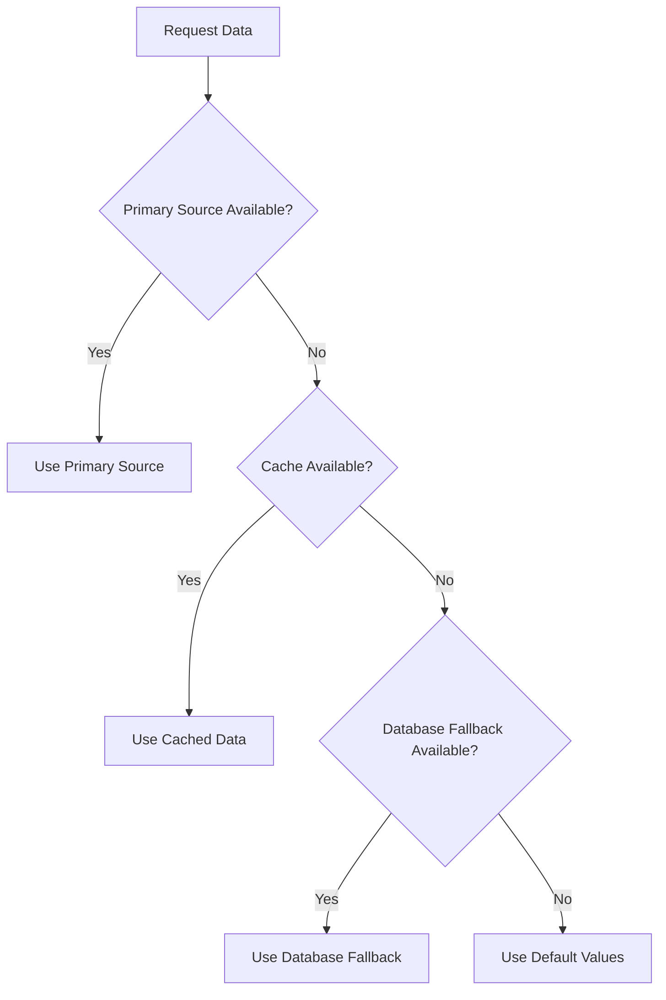

The fallback pattern provides alternative data sources when primary sources fail:

1. **Primary Source**: External API (e.g., SecLend API)
2. **Cache Fallback**: Recently cached data with extended TTL
3. **Database Fallback**: Minimum rates stored in database
4. **Default Fallback**: Conservative default values from constants

This multi-level fallback strategy ensures the system can continue operating even when multiple components fail.

```python
# Example implementation of resilience patterns

# Circuit Breaker implementation
def circuit_breaker(name, failure_threshold=5, recovery_timeout=60, success_threshold=3):
    """Circuit breaker decorator for external API calls."""
    circuit_state = {
        "state": "CLOSED",  # CLOSED, OPEN, HALF_OPEN
        "failures": 0,
        "successes": 0,
        "last_failure_time": 0
    }
    
    def decorator(func):
        @functools.wraps(func)
        async def wrapper(*args, **kwargs):
            # Check circuit state
            current_time = time.time()
            
            if circuit_state["state"] == "OPEN":
                # Check if recovery timeout has elapsed
                if current_time - circuit_state["last_failure_time"] > recovery_timeout:
                    circuit_state["state"] = "HALF_OPEN"
                    circuit_state["successes"] = 0
                    logger.info(f"Circuit {name} changed from OPEN to HALF_OPEN")
                else:
                    # Circuit is open, fail fast
                    logger.warning(f"Circuit {name} is OPEN, failing fast")
                    raise ExternalAPIException(f"Circuit {name} is open")
            
            try:
                # Call the function
                result = await func(*args, **kwargs)
                
                # Update circuit state on success
                if circuit_state["state"] == "HALF_OPEN":
                    circuit_state["successes"] += 1
                    if circuit_state["successes"] >= success_threshold:
                        circuit_state["state"] = "CLOSED"
                        circuit_state["failures"] = 0
                        logger.info(f"Circuit {name} changed from HALF_OPEN to CLOSED")
                elif circuit_state["state"] == "CLOSED":
                    circuit_state["failures"] = 0
                
                return result
            except Exception as e:
                # Update circuit state on failure
                circuit_state["failures"] += 1
                circuit_state["last_failure_time"] = current_time
                
                if circuit_state["state"] == "CLOSED" and circuit_state["failures"] >= failure_threshold:
                    circuit_state["state"] = "OPEN"
                    logger.warning(f"Circuit {name} changed from CLOSED to OPEN after {failure_threshold} failures")
                
                if circuit_state["state"] == "HALF_OPEN":
                    circuit_state["state"] = "OPEN"
                    logger.warning(f"Circuit {name} changed from HALF_OPEN to OPEN after failure")
                
                raise e
        
        return wrapper
    
    return decorator

# Retry with fallback implementation
def retry_with_fallback(fallback_function, max_retries=3, backoff_factor=2):
    """Retry decorator with exponential backoff and fallback."""
    def decorator(func):
        @functools.wraps(func)
        async def wrapper(*args, **kwargs):
            retries = 0
            while True:
                try:
                    return await func(*args, **kwargs)
                except Exception as e:
                    retries += 1
                    if retries > max_retries:
                        logger.warning(f"Max retries ({max_retries}) exceeded, using fallback")
                        # Call fallback function
                        fallback = globals()[fallback_function]
                        return await fallback(*args, **kwargs)
                    
                    # Calculate backoff with jitter
                    backoff = (backoff_factor ** (retries - 1)) * (1 + random.random() * 0.1)
                    logger.info(f"Retry {retries}/{max_retries} after {backoff:.2f}s")
                    await asyncio.sleep(backoff)
        
        return wrapper
    
    return decorator
```

### Recovery Procedures

The system implements recovery procedures to handle various failure scenarios and ensure data integrity:

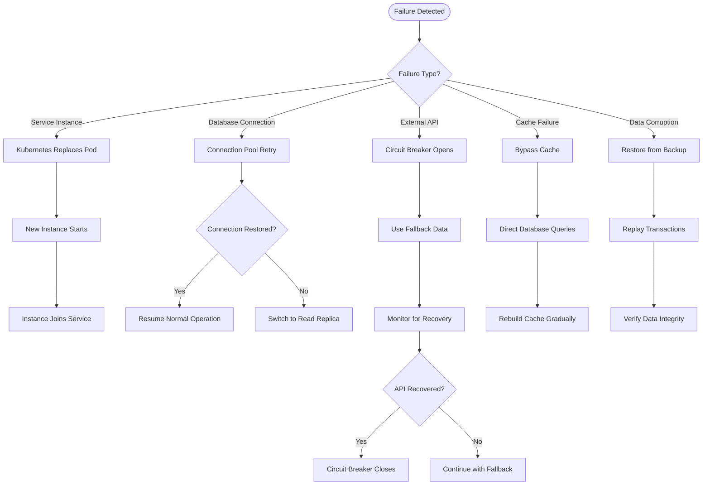

**Service Recovery:**

- **Health Checks**: Kubernetes liveness and readiness probes monitor service health
- **Auto-Healing**: Failed pods are automatically replaced
- **Graceful Shutdown**: Services handle termination signals to complete in-flight requests
- **Startup Checks**: Services verify dependencies before accepting traffic

**Database Recovery:**

- **Connection Pooling**: Efficient management of database connections
- **Retry Logic**: Automatic retry of failed database operations
- **Read Replicas**: Fallback to read replicas when primary is unavailable
- **Point-in-Time Recovery**: Ability to restore database to specific point in time

**Cache Recovery:**

- **Bypass Strategy**: Direct database queries when cache is unavailable
- **Warm-Up Process**: Gradually rebuild cache on startup or after failure
- **TTL-Based Refresh**: Automatic refresh of cached data based on TTL
- **Manual Invalidation**: API endpoints to manually invalidate cache entries

**External API Recovery:**

- **Circuit Breaker**: Automatic detection of API recovery
- **Health Polling**: Regular checks of external API health
- **Fallback Data**: Use of fallback data during outages
- **Gradual Recovery**: Controlled return to normal operation after outage

```python
# Example database connection recovery

class DatabaseConnectionManager:
    def __init__(self, primary_dsn, replica_dsn, max_retries=3, backoff_factor=2):
        self.primary_dsn = primary_dsn
        self.replica_dsn = replica_dsn
        self.max_retries = max_retries
        self.backoff_factor = backoff_factor
        self.primary_pool = None
        self.replica_pool = None
    
    async def initialize(self):
        """Initialize connection pools."""
        self.primary_pool = await self._create_pool(self.primary_dsn)
        self.replica_pool = await self._create_pool(self.replica_dsn)
    
    async def _create_pool(self, dsn):
        """Create a database connection pool with retry logic."""
        retries = 0
        while True:
            try:
                return await asyncpg.create_pool(dsn)
            except Exception as e:
                retries += 1
                if retries > self.max_retries:
                    logger.error(f"Failed to create connection pool after {self.max_retries} attempts")
                    raise
                
                backoff = self.backoff_factor ** (retries - 1)
                logger.warning(f"Connection pool creation failed, retrying in {backoff}s: {str(e)}")
                await asyncio.sleep(backoff)
    
    async def get_connection(self, read_only=False):
        """Get a database connection with fallback to replica for read-only operations."""
        if read_only:
            # Try replica first for read-only operations
            try:
                return await self.replica_pool.acquire()
            except Exception as e:
                logger.warning(f"Failed to get replica connection, falling back to primary: {str(e)}")
        
        # Try primary
        try:
            return await self.primary_pool.acquire()
        except Exception as e:
            if read_only and self.replica_pool is not None:
                # If primary fails and it's read-only, retry replica
                logger.warning(f"Primary connection failed for read-only operation, retrying replica: {str(e)}")
                return await self.replica_pool.acquire()
            raise
    
    async def execute_with_retry(self, query, *args, read_only=False, max_retries=3):
        """Execute a query with retry logic and connection recovery."""
        retries = 0
        while True:
            conn = None
            try:
                conn = await self.get_connection(read_only=read_only)
                return await conn.execute(query, *args)
            except asyncpg.exceptions.ConnectionDoesNotExistError:
                # Connection was lost, retry with new connection
                retries += 1
                if retries > max_retries:
                    logger.error(f"Query failed after {max_retries} retries due to connection issues")
                    raise
                
                logger.warning(f"Connection lost, retrying query (attempt {retries}/{max_retries})")
                # No sleep here as we're getting a new connection
            except Exception as e:
                # Other database errors
                retries += 1
                if retries > max_retries:
                    logger.error(f"Query failed after {max_retries} retries: {str(e)}")
                    raise
                
                backoff = self.backoff_factor ** (retries - 1)
                logger.warning(f"Query failed, retrying in {backoff}s (attempt {retries}/{max_retries}): {str(e)}")
                await asyncio.sleep(backoff)
            finally:
                if conn is not None:
                    await self.release_connection(conn)
```

## Conclusion

The data flow architecture of the Borrow Rate & Locate Fee Pricing Engine is designed to ensure high performance, resilience, and accuracy for financial calculations. By implementing a layered approach with appropriate caching, validation, and error handling, the system can process fee calculations efficiently while maintaining data integrity and providing fallback mechanisms when external dependencies fail.

Key aspects of the data flow architecture include:

- **Multi-level caching** to optimize performance and reduce load on external systems
- **Comprehensive validation** to ensure data integrity and calculation accuracy
- **Resilience patterns** including circuit breakers, retries, and fallbacks
- **Efficient data storage** with appropriate indexing and partitioning
- **Asynchronous processing** for non-critical operations like audit logging
- **Standardized error handling** with appropriate responses and recovery procedures

This architecture supports the system's requirements for performance (<100ms response time), scalability (1000+ requests per second), and reliability (99.95% uptime) while ensuring accurate financial calculations and comprehensive audit trails for compliance purposes.

The data flow patterns documented in this guide provide a foundation for implementation, operation, and future enhancement of the system, ensuring that data moves efficiently and reliably through all components of the Borrow Rate & Locate Fee Pricing Engine.