# Borrow Rate & Locate Fee Pricing Engine: Monitoring and Observability Architecture

## Introduction

This document describes the monitoring and observability architecture for the Borrow Rate & Locate Fee Pricing Engine. The monitoring system is designed to provide comprehensive visibility into system health, performance, and business metrics to ensure the pricing engine meets its SLA requirements and delivers accurate financial calculations.

Effective monitoring is critical for this financial system to ensure:
- Early detection of issues before they impact users
- Rapid diagnosis and resolution of problems
- Verification of system performance against SLAs
- Insights into business metrics and client usage patterns
- Support for capacity planning and scaling decisions
- Compliance with regulatory requirements

### Monitoring Goals

The monitoring architecture for the Borrow Rate & Locate Fee Pricing Engine aims to achieve the following goals:

1. **System Health Monitoring**: Ensure all components are functioning correctly and detect issues early
2. **Performance Tracking**: Verify the system meets its SLA requirements (<100ms response time, 99.95% availability)
3. **Business Insights**: Provide visibility into financial metrics and client usage patterns
4. **Troubleshooting Support**: Enable rapid diagnosis and resolution of issues
5. **Capacity Planning**: Inform scaling decisions based on usage trends and growth patterns
6. **Compliance**: Support audit requirements with comprehensive logging and tracing
7. **Security Monitoring**: Detect and alert on potential security issues

### Monitoring Principles

The monitoring architecture is guided by the following principles:

1. **Comprehensive Observability**: Collect metrics, logs, and traces to provide complete system visibility
2. **Appropriate Granularity**: Balance detail with performance impact and storage requirements
3. **Actionable Alerts**: Focus on meaningful, actionable alerts that indicate real issues
4. **Correlation**: Enable correlation between metrics, logs, and traces for effective troubleshooting
5. **Automation**: Automate monitoring tasks where possible to reduce operational burden
6. **Scalability**: Ensure monitoring infrastructure scales with the application
7. **Security**: Protect monitoring data and access with appropriate controls

### Document Structure

This document is organized into the following sections:

1. **Monitoring Infrastructure**: The technical components of the monitoring stack
2. **Metrics Collection**: The metrics collected and their significance
3. **Log Aggregation**: The logging strategy and implementation
4. **Distributed Tracing**: The approach to request tracing across services
5. **Alerting System**: Alert definitions, routing, and escalation procedures
6. **Dashboard Design**: Dashboard layouts for different user personas
7. **Incident Response**: Procedures for responding to and resolving incidents
8. **Compliance Monitoring**: Monitoring aspects related to regulatory compliance

## Monitoring Infrastructure

The Borrow Rate & Locate Fee Pricing Engine uses a comprehensive monitoring stack based on industry-standard open-source tools. This section describes the components of the monitoring infrastructure and how they work together.

### Architecture Overview

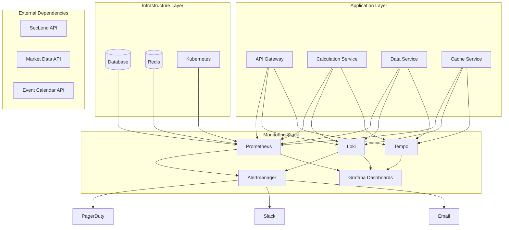

The monitoring infrastructure consists of the following components:

1. **Prometheus**: Collects and stores time-series metrics from all system components
2. **Loki**: Aggregates and indexes logs from all services
3. **Tempo**: Stores and analyzes distributed traces
4. **Alertmanager**: Routes alerts to appropriate channels based on severity and type
5. **Grafana**: Provides visualization through dashboards
6. **Fluent Bit**: Collects and forwards logs from containers to Loki
7. **OpenTelemetry Collector**: Collects and forwards traces to Tempo

These components work together to provide a complete observability solution for the pricing engine.

### Component Specifications

| Component | Version | Purpose | Retention | Scaling |
|-----------|---------|---------|-----------|----------|
| Prometheus | 2.45.0+ | Time-series metrics storage and querying | 30 days | Vertical scaling with persistent storage |
| Loki | 2.8.0+ | Log aggregation and querying | 90 days | Horizontal scaling with object storage backend |
| Tempo | 2.1.0+ | Distributed tracing storage and querying | 14 days | Horizontal scaling with object storage backend |
| Alertmanager | 0.25.0+ | Alert routing and notification | N/A | Stateful deployment with high availability |
| Grafana | 9.5.0+ | Visualization and dashboarding | N/A | Stateless deployment with horizontal scaling |
| Fluent Bit | 2.1.0+ | Log collection and forwarding | N/A | DaemonSet on all nodes |
| OpenTelemetry Collector | 0.80.0+ | Trace collection and forwarding | N/A | Deployment with horizontal scaling |

Each component is deployed in Kubernetes with appropriate resource requests and limits to ensure reliable operation.

### Deployment Architecture

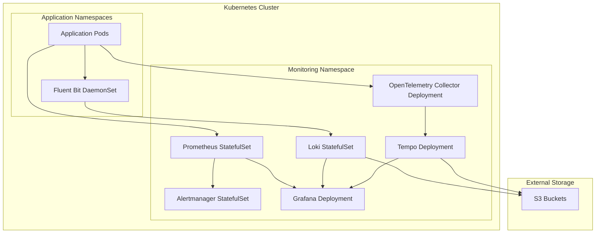

Key deployment considerations:

1. **High Availability**: Critical components (Prometheus, Alertmanager) are deployed with multiple replicas across availability zones
2. **Persistent Storage**: Prometheus uses persistent volumes for metric storage
3. **Object Storage**: Loki and Tempo use S3 for long-term storage
4. **Resource Allocation**: Each component has appropriate CPU and memory requests/limits
5. **Network Policies**: Restrict communication between monitoring components
6. **Service Accounts**: Least privilege access for monitoring components

### Data Flow

The monitoring data flows through the system as follows:

1. **Metrics Flow**:
   - Application services expose Prometheus metrics endpoints
   - Prometheus scrapes metrics at configured intervals (15s default)
   - Metrics are stored in Prometheus TSDB
   - Alertmanager evaluates alert rules against metrics
   - Grafana queries Prometheus for dashboard visualization

2. **Logs Flow**:
   - Application services write logs to stdout/stderr
   - Fluent Bit collects logs from container stdout/stderr
   - Logs are parsed, labeled, and forwarded to Loki
   - Loki indexes and stores logs
   - Grafana queries Loki for log visualization

3. **Traces Flow**:
   - Application services are instrumented with OpenTelemetry
   - Traces are sent to the OpenTelemetry Collector
   - Collector processes and forwards traces to Tempo
   - Tempo indexes and stores traces
   - Grafana queries Tempo for trace visualization

4. **Alerts Flow**:
   - Prometheus evaluates alert rules against metrics
   - Firing alerts are sent to Alertmanager
   - Alertmanager groups, deduplicates, and routes alerts
   - Notifications are sent to appropriate channels (PagerDuty, Slack, Email)

This integrated data flow enables correlation between metrics, logs, and traces for effective troubleshooting.

### Configuration Management

Monitoring configurations are managed as code in the repository:

- **Prometheus**: `infrastructure/monitoring/prometheus-config.yaml`
- **Alertmanager**: `infrastructure/monitoring/alertmanager-config.yaml`
- **Loki**: `infrastructure/monitoring/loki-config.yaml`
- **Tempo**: `infrastructure/monitoring/tempo-config.yaml`
- **Grafana**: `infrastructure/monitoring/grafana-dashboards.yaml`

Changes to these configurations follow the standard pull request and review process. After approval, changes are applied through the CI/CD pipeline.

Key configuration principles:

1. **Version Control**: All configurations are version-controlled
2. **Environment-specific Overrides**: Base configurations with environment-specific overrides
3. **Secret Management**: Sensitive values (API keys, credentials) managed through Kubernetes secrets
4. **Validation**: Configuration validation in CI/CD pipeline
5. **Documentation**: Inline comments explaining configuration choices

## Metrics Collection

This section describes the metrics collected by the monitoring system, their significance, and how they are used for monitoring and alerting.

### Metric Types

The monitoring system collects the following types of metrics:

1. **System Metrics**: Hardware and OS-level metrics (CPU, memory, disk, network)
2. **Kubernetes Metrics**: Cluster, node, and pod metrics
3. **Application Metrics**: Custom metrics specific to the pricing engine
4. **Database Metrics**: PostgreSQL and Redis performance metrics
5. **External API Metrics**: Performance and availability of external dependencies
6. **Business Metrics**: Financial and operational metrics specific to the domain

Metrics are collected using various exporters and instrumentation libraries, with a focus on standardization and consistency across all components.

### Core Application Metrics

The following core application metrics are collected from all services:

| Metric Name | Type | Description | Labels |
|------------|------|-------------|--------|
| http_requests_total | Counter | Total number of HTTP requests | method, path, status, service |
| http_request_duration_seconds | Histogram | HTTP request duration in seconds | method, path, service |
| http_request_size_bytes | Histogram | HTTP request size in bytes | method, path, service |
| http_response_size_bytes | Histogram | HTTP response size in bytes | method, path, service |
| application_info | Gauge | Application version information | version, service, commit_hash |
| process_cpu_seconds_total | Counter | Total user and system CPU time spent in seconds | service |
| process_resident_memory_bytes | Gauge | Resident memory size in bytes | service |
| process_open_fds | Gauge | Number of open file descriptors | service |

These metrics provide a baseline for monitoring all services and are supplemented by service-specific metrics.

### Service-Specific Metrics

Each service exposes additional metrics specific to its functionality:

**API Gateway Metrics:**
- `authentication_attempts_total`: Total authentication attempts (success/failure)
- `rate_limit_exceeded_total`: Rate limit exceeded events by client
- `request_validation_errors_total`: Request validation errors by type

**Calculation Service Metrics:**
- `calculation_total`: Total number of calculations performed by type
- `calculation_duration_seconds`: Duration of calculations in seconds
- `calculation_fee_amount`: Distribution of fee amounts
- `calculation_errors_total`: Calculation errors by type

**Data Service Metrics:**
- `external_api_requests_total`: External API requests by API and status
- `external_api_request_duration_seconds`: External API request duration
- `database_query_duration_seconds`: Database query duration by query type
- `database_connections_used`: Active database connections

**Cache Service Metrics:**
- `cache_hits_total`: Cache hits by key pattern
- `cache_misses_total`: Cache misses by key pattern
- `cache_size_bytes`: Cache size in bytes
- `cache_evictions_total`: Cache evictions by reason

These service-specific metrics enable detailed monitoring and troubleshooting of each component.

### Business Metrics

Business metrics provide insights into the financial and operational aspects of the system:

| Metric Name | Type | Description | Labels |
|------------|------|-------------|--------|
| borrow_rate | Gauge | Current borrow rate for a ticker | ticker, borrow_status |
| calculation_position_value | Histogram | Distribution of position values in calculations | client_id |
| calculation_loan_days | Histogram | Distribution of loan days in calculations | client_id |
| calculation_fee_amount | Histogram | Distribution of fee amounts in calculations | client_id |
| fallback_usage_total | Counter | Number of times fallback mechanisms were used | type, ticker |
| client_requests_total | Counter | Total requests by client | client_id, endpoint |

These business metrics enable monitoring of key financial indicators, client usage patterns, and system effectiveness.

### SLA Metrics

SLA metrics are derived from core metrics to track compliance with service level agreements:

| SLA Metric | Calculation | Target | Warning | Critical |
|------------|------------|--------|---------|----------|
| Availability | success_requests / total_requests | >99.95% | <99.9% | <99.8% |
| Response Time (p95) | http_request_duration_seconds{quantile="0.95"} | <100ms | >150ms | >250ms |
| Calculation Time (p95) | calculation_duration_seconds{quantile="0.95"} | <50ms | >75ms | >100ms |
| Error Rate | error_requests / total_requests | <0.1% | >0.5% | >1% |
| External API Success | successful_api_calls / total_api_calls | >99.5% | <99% | <98% |

These SLA metrics are prominently displayed on dashboards and used for alerting to ensure the system meets its performance requirements.

### Metric Cardinality Management

To prevent excessive cardinality in metrics, which can impact Prometheus performance, the following strategies are implemented:

1. **Label Limitation**: Restrict labels to essential dimensions
2. **Label Value Constraints**: Limit high-cardinality label values (e.g., client IDs, request IDs)
3. **Metric Aggregation**: Pre-aggregate metrics where appropriate
4. **Metric Relabeling**: Use Prometheus relabeling to control cardinality
5. **Histogram Buckets**: Use appropriate bucket definitions for histograms

Example of controlled histogram buckets for response time:
```yaml
http_request_duration_seconds_bucket{le="0.005"}
http_request_duration_seconds_bucket{le="0.01"}
http_request_duration_seconds_bucket{le="0.025"}
http_request_duration_seconds_bucket{le="0.05"}
http_request_duration_seconds_bucket{le="0.1"}
http_request_duration_seconds_bucket{le="0.25"}
http_request_duration_seconds_bucket{le="0.5"}
http_request_duration_seconds_bucket{le="1"}
http_request_duration_seconds_bucket{le="2.5"}
http_request_duration_seconds_bucket{le="5"}
http_request_duration_seconds_bucket{le="10"}
```

## Log Aggregation

This section describes the logging strategy, implementation, and how logs are used for monitoring and troubleshooting.

### Logging Strategy

The system implements a structured logging approach with consistent formats across all services:

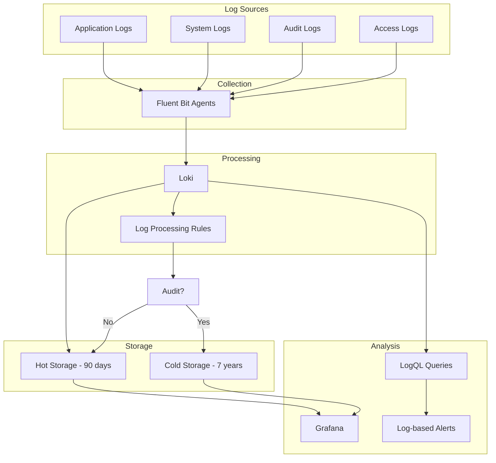

Key aspects of the logging strategy:

1. **Structured Logging**: All logs are in JSON format for consistent parsing and querying
2. **Log Levels**: Standardized log levels across all services (ERROR, WARN, INFO, DEBUG, TRACE)
3. **Contextual Information**: Each log entry includes service, trace ID, and relevant context
4. **Sensitive Data Handling**: PII and sensitive financial data are masked in logs
5. **Retention Policies**: Different retention periods based on log type and compliance requirements

### Log Types and Sources

The system generates the following types of logs:

| Log Type | Source | Format | Retention | Purpose |
|----------|--------|--------|-----------|----------|
| Application Logs | All services | JSON | 90 days | Operational monitoring and troubleshooting |
| Audit Logs | Calculation Service, API Gateway | JSON | 7 years | Regulatory compliance and transaction history |
| System Logs | Kubernetes, infrastructure | Structured text | 30 days | Infrastructure troubleshooting |
| Access Logs | API Gateway | Combined log format | 90 days | Security monitoring and usage analysis |

Each log type has specific fields and formatting appropriate to its purpose, with standardization across similar components.

### Log Format Specification

All application logs follow a standardized JSON format:

```json
{
  "timestamp": "2023-10-15T14:30:22.123Z",
  "level": "INFO",
  "service": "calculation-service",
  "trace_id": "0af7651916cd43dd8448eb211c80319c",
  "span_id": "b7ad6b7169203331",
  "request_id": "5e868e3e-8a0d-4093-b8ab-36b2e964a2a1",
  "message": "Calculation completed successfully",
  "client_id": "xyz789",
  "ticker": "AAPL",
  "duration_ms": 45,
  "additional_context": {
    "position_value": 100000,
    "loan_days": 30,
    "borrow_rate": 0.05
  }
}
```

Key fields in the log format:

1. **timestamp**: ISO 8601 format with millisecond precision
2. **level**: Log level (ERROR, WARN, INFO, DEBUG, TRACE)
3. **service**: Name of the service generating the log
4. **trace_id**: OpenTelemetry trace ID for correlation
5. **span_id**: OpenTelemetry span ID for correlation
6. **request_id**: Unique identifier for the request
7. **message**: Human-readable log message
8. **additional_context**: Service-specific contextual information

This structured format enables efficient filtering, searching, and analysis of logs.

### Log Collection and Processing

Logs are collected and processed using the following components:

1. **Log Generation**:
   - Services write logs to stdout/stderr
   - Kubernetes captures container logs

2. **Log Collection**:
   - Fluent Bit DaemonSet runs on all Kubernetes nodes
   - Collects logs from all containers
   - Parses JSON logs and adds Kubernetes metadata

3. **Log Processing**:
   - Adds additional labels based on content
   - Filters sensitive information
   - Routes logs to appropriate destinations

4. **Log Storage**:
   - Loki stores logs with efficient indexing
   - S3 for long-term archival of audit logs

This pipeline ensures efficient collection, processing, and storage of logs while maintaining their integrity and security.

### Log Querying with LogQL

Loki uses LogQL for querying logs. Common query patterns include:

1. **Basic Filtering**:
   ```
   {namespace="borrow-rate-engine", service="calculation-service"}
   ```

2. **Text Search**:
   ```
   {namespace="borrow-rate-engine"} |= "ERROR"
   ```

3. **Regular Expressions**:
   ```
   {namespace="borrow-rate-engine"} |~ "error.*calculation"
   ```

4. **JSON Parsing**:
   ```
   {namespace="borrow-rate-engine"} | json | client_id="xyz789"
   ```

5. **Line Formatting**:
   ```
   {namespace="borrow-rate-engine"} | json | line_format "{{.timestamp}} {{.level}} {{.message}}"
   ```

6. **Metric Extraction**:
   ```
   sum(count_over_time({namespace="borrow-rate-engine", level="ERROR"}[5m])) by (service)
   ```

These query patterns enable efficient troubleshooting and analysis of logs across the system.

### Log-Based Alerting

In addition to metric-based alerting, the system implements log-based alerting for specific scenarios:

1. **Error Pattern Detection**:
   - Alert on specific error patterns in logs
   - Detect unusual error frequencies
   - Identify security-related log patterns

2. **Audit Log Monitoring**:
   - Alert on missing audit logs
   - Detect unusual audit log patterns
   - Monitor compliance-related log events

3. **Security Monitoring**:
   - Alert on authentication failures
   - Detect unusual access patterns
   - Monitor for potential security breaches

Example log-based alert rule:
```yaml
groups:
  - name: log_alerts
    rules:
      - alert: HighAuthenticationFailures
        expr: sum(count_over_time({namespace="borrow-rate-engine", service="api-gateway"} |= "authentication_failed"[5m])) > 10
        for: 5m
        labels:
          severity: warning
        annotations:
          summary: High authentication failure rate
          description: More than 10 authentication failures in 5 minutes
```

## Distributed Tracing

This section describes the distributed tracing implementation, which provides end-to-end visibility into request flows across services.

### Tracing Architecture

The system implements distributed tracing using OpenTelemetry and Tempo:

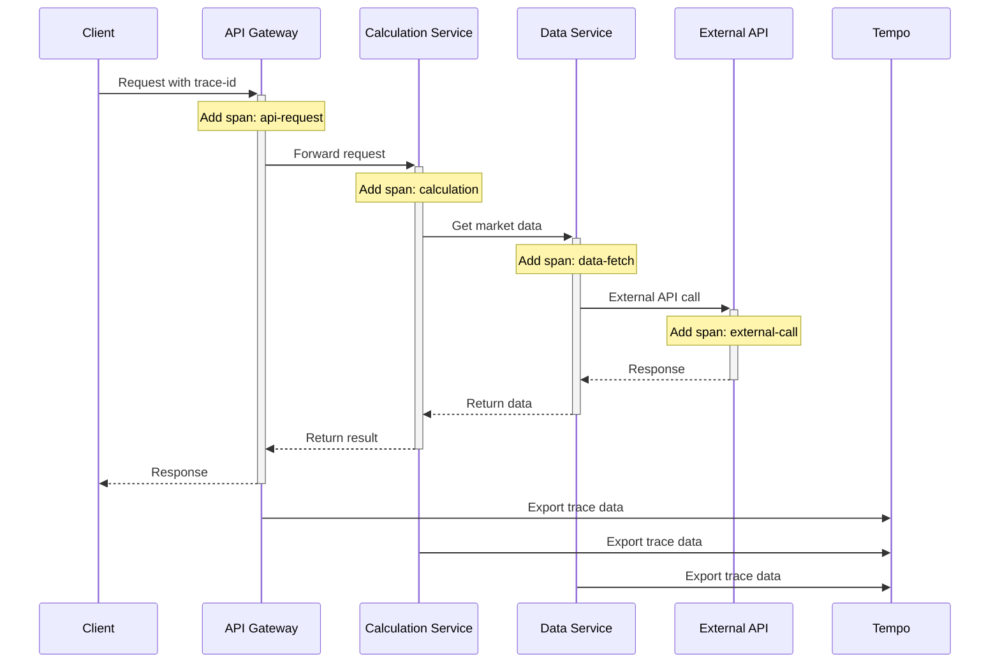

Key components of the tracing architecture:

1. **Instrumentation**: OpenTelemetry SDK integrated into all services
2. **Context Propagation**: W3C Trace Context headers for cross-service propagation
3. **Collector**: OpenTelemetry Collector for processing and forwarding traces
4. **Storage**: Tempo for efficient trace storage and querying
5. **Visualization**: Grafana for trace visualization and analysis

### Instrumentation Approach

Services are instrumented for tracing using a combination of automatic and manual instrumentation:

1. **Automatic Instrumentation**:
   - HTTP clients and servers
   - Database clients
   - Redis clients
   - External API calls

2. **Manual Instrumentation**:
   - Critical business logic
   - Calculation functions
   - Cache operations
   - Custom error handling

3. **Span Attributes**:
   - Standard attributes: http.method, http.url, http.status_code
   - Custom attributes: client_id, ticker, position_value, loan_days
   - Error details: error.type, error.message, error.stack

This comprehensive instrumentation approach ensures visibility into all aspects of request processing.

### Sampling Strategy

Trace sampling is configured to balance observability with performance:

1. **Sampling Rules**:
   - 100% sampling for error cases (status code >= 400)
   - 100% sampling for critical endpoints (fee calculation)
   - 10% sampling for normal traffic
   - 100% sampling for specific client IDs during investigations

2. **Sampling Implementation**:
   - Head-based sampling in OpenTelemetry Collector
   - Service-specific sampling rules
   - Dynamic sampling based on traffic volume

3. **Sampling Configuration**:
```yaml
processors:
  probabilistic_sampler:
    hash_seed: 22
    sampling_percentage: 10
  tail_sampling:
    decision_wait: 5s
    num_traces: 100
    expected_new_traces_per_sec: 10
    policies:
      - name: error-policy
        type: status_code
        status_code:
          status_codes: [ERROR]
      - name: critical-endpoint-policy
        type: string_attribute
        string_attribute:
          key: http.url
          values: ["/api/v1/calculate-locate"]
```

This sampling strategy ensures that important traces are always captured while controlling the volume of trace data.

### Trace Analysis

Traces can be analyzed in Grafana using the following approaches:

1. **Trace Explorer**:
   - Search by trace ID
   - Filter by service, operation, duration
   - View complete trace details
   - Analyze span attributes and events

2. **Service Graph**:
   - Visualize service dependencies
   - Identify bottlenecks
   - Analyze error rates between services
   - Understand request flow patterns

3. **Span Analysis**:
   - Examine individual spans
   - View span attributes and events
   - Identify slow operations
   - Understand error propagation

4. **Trace-to-Logs Correlation**:
   - Link traces to related logs
   - View logs in context of a trace
   - Correlate errors with trace events
   - Understand the complete context of a request

These analysis capabilities enable effective troubleshooting of complex, multi-service issues.

### Trace Correlation

The system implements correlation between traces, logs, and metrics:

1. **Trace-to-Logs Correlation**:
   - Trace ID and Span ID included in all log entries
   - Links from Grafana trace view to related logs
   - Ability to view logs for specific spans

2. **Trace-to-Metrics Correlation**:
   - Exemplars in Prometheus metrics link to traces
   - Ability to navigate from metric spikes to relevant traces
   - Correlation of performance metrics with trace data

3. **Correlation Implementation**:
   - W3C Trace Context propagation
   - OpenTelemetry Baggage for custom context
   - Consistent correlation IDs across all observability signals

This correlation enables seamless navigation between different observability signals, providing a complete view of system behavior.

### Trace Retention and Storage

Trace data is managed with the following retention and storage policies:

1. **Retention Periods**:
   - Standard traces: 14 days
   - Error traces: 30 days
   - Trace metadata: 90 days

2. **Storage Configuration**:
   - Tempo uses object storage (S3) for efficient storage
   - Block-based storage format for performance
   - Compaction for storage optimization

3. **Storage Efficiency**:
   - Bloom filters for efficient trace lookup
   - Index downsample for reduced storage requirements
   - Compression for reduced storage footprint

This approach balances the need for trace data availability with storage efficiency and cost considerations.

## Alerting System

This section describes the alerting system, which detects issues and notifies the appropriate teams for resolution.

### Alert Definition

Alerts are defined using Prometheus AlertManager rules. Each alert includes:

1. **Alert Name**: Clear, descriptive name
2. **Expression**: PromQL expression that triggers the alert
3. **Duration**: How long the condition must be true before alerting
4. **Labels**: Severity, service, category, team
5. **Annotations**: Summary, description, runbook link

Example alert definition:
```yaml
groups:
  - name: api_alerts
    rules:
      - alert: HighErrorRate
        expr: sum(rate(http_requests_total{job="api-gateway", status=~"5.."}[5m])) / sum(rate(http_requests_total{job="api-gateway"}[5m])) > 0.01
        for: 5m
        labels:
          severity: critical
          service: api-gateway
          category: availability
          team: api
        annotations:
          summary: High error rate on API Gateway
          description: Error rate is above 1% for the last 5 minutes
          runbook_url: https://example.com/runbooks/high-error-rate
```

Alerts are organized into logical groups based on service and functionality.

### Alert Categories

Alerts are categorized into the following groups:

1. **Availability Alerts**:
   - Service or component unavailability
   - High error rates
   - External dependency failures

2. **Performance Alerts**:
   - Slow response times
   - High resource utilization
   - Database performance issues

3. **Capacity Alerts**:
   - Resource saturation
   - Connection pool exhaustion
   - Storage capacity issues

4. **Security Alerts**:
   - Authentication failures
   - Rate limiting breaches
   - Unusual access patterns

5. **Business Alerts**:
   - Unusual calculation patterns
   - Fallback mechanism activation
   - Significant changes in business metrics

Each category has specific alert definitions with appropriate thresholds and severity levels.

### Alert Severity Levels

Alerts are classified into four severity levels:

| Severity | Description | Response Time | Example |
|----------|-------------|---------------|----------|
| P1 (Critical) | Service unavailable or severe impact | 15 minutes | API Gateway down, >1% error rate |
| P2 (High) | Degraded service or significant impact | 30 minutes | Slow response times, external API issues |
| P3 (Medium) | Minor impact or potential future issue | 2 hours | Cache hit rate below threshold, high resource usage |
| P4 (Low) | Informational or non-urgent issue | Next business day | Unusual patterns, minor anomalies |

Severity levels determine notification channels, response times, and escalation procedures.

### Alert Routing

Alerts are routed to different channels based on severity and type:

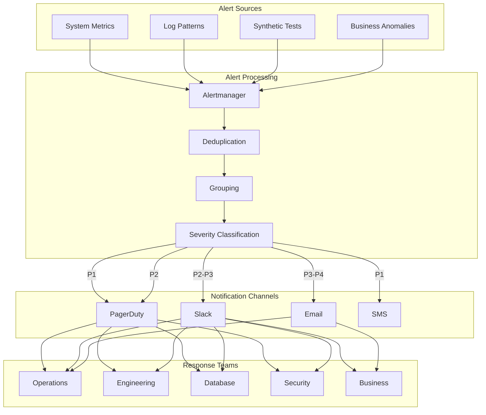

Routing configuration in Alertmanager:
```yaml
route:
  receiver: default
  group_by: ['alertname', 'cluster', 'service']
  group_wait: 30s
  group_interval: 5m
  repeat_interval: 4h
  routes:
    - match:
        severity: critical
      receiver: pagerduty-critical
      continue: true
    - match:
        severity: critical
      receiver: slack-critical
    - match:
        severity: high
      receiver: pagerduty-high
      continue: true
    - match:
        severity: high
      receiver: slack-high
    - match:
        severity: medium
      receiver: slack-medium
    - match:
        severity: low
      receiver: slack-low
```

This routing ensures that alerts reach the appropriate teams through the most effective channels.

### Notification Channels

The system uses the following notification channels:

1. **PagerDuty**:
   - Used for P1 and P2 alerts
   - Integrated with on-call rotation
   - Escalation policies for unacknowledged alerts
   - Mobile app notifications

2. **Slack**:
   - Dedicated channels for different alert severities
   - Rich formatting with alert details
   - Action buttons for common responses
   - Integration with incident management

3. **Email**:
   - Used for P3 and P4 alerts
   - Daily digest of non-critical alerts
   - Detailed alert information
   - Links to dashboards and runbooks

4. **SMS**:
   - Backup notification for critical alerts
   - Minimal information for urgent attention
   - Used when other channels fail

Each channel is configured with appropriate templates and formatting to provide clear, actionable information.

### Escalation Procedures

The escalation path follows this sequence:

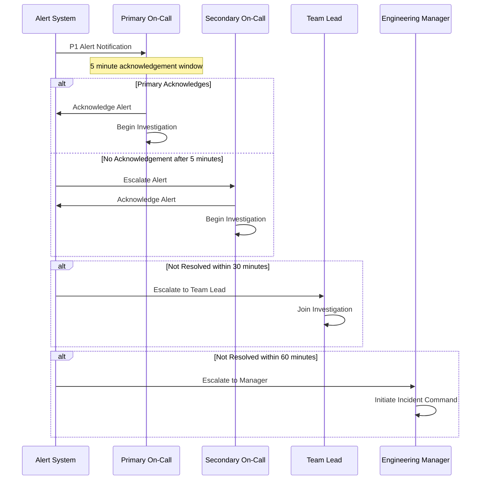

| Role | Responsibilities | Escalation Timeframe |
|------|------------------|----------------------|
| Primary On-Call | Initial response and troubleshooting | Acknowledge within 5 minutes |
| Secondary On-Call | Backup for primary | Engaged after 5 minutes of no response |
| Team Lead | Technical guidance and resource coordination | Engaged after 30 minutes for P1/P2 |
| Engineering Manager | Stakeholder communication and incident command | Engaged after 60 minutes for P1 |

This escalation procedure ensures that alerts are addressed promptly and that additional resources are engaged when needed.

### Alert Thresholds

Alert thresholds are defined based on service level objectives (SLOs) and operational experience:

| Metric | Warning (P3) | High (P2) | Critical (P1) |
|--------|--------------|-----------|---------------|
| API Success Rate | <99.5% for 5min | <99% for 5min | <98% for 2min |
| Response Time | >150ms for 10min | >250ms for 5min | >500ms for 2min |
| External API Errors | >1% for 15min | >5% for 5min | >10% for 2min |
| Database Latency | >50ms for 15min | >100ms for 5min | >200ms for 2min |
| Cache Hit Rate | <90% for 30min | <80% for 15min | <70% for 5min |

Thresholds are regularly reviewed and adjusted based on operational experience and changing requirements. The goal is to minimize false positives while ensuring that real issues are detected promptly.

## Dashboard Design

This section describes the dashboard design for different user personas, providing appropriate visibility into system health, performance, and business metrics.

### Dashboard Organization

Dashboards are organized into the following categories:

1. **Executive Dashboards**: High-level system health and business metrics for management
2. **Operational Dashboards**: Real-time monitoring for operations teams
3. **Technical Dashboards**: Detailed metrics for engineering teams
4. **Service-Specific Dashboards**: Focused views of individual services
5. **Business Metrics Dashboards**: Financial and client usage metrics

All dashboards are accessible from the Grafana home page and are organized into folders by category. Each dashboard is designed for a specific user persona and use case.

### Executive Dashboard

The Executive Dashboard provides a high-level overview suitable for management and stakeholders:

```mermaid
graph TD
    subgraph "Executive Dashboard"
        A[System Health Status]
        B[Key Business Metrics]
        C[SLA Compliance]
        D[Recent Incidents]
    end
    
    subgraph "System Health"
        A1[Overall Status: Green/Yellow/Red]
        A2[Component Status Heatmap]
        A3[7-Day Availability Trend]
    end
    
    subgraph "Business Metrics"
        B1[Daily Calculation Volume]
        B2[Average Fee Amount]
        B3[Top Client Usage]
        B4[Revenue Impact Estimate]
    end
    
    subgraph "SLA Metrics"
        C1[Availability: 99.98%]
        C2[Response Time: 85ms p95]
        C3[Calculation Accuracy: 100%]
    end
    
    subgraph "Incident Summary"
        D1[Open Incidents: 0]
        D2[Recent Resolutions: 2]
        D3[MTTR: 45 minutes]
    end
    
    A --> A1
    A --> A2
    A --> A3
    
    B --> B1
    B --> B2
    B --> B3
    B --> B4
    
    C --> C1
    C --> C2
    C --> C3
    
    D --> D1
    D --> D2
    D --> D3
```

Key panels in the Executive Dashboard:

1. **System Health Status**: Overall health with component status
2. **7-Day Availability Trend**: Availability percentage over time
3. **Daily Calculation Volume**: Number of fee calculations performed
4. **Average Fee Amount**: Average fee calculated by the system
5. **SLA Compliance**: Performance against defined SLAs
6. **Recent Incidents**: Summary of recent operational issues

This dashboard is designed to answer the question: "Is the system healthy and meeting business objectives?"

### Operational Dashboard

The Operational Dashboard provides real-time visibility for operations teams:

```mermaid
graph TD
    subgraph "Operational Dashboard"
        A[Real-time Traffic]
        B[Error Rates]
        C[Resource Utilization]
        D[External Dependencies]
    end
    
    subgraph "Traffic Metrics"
        A1[Requests per Second]
        A2[Response Time Distribution]
        A3[Endpoint Usage Breakdown]
    end
    
    subgraph "Error Analysis"
        B1[Error Rate by Endpoint]
        B2[Top Error Types]
        B3[Client Error Distribution]
    end
    
    subgraph "Resource Metrics"
        C1[CPU/Memory by Service]
        C2[Database Connections]
        C3[Cache Hit/Miss Ratio]
    end
    
    subgraph "Dependencies"
        D1[SecLend API Status]
        D2[Market Data API Latency]
        D3[Event Calendar API Status]
    end
    
    A --> A1
    A --> A2
    A --> A3
    
    B --> B1
    B --> B2
    B --> B3
    
    C --> C1
    C --> C2
    C --> C3
    
    D --> D1
    D --> D2
    D --> D3
```

Key panels in the Operational Dashboard:

1. **Requests per Second**: Current traffic levels with trends
2. **Response Time Distribution**: Latency percentiles across endpoints
3. **Error Rates by Endpoint**: Error percentages by API endpoint
4. **CPU/Memory by Service**: Resource utilization across services
5. **External API Status**: Health of external dependencies
6. **Cache Hit/Miss Ratio**: Cache effectiveness metrics

This dashboard is designed for day-to-day monitoring and should be displayed on operations team monitors.

### Technical Dashboard

The Technical Dashboard provides detailed metrics for engineering teams:

```mermaid
graph TD
    subgraph "Technical Dashboard"
        A[Service Performance]
        B[Database Metrics]
        C[Cache Performance]
        D[API Gateway Metrics]
    end
    
    subgraph "Service Details"
        A1[Calculation Service Latency]
        A2[Data Service API Calls]
        A3[Service Error Rates]
        A4[Service Instance Count]
    end
    
    subgraph "Database Insights"
        B1[Query Performance]
        B2[Connection Pool Status]
        B3[Transaction Volume]
        B4[Slow Query Analysis]
    end
    
    subgraph "Cache Analytics"
        C1[Hit Rate by Key Pattern]
        C2[Memory Usage]
        C3[Eviction Rate]
        C4[Key Expiration Analysis]
    end
    
    subgraph "Gateway Statistics"
        D1[Request Volume by Client]
        D2[Authentication Success Rate]
        D3[Rate Limiting Events]
        D4[Response Code Distribution]
    end
    
    A --> A1
    A --> A2
    A --> A3
    A --> A4
    
    B --> B1
    B --> B2
    B --> B3
    B --> B4
    
    C --> C1
    C --> C2
    C --> C3
    C --> C4
    
    D --> D1
    D --> D2
    D --> D3
    D --> D4
```

Key panels in the Technical Dashboard:

1. **Service Performance**: Detailed latency and throughput metrics
2. **Database Metrics**: Query performance, connection pools, transactions
3. **Cache Performance**: Hit rates, memory usage, eviction rates
4. **API Gateway Metrics**: Request volumes, authentication rates

This dashboard is designed for troubleshooting and performance optimization.

### Service-Specific Dashboards

Each core service has a dedicated dashboard with detailed metrics:

1. **API Gateway Dashboard**:
   - Request rate by endpoint
   - Response time by endpoint
   - Authentication success rate
   - Rate limiting events
   - Request validation errors

2. **Calculation Service Dashboard**:
   - Calculation rate by type
   - Calculation duration
   - Formula accuracy
   - Cache hit rate
   - Error distribution

3. **Data Service Dashboard**:
   - External API call volume
   - External API latency
   - Database query performance
   - Data freshness metrics
   - Error rates by external API

4. **Cache Service Dashboard**:
   - Cache hit/miss ratio by key pattern
   - Memory usage
   - Eviction rate
   - Key expiration metrics
   - Redis performance

These dashboards provide deep visibility into each service's performance and behavior.

### Business Metrics Dashboard

The Business Metrics Dashboard focuses on financial and business metrics:

```mermaid
graph TD
    subgraph "Business Metrics Dashboard"
        A[Borrow Rate Metrics]
        B[Fee Metrics]
        C[Client Metrics]
        D[Operational Metrics]
    end
    
    subgraph "Borrow Rate Analysis"
        A1[Average Borrow Rate by Ticker]
        A2[Borrow Rate Trends]
        A3[Volatility Impact]
        A4[Event Risk Impact]
    end
    
    subgraph "Fee Analysis"
        B1[Fee Distribution]
        B2[Average Fee by Client]
        B3[Fee Breakdown Components]
        B4[Revenue Impact Estimate]
    end
    
    subgraph "Client Analysis"
        C1[Requests by Client]
        C2[Average Position Value]
        C3[Loan Duration Distribution]
        C4[Client Growth Trends]
    end
    
    subgraph "Operational Insights"
        D1[Fallback Usage]
        D2[Calculation Volume Trends]
        D3[Peak Usage Patterns]
        D4[Market Event Impact]
    end
    
    A --> A1
    A --> A2
    A --> A3
    A --> A4
    
    B --> B1
    B --> B2
    B --> B3
    B --> B4
    
    C --> C1
    C --> C2
    C --> C3
    C --> C4
    
    D --> D1
    D --> D2
    D --> D3
    D --> D4
```

Key panels in the Business Metrics Dashboard:

1. **Average Borrow Rate by Ticker**: Trends in borrow rates
2. **Fee Distribution**: Histogram of fee amounts
3. **Client Usage Patterns**: Request volumes by client
4. **Fallback Usage**: Tracking of fallback mechanism activation
5. **Revenue Impact Estimate**: Estimated revenue from fees

This dashboard is particularly useful for business analysts and product managers.

### Specialized Dashboards

In addition to the core dashboards, the system includes specialized dashboards for specific use cases:

1. **Logs Dashboard**:
   - Error logs with filtering and search
   - Error rate by service
   - Audit logs for compliance
   - Log volume trends

2. **Traces Dashboard**:
   - Service graph visualization
   - Slow trace analysis
   - Error trace analysis
   - Trace browser with filtering

3. **SLA Dashboard**:
   - Real-time SLA compliance
   - Historical SLA trends
   - SLA breach analysis
   - Availability calculator

4. **Security Dashboard**:
   - Authentication attempts
   - Rate limiting events
   - API key usage
   - Unusual access patterns

These specialized dashboards provide focused views for specific operational needs.

## Incident Response

This section describes the incident response procedures, including detection, classification, escalation, and resolution.

### Incident Detection

Incidents are detected through multiple channels:

1. **Automated Alerts**:
   - Metric-based alerts from Prometheus
   - Log-based alerts from Loki
   - Synthetic transaction failures
   - External monitoring services

2. **Manual Detection**:
   - User-reported issues
   - Scheduled health checks
   - Dashboard monitoring
   - Operational reviews

3. **Proactive Detection**:
   - Anomaly detection
   - Trend analysis
   - Capacity forecasting
   - Security monitoring

Early detection is critical for minimizing the impact of incidents and ensuring rapid resolution.

### Incident Classification

Incidents are classified by severity and impact:

| Severity | Description | Business Impact | Response Time | Example |
|----------|-------------|-----------------|---------------|----------|
| P1 (Critical) | Service unavailable | Severe business impact | 15 minutes | API Gateway down, >1% error rate |
| P2 (High) | Degraded service | Significant business impact | 30 minutes | Slow response times, external API issues |
| P3 (Medium) | Minor functionality impacted | Limited business impact | 2 hours | Cache hit rate below threshold, high resource usage |
| P4 (Low) | Cosmetic issues | Minimal business impact | Next business day | Unusual patterns, minor anomalies |

Incident classification determines the response approach, escalation path, and communication strategy.

### Incident Response Workflow

The incident response workflow follows these steps:

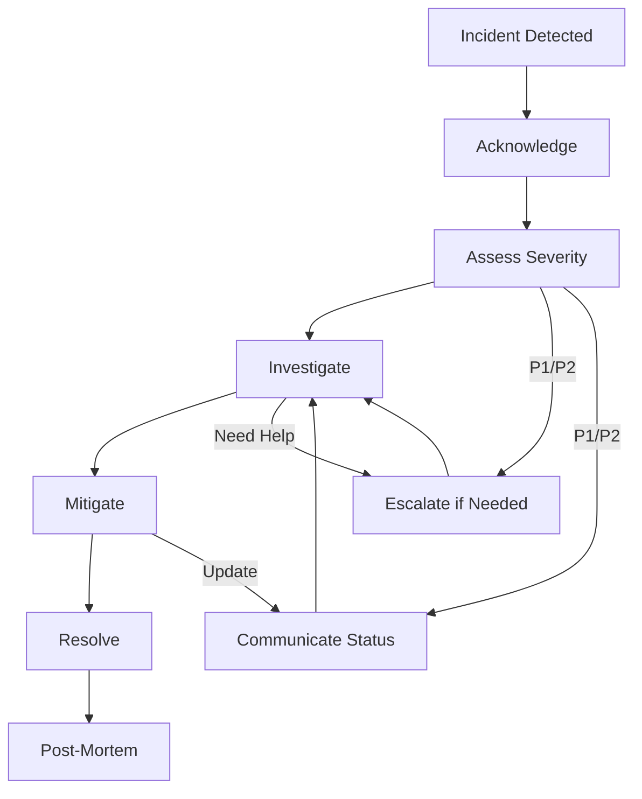

1. **Acknowledge**: Acknowledge the alert or incident
2. **Assess**: Determine severity and potential impact
3. **Investigate**: Use monitoring tools to identify the cause
4. **Mitigate**: Implement immediate fixes to restore service
5. **Resolve**: Fully resolve the incident
6. **Post-Mortem**: Analyze root cause and prevent recurrence

For P1 and P2 incidents, additional steps include escalation and regular status communication.

### Escalation Procedures

The escalation path follows this sequence:

1. **Primary On-Call Engineer**:
   - First responder for all alerts
   - Must acknowledge within 5 minutes
   - Has authority to involve additional resources

2. **Secondary On-Call Engineer**:
   - Engaged if primary doesn't respond within 5 minutes
   - Provides support for complex incidents
   - Backup for primary during high-load incidents

3. **Team Lead**:
   - Engaged after 30 minutes for unresolved P1/P2 incidents
   - Provides technical guidance and coordination
   - Has authority to engage additional teams

4. **Engineering Manager**:
   - Engaged after 60 minutes for P1 incidents
   - Manages stakeholder communication
   - Coordinates cross-team response
   - Has authority to declare major incidents

The on-call schedule is managed in PagerDuty with weekly rotations.

### Runbooks

Detailed runbooks are available for common issues:

1. **Service Runbooks**:
   - API Gateway Runbook
   - Calculation Service Runbook
   - Data Service Runbook
   - Cache Service Runbook
   - Database Runbook

2. **Issue-Specific Runbooks**:
   - High Latency Troubleshooting
   - Error Rate Troubleshooting
   - External API Failures
   - Cache Performance Issues
   - Database Performance Issues

Each runbook includes:
- Initial assessment steps
- Diagnostic procedures
- Recovery procedures
- Escalation guidelines
- Verification steps

Runbooks are regularly updated based on incident learnings and system changes.

### Post-Mortem Process

After each significant incident, a structured post-mortem is conducted:

1. **Incident Timeline**:
   - Detection time and method
   - Response actions and timestamps
   - Resolution time and method
   - Key decision points

2. **Root Cause Analysis**:
   - Technical factors
   - Process factors
   - Environmental factors
   - Contributing causes

3. **Impact Assessment**:
   - Duration of impact
   - Affected systems and users
   - Business consequences
   - SLA violations

4. **Corrective Actions**:
   - Immediate fixes
   - Long-term improvements
   - Process changes
   - Monitoring enhancements

5. **Lessons Learned**:
   - What went well
   - What could be improved
   - Knowledge gaps identified
   - Systemic issues

Post-mortems are blameless and focus on system and process improvements rather than individual actions.

### Communication Plan

Incident communication follows a structured plan:

1. **Internal Communication**:
   - Slack channel for incident coordination
   - Regular status updates (15-30 minutes for P1)
   - Handoff documentation for shift changes
   - Post-resolution summary

2. **Stakeholder Communication**:
   - Initial notification for P1/P2 incidents
   - Regular status updates
   - Resolution notification
   - Post-mortem summary

3. **Client Communication**:
   - Status page updates
   - Email notifications for major incidents
   - Resolution confirmation
   - Preventive measures summary

4. **Communication Templates**:
   - Initial incident notification
   - Status update
   - Resolution notification
   - Post-mortem summary

Clear, timely communication is essential for effective incident management and stakeholder confidence.

## Compliance Monitoring

This section describes the monitoring aspects related to regulatory compliance and audit requirements.

### Audit Logging

The system implements comprehensive audit logging for compliance:

1. **Audit Events**:
   - All fee calculations with inputs and results
   - Authentication and authorization events
   - Configuration changes
   - Data access patterns

2. **Audit Log Format**:
   - Timestamp with millisecond precision
   - Event type and description
   - User/client identifier
   - Resource affected
   - Action performed
   - Result of the action
   - Additional context

3. **Audit Log Storage**:
   - 90-day retention in Loki
   - 7-year archival in S3
   - Immutable storage for compliance
   - Secure access controls

4. **Audit Log Monitoring**:
   - Alerts for missing audit logs
   - Monitoring of audit log patterns
   - Regular audit log verification
   - Compliance reporting dashboards

Audit logs are critical for regulatory compliance and must be properly maintained.

### SLA Monitoring

SLA monitoring ensures compliance with service level agreements:

1. **SLA Metrics**:
   - Availability: Target 99.95%
   - Response Time: Target <100ms (p95)
   - Calculation Accuracy: Target 100%
   - Error Rate: Target <0.1%

2. **SLA Calculation**:
   - Availability = successful_requests / total_requests
   - Response Time = http_request_duration_seconds{quantile="0.95"}
   - Error Rate = error_requests / total_requests

3. **SLA Reporting**:
   - Real-time SLA dashboard
   - Daily SLA summary
   - Monthly SLA report
   - SLA breach analysis

4. **SLA Alerting**:
   - Early warning for SLA risk
   - Immediate alert for SLA breach
   - Escalation for sustained SLA issues

SLA monitoring provides visibility into system performance against defined targets and supports contractual compliance.

### Security Monitoring

Security monitoring ensures the protection of sensitive financial data:

1. **Authentication Monitoring**:
   - Authentication success/failure rates
   - Unusual authentication patterns
   - Brute force attempt detection
   - API key usage monitoring

2. **Authorization Monitoring**:
   - Access control violations
   - Privilege escalation attempts
   - Unusual access patterns
   - Resource access monitoring

3. **Data Protection Monitoring**:
   - Encryption status
   - Data access patterns
   - Sensitive data exposure
   - Data integrity verification

4. **Security Alerting**:
   - Real-time alerts for security events
   - Correlation of security signals
   - Escalation for security incidents
   - Regular security reporting

Security monitoring is integrated with the overall monitoring system while providing specialized visibility into security-related aspects.

### Regulatory Compliance

Monitoring supports regulatory compliance requirements:

| Regulation | Monitoring Requirements | Implementation |
|------------|--------------------------|----------------|
| SEC Rule 17a-4 | Record retention, immutability | 7-year audit log retention, tamper-evident logging |
| Sarbanes-Oxley (SOX) | Access controls, audit trails | RBAC monitoring, comprehensive logging, change management |
| GDPR/CCPA | Data protection, access controls | Encryption monitoring, access logging, data minimization |

Compliance monitoring includes:

1. **Compliance Dashboards**:
   - Regulatory compliance status
   - Control effectiveness
   - Compliance risk indicators
   - Audit readiness metrics

2. **Compliance Reporting**:
   - Scheduled compliance reports
   - Evidence collection for audits
   - Control testing results
   - Remediation tracking

3. **Compliance Alerting**:
   - Control failure alerts
   - Compliance risk indicators
   - Regulatory deadline reminders
   - Audit preparation notifications

This comprehensive approach ensures that monitoring supports regulatory compliance requirements.

### Data Retention Monitoring

Data retention monitoring ensures compliance with retention policies:

1. **Retention Policies**:
   - Metrics: 30 days in Prometheus, 1 year downsampled
   - Logs: 90 days in Loki, 7 years for audit logs
   - Traces: 14 days in Tempo, 30 days for error traces

2. **Retention Monitoring**:
   - Storage usage tracking
   - Retention policy enforcement
   - Archival process monitoring
   - Data access after archival

3. **Retention Alerting**:
   - Storage capacity warnings
   - Retention policy violations
   - Archival process failures
   - Data access issues

Effective data retention monitoring ensures that data is retained as required for compliance while managing storage costs and performance.

## Monitoring Implementation Plan

This section outlines the phased approach to implementing the monitoring architecture.

### Implementation Phases

The monitoring implementation follows a phased approach:

| Phase | Focus | Timeline | Deliverables |
|-------|-------|----------|-------------|
| Foundation | Core infrastructure monitoring | Week 1-2 | Basic health checks, resource metrics |
| Service Instrumentation | Application-level metrics | Week 3-4 | Custom metrics, tracing implementation |
| Business Metrics | Financial calculation monitoring | Week 5-6 | Fee calculation accuracy, rate monitoring |
| Advanced Alerting | Proactive detection | Week 7-8 | Alert tuning, anomaly detection |

This phased approach ensures that critical monitoring capabilities are available early while allowing for iterative enhancement.

### Implementation Approach

The implementation approach includes the following steps:

1. **Infrastructure Setup**:
   - Deploy monitoring infrastructure (Prometheus, Loki, Tempo, Grafana)
   - Configure basic scraping and collection
   - Implement basic dashboards

2. **Service Instrumentation**:
   - Instrument services with OpenTelemetry
   - Implement custom metrics
   - Configure log formatting and collection

3. **Dashboard Development**:
   - Create persona-specific dashboards
   - Implement service-specific dashboards
   - Develop business metrics dashboards

4. **Alert Configuration**:
   - Define alert rules
   - Configure notification channels
   - Implement escalation procedures

5. **Documentation and Training**:
   - Document monitoring architecture
   - Create runbooks for common issues
   - Train team on monitoring tools and procedures

This structured approach ensures comprehensive implementation while prioritizing critical capabilities.

### Validation and Testing

The monitoring implementation includes validation and testing:

1. **Metric Validation**:
   - Verify metric collection
   - Validate metric accuracy
   - Test metric performance impact

2. **Log Validation**:
   - Verify log collection
   - Validate log parsing
   - Test log query performance

3. **Trace Validation**:
   - Verify trace collection
   - Validate trace context propagation
   - Test trace visualization

4. **Alert Testing**:
   - Verify alert triggering
   - Validate notification delivery
   - Test escalation procedures

5. **Chaos Testing**:
   - Simulate service failures
   - Test fallback mechanisms
   - Validate monitoring during failures

Comprehensive testing ensures that the monitoring system functions correctly and provides accurate visibility.

### Observability Maturity Roadmap

The observability maturity roadmap outlines the evolution of monitoring capabilities:

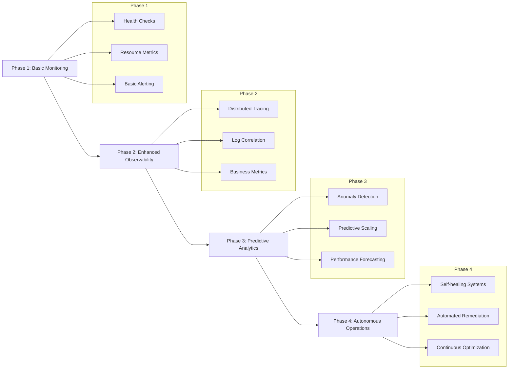

This roadmap provides a vision for the evolution of monitoring capabilities from basic monitoring to autonomous operations.

### Continuous Improvement

The monitoring system will be continuously improved through:

1. **Regular Reviews**:
   - Monthly review of monitoring effectiveness
   - Post-incident monitoring gap analysis
   - Quarterly dashboard updates
   - Annual monitoring strategy review

2. **Feedback Collection**:
   - Gather input from operations teams
   - Collect feedback after incidents
   - Identify missing metrics or alerts
   - Document monitoring pain points

3. **Improvement Process**:
   - Prioritize monitoring gaps
   - Implement incremental improvements
   - Test and validate changes
   - Document and communicate updates

4. **Knowledge Sharing**:
   - Regular training on monitoring tools
   - Documentation of monitoring best practices
   - Sharing of effective queries and techniques
   - Cross-team monitoring reviews

Continuous improvement ensures that the monitoring system evolves with the application and operational needs.

## Conclusion

The monitoring and observability architecture for the Borrow Rate & Locate Fee Pricing Engine provides comprehensive visibility into system health, performance, and business metrics. By implementing a robust monitoring stack with metrics, logs, and traces, the system ensures early detection of issues, rapid troubleshooting, and verification of SLA compliance.

Key aspects of the monitoring architecture include:

1. **Comprehensive Observability**: Integrated metrics, logs, and traces for complete visibility
2. **Persona-Specific Dashboards**: Tailored views for different user roles and use cases
3. **Proactive Alerting**: Early detection of issues with appropriate escalation
4. **Incident Response**: Structured approach to incident management
5. **Compliance Monitoring**: Support for regulatory requirements and audit needs

This monitoring architecture is designed to evolve with the system, incorporating new capabilities and addressing changing requirements through a continuous improvement process.

## References

- [Prometheus Documentation](https://prometheus.io/docs/)
- [Grafana Documentation](https://grafana.com/docs/)
- [Loki Documentation](https://grafana.com/docs/loki/latest/)
- [Tempo Documentation](https://grafana.com/docs/tempo/latest/)
- [OpenTelemetry Documentation](https://opentelemetry.io/docs/)
- [Alertmanager Documentation](https://prometheus.io/docs/alerting/latest/alertmanager/)
- [Fluent Bit Documentation](https://docs.fluentbit.io/)
- [System Architecture Overview](../architecture/overview.md)
- [API Design Documentation](../architecture/api-design.md)
- [Operations Monitoring Guide](../operations/monitoring.md)