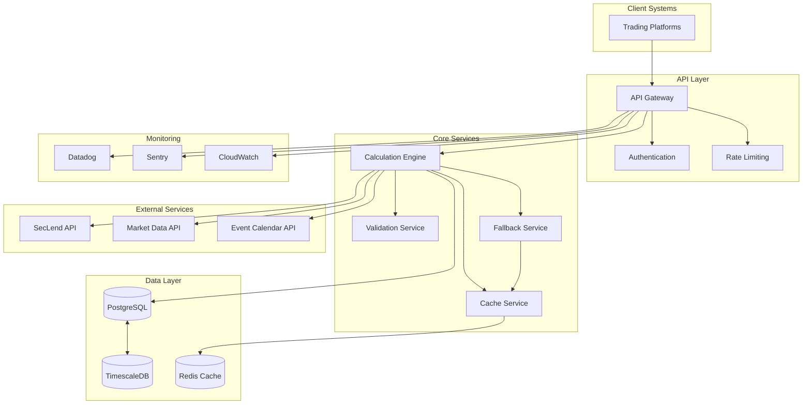

# Borrow Rate & Locate Fee Pricing Engine: Architectural Overview

## Introduction

This document provides a comprehensive architectural overview of the Borrow Rate & Locate Fee Pricing Engine. The system is designed to dynamically calculate short-selling costs for brokerages and financial institutions, addressing the critical need for accurate, real-time pricing of securities borrowing transactions in the securities lending market.

The architecture described in this document is designed to meet the following key requirements:

- **Performance**: Process fee calculations with <100ms response time
- **Scalability**: Support 1000+ requests per second during peak periods
- **Reliability**: Maintain 99.95% uptime with robust fallback mechanisms
- **Security**: Protect sensitive financial data with comprehensive security controls
- **Compliance**: Meet regulatory requirements for financial systems
- **Extensibility**: Support future enhancements and integrations

### System Purpose

The Borrow Rate & Locate Fee Pricing Engine serves as a specialized financial system that:

1. Calculates accurate borrowing costs for short-selling operations
2. Dynamically determines rates based on security characteristics, market conditions, and client parameters
3. Provides a standardized API for integration with trading platforms
4. Ensures consistent pricing methodology across all transactions
5. Maintains comprehensive audit trails for compliance purposes

By automating and standardizing the fee calculation process, the system enables financial institutions to optimize revenue from securities lending while providing transparent, consistent pricing to their clients.

### Business Context

Securities lending is a critical revenue stream for brokerages, requiring precise pricing based on market conditions. The current limitations in the industry include:

- Manual calculations leading to inconsistencies
- Delayed rate adjustments in response to market changes
- Limited audit trails for compliance purposes
- Inefficient pricing that may leave revenue uncaptured

The Borrow Rate & Locate Fee Pricing Engine addresses these limitations by providing an automated, formula-driven pricing engine with real-time data integration, potentially increasing securities lending revenue by 5-15% through more accurate fee calculations and reduced manual errors.

### Document Structure

This architectural overview is organized into the following sections:

1. **Introduction**: System purpose and business context
2. **Architectural Principles**: Guiding principles for the system design
3. **System Overview**: High-level description of the system architecture
4. **Core Components**: Detailed description of each system component
5. **Data Architecture**: Database design, caching strategy, and data flows
6. **Integration Architecture**: API design and external system integrations
7. **Security Architecture**: Authentication, authorization, and data protection
8. **Deployment Architecture**: Infrastructure, containerization, and scaling
9. **Monitoring Architecture**: Observability, alerting, and incident response
10. **Future Considerations**: Planned enhancements and extensibility options

Each section provides both high-level concepts and detailed technical specifications to support implementation and maintenance.

## Architectural Principles

The architecture of the Borrow Rate & Locate Fee Pricing Engine is guided by the following core principles:

### Microservices Architecture

The system employs a microservices architecture to ensure modularity, scalability, and maintainability. This approach allows independent scaling of high-traffic components and facilitates future extensions. Services are designed with clear boundaries and responsibilities, communicating through well-defined APIs.

### API-First Design

The system follows an API-first design approach, with all functionality exposed through RESTful APIs. This enables seamless integration with trading platforms and other client systems. API contracts are treated as first-class artifacts, with comprehensive documentation and versioning.

### Defense in Depth

Security is implemented through multiple layers of controls, following the principle of defense in depth. This includes network security, authentication, authorization, encryption, input validation, and comprehensive audit logging. No single security control failure should compromise the entire system.

### Resilience by Design

The system is designed to be resilient to failures, with circuit breakers, retry mechanisms, fallbacks, and graceful degradation. External dependencies are treated as unreliable, with appropriate strategies to handle their unavailability.

### Data Consistency and Accuracy

As a financial system, data consistency and calculation accuracy are paramount. The system employs appropriate data types for financial calculations, comprehensive validation, and verification mechanisms to ensure accurate results.

### Observability

The system is designed to be observable, with comprehensive logging, metrics, and tracing. This enables effective monitoring, troubleshooting, and performance optimization.

### Compliance by Design

Regulatory compliance requirements are addressed as fundamental design considerations, not as afterthoughts. This includes audit logging, data retention, and security controls required by financial regulations.

## System Overview

The Borrow Rate & Locate Fee Pricing Engine is a REST API-based system that calculates borrowing costs for short-selling operations. It dynamically determines rates based on security characteristics, market conditions, and client-specific parameters.

### High-Level Architecture



The system architecture consists of several layers:

1. **API Layer**: Handles client requests, authentication, and rate limiting
2. **Core Services**: Implements business logic for fee calculations
3. **Data Layer**: Stores configuration data, audit logs, and cached values
4. **External Services**: Provides real-time market data and rates
5. **Monitoring**: Ensures system health and performance

This layered approach provides separation of concerns and enables independent scaling of components based on demand.

### Key Components

The system consists of the following key components:

- **API Gateway**: Entry point for all client requests, handling routing, authentication, and rate limiting
- **Calculation Engine**: Core business logic for fee calculations, implementing the formulas and business rules
- **Data Service**: Manages data access and integration with external APIs
- **Cache Service**: Optimizes performance through multi-level caching
- **Validation Service**: Ensures data integrity through comprehensive input validation
- **Fallback Service**: Provides resilience through fallback mechanisms when external services are unavailable
- **Audit Service**: Records all calculations for compliance and troubleshooting

Each component is designed as a microservice with clear responsibilities and interfaces.

### Primary Data Flow

The primary data flow for a fee calculation request follows these steps:

1. Client sends a request to the API Gateway
2. API Gateway authenticates the request and applies rate limiting
3. Request is forwarded to the Calculation Engine
4. Calculation Engine validates the input parameters
5. Calculation Engine retrieves the current borrow rate (from cache or external API)
6. Calculation Engine retrieves the broker configuration
7. Calculation Engine applies the fee formula to calculate the total fee
8. Result is returned to the client
9. Calculation details are logged for audit purposes

This flow is optimized for performance through caching and parallel processing where appropriate.

### Technology Stack

The system is built using the following technology stack:

- **Programming Languages**: Python 3.11+ for backend services
- **API Framework**: FastAPI 0.103.0+ for high-performance API endpoints
- **Database**: PostgreSQL 15.0+ with TimescaleDB 2.11+ for time-series data
- **Caching**: Redis 7.0+ for distributed caching
- **Containerization**: Docker 24.0+ and Kubernetes 1.28+
- **Monitoring**: Prometheus, Grafana, Loki, and Tempo
- **Cloud Infrastructure**: AWS services (EKS, RDS, ElastiCache, etc.)

This technology stack was selected based on performance requirements, ecosystem maturity, and team expertise.

## Core Components

This section provides detailed specifications for each core component of the system.

### API Gateway

The API Gateway serves as the entry point for all client requests, providing a unified interface to the underlying services.

**Responsibilities:**
- Route requests to appropriate backend services
- Authenticate API requests using API keys
- Enforce rate limits based on client tier
- Validate basic request parameters
- Handle API versioning
- Log all API access for audit purposes

**Key Interfaces:**
- `/api/v1/calculate-locate`: Calculate locate fees
- `/api/v1/rates/{ticker}`: Get current borrow rates
- `/api/v1/health`: System health check

**Implementation:**
- FastAPI framework with async request handling
- JWT-based authentication with API key validation
- Redis-based token bucket algorithm for rate limiting
- OpenAPI/Swagger documentation

**Performance Requirements:**
- Handle 1000+ requests per second
- Add <5ms overhead to request processing
- 99.95% availability target

### Calculation Engine

The Calculation Engine implements the core business logic for fee calculations, applying the formulas and business rules.

**Responsibilities:**
- Calculate base borrow rates with market adjustments
- Apply broker-specific markups and fees
- Generate detailed fee breakdowns
- Handle time-based proration
- Implement fallback logic for external API failures

**Key Formulas:**
1. **Base Borrow Rate Calculation**:
   ```
   adjusted_rate = base_rate * (1 + (volatility_index * volatility_factor) + (event_risk * event_risk_factor))
   ```

2. **Fee Calculation**:
   ```
   base_cost = position_value * adjusted_rate * (loan_days / DAYS_IN_YEAR)
   markup = base_cost * (markup_percentage / 100)
   
   if fee_type == FLAT:
       transaction_fee = flat_fee_amount
   else:  # PERCENTAGE
       transaction_fee = position_value * (percentage_fee / 100)
   
   total_fee = base_cost + markup + transaction_fee
   ```

**Implementation:**
- Pure Python implementation with Decimal type for financial calculations
- Stateless design for horizontal scalability
- Comprehensive error handling and validation
- Caching integration for performance optimization

**Performance Requirements:**
- Complete calculations in <50ms
- Support 1000+ calculations per second
- 100% calculation accuracy

### Data Service

The Data Service manages all data access, including external API integration and internal database operations.

**Responsibilities:**
- Retrieve stock metadata from internal database
- Fetch broker configurations
- Coordinate external API requests
- Implement data validation and transformation
- Manage data caching and invalidation

**External API Integrations:**
- **SecLend API**: Real-time borrow rates
- **Market Volatility API**: Volatility metrics (VIX)
- **Event Calendar API**: Corporate actions and event risk

**Implementation:**
- Async HTTP clients for external API communication
- Connection pooling for database access
- Circuit breakers for external API resilience
- Retry logic with exponential backoff

**Performance Requirements:**
- Database queries in <30ms
- External API requests in <500ms
- Support 2000+ data requests per second

### Cache Service

The Cache Service optimizes performance by caching frequently accessed data with appropriate TTLs.

**Responsibilities:**
- Cache borrow rates with appropriate TTLs
- Store volatility and event data
- Implement cache invalidation strategies
- Provide fallback data during outages

**Cache Hierarchy:**
1. **L1 Cache**: In-memory application cache (60s TTL)
2. **L2 Cache**: Redis distributed cache (5-30min TTL)
3. **L3 Cache**: Database cache of external API responses (1h TTL)

**Cache Keys:**
- Borrow Rates: `borrow_rate:{ticker}`
- Volatility Data: `volatility:{ticker}`
- Event Risk: `event_risk:{ticker}`
- Broker Configuration: `broker_config:{client_id}`
- Calculation Results: `calc:{ticker}:{client_id}:{position_value}:{loan_days}`

**Implementation:**
- Redis for distributed caching
- Local memory cache for ultra-fast access
- Pub/Sub for cache invalidation events

**Performance Requirements:**
- Cache operations in <10ms
- Support 5000+ cache operations per second
- >90% cache hit rate target

### Audit Service

The Audit Service records all calculations for compliance and troubleshooting purposes.

**Responsibilities:**
- Log calculation inputs and results
- Record data sources used
- Maintain audit trail for regulatory compliance
- Support audit queries and reporting

**Audit Record Fields:**
- Timestamp
- Client ID
- Ticker symbol
- Position value
- Loan days
- Borrow rate used
- Total fee calculated
- Fee breakdown
- Data sources (API/cache/fallback)

**Implementation:**
- Asynchronous logging to avoid impact on response time
- TimescaleDB for efficient time-series storage
- Partitioning for performance with large volumes
- Retention policies for regulatory compliance

**Compliance Requirements:**
- 7-year retention of audit records
- Tamper-evident logging
- Comprehensive data capture for all calculations

## Data Architecture

The data architecture of the system is designed to support high-performance financial calculations while maintaining data integrity and compliance with regulatory requirements.

### Database Schema

The system uses PostgreSQL with TimescaleDB extension for efficient time-series data handling. The primary database schema includes:

**Stocks Table:**
```sql
CREATE TABLE stocks (
    ticker VARCHAR(10) PRIMARY KEY,
    borrow_status ENUM('EASY', 'MEDIUM', 'HARD') NOT NULL,
    lender_api_id VARCHAR(50) NULL,
    min_borrow_rate DECIMAL(5,2) NOT NULL DEFAULT 0.0,
    last_updated TIMESTAMP DEFAULT CURRENT_TIMESTAMP
);
```

**Brokers Table:**
```sql
CREATE TABLE brokers (
    client_id VARCHAR(50) PRIMARY KEY,
    markup_percentage DECIMAL(4,2) NOT NULL,
    transaction_fee_type ENUM('FLAT', 'PERCENTAGE') NOT NULL,
    transaction_amount DECIMAL(10,2) NOT NULL,
    active BOOLEAN DEFAULT TRUE
);
```

**Volatility Table:**
```sql
CREATE TABLE volatility (
    stock_id VARCHAR(10) REFERENCES stocks(ticker),
    vol_index DECIMAL(5,2) NOT NULL,
    event_risk_factor INTEGER DEFAULT 0,
    timestamp TIMESTAMP DEFAULT CURRENT_TIMESTAMP
);
```

**API_Keys Table:**
```sql
CREATE TABLE api_keys (
    key_id VARCHAR(64) PRIMARY KEY,
    client_id VARCHAR(50) REFERENCES brokers(client_id),
    rate_limit INTEGER DEFAULT 60,
    created_at TIMESTAMP DEFAULT CURRENT_TIMESTAMP,
    expires_at TIMESTAMP NULL
);
```

**AuditLog Table:**
```sql
CREATE TABLE audit_log (
    audit_id UUID PRIMARY KEY,
    timestamp TIMESTAMP DEFAULT CURRENT_TIMESTAMP,
    client_id VARCHAR(50) NOT NULL,
    ticker VARCHAR(10) NOT NULL,
    position_value DECIMAL(15,2) NOT NULL,
    loan_days INTEGER NOT NULL,
    borrow_rate_used DECIMAL(5,2) NOT NULL,
    total_fee DECIMAL(15,2) NOT NULL,
    data_sources JSONB NOT NULL,
    calculation_breakdown JSONB NOT NULL
);
```

The schema is optimized for the specific query patterns of the application, with appropriate indexes and constraints.

### Caching Strategy

The system implements a multi-level caching strategy to optimize performance and reduce load on external systems:

**Cache Levels:**
1. **L1 Cache (Application)**: In-memory cache within each service instance
   - Scope: Per service instance
   - Implementation: Local memory cache
   - TTL: Short (60 seconds)
   - Purpose: Ultra-fast access to very frequently used data

2. **L2 Cache (Redis)**: Distributed cache shared across all service instances
   - Scope: Shared across all service instances
   - Implementation: Redis
   - TTL: Medium (5-30 minutes depending on data type)
   - Purpose: Shared cache for all service instances

**TTL Strategy:**
| Data Type | TTL | Rationale |
|-----------|-----|----------|
| Borrow Rates | 5 minutes | Rates can change frequently |
| Volatility Metrics | 15 minutes | Changes more slowly than rates |
| Event Risk Factors | 1 hour | Event schedules rarely change intraday |
| Broker Configurations | 30 minutes | Infrequently changed, but critical to refresh |
| Calculation Results | 60 seconds | Short cache for high-volume calculations |

**Cache Invalidation:**
Cache invalidation is event-driven, with invalidation triggered by:
- Data updates from external APIs
- Configuration changes
- Time-based expiration (TTL)

This approach ensures that cached data remains consistent with the source of truth while optimizing performance.

### Data Flow Patterns

The system implements several core data flow patterns that are used across different operations:

**Request-Response Flow:**
The primary interaction pattern is synchronous request-response:
1. Client sends a request to the API Gateway
2. Request is authenticated and validated
3. Request is routed to the appropriate service
4. Service processes the request, potentially interacting with other services
5. Response is returned to the client

**Caching Flow:**
To optimize performance and reduce load on external systems:
1. Check L1 cache (in-memory application cache)
2. If not found, check L2 cache (Redis distributed cache)
3. If not found, retrieve from source (database or external API)
4. Store result in caches with appropriate TTL
5. Return result

**Fallback Flow:**
To ensure system resilience when external dependencies fail:
1. Attempt to retrieve data from primary source
2. If primary source fails, attempt to use cached data
3. If cached data unavailable, use fallback values from database
4. If all else fails, use conservative default values
5. Log fallback usage for monitoring

**Audit Logging Flow:**
For compliance and troubleshooting:
1. Operation is executed
2. Operation details are captured (inputs, outputs, timestamps)
3. Audit record is created
4. Audit record is asynchronously written to storage

**External API Integration Flow:**
For retrieving market data from external sources:
1. Check cache for recent data
2. If cache miss, prepare API request with appropriate authentication
3. Apply circuit breaker pattern before making external call
4. Execute request with timeout constraints
5. On success, process and cache response
6. On failure, implement retry with exponential backoff
7. If retries fail, fall back to alternative data sources

**Batch Processing Flow:**
For scheduled data updates and maintenance:
1. Scheduler triggers batch process at defined intervals
2. Process locks resources to prevent conflicts
3. Data is processed in configurable batch sizes
4. Checkpoints are maintained for restart capability
5. On completion, relevant caches are invalidated
6. Process logs statistics and completion status

These patterns ensure efficient data access, system resilience, and compliance with regulatory requirements.

### Data Retention and Archiving

The system implements data retention and archiving policies to meet regulatory requirements while maintaining performance:

**Retention Policies:**
- Volatility Data: 90 days in main tables, 7 years in archive
- Audit Logs: 1 year in partitioned tables, 7 years in archive
- Market Rates: 30 days in main tables, 7 years in archive

**Archiving Strategy:**
1. Time-based partitioning of large tables
2. Regular movement of old partitions to cold storage
3. Automated archival processes with verification
4. Secure, immutable storage for compliance data

**Data Lifecycle Management:**
- Active data in PostgreSQL/TimescaleDB
- Archived data in S3 with appropriate encryption
- Metadata maintained for archived data retrieval
- Automated cleanup of expired data

This approach balances performance needs with regulatory compliance requirements.

## Integration Architecture

The integration architecture defines how the system interacts with external systems and clients.

### API Design

The system exposes a RESTful API for client integration. The API is designed to be simple, consistent, and robust, following REST principles and industry best practices.

**Core Endpoints:**

1. **Calculate Locate Fee**
   - Endpoint: `POST /api/v1/calculate-locate`
   - Purpose: Calculate the total fee for locating and borrowing securities
   - Request Parameters: ticker, position_value, loan_days, client_id
   - Response: Total fee with breakdown of components

2. **Get Current Borrow Rate**
   - Endpoint: `GET /api/v1/rates/{ticker}`
   - Purpose: Retrieve the current borrow rate for a specific ticker
   - Response: Current rate, borrow status, volatility, and event risk

3. **Health Check**
   - Endpoint: `GET /api/v1/health`
   - Purpose: Check system health and dependency status
   - Response: Health status of all system components

**API Versioning:**
The API uses URL path versioning to ensure backward compatibility:
- Major versions in URL path (e.g., `/api/v1/`)
- Breaking changes only in new major versions
- Multiple versions supported simultaneously during transitions

**Authentication:**
All API endpoints (except health checks) require authentication using API keys:
- API keys included in the `X-API-Key` HTTP header
- Keys associated with specific client ID and rate limit
- Invalid or missing API keys result in 401 Unauthorized responses

**Rate Limiting:**
Rate limiting protects against abuse and ensures fair usage:
- Client-specific rate limits based on tier
- Default limit: 60 requests per minute
- Premium clients: up to 300 requests per minute
- Rate limit headers included in all responses

### External API Integration

The system integrates with several external APIs to retrieve market data:

**SecLend API:**
- Purpose: Retrieve real-time borrow rates for securities
- Integration Method: REST API with API key authentication
- Endpoint: `GET /api/borrows/{ticker}`
- Response Format: JSON with rate and status information
- Resilience: Circuit breaker, retry logic, fallback to minimum rates

**Market Volatility API:**
- Purpose: Retrieve volatility metrics for rate adjustments
- Integration Method: REST API with OAuth 2.0
- Endpoint: `GET /api/market/volatility/{ticker}`
- Response Format: JSON with volatility indices
- Resilience: Circuit breaker, retry logic, fallback to default volatility

**Event Calendar API:**
- Purpose: Retrieve information about upcoming corporate events
- Integration Method: REST API with API key
- Endpoint: `GET /api/calendar/events?ticker={ticker}`
- Response Format: JSON with event details and risk factors
- Resilience: Circuit breaker, retry logic, fallback to zero risk factor

**Resilience Patterns:**
All external API integrations implement the following resilience patterns:
1. Circuit Breaker: Prevent cascading failures when APIs are unavailable
2. Retry Logic: Handle transient failures with exponential backoff
3. Timeout Management: Prevent hanging requests
4. Fallback Hierarchy: Graceful degradation when APIs fail

### Client Integration Patterns

The system supports several integration patterns to accommodate different client needs:

**Synchronous Request-Response:**
The primary integration pattern is synchronous request-response:
1. Client sends a request to the API
2. API processes the request and returns a response
3. Client processes the response

This pattern is suitable for real-time fee calculations during trading operations.

**Batch Processing:**
For high-volume scenarios, clients can implement batch processing:
1. Collect multiple calculation requests
2. Send requests in parallel to the API
3. Process responses as they arrive

This approach can significantly improve throughput for bulk operations.

**Idempotency:**
The API supports idempotent requests to prevent duplicate operations:
1. Client generates a unique idempotency key
2. Client includes the key in the `Idempotency-Key` header
3. API ensures that repeated requests with the same key return identical responses

This pattern is useful for ensuring calculation consistency during network issues or retries.

### Integration Testing

The system includes comprehensive integration testing to ensure reliable interactions with external systems:

**Mock Servers:**
- Mock implementations of all external APIs for testing
- Configurable response scenarios (success, error, timeout)
- Realistic data patterns based on production observations

**Integration Test Suites:**
- End-to-end tests for complete calculation flows
- Resilience tests for external API failures
- Performance tests for integration points
- Compliance tests for regulatory requirements

**Continuous Integration:**
- Automated integration tests in CI/CD pipeline
- Regular testing against external sandbox environments
- Monitoring of integration points in production

This comprehensive testing approach ensures reliable integration with both client systems and external data sources.

## Security Architecture

The security architecture ensures the confidentiality, integrity, and availability of the system and its data.

### Authentication Framework

The system implements a multi-layered authentication framework:

**API Key Authentication:**
- Primary authentication method for client applications
- API keys included in the `X-API-Key` HTTP header
- Keys securely generated as 32+ character random strings
- Keys stored in the database as salted hashes (bcrypt)
- Each key associated with a specific client ID and rate limit
- Keys have configurable expiration dates (default: 90 days)

**Service-to-Service Authentication:**
- Mutual TLS (mTLS) for internal service communication
- Each service has its own TLS certificate
- Certificates issued by a private Certificate Authority (CA)
- Certificate validation on both client and server sides
- Automatic certificate rotation (30-day validity)

**Credential Storage:**
- API keys stored as salted bcrypt hashes in the database
- Private keys and certificates stored in AWS Secrets Manager
- Database credentials managed through AWS Secrets Manager
- No credentials stored in code, configuration files, or logs

### Authorization System

The system implements a comprehensive role-based access control (RBAC) system:

**Roles and Permissions:**
| Role | Description | Permissions |
|------|-------------|-------------|
| Client | Standard API consumer | Calculate fees, view rates for assigned tickers |
| Admin | System administrator | All permissions including configuration changes |
| Auditor | Compliance reviewer | View-only access to rates and audit logs |
| System | Internal services | System-level integration permissions |

**Multi-Level Authorization:**
Authorization is enforced at multiple levels:
1. API Gateway Level: Coarse-grained access control based on endpoint and HTTP method
2. Service Level: Function-specific permissions based on client role
3. Data Level: Row-based security ensuring clients can only access their own data

**Authorization Audit:**
All authorization decisions are logged for audit purposes:
- User/client identity
- Requested resource and action
- Authorization decision (granted/denied)
- Timestamp and context information

### Data Protection

The system implements comprehensive data protection measures:

**Encryption in Transit:**
- TLS 1.2+ for all external communications
- Strong cipher suites with forward secrecy
- Certificate pinning for critical connections
- HTTP Strict Transport Security (HSTS)

**Encryption at Rest:**
- Database encryption using AWS RDS encryption (AES-256)
- Transparent Data Encryption (TDE) for PostgreSQL
- Encrypted EBS volumes for all storage
- S3 server-side encryption for audit logs and backups

**Key Management:**
- AWS Key Management Service (KMS) for encryption key management
- Hardware Security Modules (HSMs) for key protection
- Automatic key rotation (90-day cycle)
- Strict access controls for key management operations

**Sensitive Data Handling:**
- Field-level encryption for highly sensitive data
- Data classification to identify sensitivity levels
- Data minimization to limit collection and storage
- Secure data deletion when no longer needed
- Masking of sensitive data in logs and error messages

### Network Security

The system implements multiple layers of network security:

**Network Architecture:**
The network is designed with security zones and segmentation:
- Public Zone: Load balancers and WAF
- DMZ: API Gateway and Authentication Service
- Application Zone: Core services
- Data Zone: Databases and caches
- External Zone: Connections to external APIs

**Security Controls:**
| Security Zone | Access Controls | Network Controls |
|---------------|-----------------|------------------|
| Public Zone | WAF, DDoS protection | Public internet exposure, IP filtering |
| DMZ | Authentication enforcement | Limited internal access, stateful firewall |
| Application Zone | Service-to-service authentication | No direct external access, network policies |
| Data Zone | Database authentication, encryption | Strict access control, no public endpoints |
| External Zone | API keys, IP allowlisting | Outbound-only connections, encrypted |

**DDoS Protection:**
- AWS Shield for infrastructure-level DDoS protection
- Rate limiting at the API Gateway level
- Connection limiting at the load balancer
- Traffic monitoring and anomaly detection

### Audit and Compliance

The system implements comprehensive audit logging and compliance controls:

**Audit Events:**
The following events are captured in audit logs:
- Authentication attempts (successful and failed)
- Authorization decisions (granted and denied)
- API access (endpoints, parameters, client identity)
- Data access and modifications
- Configuration changes
- Security-relevant system events

**Secure Logging:**
- Tamper-evident logging with hash chaining
- Encryption of logs in transit and at rest
- Secure, centralized log collection
- Immutable storage for compliance logs
- Access controls on log data

**Regulatory Compliance:**
The system is designed to meet financial industry regulations:

| Regulation | Key Requirements | Implementation |
|------------|------------------|----------------|
| SEC Rule 17a-4 | Record retention, immutability | 7-year audit log retention, tamper-evident logging |
| Sarbanes-Oxley (SOX) | Access controls, audit trails | RBAC, comprehensive logging, change management |
| GDPR/CCPA | Data protection, access controls | Encryption, access logging, data minimization |

## Deployment Architecture

The deployment architecture defines how the system is deployed, scaled, and operated in production.

### Infrastructure

The system is deployed on AWS infrastructure using a cloud-native approach:

**Core AWS Services:**
- Amazon EKS: Container orchestration
- Amazon RDS for PostgreSQL: Primary database
- Amazon ElastiCache for Redis: Caching layer
- Amazon ECR: Container registry
- AWS Secrets Manager: Credentials management
- AWS CloudWatch: Monitoring and logging

**High Availability Design:**
The system is deployed across multiple availability zones for high availability:
- Minimum 3 AZs for all components
- Multi-AZ RDS deployment with synchronous replication
- ElastiCache with automatic failover
- Load balancing across all AZs

**Network Architecture:**
- VPC with public and private subnets
- Internet-facing load balancers in public subnets
- All services in private subnets
- NAT gateways for outbound internet access
- VPC endpoints for AWS services

**Security Groups:**
- Restrictive security groups for all components
- Service-to-service communication only on required ports
- No direct internet access for services
- Bastion hosts for administrative access

### Containerization

The system uses containerization for consistent deployment and scaling:

**Container Platform:**
- Docker for container runtime
- Amazon ECR for container registry
- Docker Buildkit for efficient builds
- Trivy and ECR scanning for security

**Base Image Strategy:**
- Python 3.11-slim for all services
- Minimal attack surface
- Multi-stage builds for smaller images
- Consistent environment across services

**Image Versioning:**
- Semantic versioning (MAJOR.MINOR.PATCH)
- Git commit SHA as metadata tag
- Environment-specific tags (dev, staging, prod)
- Immutable images (never overwrite existing tags)

**Build Optimization:**
- Multi-stage builds to separate build and runtime
- Layer caching for faster builds
- Dependency caching for reduced build time
- Security scanning during build process

### Kubernetes Orchestration

The system uses Kubernetes (EKS) for container orchestration:

**Cluster Architecture:**
- EKS 1.28+ with managed control plane
- Multiple node groups for different workloads
- System nodes for monitoring and logging
- Application nodes for production workloads
- Spot instances for development and non-critical workloads

**Deployment Strategy:**
- Rolling updates for zero-downtime deployments
- Readiness probes to ensure service availability
- Pod Disruption Budgets (PDBs) to maintain minimum availability
- Anti-affinity rules for high availability

**Auto-scaling:**
- Horizontal Pod Autoscaler (HPA) for service scaling
- Custom metrics for scaling (requests/sec, CPU, memory)
- Cluster Autoscaler for node scaling
- Scheduled scaling for predictable load patterns

**Resource Management:**
- Resource requests and limits for all containers
- Quality of Service (QoS) classes for prioritization
- Pod Priority Classes for critical services
- Resource quotas for namespace isolation

### CI/CD Pipeline

The system uses a comprehensive CI/CD pipeline for reliable deployments:

**Build Pipeline:**
- Source control with GitHub
- Automated builds with GitHub Actions
- Code quality checks with SonarQube
- Security scanning with Snyk and Trivy
- Container image building and scanning

**Deployment Pipeline:**
- GitOps workflow with ArgoCD
- Environment-specific configurations
- Canary deployments for production
- Automated rollback on failure
- Post-deployment testing

**Environment Strategy:**
- Development: Continuous deployment from feature branches
- Staging: Deployment from main branch after PR approval
- Production: Manual approval after successful staging validation

**Quality Gates:**
- All unit tests must pass
- Code coverage must meet minimum thresholds
- No critical or high security vulnerabilities
- Static code analysis must pass defined thresholds
- Container image scan must pass security requirements

### Disaster Recovery

The system implements a comprehensive disaster recovery strategy:

**Backup Strategy:**
- Automated database snapshots (hourly)
- Transaction log backups (continuous)
- Configuration backups in version control
- Container images in multiple regions

**Recovery Objectives:**
- Recovery Point Objective (RPO): <5 minutes
- Recovery Time Objective (RTO): <15 minutes

**Recovery Scenarios:**
| Scenario | Recovery Method | Recovery Time |
|----------|-----------------|---------------|
| Single Instance Failure | Automatic replacement via Kubernetes | <1 minute |
| Availability Zone Failure | Traffic shifts to healthy zones | <5 minutes |
| Database Primary Failure | Automatic failover to replica | <2 minutes |
| Complete Region Failure | Manual promotion of DR region | <30 minutes |

**Testing:**
- Regular disaster recovery drills
- Automated recovery testing
- Chaos engineering practices
- Documentation and runbooks

## Monitoring Architecture

The monitoring architecture ensures system observability, performance tracking, and incident response.

### Monitoring Infrastructure

The system uses a comprehensive monitoring stack:

**Core Components:**
- Prometheus: Time-series metrics collection and storage
- Loki: Log aggregation and querying
- Tempo: Distributed tracing
- Grafana: Visualization and dashboarding
- Alertmanager: Alert routing and notification

**Metrics Collection:**
Prometheus scrapes metrics from all system components:
- API Gateway service
- Calculation Service
- Data Service
- Cache Service
- Audit Service
- Redis instances
- PostgreSQL database
- Kubernetes nodes and pods

**Log Aggregation:**
Logs are collected from all system components using Fluent Bit agents:
- Application logs: Service operations, errors, and warnings
- Audit logs: Calculation details, data access, and authentication events
- System logs: Infrastructure events and container lifecycle
- Access logs: API requests and authentication attempts

**Distributed Tracing:**
All services are instrumented with OpenTelemetry to generate distributed traces:
- Automatic instrumentation of HTTP clients and servers
- Automatic instrumentation of database clients
- Manual instrumentation of critical business logic
- Context propagation across service boundaries

### Key Metrics

The system tracks key metrics for performance, business insights, and capacity planning:

**Performance Metrics:**
- API response time: Target <100ms (p95)
- Calculation time: Target <50ms (p95)
- Database query time: Target <30ms (p95)
- External API latency: Target <500ms (p95)
- Cache hit rate: Target >90%

**Business Metrics:**
- Average borrow rate by ticker
- Fee distribution by amount range
- Calculation volume by client
- Fallback usage frequency
- Revenue impact estimates

**Resource Metrics:**
- CPU utilization by service
- Memory usage by service
- Database connection pool usage
- Cache memory usage
- Network I/O

**SLA Metrics:**
- System availability (target: 99.95%)
- API success rate (target: 99.9%)
- Calculation accuracy (target: 100%)
- External API availability

### Alerting System

The system implements a comprehensive alerting system:

**Alert Categories:**
- Availability alerts: Service or component unavailability
- Latency alerts: Slow response times or calculations
- Error rate alerts: Elevated error rates
- Resource alerts: High CPU, memory, or disk usage
- External dependency alerts: Issues with external APIs
- Business metric alerts: Unusual patterns in calculations or fees

**Severity Levels:**
- Critical (P1): Immediate action required, system unavailable
- High (P2): Urgent action required, significant impact
- Medium (P3): Action required during business hours
- Low (P4): Action required in the next few days

**Alert Routing:**
- Critical alerts: PagerDuty and Slack (#alerts-critical)
- High alerts: PagerDuty and Slack (#alerts-high)
- Medium alerts: Slack (#alerts-medium)
- Low alerts: Slack (#alerts-low)

**Alert Thresholds:**
| Metric | Warning (P3) | High (P2) | Critical (P1) |
|--------|--------------|-----------|---------------|
| API Success Rate | <99.5% for 5min | <99% for 5min | <98% for 2min |
| Response Time | >150ms for 10min | >250ms for 5min | >500ms for 2min |
| External API Errors | >1% for 15min | >5% for 5min | >10% for 2min |
| Database Latency | >50ms for 15min | >100ms for 5min | >200ms for 2min |

### Dashboards

The system provides a set of Grafana dashboards for different user personas:

**Executive Dashboard:**
- System health status with component availability
- 7-day availability trend
- Daily calculation volume
- Average fee amount
- SLA compliance metrics
- Recent incidents summary

**Operational Dashboard:**
- Requests per second with traffic patterns
- Response time distribution
- Error rates by endpoint
- Resource utilization by service
- External API status
- Cache hit/miss ratio

**Technical Dashboard:**
- Service performance metrics
- Database query performance
- Connection pool status
- Cache performance by key pattern
- Authentication success rate
- Detailed error analysis

**Business Metrics Dashboard:**
- Average borrow rate by ticker
- Fee distribution histogram
- Client usage patterns
- Fallback usage tracking
- Revenue impact estimates

### Incident Response

The system implements a structured incident response process:

**Incident Detection:**
Incidents are detected through multiple channels:
- Automated alerts from monitoring systems
- Synthetic transaction failures
- User-reported issues
- Scheduled health checks

**Incident Classification:**
Incidents are classified by severity:
- P1 (Critical): System unavailable, severe business impact
- P2 (High): Major functionality impacted, significant business impact
- P3 (Medium): Minor functionality impacted, limited business impact
- P4 (Low): Cosmetic issues, minimal business impact

**Escalation Procedures:**
The escalation path follows this sequence:
1. Primary on-call engineer (responds within 5 minutes)
2. Secondary on-call engineer (engaged after 5 minutes of no response)
3. Team lead (engaged after 30 minutes for P1/P2 incidents)
4. Engineering manager (engaged after 60 minutes for P1 incidents)

**Post-Mortem Process:**
After each significant incident, a structured post-mortem is conducted:
1. Incident timeline documentation
2. Root cause analysis
3. Impact assessment
4. Corrective actions identification
5. Lessons learned documentation

## Future Considerations

This section outlines planned enhancements and extensibility options for the system.

### Planned Enhancements

The following enhancements are planned for future releases:

**Functional Enhancements:**
- Support for non-US markets and securities
- Enhanced volatility modeling for more accurate rate adjustments
- Machine learning-based rate prediction
- Automated markup optimization based on market conditions
- Historical analysis and reporting tools

**Technical Enhancements:**
- GraphQL API alongside REST for more flexible client integration
- Enhanced caching with predictive prefetching
- Real-time data streaming for market updates
- Advanced anomaly detection for unusual market conditions
- Expanded monitoring and observability capabilities

### Extensibility Points

The system is designed with the following extensibility points:

**API Extensibility:**
- Versioned API design allows adding new endpoints without breaking existing clients
- Extensible request/response schemas for additional data fields
- Middleware architecture for adding cross-cutting concerns

**Calculation Extensibility:**
- Pluggable formula components for custom rate adjustments
- Configuration-driven calculation rules
- Support for custom fee structures and pricing models

**Integration Extensibility:**
- Adapter pattern for new external data sources
- Event-driven architecture for adding new consumers
- Webhook support for notification integration

### Scalability Roadmap

The scalability roadmap addresses future growth requirements:

**Throughput Scaling:**
- Current design supports 1,000+ requests per second
- Planned enhancements to support 10,000+ requests per second
- Distributed calculation engine for massive parallelization

**Data Volume Scaling:**
- Current design supports all US equities (~8,000 tickers)
- Planned enhancements to support global markets (100,000+ tickers)
- Sharded database architecture for horizontal scaling

**Geographic Expansion:**
- Current design deployed in single region
- Planned multi-region deployment for global coverage
- Active-active configuration for regional resilience

### Technology Evolution

The technology evolution plan addresses future technology changes:

**Language and Framework Updates:**
- Regular updates to Python and FastAPI versions
- Evaluation of new frameworks for specific components
- Potential adoption of Rust for performance-critical components

**Infrastructure Evolution:**
- Evaluation of serverless options for appropriate components
- Adoption of service mesh for enhanced service-to-service communication
- Exploration of eBPF for advanced observability

**Database Evolution:**
- Evaluation of specialized time-series databases for market data
- Exploration of graph databases for relationship-based queries
- Assessment of multi-model databases for flexibility

## Conclusion

The Borrow Rate & Locate Fee Pricing Engine architecture provides a robust, scalable, and secure foundation for calculating securities borrowing costs. By implementing a microservices architecture with clear component boundaries, comprehensive data flows, and resilient integration patterns, the system ensures accurate, timely fee calculations even in the face of external dependencies and potential failures.

The architecture addresses the key requirements of performance, scalability, reliability, security, compliance, and extensibility, providing a solid foundation for current needs while enabling future growth and enhancement. The comprehensive monitoring and observability capabilities ensure operational excellence, while the security architecture protects sensitive financial data.

This architectural overview serves as a guide for implementation, operation, and future enhancement of the system, ensuring alignment with business goals and technical requirements.