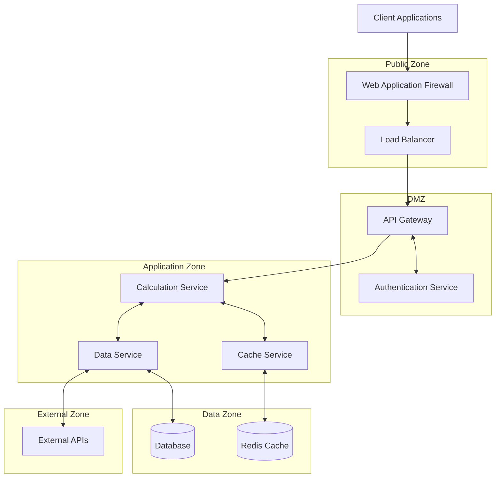

# Security Architecture

## Introduction

This document provides a comprehensive overview of the security architecture implemented in the Borrow Rate & Locate Fee Pricing Engine. As a financial system handling sensitive data and calculations, security is a critical aspect of the design and implementation.

The security architecture follows a defense-in-depth approach, implementing multiple layers of security controls to protect against various threats. This document details the authentication mechanisms, authorization controls, data protection measures, network security, and compliance considerations that together form a robust security framework.

### Security Principles

The security architecture is guided by the following core principles:

- **Defense in Depth**: Multiple layers of security controls to prevent single points of failure
- **Least Privilege**: Users and services have only the minimum permissions necessary
- **Secure by Default**: Security is built into the system from the ground up, not added as an afterthought
- **Data Protection**: Sensitive data is protected both at rest and in transit
- **Comprehensive Logging**: All security-relevant events are logged for audit and investigation
- **Regulatory Compliance**: Security controls meet or exceed relevant financial industry regulations

These principles inform all aspects of the security architecture and implementation.

### Threat Model

The security architecture addresses the following key threats:

- **Unauthorized Access**: Attempts to access the API without proper authentication
- **Data Interception**: Attempts to intercept sensitive data in transit
- **Data Exfiltration**: Unauthorized extraction of sensitive financial data
- **API Abuse**: Excessive API usage or denial of service attempts
- **Injection Attacks**: SQL injection, command injection, or similar attacks
- **Insider Threats**: Misuse of legitimate access by authorized users

Each component of the security architecture is designed to mitigate one or more of these threats.

### Document Structure

This document is organized into the following sections:

1. **Authentication Framework**: How clients are authenticated to the system
2. **Authorization System**: How permissions are enforced once authenticated
3. **Data Protection**: How sensitive data is protected at rest and in transit
4. **Network Security**: How the network architecture enhances security
5. **Audit and Compliance**: How security events are logged and compliance is maintained
6. **Security Operations**: How security is maintained during operations
7. **Security Testing**: How security controls are validated

Each section provides both high-level concepts and detailed technical specifications.

## Authentication Framework

The Borrow Rate & Locate Fee Pricing Engine implements a multi-layered authentication framework to ensure that only authorized clients can access the system.

### API Key Authentication

The primary authentication method for client applications is API key authentication:

- Each client is issued a unique API key that must be included in the `X-API-Key` HTTP header of each request
- API keys are generated as cryptographically secure random strings of at least 32 characters
- Keys are stored in the database as salted bcrypt hashes, never in plaintext
- Each key is associated with a specific client ID and rate limit tier
- Keys have configurable expiration dates (default: 90 days)
- Failed authentication attempts are logged and monitored for potential brute force attacks

**Implementation Details:**

```python
# API key verification (simplified example)
def verify_api_key(api_key: str) -> bool:
    # Get API key configuration from database or cache
    key_config = get_api_key_config(api_key)
    
    # Check if key exists and is not expired
    if key_config and not is_expired(key_config.expires_at):
        return True
    
    return False
```

API key authentication is enforced by the `AuthenticationMiddleware` which intercepts all incoming requests, extracts the API key from headers, and validates it before allowing the request to proceed.

### JWT Token Authentication

For session management and service-to-service communication, the system uses JWT (JSON Web Token) authentication:

- Short-lived JWT tokens (15-minute lifetime) are issued after successful API key authentication
- Tokens contain claims including client ID, permissions, and expiration time
- Tokens are signed using HMAC-SHA256 with a secure secret key
- Token validation includes signature verification and expiration checking
- Refresh tokens (24-hour lifetime) can be used to obtain new access tokens without re-authentication

**Implementation Details:**

```python
# JWT token creation (simplified example)
def create_access_token(data: dict, expires_delta: Optional[timedelta] = None) -> str:
    to_encode = data.copy()
    expire = datetime.utcnow() + (expires_delta or timedelta(minutes=15))
    to_encode.update({"exp": expire})
    
    # Sign the token with the secret key
    encoded_jwt = jwt.encode(to_encode, SECRET_KEY, algorithm=ALGORITHM)
    return encoded_jwt
```

JWT tokens are used primarily for internal service-to-service communication and are not typically exposed to external clients.

### Service-to-Service Authentication

For internal service-to-service communication, the system uses mutual TLS (mTLS) authentication:

- Each service has its own TLS certificate issued by a private Certificate Authority (CA)
- Certificates are validated on both client and server sides
- Certificate validation includes checking the certificate chain, expiration, and revocation status
- Certificates are automatically rotated every 30 days
- Private keys are stored securely in AWS Secrets Manager

This approach ensures that only authorized services can communicate with each other, even within the internal network.

### Authentication Workflow

The authentication workflow follows these steps:

1. Client sends a request with an API key in the `X-API-Key` header
2. `AuthenticationMiddleware` extracts the API key from the header
3. The API key is validated against stored configurations
4. If valid, the client ID associated with the API key is retrieved
5. Rate limits are checked based on the client ID
6. If rate limits are not exceeded, the request is allowed to proceed
7. The client ID is stored in the request context for authorization checks
8. A JWT token may be generated for subsequent requests

This workflow ensures that all requests are properly authenticated before accessing protected resources.

### Credential Storage

Secure credential storage is a critical aspect of the authentication framework:

- API keys are stored as salted bcrypt hashes in the database
- JWT secret keys are stored in AWS Secrets Manager
- TLS private keys and certificates are stored in AWS Secrets Manager
- Database credentials are managed through AWS Secrets Manager
- No credentials are stored in code, configuration files, or logs

Access to credential storage systems is strictly controlled and audited.

## Authorization System

Once a client is authenticated, the authorization system determines what actions they are allowed to perform and what data they can access.

### Role-Based Access Control

The system implements a comprehensive role-based access control (RBAC) system:

**Roles and Permissions:**

| Role | Description | Permissions |
|------|-------------|-------------|
| Client | Standard API consumer | Calculate fees, view rates for assigned tickers |
| Admin | System administrator | All permissions including configuration changes |
| Auditor | Compliance reviewer | View-only access to rates and audit logs |
| System | Internal services | System-level integration permissions |

Each client is assigned a role that determines their permissions within the system. Roles are stored in the database and associated with client IDs.

### Multi-Level Authorization

Authorization is enforced at multiple levels to provide defense in depth:

1. **API Gateway Level**: Coarse-grained access control based on endpoint and HTTP method
2. **Service Level**: Function-specific permissions based on client role
3. **Data Level**: Row-based security ensuring clients can only access their own data

This multi-level approach ensures that even if one level is bypassed, other levels will still enforce appropriate access controls.

### Permission Enforcement

Permissions are enforced through a combination of middleware and service-level checks:

```python
# Example permission check in an endpoint handler
def calculate_locate_fee(ticker: str, position_value: float, client_id: str):
    # Get the authenticated client from the request context
    authenticated_client_id = get_authenticated_client_id()
    
    # Check if the client has permission to calculate fees
    if not has_permission(authenticated_client_id, "calculate_fees"):
        raise PermissionDenied("Not authorized to calculate fees")
    
    # Check if the client has access to the requested ticker
    if not has_ticker_access(authenticated_client_id, ticker):
        raise PermissionDenied(f"Not authorized to access ticker {ticker}")
    
    # If all checks pass, proceed with the calculation
    return perform_calculation(ticker, position_value, client_id)
```

These checks ensure that clients can only perform actions and access data that they are authorized for.

### Data Access Controls

Data access controls ensure that clients can only access their own data or data that has been explicitly shared with them:

- Database queries include client ID filters to restrict data access
- Row-level security policies in PostgreSQL enforce data isolation
- Views and stored procedures enforce additional access controls
- Data masking is applied for sensitive fields based on client role

These controls prevent unauthorized access to sensitive financial data, even if a client has general permission to use a particular API endpoint.

### Authorization Audit

All authorization decisions are logged for audit purposes:

- Client identity
- Requested resource and action
- Authorization decision (granted/denied)
- Timestamp and context information

These logs provide a complete audit trail of all access attempts, which is essential for security investigations and compliance reporting.

## Data Protection

The system implements comprehensive data protection measures to ensure the confidentiality and integrity of sensitive financial data.

### Encryption in Transit

All data transmitted between clients and the system, as well as between internal components, is encrypted:

- TLS 1.2+ for all external communications
- Strong cipher suites with forward secrecy
- Certificate pinning for critical connections
- HTTP Strict Transport Security (HSTS)
- Mutual TLS (mTLS) for service-to-service communication

These measures protect against eavesdropping, man-in-the-middle attacks, and data interception.

### Encryption at Rest

All sensitive data stored by the system is encrypted at rest:

- Database encryption using AWS RDS encryption (AES-256)
- Transparent Data Encryption (TDE) for PostgreSQL
- Encrypted EBS volumes for all storage
- S3 server-side encryption for audit logs and backups
- Field-level encryption for highly sensitive data

**Implementation Example:**

```python
# Encrypting sensitive data (simplified example)
def encrypt_sensitive_data(data: str) -> str:
    # Get encryption key from secure storage
    key = get_encryption_key()
    
    # Create a Fernet cipher using the key
    cipher = Fernet(key)
    
    # Encrypt the data
    encrypted_data = cipher.encrypt(data.encode())
    
    # Return the encrypted data as a base64-encoded string
    return encrypted_data.decode()
```

This approach ensures that data remains protected even if storage media is compromised.

### Key Management

Encryption keys are managed securely to maintain the effectiveness of encryption:

- AWS Key Management Service (KMS) for encryption key management
- Hardware Security Modules (HSMs) for key protection
- Automatic key rotation (90-day cycle)
- Strict access controls for key management operations
- Separation of duties for key management

Proper key management is essential to maintain the security of encrypted data and prevent unauthorized decryption.

### Data Classification

Data is classified according to sensitivity to ensure appropriate protection:

| Classification | Examples | Protection Measures |
|---------------|----------|---------------------|
| Public | API documentation, error codes | No special protection |
| Internal | Aggregated statistics, general configurations | Encrypted in transit |
| Confidential | Client configurations, borrow rates | Encrypted in transit and at rest |
| Restricted | API keys, client financial data | Field-level encryption, strict access controls |

This classification guides the application of security controls and ensures that sensitive data receives appropriate protection.

### Data Minimization

The system follows data minimization principles to reduce risk:

- Only necessary data is collected and stored
- Sensitive data is retained only as long as required
- Data is anonymized or pseudonymized where possible
- Unnecessary sensitive data is purged regularly

By minimizing the data collected and stored, the system reduces the potential impact of a data breach.

### Secure Data Handling

Secure data handling practices are implemented throughout the system:

- Input validation to prevent injection attacks
- Output encoding to prevent XSS and similar attacks
- Parameterized queries to prevent SQL injection
- Memory management to prevent data leakage
- Secure logging that masks sensitive data

These practices ensure that data is handled securely throughout its lifecycle in the system.

## Network Security

The network architecture is designed to provide multiple layers of security and isolation.

### Network Architecture

The network is designed with security zones and segmentation:



This segmentation ensures that even if one zone is compromised, the attacker's ability to move laterally is limited.

### Security Controls by Zone

Each security zone has specific access controls and network protections:

| Security Zone | Access Controls | Network Controls |
|---------------|-----------------|------------------|
| Public Zone | WAF, DDoS protection | Public internet exposure, IP filtering |
| DMZ | Authentication enforcement | Limited internal access, stateful firewall |
| Application Zone | Service-to-service authentication | No direct external access, network policies |
| Data Zone | Database authentication, encryption | Strict access control, no public endpoints |
| External Zone | API keys, IP allowlisting | Outbound-only connections, encrypted |

These controls ensure that traffic between zones is properly authenticated and authorized.

### Web Application Firewall

A Web Application Firewall (WAF) protects the system from common web attacks:

- OWASP Top 10 protection rules
- Rate limiting and request throttling
- IP reputation filtering
- Geographic restrictions
- Custom rule sets for application-specific threats

The WAF is the first line of defense against attacks from the public internet.

### DDoS Protection

The system includes multiple layers of DDoS protection:

- AWS Shield for infrastructure-level DDoS protection
- Rate limiting at the API Gateway level
- Connection limiting at the load balancer
- Traffic monitoring and anomaly detection
- Automatic scaling to absorb traffic spikes

These measures ensure that the system remains available even during attempted denial of service attacks.

### Network Monitoring

Comprehensive network monitoring detects and responds to suspicious activity:

- VPC Flow Logs for network traffic analysis
- GuardDuty for threat detection
- Network traffic analysis for anomaly detection
- Intrusion detection systems
- Real-time alerting for suspicious patterns

Monitoring ensures that potential security incidents are detected and addressed promptly.

## Audit and Compliance

The system implements comprehensive audit logging and compliance controls to meet regulatory requirements and support security investigations.

### Audit Logging

All security-relevant events are logged for audit purposes:

**Logged Events:**
- Authentication attempts (successful and failed)
- Authorization decisions (granted and denied)
- API access (endpoints, parameters, client identity)
- Data access and modifications
- Configuration changes
- Security-relevant system events

**Log Content:**
Each log entry includes:
- Timestamp with millisecond precision
- Event type and description
- Actor identity (client ID, service ID)
- Action performed or attempted
- Resource affected
- Source IP address
- Success or failure indication
- Correlation ID for request tracing

These logs provide a complete audit trail for security investigations and compliance reporting.

### Secure Logging

Logs are protected to maintain their integrity and confidentiality:

- Tamper-evident logging with hash chaining
- Encryption of logs in transit and at rest
- Secure, centralized log collection
- Immutable storage for compliance logs
- Access controls on log data
- Log rotation and archival policies

These measures ensure that logs remain reliable evidence for security investigations and compliance audits.

### Regulatory Compliance

The system is designed to meet financial industry regulations:

| Regulation | Key Requirements | Implementation |
|------------|------------------|----------------|
| SEC Rule 17a-4 | Record retention, immutability | 7-year audit log retention, tamper-evident logging |
| Sarbanes-Oxley (SOX) | Access controls, audit trails | RBAC, comprehensive logging, change management |
| GDPR/CCPA | Data protection, access controls | Encryption, access logging, data minimization |

Compliance is built into the system architecture and operations, not added as an afterthought.

### Compliance Monitoring

Continuous monitoring ensures ongoing compliance:

- Automated compliance checks against policy requirements
- Regular compliance reports for stakeholders
- Alerts for potential compliance violations
- Periodic compliance reviews and assessments
- Integration with governance, risk, and compliance (GRC) systems

This monitoring ensures that the system remains compliant with regulatory requirements over time.

## Security Operations

Security operations ensure that security controls remain effective throughout the system lifecycle.

### Vulnerability Management

The system includes a comprehensive vulnerability management process:

- Regular vulnerability scanning of all components
- Dependency scanning for third-party libraries
- Static application security testing (SAST)
- Dynamic application security testing (DAST)
- Container image scanning
- Penetration testing by independent security teams

Vulnerabilities are prioritized based on severity and potential impact, with critical vulnerabilities addressed immediately.

### Patch Management

A structured patch management process ensures that security updates are applied promptly:

- Automated monitoring for security updates
- Regular patching schedule for non-critical updates
- Emergency patching process for critical vulnerabilities
- Testing of patches before deployment
- Rollback capability for problematic patches

This process ensures that the system remains protected against known vulnerabilities.

### Incident Response

A defined incident response process ensures effective handling of security incidents:

1. **Preparation**: Documented procedures, trained team, necessary tools
2. **Detection**: Monitoring systems, alert triage, initial assessment
3. **Containment**: Isolate affected systems, prevent further damage
4. **Eradication**: Remove the threat, address vulnerabilities
5. **Recovery**: Restore systems to normal operation
6. **Lessons Learned**: Post-incident analysis and improvements

Regular incident response exercises ensure that the team is prepared to handle real incidents effectively.

### Security Monitoring

Continuous security monitoring detects potential security issues:

- Real-time monitoring of security logs
- Correlation of events across systems
- Anomaly detection for unusual patterns
- Threat intelligence integration
- Automated alerting for security incidents

Monitoring ensures that security incidents are detected and addressed promptly, minimizing potential impact.

## Security Testing

Regular security testing validates the effectiveness of security controls and identifies potential vulnerabilities.

### Security Testing Approach

The security testing approach includes multiple complementary methods:

- **Static Application Security Testing (SAST)**: Code analysis to identify security issues
- **Dynamic Application Security Testing (DAST)**: Testing running applications for vulnerabilities
- **Dependency Scanning**: Checking third-party libraries for known vulnerabilities
- **Container Scanning**: Analyzing container images for security issues
- **Infrastructure Scanning**: Checking infrastructure configurations for security weaknesses
- **Penetration Testing**: Simulated attacks to identify vulnerabilities

These methods provide comprehensive coverage of potential security issues.

### Continuous Security Testing

Security testing is integrated into the development and deployment process:

- SAST and dependency scanning in the CI/CD pipeline
- Pre-deployment security scans for all changes
- Regular automated security scans of production systems
- Continuous monitoring for new vulnerabilities
- Periodic manual security reviews

This approach ensures that security issues are identified and addressed throughout the system lifecycle.

### Penetration Testing

Regular penetration testing provides an external perspective on security:

- Annual comprehensive penetration tests
- Targeted tests after significant changes
- Tests performed by independent security teams
- Realistic attack scenarios based on threat model
- Detailed reporting and remediation tracking

Penetration testing helps identify vulnerabilities that might be missed by automated scanning and internal testing.

### Security Acceptance Criteria

All changes must meet security acceptance criteria before deployment:

- No critical or high security vulnerabilities
- All security tests passed
- Security requirements implemented and verified
- Security review completed for significant changes
- Compliance requirements met

These criteria ensure that security is maintained as the system evolves.

## Conclusion

The security architecture of the Borrow Rate & Locate Fee Pricing Engine provides a comprehensive approach to protecting sensitive financial data and ensuring system integrity. By implementing multiple layers of security controls—from authentication and authorization to data protection and network security—the system addresses a wide range of potential threats.

The security architecture is designed to meet or exceed financial industry regulatory requirements while maintaining system performance and usability. Regular security testing and continuous monitoring ensure that security controls remain effective as the system evolves and new threats emerge.

By following the principles and practices outlined in this document, the system provides a secure foundation for calculating securities borrowing costs for brokerages and financial institutions.

## Appendix A: Security Controls Matrix

This matrix maps security controls to the threats they address and the regulatory requirements they support.

### Authentication Controls

| Control | Threats Addressed | Regulatory Requirements |
|---------|-------------------|-------------------------|
| API Key Authentication | Unauthorized Access | SOX, SEC 17a-4 |
| JWT Token Authentication | Unauthorized Access, Session Hijacking | SOX, SEC 17a-4 |
| Mutual TLS | Unauthorized Access, Man-in-the-Middle | SOX, SEC 17a-4 |
| Credential Storage | Credential Theft | SOX, SEC 17a-4, GDPR |

### Authorization Controls

| Control | Threats Addressed | Regulatory Requirements |
|---------|-------------------|-------------------------|
| Role-Based Access Control | Unauthorized Access, Privilege Escalation | SOX, SEC 17a-4 |
| Multi-Level Authorization | Unauthorized Access, Privilege Escalation | SOX, SEC 17a-4 |
| Data Access Controls | Data Exfiltration, Unauthorized Access | SOX, SEC 17a-4, GDPR |
| Authorization Audit | Insider Threats, Unauthorized Access | SOX, SEC 17a-4 |

### Data Protection Controls

| Control | Threats Addressed | Regulatory Requirements |
|---------|-------------------|-------------------------|
| Encryption in Transit | Data Interception | SOX, SEC 17a-4, GDPR |
| Encryption at Rest | Data Theft, Unauthorized Access | SOX, SEC 17a-4, GDPR |
| Key Management | Encryption Bypass, Key Theft | SOX, SEC 17a-4, GDPR |
| Data Classification | Data Leakage, Unauthorized Access | SOX, SEC 17a-4, GDPR |
| Data Minimization | Data Leakage, Privacy Violations | GDPR, CCPA |

### Network Security Controls

| Control | Threats Addressed | Regulatory Requirements |
|---------|-------------------|-------------------------|
| Network Segmentation | Lateral Movement, Unauthorized Access | SOX, SEC 17a-4 |
| Web Application Firewall | Injection Attacks, API Abuse | SOX, SEC 17a-4 |
| DDoS Protection | Denial of Service | SOX, SEC 17a-4 |
| Network Monitoring | Intrusion, Unauthorized Access | SOX, SEC 17a-4 |

## Appendix B: Security Configuration Guidelines

This appendix provides guidelines for securely configuring the system components.

### API Gateway Security Configuration

- Enable TLS 1.2+ with strong cipher suites
- Configure rate limiting based on client tiers
- Enable request validation for all endpoints
- Configure authentication middleware for all protected routes
- Enable detailed logging for security events
- Configure CORS with appropriate restrictions
- Set appropriate timeout values for all requests

### Database Security Configuration

- Enable encryption at rest
- Configure TLS for all connections
- Implement connection pooling with appropriate limits
- Configure role-based access control for database users
- Enable row-level security for multi-tenant data
- Configure audit logging for sensitive operations
- Implement query timeouts to prevent DoS attacks

### Redis Security Configuration

- Enable TLS for all connections
- Configure authentication with strong passwords
- Disable dangerous commands in production
- Set appropriate memory limits
- Configure key eviction policies
- Enable persistence with appropriate backup schedule
- Configure network security to restrict access

### Kubernetes Security Configuration

- Enable RBAC for all clusters
- Configure network policies to restrict pod communication
- Use security contexts to limit container privileges
- Enable pod security policies
- Configure secrets management with appropriate access controls
- Enable audit logging for cluster operations
- Configure resource limits for all pods

## Appendix C: Security Incident Response Procedures

This appendix provides detailed procedures for responding to common security incidents.

### Authentication Breach Response

1. **Identification**: Detect unusual authentication patterns or explicit breach indicators
2. **Containment**: Revoke compromised credentials immediately
3. **Investigation**: Determine the scope and method of the breach
4. **Remediation**: Reset affected credentials and address vulnerabilities
5. **Recovery**: Restore normal operations with new credentials
6. **Communication**: Notify affected parties as required by policy and regulations
7. **Documentation**: Document the incident, response, and lessons learned

### Data Breach Response

1. **Identification**: Detect unauthorized data access or exfiltration
2. **Containment**: Isolate affected systems and block unauthorized access
3. **Investigation**: Determine what data was accessed and how
4. **Remediation**: Address vulnerabilities that enabled the breach
5. **Recovery**: Restore systems to secure operation
6. **Communication**: Notify affected parties as required by policy and regulations
7. **Documentation**: Document the incident, response, and lessons learned

### Denial of Service Response

1. **Identification**: Detect abnormal traffic patterns or service degradation
2. **Containment**: Implement traffic filtering and scaling
3. **Investigation**: Determine the source and method of the attack
4. **Remediation**: Implement additional protections against the attack method
5. **Recovery**: Restore normal service operations
6. **Communication**: Notify affected parties as appropriate
7. **Documentation**: Document the incident, response, and lessons learned

### Malware Incident Response

1. **Identification**: Detect malware indicators through monitoring or scanning
2. **Containment**: Isolate affected systems from the network
3. **Investigation**: Determine the malware type, entry point, and impact
4. **Remediation**: Remove malware and address vulnerabilities
5. **Recovery**: Restore systems from clean backups
6. **Communication**: Notify affected parties as required
7. **Documentation**: Document the incident, response, and lessons learned