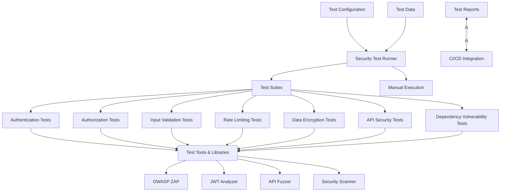

# Security Testing Framework

## Introduction

The Security Testing Framework for the Borrow Rate & Locate Fee Pricing Engine provides comprehensive testing capabilities to verify and validate the system's security controls. As a financial system handling sensitive pricing data for securities lending operations, rigorous security testing is essential to protect against unauthorized access, data breaches, and maintain regulatory compliance.

This framework implements a defense-in-depth approach to security testing, addressing multiple layers of the application stack from API authentication to data encryption. It enables both automated security testing as part of CI/CD pipelines and manual penetration testing to identify and remediate security vulnerabilities before they can be exploited in production.

The primary goals of this security testing framework are to:

- Ensure authentication and authorization mechanisms function correctly
- Verify the effectiveness of input validation controls
- Test rate limiting protections against abuse
- Validate encryption of sensitive financial data
- Identify vulnerabilities in API endpoints
- Detect security issues in third-party dependencies
- Provide evidence for security compliance requirements

## Security Testing Architecture

The security testing architecture follows a modular approach with specialized test suites targeting different security aspects of the system. It leverages both custom test code and industry-standard security testing tools to provide comprehensive coverage.



The architecture consists of:

- **Test Runner**: Coordinates and executes security tests, manages dependencies, and generates reports
- **Test Suites**: Specialized test modules for different security aspects
- **Testing Tools**: Integration with industry-standard security testing tools
- **Configuration**: Environment-specific settings and test parameters
- **Test Data**: Specialized data sets for security testing scenarios
- **Reporting**: Standardized security test reports for remediation and compliance

Security tests can be executed both through automated CI/CD pipelines and manually for targeted testing.

## Security Test Types

### Authentication Testing

**Location**: `src/test/security_tests/test_authentication.py`

Authentication testing verifies that the system properly authenticates users and prevents unauthorized access. These tests cover:

- API key validation and rejection of invalid keys
- JWT token issuance, validation, and expiration handling
- Multi-factor authentication flows (where applicable)
- Authentication bypass attempts using various techniques
- Brute force protection mechanisms
- Session management security
- Credential handling and transmission

Example test cases include attempting to access protected endpoints without authentication, with expired tokens, or with invalid credentials.

### Authorization Testing

**Location**: `src/test/security_tests/test_authorization.py`

Authorization testing ensures that authenticated users can only access resources and perform actions they are authorized for. These tests cover:

- Role-based access control (RBAC) enforcement
- Permission-based authorization for specific operations
- Resource-level access controls (client data isolation)
- Privilege escalation prevention
- Default deny policies

Tests include scenarios such as a user with "Client" role attempting to access admin-only endpoints, or a client attempting to access another client's data.

### Input Validation Testing

**Location**: `src/test/security_tests/test_input_validation.py`

Input validation testing verifies that the system properly validates and sanitizes all input data to prevent injection attacks and other security issues. These tests cover:

- SQL injection prevention
- Cross-site scripting (XSS) prevention
- Command injection prevention
- Parameter tampering detection
- Type validation and coercion
- Boundary testing for numeric inputs
- Special character handling

Test cases include attempted injection attacks against API endpoints, boundary tests with extreme values, and malformed input data.

### Rate Limiting Testing

**Location**: `src/test/security_tests/test_rate_limiting.py`

Rate limiting testing ensures that the system properly enforces API rate limits to prevent abuse and denial of service attacks. These tests cover:

- Request rate limiting per client
- Burst capacity handling
- Rate limit bypass attempts
- Rate limit response headers
- Throttling behavior under load
- Different rate limits by client tier

Tests include sending requests at rates exceeding configured limits and verifying appropriate throttling and 429 responses.

### Data Encryption Testing

**Location**: `src/test/security_tests/test_data_encryption.py`

Data encryption testing verifies that sensitive data is properly encrypted both at rest and in transit. These tests cover:

- TLS configuration and certificate validation
- Field-level encryption for sensitive data
- Encryption key management
- Encrypted database connections
- Proper implementation of encryption algorithms
- Key rotation procedures

Tests include inspecting encrypted data channels, attempting to access unencrypted data, and verifying encryption algorithm strength.

### API Security Testing

**Location**: `src/test/security_tests/test_api_security.py`

API security testing focuses on identifying vulnerabilities specific to the API implementation. These tests cover:

- API endpoint security headers
- CORS configuration
- Error handling and information leakage
- HTTP method handling
- Content type validation
- API schema validation
- Security middleware effectiveness

Tests include inspecting HTTP responses for security headers, attempting cross-origin requests, and fuzzing API endpoints.

### Dependency Vulnerability Testing

**Location**: `src/test/security_tests/test_dependency_vulnerabilities.py`

Dependency vulnerability testing identifies security vulnerabilities in third-party dependencies used by the system. These tests cover:

- Known vulnerability scanning in dependencies
- Outdated dependency detection
- License compliance checking
- Supply chain attack detection
- Container image scanning

Tests integrate with tools like Safety, Snyk, or OWASP Dependency Check to identify vulnerable dependencies in the project.

## Security Testing Tools

The security testing framework integrates several specialized security testing tools:

### OWASP ZAP

OWASP Zed Attack Proxy (ZAP) is an integrated penetration testing tool for finding vulnerabilities in web applications. In our framework, ZAP is used for:

- Active scanning of API endpoints
- Passive analysis of responses
- Automated security testing in CI/CD
- Manual penetration testing support

ZAP integration allows for both automated scanning during CI/CD pipelines and interactive testing during development or manual security reviews.

### JWT Analyzer

JWT Analyzer is a specialized tool for testing JWT token security. It's used for:

- JWT token structure analysis
- Signature verification testing
- Token tampering attempts
- Expiration and validity testing
- Algorithm confusion attacks

The tool helps identify misconfigurations or vulnerabilities in JWT implementation that could lead to authentication bypasses.

### API Fuzzer

The API fuzzer is a custom tool that generates random, unexpected, or malformed inputs to API endpoints to identify vulnerabilities. It's used for:

- Input boundary testing
- Error handling verification
- Unexpected input handling
- Protocol fuzzing
- Parameter mutation testing

Fuzzing helps identify edge cases and error conditions that might lead to security vulnerabilities or system instability.

### Security Scanner

The security scanner is a comprehensive tool that combines multiple security testing techniques. It's used for:

- Vulnerability scanning
- Configuration analysis
- Compliance checking
- Security misconfigurations
- Best practice validation

The scanner provides broad coverage of common security issues and is particularly useful for identifying configuration problems.

## Environment Setup

### Prerequisites

To run the security tests, you'll need the following prerequisites:

- Python 3.11 or higher
- Docker and Docker Compose (for containerized tools)
- Access to test environments with appropriate permissions
- Network access to API endpoints being tested
- Required API keys and credentials for test accounts
- JDK 11+ (for some Java-based security tools)
- Node.js 18+ (for some JavaScript-based security tools)

### Configuration

**Location**: `src/test/security_tests/config/settings.py`

Security tests are configured through environment-specific configuration files and environment variables. Key configuration parameters include:

- API endpoints to test
- Authentication credentials for test users with different roles
- Rate limiting thresholds for testing
- Test environment selection (dev, staging, prod)
- Security tool paths and settings
- Reporting configuration
- Test timeouts and retry settings

Example configuration:

```python
# Security test configuration
SECURITY_TEST_CONFIG = {
    "environments": {
        "dev": {
            "api_base_url": "https://dev-api.example.com/",
            "auth_endpoint": "auth/token",
            "test_credentials": {
                "client_role": {"client_id": "test_client", "api_key": "test_key_123"},
                "admin_role": {"client_id": "test_admin", "api_key": "admin_key_456"}
            },
            "rate_limits": {
                "standard_tier": 60,
                "premium_tier": 300
            }
        },
        # Additional environments...
    },
    "tools": {
        "zap": {
            "path": "/usr/local/bin/zap.sh",
            "config_file": "zap-config.xml",
            "timeout": 300
        },
        # Additional tool configurations...
    },
    "reporting": {
        "output_dir": "reports/security",
        "formats": ["json", "html", "xml"]
    }
}
```

### Test Data

Security testing requires specialized test data that includes:

- Test users with different roles and permissions
- Valid and invalid authentication tokens
- Test cases for injection attacks
- Boundary test values
- Encryption test data
- Rate limiting test scenarios

Test data is typically defined in JSON or YAML files in the `src/test/security_tests/test_data` directory and loaded dynamically during test execution.

### Security Tools Setup

**Location**: `src/test/security_tests/helpers/security_tools.py`

Security testing tools can be set up in several ways:

1. **Local Installation**:
   Tools can be installed locally using package managers like pip, npm, or from official releases.

2. **Docker Containers**:
   Many security tools are available as Docker images, which simplifies setup and ensures consistency.

3. **CI/CD Integration**:
   Security tools can be integrated into CI/CD pipelines using pre-built actions or scripts.

Example Docker-based setup:

```bash
# Pull the OWASP ZAP Docker image
docker pull owasp/zap2docker-stable

# Run ZAP in daemon mode
docker run -d -p 8080:8080 -p 8090:8090 -i owasp/zap2docker-stable zap.sh -daemon -host 0.0.0.0 -port 8080
```

## Running Security Tests

### Local Execution

To run security tests locally, use the security test runner with appropriate parameters:

```bash
# Run all security tests
python -m src.test.security_tests.runner

# Run specific test suite
python -m src.test.security_tests.runner --suite authentication

# Run tests with specific configuration
python -m src.test.security_tests.runner --config dev --report-format html
```

For focused testing, you can run individual test modules directly:

```bash
# Run authentication tests
python -m pytest src/test/security_tests/test_authentication.py -v

# Run API security tests with increased verbosity
python -m pytest src/test/security_tests/test_api_security.py -vv
```

### CI/CD Integration

**Location**: `src/test/ci/github_actions/security_scan_workflow.yml`

Security tests are integrated into the CI/CD pipeline to ensure security testing at every relevant stage of development. Key integration points include:

- Pull request security scans
- Pre-deployment security validation
- Scheduled comprehensive security audits
- Post-deployment verification

Example GitHub Actions workflow:

```yaml
name: Security Scan

on:
  pull_request:
    branches: [ main, develop ]
  push:
    branches: [ main ]
  schedule:
    - cron: '0 2 * * 1' # Weekly on Mondays at 2:00 UTC

jobs:
  security-scan:
    runs-on: ubuntu-latest
    steps:
      - uses: actions/checkout@v3
      
      - name: Set up Python
        uses: actions/setup-python@v4
        with:
          python-version: '3.11'
          
      - name: Install dependencies
        run: |
          python -m pip install --upgrade pip
          pip install -r requirements-dev.txt
          
      - name: Run security tests
        run: python -m src.test.security_tests.runner --ci --config ci
        
      - name: Upload security reports
        uses: actions/upload-artifact@v3
        with:
          name: security-reports
          path: reports/security/
```

### Test Parameters

Security tests can be customized with various parameters to focus testing on specific areas or to adjust test behavior:

- **Environment**: Target environment for testing (dev, staging, prod)
- **Verbosity**: Level of detail in test output
- **Timeout**: Maximum time for test execution
- **Reporting**: Format and location of test reports
- **Severity**: Minimum severity level to report
- **Focus**: Specific components or endpoints to test

Parameters can be passed via command line arguments, environment variables, or configuration files.

### Test Reporting

Security test reports provide detailed information about identified vulnerabilities and security issues. Reports are generated in multiple formats:

- **HTML**: Human-readable reports with detailed findings
- **JSON**: Machine-readable format for programmatic processing
- **XML**: Compatible with security tools and dashboards
- **JUnit**: CI/CD integration for test results

Reports include:
- Vulnerability details and severity
- Steps to reproduce
- Potential impact
- Recommended remediation
- References to security standards
- Evidence (screenshots, HTTP traces, etc.)

## Security Test Payloads

### Authentication Bypass Payloads

Authentication bypass testing uses specialized payloads to attempt bypassing authentication controls:

- Null bytes in authentication headers
- JWT token tampering attempts
- SQL injection in authentication parameters
- Default or weak credentials
- Session fixation attempts
- Manipulated cookies or tokens

These payloads are systematically applied to authentication endpoints to verify proper rejection and error handling.

### Injection Payloads

Injection testing uses both standard and custom payloads to detect vulnerabilities:

- SQL injection patterns for different database engines
- NoSQL injection patterns
- Command injection sequences
- Cross-site scripting (XSS) patterns
- XML External Entity (XXE) payloads
- LDAP injection patterns
- Template injection sequences

Payloads are applied to all input parameters, headers, and data fields to verify proper sanitization and validation.

### Fuzzing Payloads

Fuzzing tests use randomly generated or mutated inputs to identify edge cases and unexpected behavior:

- Random string generators
- Boundary value generators (max integers, empty strings, etc.)
- Special character sequences
- Encoding variations (URL, base64, etc.)
- Protocol-specific fuzzing
- Format string test cases
- Input length variations

Fuzzing payloads are designed to trigger error conditions or unexpected behavior that might indicate security vulnerabilities.

### Custom Payloads

For specific testing scenarios, custom payloads can be created that target the unique aspects of the Borrow Rate & Locate Fee Pricing Engine:

- Finance-specific injection patterns
- Calculation manipulation attempts
- Borrow rate tampering patterns
- Client ID manipulation
- Position value overflow attempts
- Custom header manipulation

Custom payloads should be developed based on system-specific knowledge and updated as the application evolves.

## Security Testing Best Practices

### Test Coverage

To ensure comprehensive security testing:

1. **Map test coverage to threat model**: Ensure all identified threats have corresponding tests
2. **Test all API endpoints**: Every endpoint should have appropriate security tests
3. **Cover all authentication paths**: Test all authentication methods and flows
4. **Test positive and negative cases**: Verify both valid access and proper rejection
5. **Include edge cases**: Test boundary conditions and unexpected inputs
6. **Test across environments**: Verify security controls in all deployment environments
7. **Monitor coverage metrics**: Track and improve security test coverage over time

Regular security testing coverage reviews should be conducted to identify and address gaps.

### Test Isolation

Proper test isolation is critical for security testing:

1. **Use dedicated test environments**: Avoid security testing in shared environments
2. **Reset state between tests**: Ensure test independence and prevent cross-test contamination
3. **Isolate test data**: Use separate test data sets for security testing
4. **Control network access**: Restrict security tests to intended targets
5. **Manage test credentials**: Use dedicated test credentials with appropriate permissions
6. **Cleanup after testing**: Remove any artifacts or data created during testing
7. **Prevent side effects**: Ensure tests don't affect production or other test environments

Test isolation prevents false positives, ensures result reproducibility, and prevents unintended impact.

### False Positives

Managing false positives is important for efficient security testing:

1. **Validate findings manually**: Confirm that reported issues are actual vulnerabilities
2. **Use context-aware testing**: Consider application-specific security controls
3. **Maintain a knowledge base**: Document known false positives and their reasons
4. **Tune security tools**: Adjust tool configurations to reduce false positives
5. **Implement baseline comparisons**: Compare results against known-good baselines
6. **Use multiple testing techniques**: Cross-validate findings with different approaches
7. **Continuous refinement**: Regularly update tests to reduce false positives

Reducing false positives improves efficiency and ensures focus on real security issues.

### Continuous Security Testing

Implementing continuous security testing throughout the development lifecycle:

1. **Shift left approach**: Integrate security testing earlier in development
2. **Developer security checks**: Implement pre-commit hooks for basic security checks
3. **Automated security gates**: Require security tests to pass before deployment
4. **Regular scheduled scans**: Conduct comprehensive security tests on a schedule
5. **Incremental testing**: Run focused tests for changed components
6. **Security regression testing**: Verify that fixed vulnerabilities don't reappear
7. **Feedback loops**: Ensure security findings promptly reach developers

Continuous security testing helps identify and address vulnerabilities earlier, reducing remediation costs.

## Security Findings Management

### Severity Classification

Security findings are classified by severity to prioritize remediation efforts:

- **Critical**: Vulnerabilities that can lead to system compromise, data breach, or significant financial impact. Must be fixed immediately.
- **High**: Serious vulnerabilities that could lead to partial system compromise or data exposure. Should be fixed within 1-2 weeks.
- **Medium**: Vulnerabilities that may lead to limited data exposure or functionality compromise. Should be fixed within 1 month.
- **Low**: Minor issues with limited security impact. Should be addressed in regular maintenance cycles.
- **Informational**: Recommendations and best practices that don't represent vulnerabilities but could improve security posture.

Severity classification considers:
- Potential impact on confidentiality, integrity, and availability
- Exploitability and complexity of attack
- Authentication requirements
- Potential business impact
- Relevant compliance requirements

### Remediation Process

The remediation process for security findings follows these steps:

1. **Triage and validation**: Confirm the finding and its severity
2. **Assign ownership**: Determine who is responsible for fixing the issue
3. **Develop fix**: Create and test a solution that resolves the vulnerability
4. **Review solution**: Security team reviews the proposed fix
5. **Implement fix**: Deploy the solution to affected environments
6. **Verification testing**: Confirm that the vulnerability has been properly remediated
7. **Document resolution**: Record details of the fix and verification

All findings should be tracked in a dedicated security issue tracker with appropriate access controls.

### Verification Testing

Verification testing ensures that security issues have been properly remediated:

1. **Reproduce original finding**: Attempt to exploit the vulnerability using the original method
2. **Verify fix effectiveness**: Confirm that the vulnerability cannot be exploited
3. **Check for similar vulnerabilities**: Test for variations of the original vulnerability
4. **Review the fix implementation**: Ensure the fix follows security best practices
5. **Test for regressions**: Verify that the fix doesn't introduce new vulnerabilities
6. **Document verification results**: Record detailed verification steps and results

Verification testing should be conducted by someone other than the developer who implemented the fix.

### Security Regression Testing

Security regression testing prevents the reintroduction of previously fixed vulnerabilities:

1. **Maintain vulnerability database**: Document all previously identified vulnerabilities
2. **Create regression test cases**: Develop specific tests for each fixed vulnerability
3. **Automate regression tests**: Include regression tests in regular security testing
4. **Track vulnerability metrics**: Monitor vulnerability recurrence rates
5. **Update knowledge base**: Document root causes and prevention strategies
6. **Security code reviews**: Focus reviews on previously vulnerable components
7. **Security awareness**: Educate developers about common vulnerability patterns

Regular security regression testing ensures that security improvements are maintained over time.

## Compliance Requirements

### SOC 2 Compliance

SOC 2 compliance requires security testing to demonstrate effective controls:

- **Access Controls**: Testing of authentication and authorization mechanisms
- **System Monitoring**: Verification of logging and monitoring capabilities
- **Risk Management**: Regular vulnerability assessments and penetration testing
- **Change Management**: Security testing of system changes
- **Incident Response**: Testing of security incident handling procedures
- **Encryption**: Verification of data encryption controls

Security testing should be documented as evidence for SOC 2 audit requirements, with formal reports retained for the required period.

### PCI DSS Compliance

For systems handling payment card information, PCI DSS requires specific security testing:

- **Requirement 6.6**: Application security assessment through web application scanning or code review
- **Requirement 11.2**: Regular vulnerability scanning of internal and external networks
- **Requirement 11.3**: Penetration testing at least annually and after significant changes
- **Requirement 6.5**: Testing for common coding vulnerabilities (OWASP Top 10)
- **Requirement 9.1**: Testing of physical access controls
- **Requirement 3.4**: Verification of PAN encryption procedures

Security testing for PCI DSS should follow the specific methodologies outlined in the standard.

### SEC Requirements

Securities industry regulations require security testing to protect financial data:

- **Regulation S-P**: Testing of controls protecting customer financial information
- **Regulation SCI**: Testing of systems, capacity, and security controls
- **Rule 17a-4**: Verification of electronic records protection
- **Business continuity**: Testing of security during disaster recovery scenarios
- **Identity theft prevention**: Testing of Red Flags Rule compliance

Security testing should address the specific requirements of applicable SEC regulations and be documented for regulatory examinations.

### Financial Industry Standards

Financial industry security standards require comprehensive security testing:

- **NIST Cybersecurity Framework**: Risk-based security testing approach
- **ISO 27001**: Testing aligned with information security management system requirements
- **FFIEC IT Examination Handbook**: Testing of financial institution security controls
- **FINRA Cybersecurity Practices**: Testing based on financial industry best practices
- **SWIFT Customer Security Programme**: Testing of payment messaging security

Security testing should align with industry standards and frameworks applicable to securities lending operations.

## Troubleshooting

### Common Issues

Frequently encountered security testing issues include:

1. **Authentication failures during testing**:
   - Verify test credentials are valid
   - Check for IP restrictions or geolocation blocks
   - Ensure API keys have not expired
   - Verify correct authentication headers

2. **False positives in security scans**:
   - Review security tool configurations
   - Check for known false positive patterns
   - Verify with manual testing
   - Update security tool databases

3. **Missing test coverage**:
   - Review and update threat model
   - Analyze API endpoints for coverage gaps
   - Review test implementations against requirements
   - Use coverage analysis tools

4. **Environment connectivity issues**:
   - Check network configurations and firewalls
   - Verify DNS resolution
   - Check for TLS/certificate issues
   - Verify proxy configurations

### Debugging Security Tests

Techniques for debugging security test failures:

1. **Increase logging verbosity**:
   - Enable debug logging in test configuration
   - Use `-v` or `-vv` flags with pytest
   - Enable request/response logging

2. **Inspect network traffic**:
   - Use proxies like OWASP ZAP or Burp Suite
   - Capture and analyze HTTP requests/responses
   - Look for TLS handshake issues

3. **Isolate test dependencies**:
   - Run tests individually to identify problematic tests
   - Check for dependency conflicts
   - Test against mock services if needed

4. **Step through test execution**:
   - Use debugger to step through test code
   - Add breakpoints at critical sections
   - Inspect variable values during execution

### Tool-Specific Issues

Issues specific to security testing tools and their resolution:

1. **OWASP ZAP**:
   - Java memory allocation: Increase heap size with `-Xmx` option
   - Hanging scans: Set appropriate timeouts
   - False positives: Adjust alert thresholds in configuration
   - API connectivity: Check for correct API specifications

2. **JWT Analyzer**:
   - Algorithm compatibility: Verify supported algorithms
   - Key format issues: Check key format and encoding
   - Performance issues: Limit test token count

3. **API Fuzzer**:
   - Performance degradation: Adjust request rate
   - Excessive resource usage: Limit test payload size
   - Target availability: Implement circuit breakers
   - False positives: Tune detection sensitivity

4. **Dependency Scanners**:
   - False positives: Update vulnerability databases
   - Incomplete scans: Check scan scope configuration
   - Performance issues: Use incremental scanning

## References

### OWASP Resources

- [OWASP API Security Top 10](https://owasp.org/www-project-api-security/)
- [OWASP Testing Guide](https://owasp.org/www-project-web-security-testing-guide/)
- [OWASP Authentication Testing](https://owasp.org/www-project-web-security-testing-guide/latest/4-Web_Application_Security_Testing/04-Authentication_Testing/README)
- [OWASP Authorization Testing](https://owasp.org/www-project-web-security-testing-guide/latest/4-Web_Application_Security_Testing/05-Authorization_Testing/README)
- [OWASP Input Validation Testing](https://owasp.org/www-project-web-security-testing-guide/latest/4-Web_Application_Security_Testing/07-Input_Validation_Testing/README)

### Security Testing Standards

- [NIST SP 800-115: Technical Guide to Information Security Testing and Assessment](https://csrc.nist.gov/publications/detail/sp/800-115/final)
- [PCI DSS v4.0 Testing Procedures](https://www.pcisecuritystandards.org/)
- [OSSTMM (Open Source Security Testing Methodology Manual)](https://www.isecom.org/OSSTMM.3.pdf)
- [PTES (Penetration Testing Execution Standard)](http://www.pentest-standard.org/)
- [NIST Cybersecurity Framework](https://www.nist.gov/cyberframework)

### Tool Documentation

- [OWASP ZAP Documentation](https://www.zaproxy.org/docs/)
- [PyJWT Documentation](https://pyjwt.readthedocs.io/)
- [OWASP Dependency Check](https://owasp.org/www-project-dependency-check/)
- [pytest Documentation](https://docs.pytest.org/)
- [Safety Documentation](https://pyup.io/safety/)
- [Snyk Documentation](https://docs.snyk.io/)